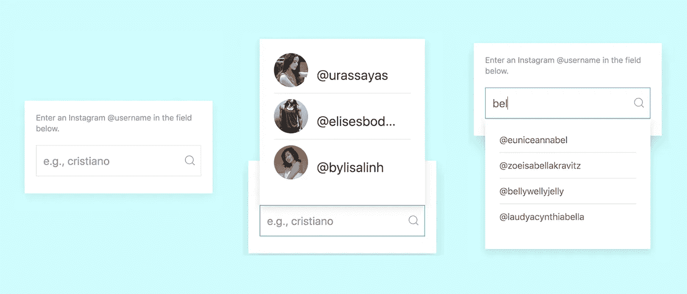
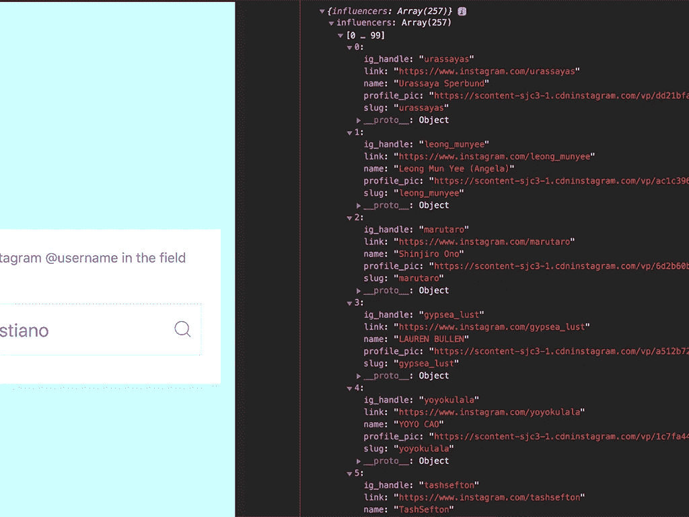

# VanillaJS 中的一个简单的“键入即建议”搜索小部件。

> 原文：<https://javascript.plainenglish.io/simple-suggest-as-you-type-es6-3b6c0fb6489a?source=collection_archive---------1----------------------->

## 一个有效的搜索小部件，在您输入时显示建议，使用普通的旧 JavaScript，使用 Fetch API 获取内容。



在开发[influence $ e](http://www.influense.me)的时候，我想让搜索功能成为人们搜索某个影响者的 Instagram 的强大工具。

因为发现是[influence $ e](http://www.influense.me)的一个关键区别特征，所以我还想构建一个简单的推荐功能，根据影响者的内容与其核心品牌价值的相关性来定位客户。

在本文中，我将分享代码并带您了解该函数是如何工作的。

> 如果你知道你在做什么，你可以跳到 GitHub 上的代码。

## **HTML**

我的 CSS 框架使用 UIKit 3，所以这部分很简单。代码如下:

## 使用 Fetch API 获取数据

我们需要做的第一件事是获得一个对象数组来填充建议，对吗？因此，我们需要向 API 端点或无头函数或其他什么发出请求。

我们将使用 Fetch API，因为我们需要的只是一个 JSON 对象，但是如果你想要更细粒度的控制，你也可以使用 XHR。

获取非常简单:

*   向 API 端点`(://<server>/api/)`发送一个`GET`请求。
*   `.then(res => res.json())`将响应呈现为 JSON。
*   `.then(json => {})`是我们可以使用 JSON 地方。
*   `.catch(error =>...);`捕捉我们请求中的任何错误。

> Fetch 不做任何错误检查！只有当对服务器的实际请求出错时，它才返回失败，比如 404 或 500。因此，您需要编写自己的错误捕获代码。

如果你运行这段代码，你会得到一个对象数组。在我的例子中，它是一堆社交媒体影响者对象:



JSON response as seen in Dev tools

## 编写 UI 代码

现在我们需要把这个数组变成一个漂亮的下拉列表。我们要生成两种类型的列表。

1.  当用户点按搜索栏时，有针对性的推荐的自动列表。
2.  另一个是我们的“随你输入建议”列表。

为此，我们将把数组传递给一个名为`loadLists()`的新函数。让我们更新对调用`loadLists(json):`的获取响应

这将我们的成员对象数组传递给一个名为`loadLists()`的新函数，如下所示:

这里发生了几件事。

*   首先，我们使用一个扩展操作符`[...json.members]`来访问数组中的对象。
*   接下来，我们创建一个名为`searchSuggest`的数组，并在其中调用`filterList()`函数。
*   然后，我们在 HTML 表单的输入字段中添加一个事件监听器。
*   最后，我们将前三名推荐的影响者加载到`presetMembers`下拉菜单中(我很快会讲到)。

我们创建`searchSuggest`数组的原因是因为我们想要将事件和函数调用传递给我们的事件监听器。这只是更清晰地划分我们的职能。

好了，让我们来看看`filterList();`功能。

哇，这是迄今为止最大的一段代码。让我们走一遍。

首先，我们有几个论点`key`和`members`。

因此，参数`members`显然是我们从 Fetch API 调用中获得的成员数组。

## 但什么是“`key”`？

还记得我们创建的那个名为`searchSuggest`的数组吗？提醒一下，我们添加的活动是

```
searchSuggest = [**'input'**, function(e) {...
```

我们为`**input**`添加了一个事件监听器，基本上就是说用户在表单域中输入的每个字符都会触发`input`事件。明白了吗？`input`事件是击键，这是我们的`key`参数。

换句话说，每当用户在我们的搜索栏中键入一个字符，就触发`filterList()`函数。

接下来，我们从 HTML 中获取`MemberList`元素。这是我们生成成员列表的地方。

好了，来看看我们的`for loop`。

在这一行中，我们将所有文本转换为小写，因此我们的搜索将不区分大小写:

```
if ((members[i].ig_handle.toLowerCase()).indexOf(key.toLowerCase()) > -1)
```

然后，对于输入的每个字符，我们遍历成员列表并创建一个新的列表项节点:

`${members[i].ig_handle}`这是我们识别会员的方式。就我而言，我是通过他们的 Instagram 用户名== `**ig_handle**`来查找的。你应该使用任何适合你需要的东西。

然后我们得到最多五个成员，并使用`insertAdjacentHTML`将他们添加到我们的列表中:

最后，如果用户输入少于两个字符——或者退格到少于两个字符——重新加载我们的`presetMembers`,隐藏我们的建议:

## 将它们缝合在一起

让我们用`getElementById:`得到我们的元素

现在我们使用模板文字来生成我们的`<ul>`标记，我们将把它插入到`presetmember` div 中。

就在那里。保存文件,(希望)它应该都工作得很好！

我希望这对你有帮助。随意评论问题，揭露，侮辱等。

获取 GitHub 上的所有代码:

[](https://github.com/MichaelLisboa/suggest-search-vanillaJS) [## MichaelLisboa/suggest-search-vanillaJS

### 在 JavaScript 和 ui kit 3-MichaelLisboa/suggest-search-vanillaJS 中键入搜索时提供建议

github.com](https://github.com/MichaelLisboa/suggest-search-vanillaJS) 

在 www.hypermix.com 的[查看我的作品集](http://www.hypermix.com)