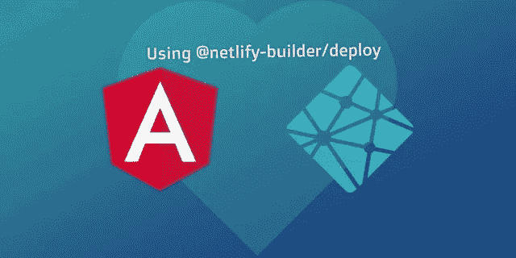
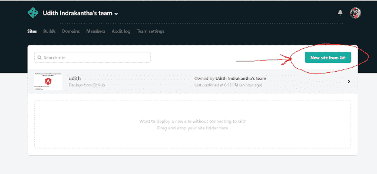
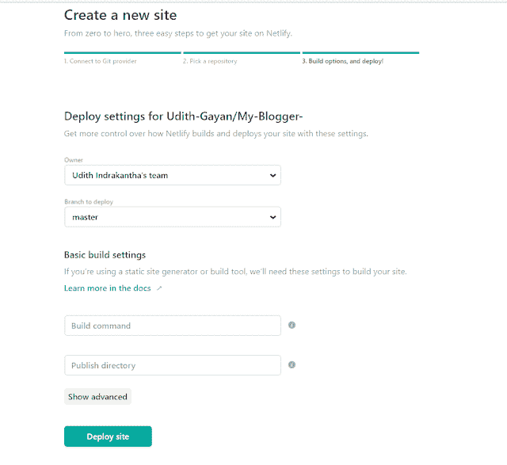
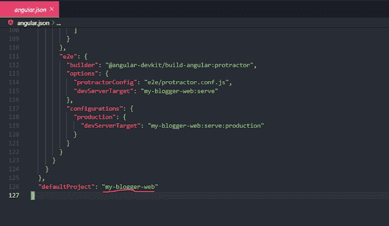
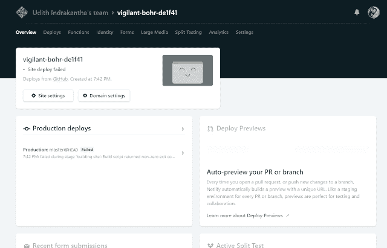
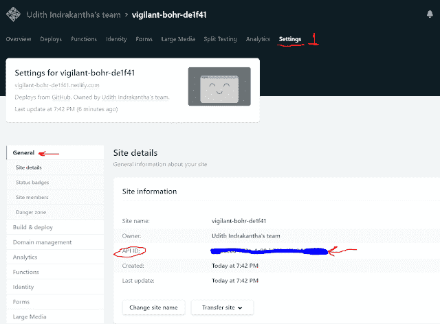
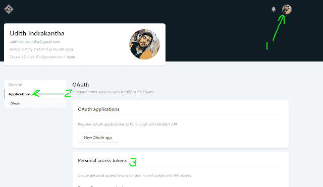
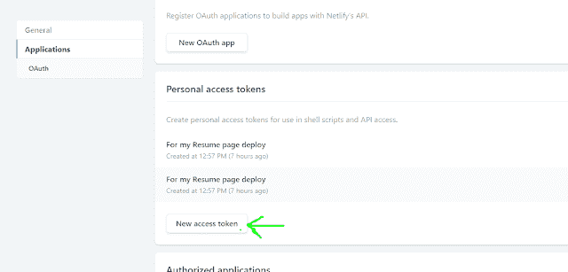
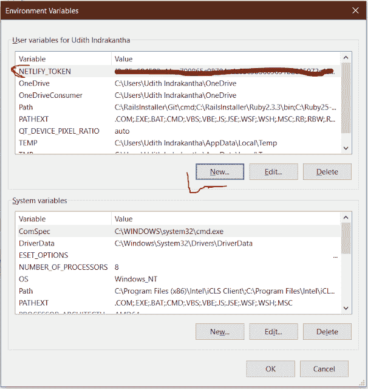
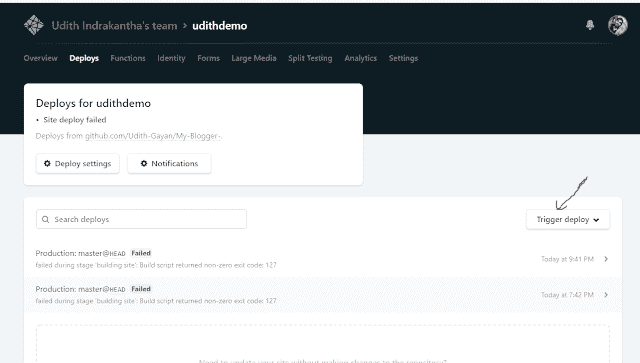

# 只需在 Netlify 上部署 Angular 应用程序

> 原文：<https://javascript.plainenglish.io/simply-deploy-your-angular-app-on-netlify-edfba30301ea?source=collection_archive---------4----------------------->



这篇文章讲述了如何在 Netlify 上安全地部署 Angular 应用程序。这是您部署应用程序的自由空间。

首先你需要一个 Netlify account([Create](https://www.netlify.com/)if not)和一个你的项目的 GitHub repo。
(我假设你已经有了 Angular 项目的 github 回购。)
我用一个我只是为了好玩而创建的示例项目来教你这个方法。

**让我们开始**

# 配置网络生活

**1。首先进入你的网络账户。您可以看到一个按钮“来自 Git 的新站点”(*图 1.1* )。点击它。**



Fig 1.1

**2** 。然后选择存储库站点。我在这里选择 GitHub。(您可以选择项目所在的地点。)
选中后，您将被重定向以授权从 netlify 进行访问，您可以在 netlify 中选择需要部署的存储库。

**3** 。再次选择存储库并转到步骤 3。(*图 1.2* )



Fig 1.2

在这一页，你必须填写一些信息。(您也可以在以后更改这些内容)

您可以指定需要部署哪个分支。
对于 **Build 命令，**give**ng Build—prod**
For**Publish directory，** give **dist/ <您的项目名称>**
**(** 您可以在您的项目的 *angular.json* 文件的末尾找到您正确的项目名称。例如: **dist/my-blogger-web** 如图(1.3))



Fig 1.3

如果一切就绪。单击按钮“部署站点”。在图 1.4 的*中，您将会看到类似这样的内容。*



Fig 1.4

**4。**接下来，转到设置选项卡，复制 *API ID* 并将其保存在某个地方，因为我们稍后会用到它。(*图 1.5)*
*【在这里，你也可以更改你的站点名称。】*



Fig 1.5

**5。我们需要找到一个个人访问令牌密钥。
点击您个人资料右上角的头像图片，选择*用户设置，*从菜单中选择*应用程序*，在*个人访问令牌下
，点击*新建访问令牌按钮。
*(图 1.6，图 1.7)***



Fig 1.6



Fig 1.7

为令牌提供一个简单的描述，以便您在以后检查令牌时能够识别使用该令牌的原因。

单击按钮生成令牌。**复制**和**粘贴**那个令牌到某个地方以备后用。然后点击完成！终于。

# 角度项目中的配置

**6。在 Angular 项目的根文件夹中打开命令窗口。**

并运行此命令
***ng add @ netlify-builder/deploy***

******** 系统要求您输入 *API ID:您可以从之前复制保存的地方输入。*
**接下来系统会要求您输入之前生成的个人访问令牌。请不要在这里输入。只需按 enter 键并跳过它。(因为这些细节都输入到您的 angular.json 文件中，可以很容易地在 github repo 中进行跟踪，这样外人就可以使用您的 API ID 和访问令牌来访问您的站点。见*图 1.8* )


Fig 1.8

**7 .**接下来，您必须将访问令牌密钥设置为计算机的环境变量。
右键单击您电脑桌面上的此电脑图标== >属性== >高级系统设置== >高级选项卡== >环境变量== >用户变量

在用户变量下，您必须输入一个新的变量，变量名为 **NETLIFY_TOKEN** ，变量值为您之前生成并保存以备后用的访问令牌密钥。见*图 1.9*



Fig 1.9

**9。**要在网络中启用角度布线，您需要做一个小的改变。

添加一个名为***_ 的新文件，将*** 重定向到您的 **src** 文件夹，并在该文件中写入以下行。

```
/*  /index.html 200
```

然后，打开 **angular.json** 文件，在`projects.architect.build.options.***assets***`上增加如下代码

```
{
  "glob": "_redirects",
  "input": "src",
  "output": "/"
}
```

**10。**接下来你要运行
***ng 运行<你的项目名称>:部署***

请在运行上述命令时给出您的项目名称。

示例: *ng 运行 my-blogger-web:部署*

【对于 Angular vCLI 8.3.0 及以上，只需运行****ng deploy****

*这将创建一个文件夹 *dist/ <您的项目名称>* ，您将其作为 netlify 网站的发布目录。*

***(可选)11。**下一步是，打开*。git 忽略您项目的*文件并删除带有 */dist* 的行，以跟踪要推送到 gitHub 的 dist 文件夹*。**

*最后，承诺和推动。*

*给你，去你的网站，点击*触发部署*按钮进行部署。如果您愿意，您可以在那里更改*部署设置*。*

**

*全部完成！*

*您的网站可在**https://*T76 上找到。您的网站名称>*。netlify . com***

***ex:**[](https://udithdemo.netlify.com/)*

***谢谢你。***