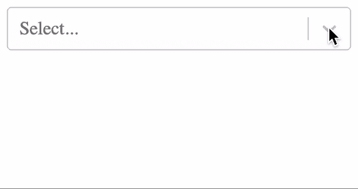

# 用测试库的用户事件模拟浏览器交互

> 原文：<https://javascript.plainenglish.io/simulate-browser-interactions-with-testing-librarys-userevent-cf8480d2606?source=collection_archive---------4----------------------->

## 图书馆用户事件 API 测试指南


Photo by [Markus Spiske](https://unsplash.com/@markusspiske?utm_source=medium&utm_medium=referral) on [Unsplash](https://unsplash.com?utm_source=medium&utm_medium=referral)

# 我的旅程

像大多数人一样，当我第一次开始使用[测试库](https://testing-library.com/docs/intro)，[时，我使用 Fire Event 来测试组件交互](https://medium.com/javascript-in-plain-english/interaction-testing-with-react-testing-library-d824f74ce48a)。毕竟，这个 API 是库本身附带的，并且用于文档中的测试示例。但我很快发现，火灾事件有严重的局限性。我会尝试单击某个东西，但没有出现预期的效果。为什么？

# 浏览器事件

为了理解这个问题，我们需要更好地理解浏览器事件。当用户点击浏览器中的某个东西时，会触发多个事件— `mouseDown`、`mouseUp`、`click`和`focus`。类似地，当输入内容时，`keyDown`、`keyUp`和`keyPress`事件都会触发！因为单个用户交互可以触发多个事件，所以开发人员有多种实现选择。这就是我遇到问题的地方。

# 火灾事件

不幸的是，Fire 事件要求您使用相应事件处理程序的方法来触发。如果一个元素有`onClick`事件处理程序，我就得用`fireEvent.click`；如果一个元素有一个`onMouseDown`事件处理器，我必须使用`fireEvent.mouseDown`。换句话说，我需要知道事件处理程序的确切实现才能成功使用`fireEvent`。

# 用户事件

[用户事件](https://www.npmjs.com/package/@testing-library/user-event)是 Fire 事件的更高级实现，更好地模拟了浏览器事件。它基于 Fire 事件来触发通常会在浏览器上发生的一系列事件。这允许您更像用户一样进行交互，而不关心内部实现，最终确保您的测试环境交互更加真实。

# 用户事件与火灾事件

[React Select](https://www.npmjs.com/package/react-select) 是 Fire 事件的局限性和用户事件的价值的最好例子。它会呈现一个输入，当您单击它时会打开一个选项菜单。



React Select

使用 Fire Event，您可以在单击下拉指示器时看到选择选项。

```
import { fireEvent, render, screen } from '[@testing](http://twitter.com/testing)-library/react';
import ReactSelect from 'react-select';// test fails
test('should open select menu with fireEvent click', () => {
  const { container, queryByText } = render(
    <ReactSelect classNamePrefix="select" options={options} />
  );
  const control = container.querySelector('.select__dropdown-indicator');
  fireEvent.click(control);
  expect(getByText('React')).toBeTruthy();
  expect(getByText('Vue')).toBeTruthy();
  expect(getByText('Angular')).toBeTruthy();
});
```

但这并没有发生！遇到这个的时候，好迷茫。在磕磕绊绊地通过 React Select 代码库中的[测试后，我发现我需要使用`fireEvent.mouseDown`来获得打开菜单的预期效果。](https://github.com/JedWatson/react-select/blob/master/packages/react-select/src/__tests__/Select.test.js#L798)

但是对于用户事件，我不需要担心这个实现细节！

```
import userEvent from '[@testing](http://twitter.com/testing)-library/user-event';// test succeeds
test('should open select menu with userEvent click', () => {
  const { container, getByText } = render(
    <ReactSelect classNamePrefix="select" options={options} />
  );
  const control = container.querySelector('.select__dropdown-indicator');
  userEvent.click(control);
  expect(getByText('React')).toBeTruthy();
  expect(getByText('Vue')).toBeTruthy();
  expect(getByText('Angular')).toBeTruthy();
});
```

由于`userEvent.click`触发了多个事件，其中包括通常会在浏览器中发生的`mouseDown`事件，因此正确的事件处理程序被触发，菜单打开。

# 蜜蜂

用户事件提供的不仅仅是上面的 click 方法。它提供了以下 API，这些 API 将使您的测试工作变得更加容易。

*   **悬停**将触发目标元素的`pointerOver`、`mouseOver`、`pointerMove`、`mouseMove`事件处理程序，并触发所有父元素的`pointerEnter`和`mouseEnter`事件处理程序。
*   **unhover** 会做与上面 *hover* API 相同的事情，但是顺序相反。
*   **点击**将触发上述*悬停* API，然后触发`pointerDown`、`mouseDown`、`focus`、`pointerUp`、`mouseUp`和`click`事件处理程序。如果有一个先前聚焦的元素，它也会触发模糊。
*   **dblClick** 将触发上述 *click* 方法两次，但只触发上述 *hover* 一次。
*   **type** 将首先触发元素上的上述 *click* API，然后触发`keyDown`、`keyUp`、`keyPress`，改变事件处理程序。通过该 API 添加的文本将在现有文本之上完成。因此，如果您执行`userEvent.type(input, ' World')`并且输入已经有了值`Hello`，那么结果文本将是`Hello World`。此外，文字将遵守任何选定的文本行为，并在添加新文本时删除它。
*   **上传**将触发上面的*点击* API，然后是`blur`(当文件选择器弹出时)、`focus`(从弹出的文件中选择一个文件后)，以及输入元素上的`change`事件处理程序。
*   **清除**将触发上述*类型*方法，用全选和删除清除输入文本。
*   **selectOptions** 将触发上述*悬停*、*点击*、*取消悬停*选择元素选项上的 API。
*   如果选择元素启用了多个值，则**取消选择选项**将执行与上述*选择选项* API 相同的操作。
*   **tab** 将触发下一个 tabbable 元素上的`focus`事件处理程序，并触发当前聚焦元素上的`blur`事件处理程序。
*   **粘贴**将触发一个粘贴剪贴板事件，该事件将在现有文本的顶部插入文本。

# 最后的想法

用户事件旨在解决使用和实现之间的脱节，使您的测试更加准确和可靠。它消除了理解实现的需要，并努力模拟用户如何与组件交互，这是测试库本身的核心指导原则。用户不关心你是否使用`mouseDown` vs `mouseUp` vs `click`实现了事件处理程序！你的测试也不应该！但前提是您开始使用用户事件。

# 资源

*   [官方用户活动文档](https://www.npmjs.com/package/@testing-library/user-event)
*   [官方测试库文档](https://testing-library.com/docs/intro)
*   [交互测试指南](https://medium.com/@changmander/interaction-testing-with-react-testing-library-d824f74ce48a)
*   [本文 Github 回购](https://github.com/mjchang/medium/tree/master/user-event)
*   [本文的 code sandbox](https://codesandbox.io/s/github/mjchang/medium/tree/master/user-event?file=/src/Select.test.js)

# 放弃

在写这篇文章的时候，我注意到 [Fire 事件文档](https://testing-library.com/docs/dom-testing-library/api-events)现在包含了一个关于使用用户事件的简介。这是在【2020 年 8 月新增的。