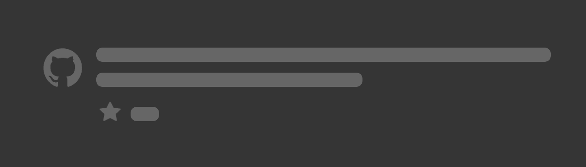
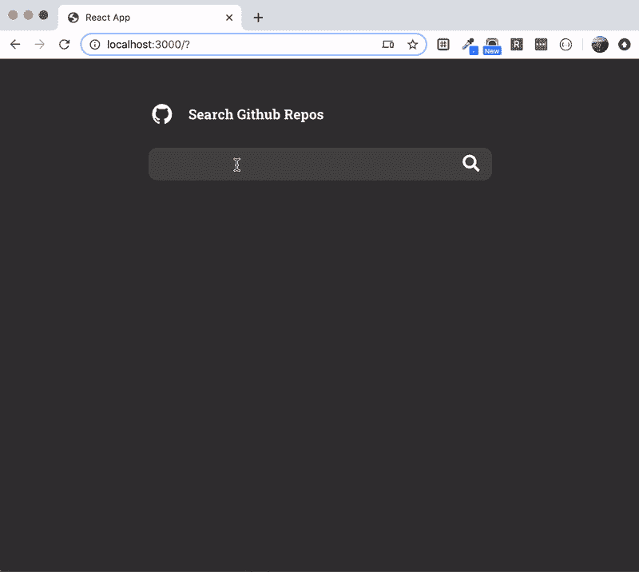
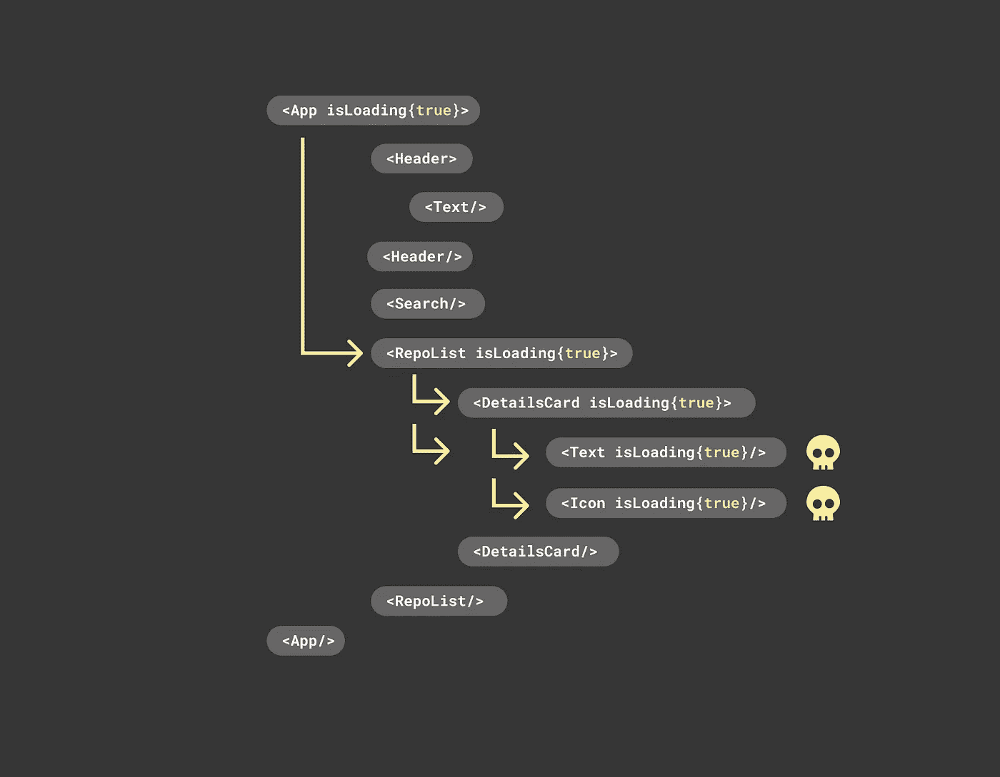
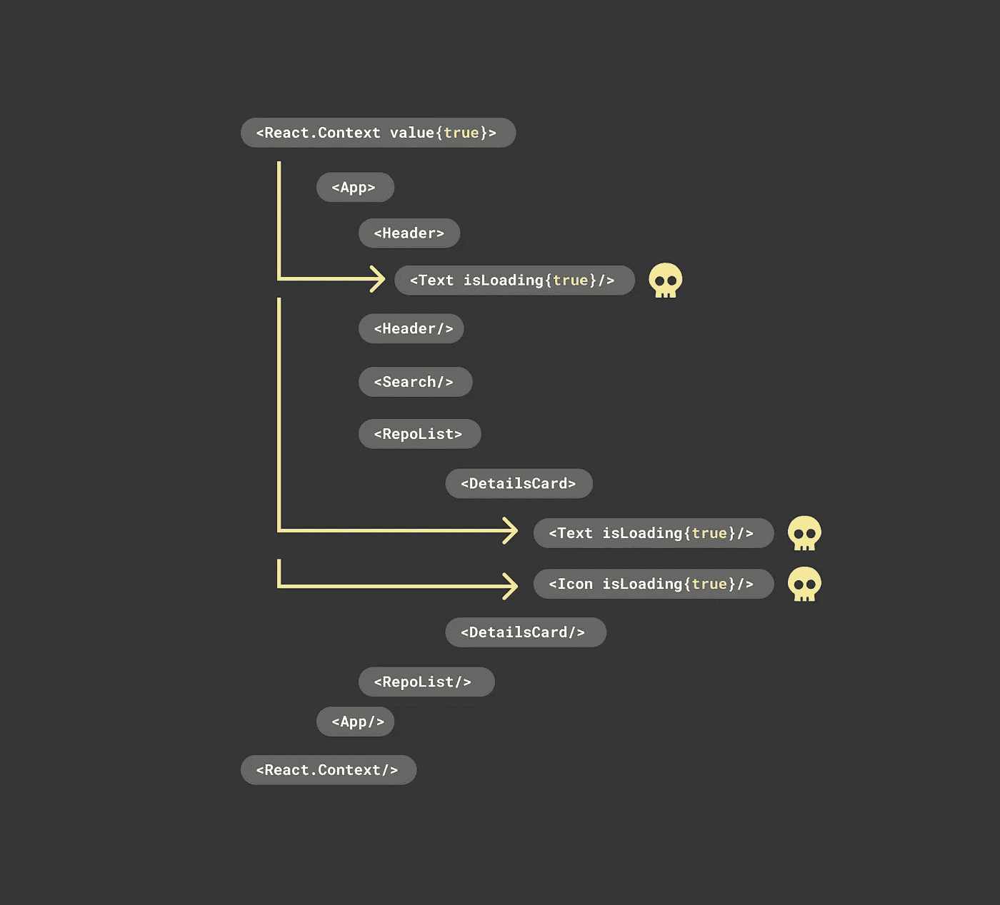
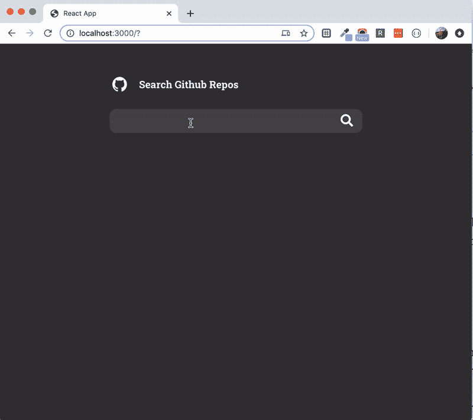
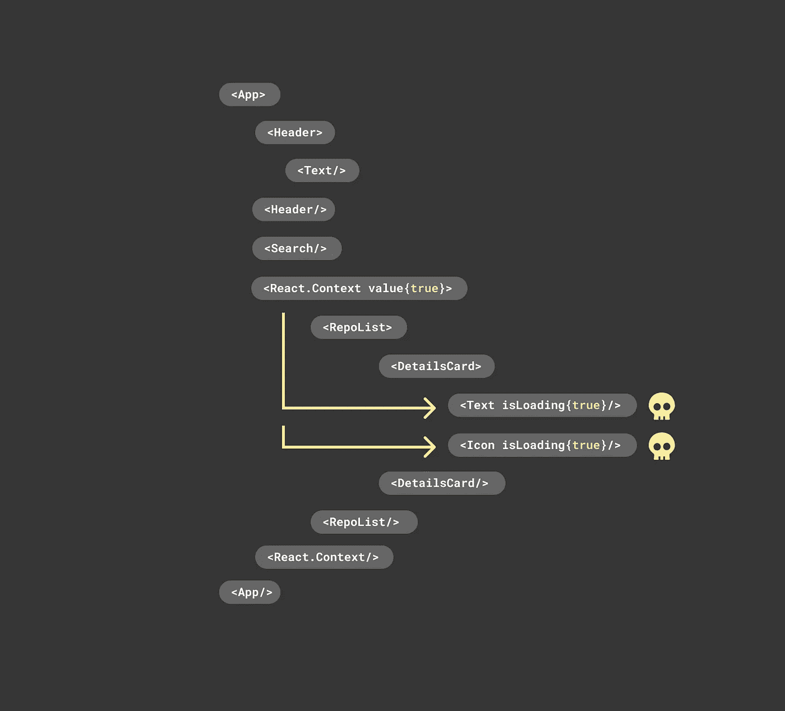

# 骨架加载状态作为一个系统

> 原文：<https://javascript.plainenglish.io/skeleton-loading-state-as-a-system-286e828ddf75?source=collection_archive---------1----------------------->

这是一个关于如何在前端应用程序中实现框架加载基础结构的演练。该方法将框架状态构建为一个*系统*，因此您的前端可以在保持加载状态一致性的同时进行扩展。对于这个例子，我将使用 React、React 上下文和钩子。

# 基本想法

为用户界面中最底层的组件实现一个“框架状态”。然后使用您选择的框架的状态管理特性，在必要时打开和关闭框架状态。

Text component changes from regular state to skeleton state

Icon component changes from regular state to skeleton state

由于较高级别的组件是由较低级别的组件组成的，每个向前(或向上)移动的新组件都可以免费获得一个框架状态视图。正是这一概念允许应用程序向上扩展，而无需在应用程序增长时为每个新组件构建唯一的框架状态的技术开销。

DetailsCard component changes from regular state to skeleton state

# 低级组件

良好的低电平元件包括`<Text/>`、`<Image/>`和`<Icon/>`。这些常见组件的行为符合预期，即文本呈现文本，图像呈现图像，等等。但是在这种方法中，它们都将构建有自己的后续“加载”视图，可以打开和关闭。

## 文本组件

默认情况下，文本组件将呈现传入的任何文本和样式。如果道具`skeleton`作为`true`传入，它将呈现一个带有灰色背景和圆形边缘的条，就像上面的图片示例一样。

Text component with a skeleton state

## 图像组件

图像组件遵循相同的原理。它将使用传入的任何源来呈现图像。但是如果`skeleton`道具是`true`，它会呈现一个灰色的方框表示“正在加载”。

Image component with a skeleton state

# 高级组件

正如我之前提到的，较高级别的组件是由较低级别的组件组成的，因此与后续的框架视图打包在一起。例如，一个`<DetailsCard/>`可能看起来像这样。

注意，这个组件不需要框架状态的代码，但是框架视图立即可用。由于代码中没有提到，所以骨架状态是否可用并不十分明显，但这是部分原因。该组件由“支持框架”的组件组成，因此它本身也是“支持框架”的。随着应用程序的发展而构建的任何新组件都可以免费获得按需加载状态。

由于管理应用程序框架状态的外观和感觉发生在应用程序的一个完全不同的区域(低级组件)，因此可伸缩性也得到显著实现。为了说明这一点，设想在应用程序的所有框架状态上引入动画效果。通过将其应用于低级组件，动画效果立即应用于每个组件的*。*

这就是这种方法的核心。下一部分将介绍骨架状态是如何打开和关闭的。

# 通信状态

考虑一个应用程序，它有一个搜索字段来查找 github repos。在搜索框中输入一个词会启动一个对 github 的 API 请求。响应以列表的形式返回，填充在搜索字段下方。当请求发出和返回时，UI 显示一个框架状态来帮助用户理解发生了什么。

React 中的一个简单实现可能有一个用于标题区域的`<Header/>`组件、一个用于搜索框的`<Search/>`组件和一个用于呈现搜索结果的`<RepoList/>`组件。

Example fetch request for git repositories on submit

注意，第 25 行的`onSubmit`回调触发了`handleSearchSubmit`函数来发出 API 请求。当请求开始时，第 7 行将本地`isLoading`状态设置为`true`，当请求完成时，返回到第 19 行的`false`。在第 18 行，来自 API 请求的响应存储在`gitRepos`本地状态中。最后，`gitRepos`和`isLoading`状态被传递给`<RepoList/>`组件。

呈现搜索查询结果的`<RepoList/>`组件接受一个数据数组，并呈现一个`<DetailsCard/>`组件列表。它还需要一个`isLoading` prop 来理解何时获取数据。在下面的例子中，当`isLoading`设置为 true 时，它将真实数据交换为一列假占位符数据(第 11 行)。

## 向下传递数据

当 API 请求正在进行时，您需要告诉底层组件进入它们的框架状态。在 React 中，您可以向下传递道具，但这需要[道具钻孔](https://medium.com/@jeromefranco/how-to-avoid-prop-drilling-in-react-7e3a9f3c8674)才能够到低级组件。随着越来越多的组件被嵌套，跟踪道具是非常麻烦的，这就是为什么一般不建议使用道具钻孔。

Diagram of prop drilling

相反，我们将使用[反应上下文](https://reactjs.org/docs/context.html)。使用 React 上下文，您可以与任何子组件共享状态，而不管有多少层。

Diagram of React Context

为此，我们将创建一个名为`skeleton.js`的新文件。它有一个`SkeletonContext`变量来存储用于打开和关闭骨架状态的布尔值。和一个共享状态的`<SkeletonArea/>`提供者组件。

Skeleton context and provider

接下来，我们将用新的`<SkeletonArea/>`组件将整个应用程序包装在`app.js`中(下面的第 22 和 28 行),并传入`isLoading`属性。通过将`isLoading`属性传递给提供者，您可以有效地将该值作为其所有子组件的全局状态进行共享。

App.js wrapped with a context provider

最后，我们将使用新的上下文提供者更新所有底层组件，以便它们知道何时进入“框架”状态。下面的每个文件都有一个由上下文提供者设置的名为`isLoading`的新布尔变量。

Level components consuming the context provider

# 孤立的骨架区域

这个解决方案有一个问题。由于所有的组件都使用相同的状态，您可能会得到一个不应该与“加载”相关联的页面区域的框架视图。例如，当获取搜索响应(“加载”)时，这里的头不应进入骨架状态。

为了解决这个问题，您可以在一组组件的边界应该共享相同框架状态的每个点上嵌套 React 上下文提供程序。在下图中，提供者只包装了结果列表，为特定的组件树创建了一个隔离的全局状态区域。

Diagram of isolated React Context

让我们更新代码来隔离列表结果，如上图所示。因为我们只希望骨架状态出现在结果列表中，所以我们将它从`app.js`中移除，并将其添加到`<RepoList/>`组件中。

Moves the context provider to the RepoList component

现在我们有了想要的行为。只有列表区域显示一个框架状态。

# 使用骨架挂钩

现在一切正常，但是代码需要打包以便重用。为此，我将在 React 钩子中捕获模式细节，并公开一个小 API 以供重用。我将调用钩子`useSkeletonData`，钩子的 API 将接受 3 个参数。

*   `**fakeData**`:这是组件在骨架状态下使用的数据。把它想象成占位符数据。
*   `**realData**`:这是组件在不处于框架状态时使用的数据。
*   `**isLoadingPredicate**`:这个函数返回一个布尔值。它的目的是远程控制任何低级子组件何时应该进入它们的框架状态。

钩子(第 18 行)将返回一个数据对象，或者是实数，或者是占位符，这取决于上面描述的谓词函数，以及一个“`connector`”对象。(连接器是允许钩子控制低级组件的骨架状态的必要部件)。

Adds two hooks for toggling data and consuming data

有了新的钩子，我将把它应用到`<RepoList/>`组件上。

RepoList component updated with the useSkeletonData hook

第 16 行获取真实数据，第 17 行获取虚假数据，第 18 行获取谓词函数。在这种情况下，它返回`isLoading`道具来控制骨骼状态。最后，第 10 行在上下文组件中传递了`connector`对象。

回到`skeleton.js`文件，我将为底层组件再创建一个钩子(下面的第 16 行)，`useIsSkeletonLoading`。

任何低级别的组件都将能够使用这个钩子，而不是直接导入 React 上下文来打开和关闭它们的框架视图。下面是如何更新`<Text/>`组件。

所有其他低级组件也将被更新。

# 沙箱

我们已经解决了许多复杂的问题:

*   按需骨架组件
*   孤立的骨架区域
*   可重用 API

这个沙盒有一个运行的例子。

Sandbox

感谢你阅读❤

- —— -
Nathaniel 是 [**Rangle.io**](http://rangle.io/) 的解决方案架构师