# JavaScript 中的切片和拼接方法

> 原文：<https://javascript.plainenglish.io/slice-and-splice-methods-in-javascript-17bf4681a16c?source=collection_archive---------7----------------------->

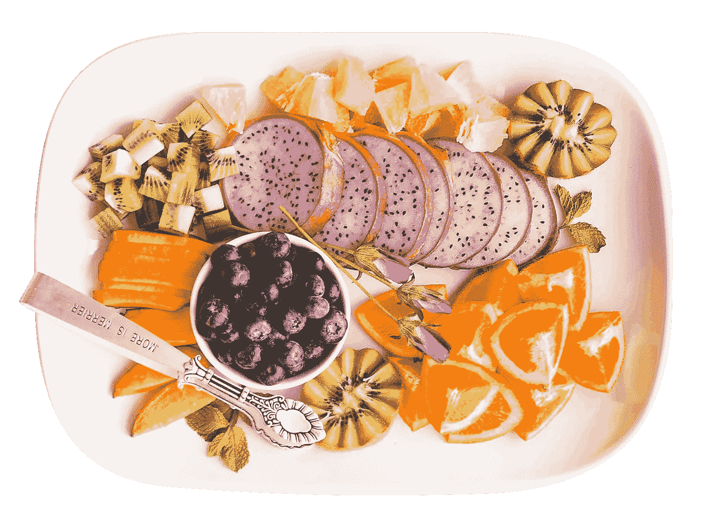

今天，我们要复习。slice()和。JavaScript 中的 splice()方法。

这两种方法非常相似。它们都是数组和字符串方法，返回任一。

让我们来看看我为这篇文章创建的一个编码示例。我们有一系列的水果，比如:

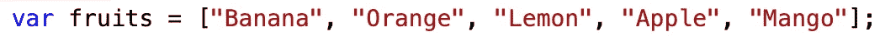

# 切片法

此处的方法可以有 0 个或最多两个参数。它将非破坏性地返回一个包含切片元素的新数组/字符串。

## 零参数:

这个方法将返回整个数组/字符串。这里有一个例子:

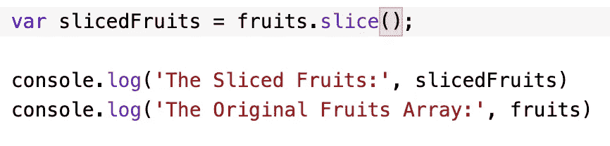

当我们对阵列进行控制台日志记录时，我们会得到:

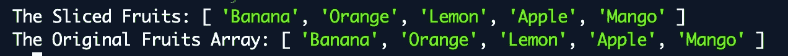

## 一个论点:

使用单个整数作为参数，该方法将返回从该指定索引直到数组/字符串结尾的所有内容。

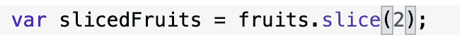

## 两个论点:

如果有一个附加参数，该方法将返回从作为索引的第一个参数到作为索引的第二个参数(不包括这两个参数)的所有内容。

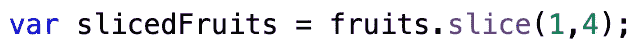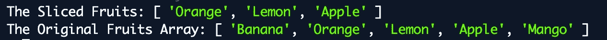

# 拼接方法

这种方法也类似于切片法。这个方法至少需要一个整数作为参数，并且可以有任意多个参数。**注意:该方法将改变原始数组——拼接的元素将从原始数组/字符串中移除！**

## 一个论点:

使用单个参数，此方法将返回一个从指定索引开始直到字符串/数组结尾的字符串/数组。

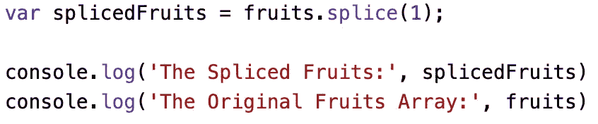

## 两个论点:

如果您不想在字符串/数组末尾之前拼接，此参数决定了该方法将从初始索引中取出多少个元素。

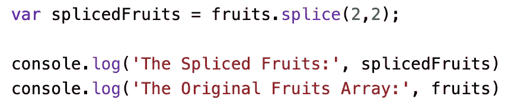

## 额外参数:

如果要用新值替换拼接元素，可以使用此参数。splice 函数可以接受任意多的参数:

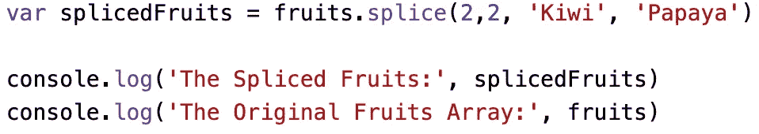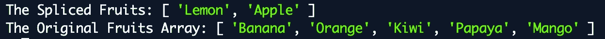

现在你知道了！切片和拼接是习惯使用的基本方法，因为它们经常用于操作数据结构。我希望这篇文章能帮助你理解这些非常相似的方法之间的区别。

# 资源

 [## JavaScript 数组 slice()方法

### 组织良好，易于理解的网站建设教程，有很多如何使用 HTML，CSS，JavaScript 的例子…

www.w3schools.com](https://www.w3schools.com/jsref/jsref_slice_array.asp)  [## JavaScript 数组 splice()方法

### 组织良好，易于理解的网站建设教程，有很多如何使用 HTML，CSS，JavaScript 的例子…

www.w3schools.com](https://www.w3schools.com/jsref/jsref_splice.asp) 

## **用简单英语写的 JavaScript**

喜欢这篇文章吗？如果有，通过 [**订阅我们的 YouTube 频道**](https://www.youtube.com/channel/UCtipWUghju290NWcn8jhyAw) **获取更多类似内容！**