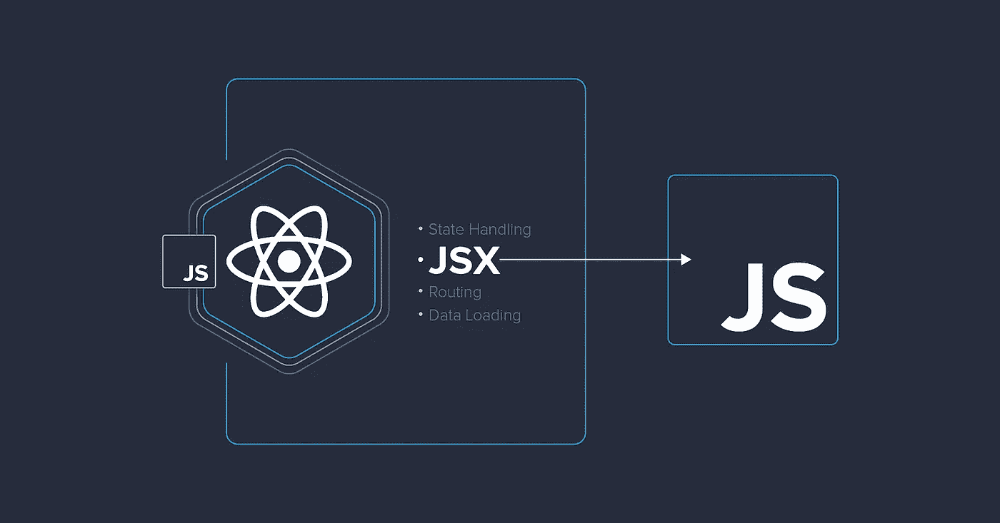

# 在 React 应用中编写 JSX 的聪明方法

> 原文：<https://javascript.plainenglish.io/smart-ways-to-write-jsx-in-your-react-app-f435aa12bb96?source=collection_archive---------1----------------------->



JSX 允许我们在 React 中编写 HTML。JSX 使得在 React 中编写和添加 HTML 更加容易。JSX 很容易理解，但作为 JSX 的新来者，有几件事你需要记住。

# 变量

无论何时你想在 JSX 中渲染一个变量/表达式，你都需要用花括号`{}`把它们括起来。您可以在大括号中包含任何 JS 表达式。

```
const name = 'Harsha';
return (
<div>
  <h1>Welcome!</h1>
  <h2>{name}</h2>
  <p>Years of coding {2020 - 2010}</p>
  <p>Today : {new Date().toLocaleDateString()}</p>
</div>
);
```

# 不渲染任何内容

如果您希望 React 不将内容呈现到屏幕上，请返回`null`。当您返回`undefined`、`[]`(空数组)、布尔值时，React 不会呈现任何内容，但是`null`很好用，因为代码可以被其他开发人员轻松阅读。

```
if(loading) return null;
return <div>Content loaded!</div>;
```

# 条件渲染

有三种方法可以在 React 中有条件地呈现内容。

## If/Else

这是我们在大多数编程语言中使用的通用语法。

```
const val = 7;
if(val>5) {
  return <div>Above 5!</div>
} else {
  return <div>Below 5!</div>
}
```

## 三元运算符

您还可以使用 JSX 的传统三元运算符进行条件渲染。如前所述，当 JSX 被包装在`{}`中时，我们也可以在其中使用这些三元运算符。

```
return isValid() === true 
  ? <div>Yay!</div> 
  : <div>Error!</div>
```

## 逻辑算子

您也可以使用逻辑 AND 运算符`&&`进行有条件渲染。使用此选项时，只有当第一个条件为真时，才会呈现内容。

```
return isValid && <div>Hello World!</div>
```

# 反应碎片

新手最常犯的一个错误是，他们试图在渲染时返回多个标签，这导致了一个错误。所以通常，他们倾向于添加一个父元素`div`来解决这个问题。但是我们真的需要`div`或者其他标签来包装吗？不完全是。有两种方法可以解决这个问题。

## JSX 的返回数组

你可以返回一个 JSX 数组，而不是返回 JSX。它将按照预期呈现，没有任何错误。

```
return [<div>One</div>, <div>Two</div>]
```

## 使用 React 片段

React 为这个用例提供了 React 片段。除了用`div`包装之外，你可以用`React.Fragment`或简单的空标签`<>`包装它。

```
return (
  <React.Fragment>
    <div>One</div>
    <div>Two</div>
  </React.Fragment>
)
```

您也可以使用这个空标记语法。

```
return (
  <>
    <div>One</div>
    <div>Two</div>
  </>
)
```

# 资本化

以大写字母开始组件名称总是一个好习惯。这是因为 React 通过大写来标识 React 组件。如果没有大写，React 会将其视为普通的 HTML 元素。所以无论何时你需要使用一个 React 组件，都要大写。

```
const App = () => <div>I am App Component<div>
```

# 结论

**额外提示** : React v17 推出了新版本的 JSX 变换，在这里你不必像以前那样导入`React`。点击了解更多信息[。](http://reactjs.org/blog/2020/09/22/introducing-the-new-jsx-transform.html)

在 React 中，你不需要使用 JSX 元素，但是 JSX 使得编写 React 应用程序更加容易。此外，最好将渲染部分保持在较小的单元中，而不是正确地渲染很多东西。我个人喜欢使用 JSX，我希望你也是如此。我希望这篇文章是有帮助的。感谢阅读！