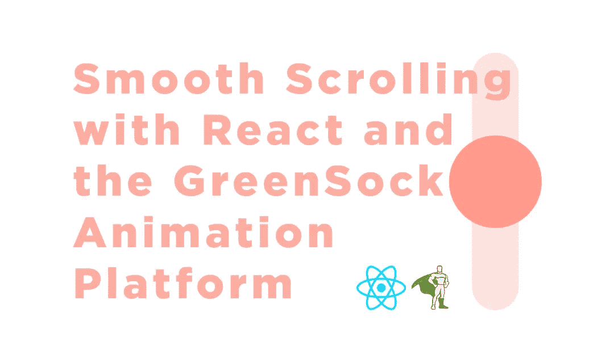

# 使用 React 和 GreenSock 动画平台实现平滑滚动

> 原文：<https://javascript.plainenglish.io/smooth-scrolling-with-react-and-the-greensock-animation-platform-883c7e10f9b3?source=collection_archive---------0----------------------->

## 没有 2000 年和迟到

从一开始，平滑滚动就一直是开发人员心中的一个问题。我们已经做了很多事情来制作页面动画，但是当你有不断变化的动态内容时会发生什么呢？固定高度滚动条和百分比值是如此 2000 年和后期。现在是 2019 年，我们已经有了 Resize Observer——一种确定内容高度的完全可靠的方法，同时始终保持用户习惯的原生滚动感觉。平滑滚动应该增强 UX，而不是降低它。

让我们开始吧。

首先，我们将创建一个包含两个 div 的 SmoothScroll 组件，一个作为视口，另一个为实际主体添加一个高度，这样我们就可以滚动页面并将它们添加为引用。

现在让我们设置 App.js，这样我们就可以使用它了。我决定从 unsplash 加载图像，并使用状态将它们映射到 DOM 中，并添加了一个按钮，这样我们可以根据需要添加任意多或少的图像。

让我们做一些基本的造型，这样看起来就不会那么丑了。

现在让我们来看本质。

resize observer 返回一个名为 observe(elements)的方法，该方法接受一个元素数组或单个元素。以防万一你想增加一个数组，我决定增加一个小循环。

现在，我们为窗口添加一个滚动监听器，并将其映射到组件的 onScroll 方法。一旦 resize observer 检测到高度发生了变化，我们也将更新状态。我们用 GSAP 的 TweenLite 制作动画，用他们的 Power4.easeOut 算法缓解它，瞧。您已经拥有了一个非常平滑的滚动页面，当内容更新时，它会自动更新。

你可以在这里看看最终产品[或者你可以在 CodeSandbox 查看下面的完整源代码。](https://87lq2.codesandbox.io/)

 [## 反应+ GSAP 平滑滚动-代码沙盒

### CodeSandbox 是一个为 web 应用程序量身定制的在线编辑器。

codesandbox.io](https://codesandbox.io/embed/nostalgic-sea-87lq2?fontsize=14) 

感谢你的时间，我希望你学到了一些东西。再见。

在你走之前，看看我的社交网站:👀

## 🔗[我的网站/作品集](https://alekangelov.com)

## 🐦[推特](https://twitter.com/39strife)

## 📷 [Instagram](https://instagram.com/angelov.alek)

我工作的数字机构:[数字呈现](https://digitalpresent.io)