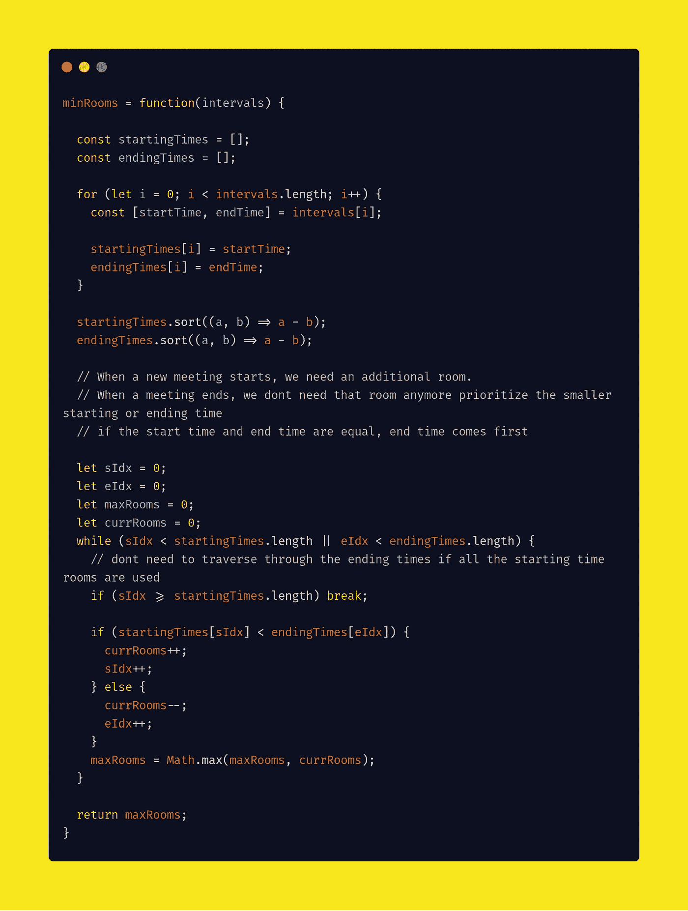
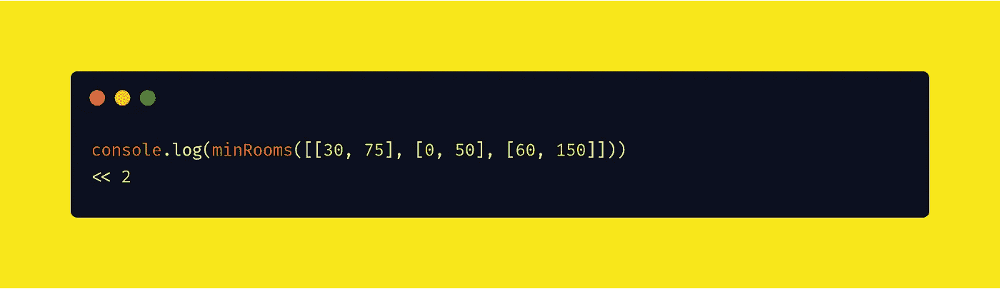
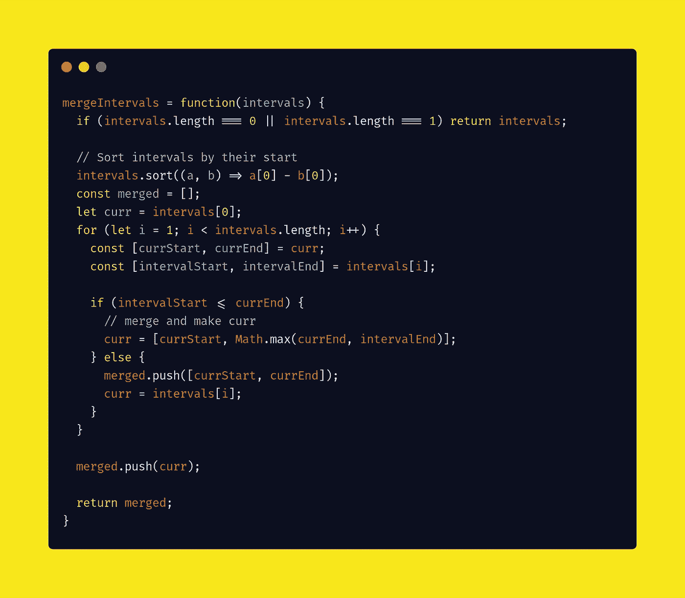
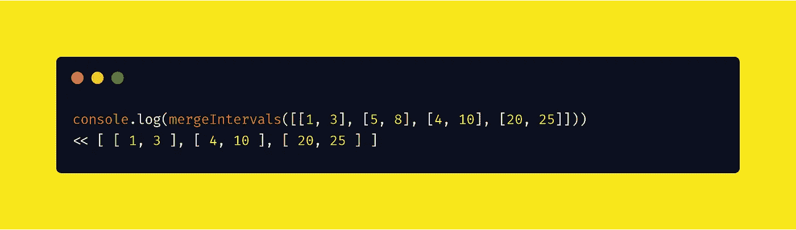

# Snapchat 编码面试问题

> 原文：<https://javascript.plainenglish.io/snapchat-coding-interview-questions-377fc67e0cbe?source=collection_archive---------5----------------------->

## 通过每天解决一个问题，变得非常擅长编写面试代码

Photo by [Thought Catalog](https://unsplash.com/@thoughtcatalog?utm_source=medium&utm_medium=referral) on [Unsplash](https://unsplash.com?utm_source=medium&utm_medium=referral)

# 日常编码问题

它们是受真实编程面试启发的各种各样的问题，带有深入的解决方案，清晰地带您了解每个核心概念。

> 通过每天解决一个问题，变得格外擅长编写面试代码。

我们将一起使用 JavaScript 解决这些问题。

# 问题#1

## 问题

给定一系列课堂授课的时间间隔(开始，结束)(可能重叠),找出所需教室的最小数量。

例如，给定[(30，75)，(0，50)，(60，150)]，应该返回 2。

## 解决办法

我们编写了`minRooms(intervals)`函数，根据 2d 数组中显示的时间间隔返回所需房间的最小数量。

请记住。

*   当新的会议开始时，我们需要一个额外的房间。
*   当会议结束时，我们不再需要那个房间，优先考虑开始或结束时间较短的时间，如果开始时间和结束时间相等，结束时间优先。

这个解决方案的输出。

# 问题#2

## 问题

给定一个可能重叠的区间列表，返回一个新的区间列表，其中所有重叠的区间都已合并。

输入列表不一定以任何方式排序。

比如给定[(1，3)，(5，8)，(4，10)，(20，25)]，你应该返回[(1，3)，(4，10)，(20，25)]。

## 解决办法

我们编写`mergeIntervals(intervals)`函数。这将返回一个新的区间列表，其中所有重叠的区间都已合并。

这个解决方案的输出。

很简单，对吧？

我将在本文中更新 Snapchat 提出的新问题🔖它重新阅读并获得最新的问题和解决方案。

感谢阅读😘

## **简明英语团队的笔记**

你知道我们有四种出版物吗？给他们一个关注来表达爱意:[**JavaScript in Plain English**](https://medium.com/javascript-in-plain-english)[**AI in Plain English**](https://medium.com/ai-in-plain-english)[**UX in Plain English**](https://medium.com/ux-in-plain-english)[**Python in Plain English**](https://medium.com/python-in-plain-english)**——谢谢，继续学习！**

**此外，我们总是有兴趣帮助推广好的内容。如果您有一篇文章想要提交给我们的任何出版物，请发送电子邮件至[**submissions @ plain English . io**](mailto:submissions@plainenglish.io)**，附上您的媒体用户名和您感兴趣的内容，我们将会回复您！****