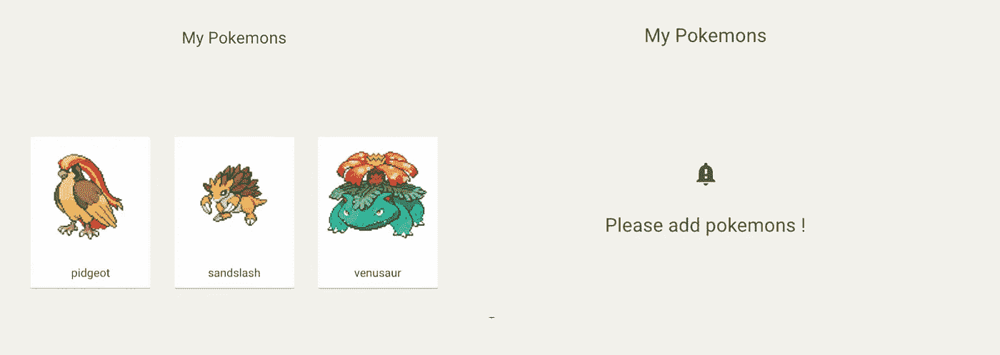

# 带有 React 测试库和类型脚本的材质 UI 风格组件的快照。

> 原文：<https://javascript.plainenglish.io/snapshots-of-material-ui-styled-component-with-react-testing-library-and-typescript-d82d7d926d2c?source=collection_archive---------6----------------------->


每个人都知道编写测试对于软件开发来说非常重要。它使我们能够以更少的错误更快地修改代码。

说到前端，`React Testing Library`越来越受欢迎，因为与`enzyme`相比，它更容易测试 React 钩子。然而，当你想用材质 UI 风格的组件做快照测试时，你应该处理一件事，材质 UI 创建的随机类名。

# 将测试库与材料用户界面(MUI)进行反应

首先，测试 MUI 组件与普通 JSX 组件基本相同。您应该关注用户如何与实际的 DOM 交互。

是的，MUI `<Button />`组件不同于 html `<button />`。但你要接触的只是从 MUI 消化过来的 HTML。

# MUI 样式的组件

有了 MUI，你可以定义自己的`theme`，用 JS 写 CSS。要使用它，通常在使用 React 上下文 API 的根组件中提供`theme`。

```
// Index.tsxReactDOM.render(
  <MuiThemeProvider theme={theme}>
    <App />
  </MuiThemeProvider>,
  document.getElementById('root'),
);
```

每个子组件如下所示。HOC 可以让你用 JS 写 CSS 并提供主题。

```
import React from 'react';
import { withStyles, WithStyles, Theme, StyleRules } from '@material-ui/core/styles';
import { Typography } from '@material-ui/core';const styles = (theme: Theme): StyleRules => ({
  typography: {
    margin: 200,
  },
});type HelloProps = WithStyles<typeof styles>;const Hello: React.FC<HelloProps> = ({ classes }) => (
  <Typography className={classes.typography} variant="h6">
    Hello world!
  </Typography>
);export default withStyles(styles)(Hello);
```

如果您在浏览器中检查实际 DOM 的类名，您会理解 MUI 创建了类似于 <component name="">- <class name="">- <random number="">的类名并将 css 应用于每个类。</random></class></component>

```
<h6 class="MuiTypography-root MuiTypography-h6 Hello-typography-274">
  Hello World!
</h6>
```

然而，MUI 创建的类名导致了快照测试的一个问题。

# 设置演示应用程序

我创建了一个演示应用程序来学习如何一步一步地测试一个样式化的组件。请克隆它。

```
git clone [https://github.com/egurinko/react-testing-library-demo.git](https://github.com/egurinko/react-testing-library-demo.git)
git checkout feature/01_MUI_styled_component_test
```

您可以使用运行应用程序

```
yarn
yarn start
```

使用运行测试

```
yarn test
```

# 编写第一个快照测试

测试样式化组件的好组件是`src/components/my_pokemons/Index.tsx`。如果你选择口袋妖怪，你可以看到你的口袋妖怪。如果你没有选择口袋妖怪，你可以看到一个信息。



让我们创建测试文件。

```
// src/__test__/integration/my_pokemons/index.tsx.......const myPokemons: Pokemons = [
  {
    id: 1,
    name: 'mockName',
    stats: [],
    sprite: 'mockSprite',
  },
];let body: RenderResult;describe('<Index />', () => {
  beforeEach(() => {
    body = render(<Index myPokemons={myPokemons} />);
  }); it('matches snapshot', () => {
    const { baseElement } = body;
    expect(baseElement).toMatchSnapshot();   
  });
});
```

运行测试。

```
yarn test src/__test__/integration/my_pokemons/index.spec.tsx
```

添加了一个快照测试文件，一切看起来都很好。

# 快照很脆弱…

让我举个例子。

```
// src/__test__/integration/my_pokemons/index.tsx.......const myPokemons: Pokemons = [
  {
    id: 1,
    name: 'mockName',
    stats: [],
    sprite: 'mockSprite',
  },
];describe('<Index />', () => {
  beforeEach(() => {
    body = render(<Index myPokemons={myPokemons} />);
  });

  // ADD a test
  it('shows pokemons', ()=>{
    expect(body.getByText(myPokemons[0].name)).toBeInTheDocument()
  });

  it('matches snapshot', () => {
    const { baseElement } = body;
    expect(baseElement).toMatchSnapshot();   
  });
});
```

我添加了一个通过的简单测试。但是当你测试的时候。

```
yarn test src/__test__/integration/my_pokemons/index.spec.tsx
```

您会看到快照测试失败…如下所示。

```
exports[`<Index /> with pokemons matches snapshot 1`] = `<body>
  <div>
    <div
-     class="Index-container-1"
+     class="Index-container-185"
    >
.....
```

当你第一次运行测试时，MUI 添加`1`作为类名的随机数。但是，通过增加一个测试，随机数变成了`185`，就失败了。我没有改变任何事…

那么如何解决这个问题呢？？

# Hack generateClassName 函数

提示在 MUI 实现中。其实有个生成类名的地方叫[createGenerateClassName](https://github.com/mui-org/material-ui/blob/c171287d490e05a6bf23028468dea5b60047cddc/src/styles/createGenerateClassName.js#L11)。

`createGenerateClassName`函数返回函数取`rule`、`styleSheet`返回`${prefix}-${rule.key}-${ruleCounter}`的类名字符串。`ruleCounter`给类名添加一个随机数。

`generateClassName`变量保存`createGenerateClassName` [返回的函数，保存的函数用于`StylesProvider`。](https://github.com/mui-org/material-ui/blob/c171287d490e05a6bf23028468dea5b60047cddc/src/styles/withStyles.js#L35)

所以如果你创建自己的`generateClassName`函数并将其传递给`StylesProvider`，类名就可以是固定的。

首先，创建自己的`generateClassName`。

```
// src/__test__/util/themeProvider.tsximport React, { ReactElement } from 'react';
import { MuiThemeProvider } from '@material-ui/core/styles';
import { StylesProvider, StylesOptions } from '@material-ui/styles/';
import theme from '../../utils/theme';const generateClassName: StylesOptions['generateClassName'] = (
  rule,
  sheet
): string => `${sheet!.options.classNamePrefix}-${rule.key}`;
```

不包括`generateClassName`末的`ruleCounter`。如果您将此`generateClassName`与`StylesProvider`一起使用，就不会创建随机数。所以将`StylesProvider`添加到您自己的`generateClassName`中。

```
// src/__test__/util/themeProvider.tsx...): string => `${sheet!.options.classNamePrefix}-${rule.key}`;export const provideTheme = (ui: ReactElement): ReactElement => {
  return (
    <StylesProvider generateClassName={generateClassName}>
      <MuiThemeProvider theme={theme}>{ui}</MuiThemeProvider
    </StylesProvider>
  );
};
```

实际上，`provideTheme`函数以 react rement 为参数，返回由`StylesProvider`、`MuiThemeProvider`包装的 react rement。因此，如果您将 ReactElement 传递给`provideTheme`，您就可以得到没有随机类名的样式化组件🎉

当您使用它时，只需在渲染前通过 ReactElement。

```
// src/__test__/integration/my_pokemons/index.spec.tsx...describe('<Index />', () => {
  beforeEach(() => {
    body = render(provideTheme(<Index myPokemons={myPokemons} />));
  });....
```

一切都准备好了！让我们进行测试。

```
yarn test -u
```

它过去了🎉！如果您检查快照文件，

```
exports[`<Index /> matches snapshot 1`] = `
<body>
  <div>
    <div
      class="Index-container"
    >
```

它不会在类名的末尾添加随机数！最后，快照测试变得可靠！

本文主要讨论用 TypeScript 对 MUI 风格的组件进行快照测试。

因为我写了其他关于反应测试库的文章，如果你喜欢的话，去看看吧！

*   [用 TypeScript 启动反应测试库的实用指南。](https://medium.com/@egctoru/the-practical-guide-to-start-react-testing-library-with-typescript-d386804a018)

谢谢你！

## 参考

*   [检测库](https://testing-library.com/)
*   [JEST](https://jestjs.io/en/)
*   [ts-jest](https://github.com/kulshekhar/ts-jest)