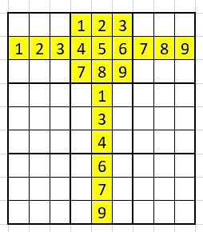
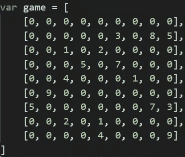
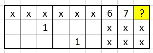
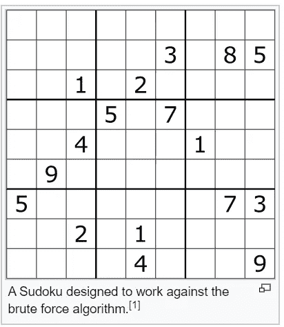
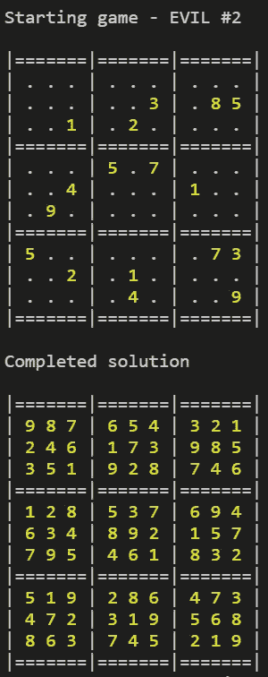
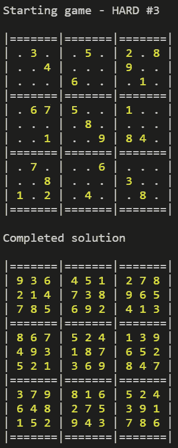
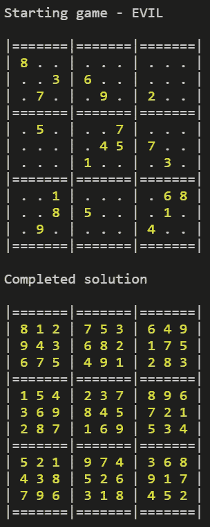

# 如何用 JavaScript 解一个数独

> 原文：<https://javascript.plainenglish.io/solve-a-sudoku-using-javascript-de456e8c34a5?source=collection_archive---------2----------------------->


Cover photo by [Jonathan Ybema](https://unsplash.com/@jayworks?utm_source=unsplash&utm_medium=referral&utm_content=creditCopyText) on [Unsplash](https://unsplash.com/s/photos/sudoku-puzzle?utm_source=unsplash&utm_medium=referral&utm_content=creditCopyText)

## 通过用 JavaScript 编写的例子，演示了解决流行的数独数字挑战的算法。

## **游戏规则**

对那些不熟悉数独规则的人做一个简单的总结。一个完整的数独是一个 9 x 9 的网格，其中每一个**行**、**列**和每一个 **3 x 3 的正方形**必须包含数字 1-9 中的每一个(并且只能包含一次)。下面的网格描述了遵守这些约束的单行、列和正方形。



游戏以部分完成的网格和复杂程度呈现，给出了预先填充的单元数量和这些单元的位置(提供“线索”)。他们的范围从简单到专家。

## **游戏输入**

为了挑战的利益，我们可以假设我们将从长度为 9(行)的数组开始游戏。每行本身是一个长度为 9(单元)的数组。

值将是 0-9 的整数，其中零表示空白。



Example Sudoku taken from Wikipedia

## **助手功能**

不管算法如何(我将在后面通过我采用的两种方法来讨论)，一些辅助函数总是有用的。源码分享在最后。

*   ***get_row(board，row)*** —由于游戏棋盘是一个行的数组，所以这是琐碎的，只是一个奢侈的方法！
*   ***【get _ column(board，column)*** —返回所提供列的所有单元格。
*   ***get_square(board，square)*** —我们可以在逻辑上将棋盘分割成 9 个 3×3 的正方形，给定 *(row，col)* 坐标我们可以识别正方形，然后返回同一正方形内的所有单元格。
*   ***is _ solved(board)***—给定一个已完成的棋盘，它是否正确，即我们是否完成了拼图？这个函数应该检查每一行、每一列和每一个正方形是否有完整的 1-9 值。
*   ***【print _ board(板)*** — 帮助可视化板/网格的功能。下面的输出是前面图片中游戏阵列的棋盘的起始位置。

```
|=======|=======|=======|
| . . . | . . . | . . . |
| . . . | . . 3 | . 8 5 |
| . . 1 | . 2 . | . . . |
|=======|=======|=======|
| . . . | 5 . 7 | . . . |
| . . 4 | . . . | 1 . . |
| . 9 . | . . . | . . . |
|=======|=======|=======|
| 5 . . | . . . | . 7 3 |
| . . 2 | . 1 . | . . . |
| . . . | . 4 . | . . 9 |
|=======|=======|=======|
```

## **两种方法**

我从两个角度来面对这个挑战，最后我使用了这两种技术——对于复杂的数独游戏来说，使用组合会更快。

**方法 1。**第一种方法是运用**蛮力**来解决问题。我们可以应用一个 [**回溯**](https://en.wikipedia.org/wiki/Backtracking) 算法，遍历所有的空单元格，从值 1 开始并检查它是否有效。然后，我们移动到下一个空单元格，将其设置为 1，并检查它是否有效。诸如此类。在任何时候，我们遇到一个不可能的解决方案(没有有效值的单元格)，我们尝试下一个值，然后下一个。如果我们用尽了当前单元格中的所有组合，我们会返回一个循环，增加前一个单元格的值，然后重新开始。

使用这种方法，一路回溯多次开始的情况并不少见。为了实现这种方法，我们可以使用一个简单的循环并应用递归(一个用改变或缩减的问题空间调用自己的函数)——逻辑只有几行。

我发现一种蛮力方法解决了所有数独游戏——但这是以*性能为代价的*。(尽管只有几分之一秒)。

**方法二。**这就是为什么我引入了第二种方法——**单值单元格约束**函数——当单独使用时，它解决了我扔给它的所有容易解决的问题，根本不需要诉诸暴力。在这里，我们应用了一个人在解决一个难题时会用到的技术——因此逻辑要长得多。

我们获取每个空单元格，并确定它可能包含的值——将每个空单元格更新为其可能值的数组。

如果任何单元格只能包含**一个值**，我们就在主游戏网格中将其正式设置为该值。所以在这个相当简单的例子中，标有“？”的单元格只有一个可能的值(9)。


如果一个单元格有不止一个可能的值呢？在这种情况下，我们将每个可能的值 *x* 与行、列和正方形中的其他单元格进行比较。如果 *x* 仅作为该单元格的一种可能性出现，*不管该单元格可能有什么其他可能性*，都保证该单元格有该值。

为了详细说明，在下一个示例中，标记为“？”的单元格可能第一次就有了可能性`[1, 2, 3, 4, 5, 8, 9]`。然而，当我们查看行或正方形时，我们不会在任何其他单元格(标记为“x”)中找到值 1 的可能性。因此我们 100%知道细胞"？一定是 1 的位置。人类会简单地在他们的大脑中应用这个规则。



第二种方法是在整个表中迭代这两个循环，直到不能再应用更新为止— **，它解决了大多数简单到中等复杂的数独问题。**

这也使得破解复杂的数独游戏——通过暴力—**—**要快得多，因为我们已经提前预填充了许多单元格。

## **最终解决方案**

解决方案是两种方法的结合；

1.  **单值单元格约束** —这里解决了大多数不复杂的解决方案。
2.  **强力/回溯** —在这里，我们可以重用(1)中的逻辑，即每次我们选择一个值，然后我们可以“向前看”并填充任何现在只有一个可能值的单元格，从而缩小问题空间(或快速消除我们认为不可能的选择)。

这两种方法的结合解决了我早期单独使用蛮力挑战复杂数独的性能问题。

## **代码**

入口函数是`solved(board)`，它调用实现前面描述的两种方法的函数。我们迭代我们的**单值单元格约束**函数，只要更新仍然被应用(即单元格被填充，因为它们只有一个可能的值)。当我们解决了数独或者不再填充任何单元格时，这个循环就结束了。

如果我们没有解决数独，那么我们就退回到**强力**功能。我们假设网格可以被解决——也就是说，不要试图抓住我们——所以最后我们会将电路板作为一个完整的解决方案返回。

```
function solve(board) { let updated = true, solved = false

  while (updated && !solved) {
    updated = **one_value_cell_constraint**(board)
    solved = is_solved(board)
  } if (!solved) {
    board = **backtrack_based**(board)
  } return board
}
```

在`one_value_cell_constraint`函数中(如下所示),我们保存了`updated`的记录，网格的任何变化都会让我们继续下一次迭代——因为我们正在实时编辑游戏网格，函数中的每个循环都建立在之前的更新之上。

在内部，我们使用了一个名为`complete_cell`的函数，我们在后面的强力逻辑中也会用到它。该函数查找单元格的所有可能值—如果只有一个值，它将单元格设置为该值；如果有多个值，它将单元格设置为包含所有可能值的数组(如`[1, 4, 5]`)。

下一部分选取任何具有一系列可能性的单元格，并查看相应的行、列和方块，以查看是否有可能的值`appears_once_only`。如果是，那么我们将单元格设置为该值。

```
function one_value_cell_constraint(board) { updated = false // Convert every gap into an array of possibilities
  for (let r = 0; r < 9; r++) {
    for (let c = 0; c < 9; c++) {
      if (board[r][c] == 0) {
        updated = **complete_cell**(board, r, c) || updated
      }
    }
  } // Look out for any possibility that appears as a possibility
  // once-only in the row, column, or quadrant.
  for (let r = 0; r < 9; r++) {
    for (let c = 0; c < 9; c++) {
      if (Array.isArray(board[r][c])) {
        let possibilities = board[r][c]
        updated = 
          **appears_once_only**(board, possibilities, get_row(board, r), r, c) ||
          **appears_once_only**(board, possibilities, get_column(board, c), r, c) ||
          **appears_once_only**(board, possibilities, get_square(board, square_coordinates[r][c]), r, c) || updated
      }
    }
  } // Reinitialize gaps back to zero before ending
  for (let r = 0; r < 9; r++) {
    for (let c = 0; c < 9; c++) {
      if (Array.isArray(board[r][c])) {
        board[r][c] = 0
      }
    }
  } return updated
}
```

最后，**暴力**逻辑在我们的`backtrack_based`函数中。

因为我们可能会跟踪死胡同，所以我们处理数组的副本——尽管 JavaScript 通过值在*中传递模板，数组中的所有对象都是引用 JSON 库帮助深度克隆数组。*

我们迭代每个空单元格，并最初重用我们之前提到的`complete_cell`函数。如果只有一个可能的值，这将填充单元格——这在我们到达最后一个空单元格时很有用，这将基本上解决棋盘，因此我们在这里包含一个`is_solved`检查并返回解决的棋盘。

假设我们得到一个可能值的列表，我们依次迭代这些可能性——将单元格设置为列表中的第一个值，并递归调用函数。在某个阶段，一个递归会成功结束(用`complete_cell`填充最后一个单元格)，但很可能我们会进入一个‘死胡同’。如果我们用尽了所有可能的值，我们返回 false 并回溯。

```
function backtrack_based(orig_board) { // Create a temporary board for our recursion.
  let board = JSON.parse(JSON.stringify(orig_board)); for (let r = 0; r < 9; r++) {
    for (let c = 0; c < 9; c++) {
      if (board[r][c] == 0) {
 **complete_cell(board, r, c)
        if (is_solved(board)) return board;** let cell = board[r][c]
        if (Array.isArray(cell)) {
          for (let i = 0; i < cell.length; i++) { // Create a temporary board for each recursion.
            let board_2 = JSON.parse(JSON.stringify(board)); // Choose a value
            board_2[r][c] = cell[i] // Recurse again using new board
 **if (completed_board = backtrack_based(board_2)) {
              return completed_board;
            }**          }
          return false // dead end
        }
      }
    }
  } return false;
}
```

## **结论和实例**

首先——**代码起作用了**，包括对抗“*数独，该数独是为对抗暴力算法*而设计的。将两种不同的技术结合起来使用是一个很有价值的学习点。



代码可以优化，尽管即使是最困难的代码，性能也是次秒级的。每次递归复制数组都会引入内存开销，我本可以解决这个问题。

## **一些示例游戏和解决方案**



## **延伸阅读**

*   [这个解决方案的源代码](https://github.com/davelms/medium-articles/blob/master/sudoku-solver/sudoku.js)可以在 GitHub 上找到。
*   维基百科关于“数独求解算法”的文章。

[](https://en.wikipedia.org/wiki/Sudoku_solving_algorithms) [## 数独求解算法

### 一个标准的数独游戏包含 81 个单元格，在 9×9 的网格中，有 9 个盒子，每个盒子是第一个…

en.wikipedia.org](https://en.wikipedia.org/wiki/Sudoku_solving_algorithms) 

## **用简单英语写的 JavaScript 笔记**

我们已经推出了三种新的出版物！请关注我们的新出版物:[**AI in Plain English**](https://medium.com/ai-in-plain-english)，[**UX in Plain English**](https://medium.com/ux-in-plain-english)，[**Python in Plain English**](https://medium.com/python-in-plain-english)**—谢谢，继续学习！**

**我们也一直有兴趣帮助推广高质量的内容。如果您有一篇文章想要提交给我们的任何出版物，请发送电子邮件至[**submissions @ plain English . io**](mailto:submissions@plainenglish.io)**，并附上您的 Medium 用户名，我们会将您添加为作者。另外，请让我们知道您想加入哪个/哪些出版物。****