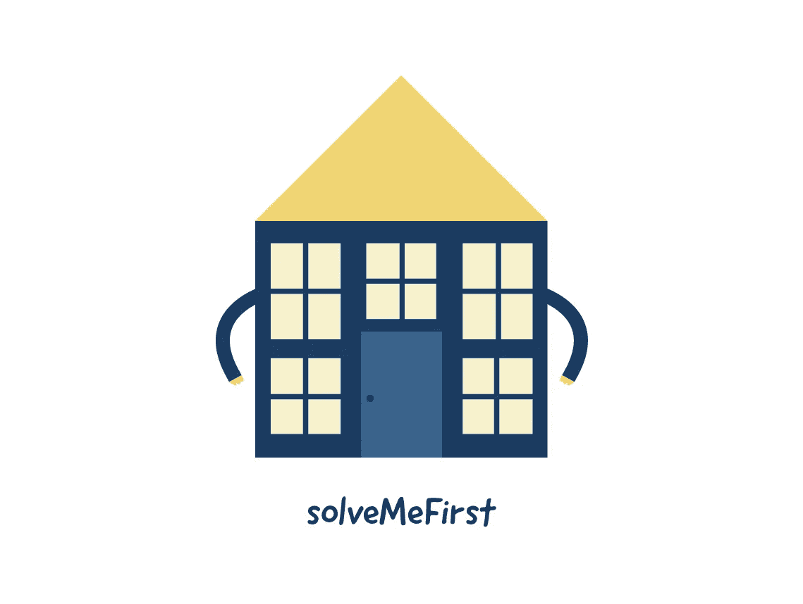
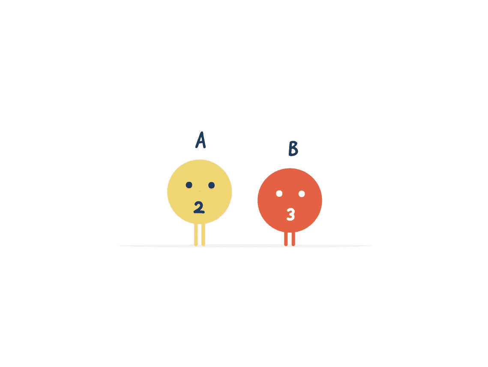
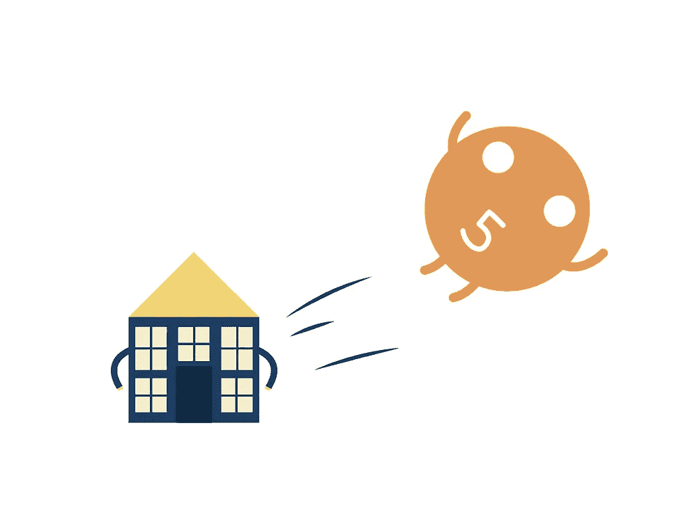

# JavaScript 中的算法:先解决我

> 原文：<https://javascript.plainenglish.io/solve-me-first-7a2f53789228?source=collection_archive---------2----------------------->

## 在 JavaScript 中完成一个名为 solveMeFirst 的函数，这个函数的作用是计算两个整数的和。

在这个算法中，目标是完成一个名为 solveMeFirst 的函数，这个函数的作用是计算两个整数的和。

将 solveMeFirst 函数(或一般函数)想象成一所房子:

这个功能是一个房子，在房子里发生事情。例如，如果一个没有食物的人(输入)走进一家杂货店(一个函数)，输出将是你推着一车食物走出来。杂货店的功能将是给你食物吃。如果是洗车，输入是脏车，输出是干净车。

对于这个功能，房子只是一个附加的房子。solveMeFirst 函数将接受两个输入:

输入 A 和 B 都是整数。一旦函数接收到这两个输入，事情就会发生:

a 和 B 相加，并返回相加的结果。

可以把它想象成当一个函数返回一些东西时，这个函数把结果踢回来，这样它就可以用于其他目的。对于这个函数，唯一需要的就是值。没别的了。

如你所见:当 A = 2，B = 3 时，最终结果是 5。这适用于任何整数，因此如果 A = 19，B = 29，该函数将返回 48。

结束了。

这里有一些其他的 JavaScript 算法，你可以看看:

 [## JavaScript 算法:生日蛋糕蜡烛

### 对于今天的算法，我们将创建一个名为生日蛋糕蜡烛的函数。

medium.com](https://medium.com/javascript-in-plain-english/javascript-algorithm-birthday-cake-candles-86da2c686634)  [## 最小-最大和

### 对于今天的算法，我们将创建一个名为 miniMaxSum 的函数。在这个函数中，给你一个数组…

medium.com](https://medium.com/@endubueze00/mini-max-sum-a62de1d7f4f1)