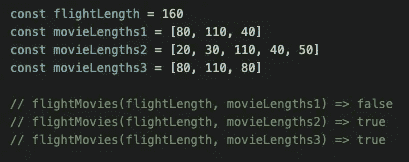
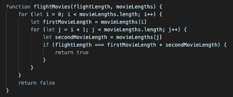
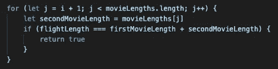
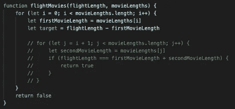
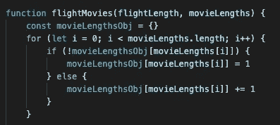
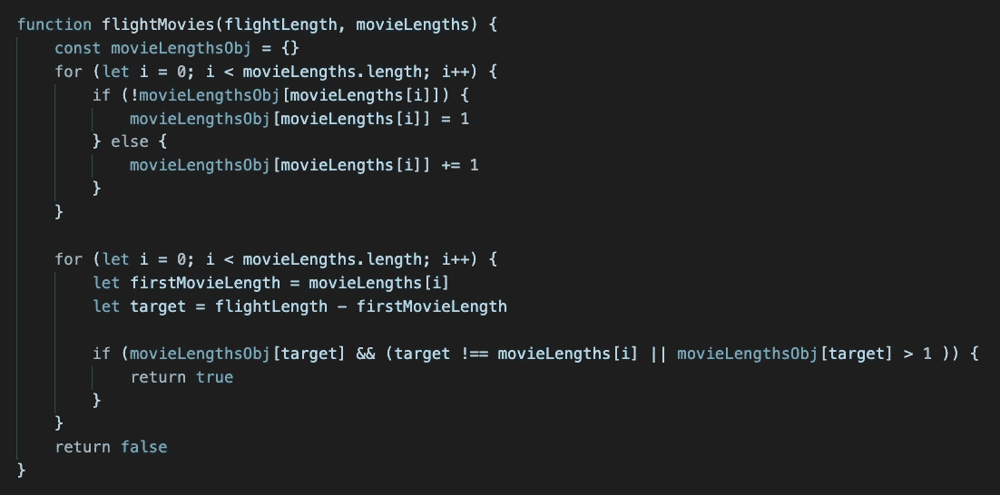
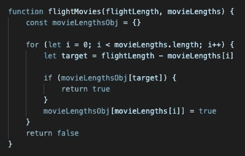

# 用 JavaScript 解决一个概念性面试问题

> 原文：<https://javascript.plainenglish.io/solving-a-conceptual-interview-question-in-javascript-d904e8fd95ea?source=collection_archive---------3----------------------->

Photo by [Suhyeon Choi](https://unsplash.com/@by_syeoni?utm_source=medium&utm_medium=referral) on [Unsplash](https://unsplash.com?utm_source=medium&utm_medium=referral)

最近，在一次模拟技术面试中，我被要求回答这个面试问题:

*假设你正在为一家航空公司构建一个靠背娱乐系统。你的任务是实现一个功能，允许用户观看电影对，其总运行时间将等于他们飞行的确切长度。*

*编写一个函数，该函数采用一个整数* ***flightLength(以分钟为单位)*** *和一个整数数组* ***movieLengths(以分钟为单位)*** *并返回一个布尔值，该值指示在****movie lengths****中是否有两个数字的和等于****flight length***

*用户不能两次观看同一部电影，只有在飞行期间可以观看完整的两部电影时，该函数才应返回 true。*

像大多数编码挑战一样，这里有多种方法来解决问题。首先，我们将实现一个强力解决方案，以便理解问题并让我们的代码工作。

稍后，我们将探讨重构代码以优化运行时时的一些关键概念。

## **天真的方法**

首先，让我们硬编码一个`flightLength`和几个不同的`movieLengths`数组。

Example inputs

假设`flightLength`为 160 分钟，`movieLengths1`不包含两个合起来等于 160 分钟的运行时。这里，我们应该返回 false。

`movieLengths2`返回 true，因为运行时间为 110 分钟和 50 分钟的电影总计为 160 分钟。

`movieLengths3`也返回 true，因为有两个*独立的*电影，运行时间为 80 分钟。它们合起来等于 160 分钟。

我们天真的方法可能是这样的:

A naïve approach using a nested loop

这里我们使用一个循环来迭代`movieLengths`数组，并选择我们的第一部电影。然后，我们进入一个嵌套循环来选择我们的第二部电影。如果`flightLength`等于`firstMovieLength`和`secondMovieLength`之和，函数将返回 true。否则，我们将停留在嵌套循环中，重置`secondMovieLength`的值，并在每次迭代中比较它和`firstMovieLength`到`flightLength`的和，直到没有第二部电影可供选择。

如果我们到达了数组的末尾，却没有找到一个与我们的`firstMovieLength`组合在一起等于`flightLength`的`secondMovieLength`，我们将跳出我们的嵌套循环，回到我们的原始循环中，在那里我们将设置数组中的下一部电影等于`firstMovieLength`。然后，重复该过程。如果没有任何两个电影长度可以组合等于`flightLength`，我们的函数返回假。

虽然这个解决方案可行，但远非理想。嵌套循环导致运行时间为 *O* (n)。这意味着随着我们的`movieLengths`数组大小的增加，我们的算法将需要成倍增加的时间来运行。只要有可能，就应该避免使用它们，而且通常可以重构为更有效的解决方案。

花一分钟时间停下来，想想我们如何在这里重构代码。怎样才能避免内循环？内循环到底在做什么？

The inner loop

分步朗读:对于外循环中选作`firstMovieLength`的电影之后的每一部电影，如果`flightLength`等于`firstMovieLength`和`secondMovieLength`之和，则返回 true。

与其将`flightLength`与每一对可能的电影之和进行比较，不如我们移动一些数学运算，首先找出我们的函数返回 true 所需的第二部电影的长度？

我们可以在定义了`firstMovieLength`的值之后，在外部循环中这样做:

Set target equal to the difference between flightLength and firstMovieLength

啊哈！所以现在我们有了第二部电影的目标长度，而不是使用内部循环来比较`flightLength`和每对电影的总和，我们可以在原始数组中搜索我们的目标长度！对吗？！嗯…没那么快。

诚然，我们*可以*实现这样的解决方案，从而避免在我们的代码中显式写出内部循环，但是在数组上执行搜索需要 *O* (n)，因此我们代码的运行时间最终将是相同的， *O* (n)。这是因为我们将设置`firstMovieLength` *O* (n)次，然后在数组中搜索`secondMovieLength` *O* (n)。

该死。如果有一种数据结构能让我们在恒定的时间内进行搜索就好了

## **使用一个物体**

Create an object to hold movieLengths values as keys

我们可以从`movieLengths`数组中创建一个对象，以便在常量时间内查找我们的目标值。我们迭代每个电影长度，如果电影长度在我们的`movieLengthsObj`中还不存在，我们为该电影长度创建一个键，并将其值设置为 1。如果它确实存在，我们就把它的值加 1。这是很重要的，这样我们就可以跟踪具有相同运行时间的不同电影，例如我们在`movieLengths3`中设置的虚拟数据。

## **现在为剩下的代码**

Looking up target value in movieLengthsObj

在设置了`firstMovieLength`并为我们的第二个电影长度计算了一个目标值之后，我们搜索`movieLengthsObj`来查看目标电影长度是否作为一个键存在。如果是的话，如果目标值不等于我们的`firstMovieLength`或者对应于我们的目标电影长度的键值大于 1，我们将返回 true。这使得我们可以避免对同一部电影进行两次计数，并考虑共享相同运行时间的不同电影。

这可能看起来比我们的第一个解决方案多了很多代码，你可能会想如果我们仍然有两个循环会有什么好处。虽然这是真的，但重要的是循环不是嵌套的。这意味着在计算我们的 Big O 运行时，我们将它们加在一起，而不是相乘。*O*(n)+*O*(n)=*O*(2n)，由于大 O 只是一个近似值我们可以把系数去掉，称之为 *O* (n)。厉害！

因此，在使用一个对象查找我们的目标值后，我们从第一个解决方案中的 *O* (n)到 *O* (n)。完成了吗？不完全是。

## 让我们把它清理得更干净些

Final solution

这里，我们不是从一开始就用所有的`movieLengths`值填充我们的对象，而是在检查我们的目标值是否存在于`movieLengthsObj`中之后，只给我们的对象*添加一个电影长度。在这种情况下，我们不需要担心增加键值，因为我们只能向后比较在之前的循环迭代中已经设置为`firstMovieLength`的电影。不可能对同一部电影进行两次求和，共享相同运行时间的独立电影可以放心地加在一起。*

作为奖励，使用这种方法我们还优化了最佳情况下的空间效率`movieLengthsObj`。

这与我们最初的嵌套循环解决方案相比如何？

感谢您的阅读，如果您有不同的方法来解决这个问题，请在评论中告诉我。很想听听你的想法！