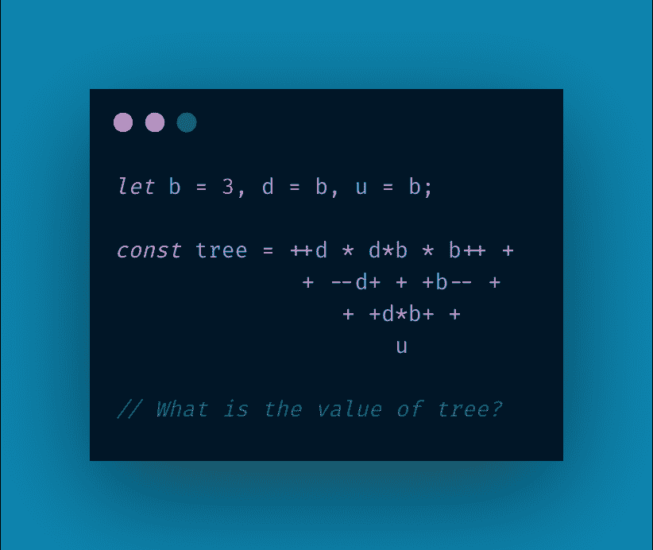

# 解决一个愚蠢的 JavaScript 问题

> 原文：<https://javascript.plainenglish.io/solving-a-stupid-javascript-problem-aa54e26e3605?source=collection_archive---------1----------------------->

我们的故事从[发自](https://twitter.com/tlakomy/status/1317533732505530368)[托马兹·扎科米](https://medium.com/u/95ecb313f8ac?source=post_page-----aa54e26e3605--------------------------------)的一条推文开始，他让你想象这个问题会在编码面试中出现。



至于在采访中我会如何回应这个问题，我觉得这取决于问题的焦点是什么。如果问题实际上是树的价值是什么，他们可以走开，或者希望我只是把它粘贴到我的控制台，然后告诉他们走开。

然而，如果问题是**将如何**解决这个问题，那么这就很有趣了，并导致了许多关于 JavaScript 和编译器工作方式的怪癖。因此，在这篇文章中，我将深入到这些混乱的事物中，探索会产生什么有趣的想法。

我还在 [Twitch](https://www.twitch.tv/videos/774155933) 上串流了解决这个问题的过程。很长，但是给出了另一种观点，如何一点一点的解决这类问题。

# 高层次的想法

首先，让我们把这个东西变成可复制的状态:

```
let b = 3, d = b, u = b;const tree = ++d * d*b * b++ +
 + --d+ + +b-- +
 + +d*b+ +
 u
```

我立刻注意到了一些事情。我想编译器可能会有一些小技巧。JavaScript 通常会在每一行的末尾添加分号**，除非有一个表达式不能终止**。在这种情况下，每行末尾的`+`告诉编译器不要终止这条语句。

第一行只创建了三个变量，它们都被设置为`3`。`3`是一个原始值，所以任何时候复制都是通过值完成的*，所以新的变量是用值`3`创建的。如果 JavaScript 通过引用*为这些变量*赋值，那么每个新变量**将指向**之前使用的变量，但不会为自己创建一个值。*

[延伸阅读](https://medium.com/nodesimplified/javascript-pass-by-value-and-pass-by-reference-in-javascript-fcf10305aa9c)

# 运算符优先级和结合性

这些是解决这个可怕的树问题的关键概念。稍后我会解释每一个，但是在高层次上，它们决定了 JavaScript 表达式组合的求值顺序。

## 运算符优先级

问题:这两种表达方式有什么区别？

```
3 + 5 * 55 * 5 + 3
```

就结果而言，没有什么不同。任何记得他们在学校的数学课的人都记得你先乘后加。我记得它是作为 **BODMAS、**或括号掉除乘加减。在 JavaScript 中，我们有相同的概念，叫做操作符优先，它简单地表示我们计算表达式的顺序。如果我们想强制`3 + 5`先进行评估，那么我们只需执行以下操作

```
(3+5) * 5
```

括号强制首先计算表达式的这一部分，因为`()`的运算符优先级高于`*`。

每个 JavaScript 操作符都有一个优先级，由于树中有这么多操作符，我们需要理解事物的求值顺序。特别是因为`++`和`--`会改变`b`和`d`的值，我们需要知道这些表达式相对于树的其余部分何时被求值。

**重要:** [操作员优先顺序和后续阅读表](https://developer.mozilla.org/en-US/docs/Web/JavaScript/Reference/Operators/Operator_Precedence)

# 结合性

结合性用于确定在给定的具有相同优先级的运算符中计算哪个顺序表达式。例如:

```
a + b + c
```

在这个表达式中，我们没有运算符优先级，因为我们只有一个运算符。那么我们是评价为`(a + b) + c`还是`a + (b + c)`？

我知道答案是一样的，但是编译器需要知道，这样它可以先选择一个来做，然后继续。在这种情况下，`(a + b) + c`就是答案，因为`+`操作符是左关联的，这意味着它首先计算左边的表达式。

"他们为什么不把所有东西都联想起来？"我听到你问了。

好吧，考虑以下情况:

```
a = b + c
```

如果我们遵循前面的左结合公式，我们就有了

```
(a = b) + c
```

但是坚持住。这看起来很奇怪，我不是这个意思。如果我们想让这个表达式只使用左结合律，我们需要这样做:

```
a + b = c
```

哪个变成了`(a + b) = c`，或者更清楚地说，我们先做`a + b`，然后将`c`赋值给那个结果的值。

如果我们必须这样思考，JavaScript 会更加混乱，我们对不同操作数使用不同关联的原因是为了让代码更具可读性。当你阅读`a = b + c`时，求值的顺序感觉很自然，即使在幕后有一些诡计在进行，并且左右两个关联操作数都被使用。

你现在可能已经注意到`a = b + c`有一个结合性问题。由于两个操作具有不同的关联，您如何知道应该首先解析哪个表达式呢？答案是上一节中具有更高**运算符优先级**的那个！在这种情况下,`+`优先，所以它首先被评估。

*我已经在最后的注释中添加了更详细的解释，或者你可以* [*在这里阅读更多*](http://Operator associativity) *。*

## 理解我们的表达式树是如何计算的

现在我们对这些概念有了一个概念，我们可以开始理解我们的问题了。有许多运营商在发挥作用，没有括号来澄清，当一切发生在我们弱小的人类思想。因此，让我们添加一些括号，列出所有使用的操作符，以及它们的优先级和结合性。

```
**(operator with variable x): (precedence) (associativity)**
x++: 18 n/a
x--: 18 n/a++x: 17 r
--x: 17 r+x: 17 r*: 15 lx + y: 14 l= : 3 r
```

## 括号

*这里值得一提的是，正确添加括号是很棘手的。我确保答案在每一点上都是正确的，但这并不保证我的括号总是正确的！如果有人知道自动添加括号的工具，请告诉我。*

让我们弄清楚事物被评估的顺序，并添加括号来显示。我将一步一步地展示我是如何得到最终结果的，简单地从优先级最高的操作符开始。

**后缀** `**++**` **和**后缀`**--**`

```
const tree = ++d * d*b * **(b++)** +
 + --d+ + +**(b--)** +
 + +d*b+ +
 u
```

**一元** `**+**` **，前缀** `**++**` **，前缀** `**--**`

这里我们有一个小问题，但是我将从评估一元`+`操作符开始，直到我们到达问题点。

```
const tree = ++d * d*b * (b++) +
 + --d+ **(+(+**(b--)**))** +
 **(+(+(**d*b+ **(+
 u))))**
```

现在我们有一个棘手的问题。

```
const tree = ++d * d*b * (b++) +
 **+ --d**+ (+(+(b--))) +
 (+(+(d*b+ (+
 u))))
```

我已经突出显示了问题区域。`--`和 `+()`具有相同的优先级。那么我们如何知道按照哪个顺序进行评估呢？让我用更简单的方式来陈述这个问题

```
let d = 10const answer = + --d
```

记住，这里的`+`不是指加法，而是指一元加，或者正。就像你会想到`-1`一样，只是它是`+1`。

答案是我们从右向左求值，因为这个优先级的操作符是**右关联**。

所以我们的表达式重写后变成了`+ (--d).`

为了让你明白这一点，想象一下如果所有的操作员都是一样的。在这种情况下，`+ +1`将与`(+ (+1))`相同，遵循类似于`1 — 1 — 1`与`((1 — 1) — 1)`相同的逻辑。注意右关联运算符如何产生与左关联运算符相反的括号符号？

将这个逻辑应用到我们表达式中的问题点，我们得到:

```
const tree = ++d * d*b * (b++) +
 **(+ (--d))** + (+(+(b--))) +
 (+(+(d*b+ (+
 u))))
```

最后，填入最后一个`++`的括号，我们得到:

```
const tree = **(++d)** * d*b * (b++) +
 (+ (--d)) + (+(+(b--))) +
 (+(+(d*b+ (+
 u))))
```

`**Multiplication (*)**`

我们不得不再次处理结合律，但是这一次是用同一个操作符，并且都是左结合律。相比上一步，这应该是小菜一碟！

```
const tree = **((((++d) * d) * b) *** (b++)**)** +
 (+ (--d)) + (+(+(b--))) +
 (+(+(**(d*b)** + (+u))))
```

我们已经到了可以开始真正评估事物的时候了。我们还可以为赋值操作符添加额外的括号，但是我认为这样会造成更多的混乱，所以我把它去掉了。注意，上面的表达式只是一个更复杂的`x = a + b + c`

我们可以取消一些一元操作符，但我现在将它们保留下来，以防它们很重要。

通过将表达式拆分成多个部分，我们可以理解各个求值步骤，并从那里开始。

```
let b = 3, d = b, u = b;

const treeA = ((((++d) * d) * b) * (b++))
const treeB = (+ (--d)) + (+(+(b--)))
const treeC = (+(+((d*b) + (+u))))const tree = treeA + treeB + treeC
```

现在我们已经完成了这些，我们可以开始研究评估时的各种值。从 treeA 开始

## TreeA

```
let b = 3, d = b, u = b;const treeA = (((++d) * d) * b) * (b++)
```

这里首先要评估的是`++d`，它将返回`4`，并递增`d`

```
// b = 3
// d = 4((4 * d) * b) * (b++)
```

接下来，`4*d`我们知道此时 d 是 4，所以`4*4`是 16

```
// b = 3
// d = 4(16 * b) * (b++)
```

此时有趣的是，我们将在 b 递增之前乘以 b **，因为我们是从左到右求值的。`16 * 3 = 48`**

```
// b = 3
// d = 448 * (b++)
```

前面我们谈到了`++`如何比`*`具有更高的运算符优先级，所以这可以写成`48 * b++`，但是这里有更多的诡计，因为`b++`的返回值是**pre-**increment 值，而不是 post。因此，虽然 b 将以 4 结尾，但我们要乘以的值将是 3。

```
// b = 3
// d = 448 * 3// b = 4
// d = 4
```

而`48 * 3`是`144`，所以一旦我们的第一部分被求值，b 和 d 都是 4，表达式结果是`144`

```
let b = 4, d = 4, u = 3;

const treeA = 144
const treeB = (+ (--d)) + (+(+(b--)))
const treeC = (+(+((d*b) + (+u))))const tree = treeA + treeB + treeC
```

## TreeB

```
const treeB = (+ (--d)) + (+(+(b--)))
```

在这一点上，我可以看到一元操作符实际上没有做任何事情。如果我们把它们抵消掉，就可以大大简化表达式。

```
// b = 4
// d = 4const treeB = (--d) + (b--)
```

我们以前见过这种把戏。`--d`将返回给我们`3`而`b--`将返回给我们`4`，在表达式求值时，这两个变量都将被赋值为 3。

```
const treeB = 3 + 4// b = 3
// d = 3
```

所以现在我们的问题看起来像这样:

```
let b = 3, d= 3, u = 3;

const treeA = 144
const treeB = 7
const treeC = (+(+((d*b) + (+u))))const tree = treeA + treeB + treeC
```

## TreeC

终于到了终点！

```
// b = 3
// d = 3
// u = 3const treeC = (+(+((d*b) + (+u))))
```

让我们从清除那些讨厌的一元操作符开始

```
// b = 3
// d = 3
// u = 3const treeC = (+(+((d*b) + u)))
```

这是一个，但是我们必须小心括号等等

```
// b = 3
// d = 3
// u = 3const treeC = (d*b) + u
```

在这一点上很容易。`3 * 3`是`9`，`9 + 3`是`12`，最后我们只剩下…

# 答案！

```
let b = 3, d= 3, u = 3;

const treeA = 144
const treeB = 7
const treeC = 12const tree = treeA + treeB + treeC
```

`144 + 7 + 12`就是`163`。答案是`163`。

# 结论

JavaScript 可以给你带来许多奇怪而奇妙的方式。但是理解了语言是如何组合在一起的，你就能弄清楚事物为什么会这样。

更一般地说，寻找解决方案的过程可能比答案更有启发性，你在这个过程中找到的小解决方案本身就是教学时刻。

值得一提的是，我在使用浏览器控制台时检查了我的工作，并且更感兴趣的是逆向工程解决方案，而不是从基本原理解决它。

即使知道如何解决这个问题，在这个过程中仍然有许多语法歧义需要解决，我相信您在查看树时已经注意到了其中的许多歧义。我在下面提到了其中的一些，尽管每一个都值得写在自己的文章里！

我还想对 https://twitter.com/AnthonyPAlicea,大声喊出来，没有他的课程，我永远也搞不清楚这些东西，还有 https://twitter.com/tlakomy[首先提出这个问题。](https://twitter.com/tlakomy)

# 笔记和奇怪的东西

我把这个分开，试图保持整个问题解决流程的整洁，但是在这个过程中，我必须解决很多小问题。

## 变量的顺序是如何被改变和使用的？

考虑一下这个

```
let x = 10console.log(x++ + x)
```

这里有几个问题。控制台会记录什么，第二行的`x`的值是什么？

如果你的答案是一个数字，那么很抱歉，我骗了你。诀窍在于`x++ + x`求值为`(x++) + x`，JavaScript 引擎求值左侧`(x++)`时递增`x`，所以到了`+ x`，x 的值是`11`，而不是`10`。

更棘手的是，`x++`返回什么值？

我已经非常强烈地暗示了答案实际上是`10`。*

这就是`x++`和`++x`的区别。如果我们把操作符看作是它们的底层函数，它们看起来就像这样:

```
function ++x(x) {
  const oldValue = x;
  x = x + 1;
  return oldValue;
}function x++(x) {
  x = x + 1;
  return x
}
```

从这个角度来看，你可以理解

```
let x = 10console.log(x++ + x)
```

将意味着`x++`返回`10`，在`+ x`被求值的点，它的值是`11`。因此控制台将记录`21`，x 的值将是`11`。

这个相对简单的问题实际上指向了所有代码中的一个公共反模式，即当**表达式**和**副作用**混合时。[阅读更多](https://en.wikipedia.org/wiki/Side_effect_(computer_science))

**我正要说* `*10*` *！这里，但是有人会开一个析因玩笑，我已经在这件事上失去理智了)*

## 你能让两个操作符有相同的优先级，但是有不同的关联吗？

让我们一步一步来，忽略关联是否是一个真实的词。

我们就拿运算符`+`和`=`来概括一下吧。

在前一种情况下，`a + b + c`被评估为`(a + b) + c`，因为`+`是左关联的。

在后者中，`a = b = c`被评估为`a = (b = c)`，因为`=`是右结合的。*注意* `*=*` *返回赋值变量的值，所以一旦表达式被求值，那么* `*a*` *将等于* `*b*` *的值。*

现在，如果我们用优先级替换操作数，

```
a left b left c = (a left b) left c
a right b right c = a right (b right c)but what abouta left b right c = ?
a right b left c = ?
```

你看到第二个例子在逻辑上是不可能的了吗？`a + b = c` 之所以可能，只是因为`+`优先于`=`，所以解析器知道该做什么。如果两个操作符具有相同的优先级但不同的结合性，那么语法分析器就不可能决定做事情的顺序！

所以综上所述，没有。具有相同优先级的运算符不能有不同的关联度！

有趣的是，你可以在 F#中动态地改变一个函数的结合性，这就是为什么我能够谈论结合性而不会发疯！[阅读更多](https://fsharpforfunandprofit.com/posts/function-composition/)

注:我不会因为 a 离开 b 而感到难过。他们从一开始就是一对有毒的搭档。另一方面，c 是一笔财富，不应该受到这样的伤害。

## 一元运算符

这里有一点很有趣，它来自于试图找出`+n`和`++n`的求值顺序。

不能做`-- -i`是因为`—`返回一个数字，数字不能递增或递减，也不能做`---i`是因为`---`的含义不明确(是`-- —`还是`— --`？评论如下)但是你可以做:

```
let i = 10console.log(-+-+-+-+-+--i)
```

## 非常令人困惑

更棘手的问题之一是 JavaScript 中的`+`的模糊性。相同的符号用于四种不同的功能，如下所示:

```
let i = 10console.log(i++ + + ++i)
```

每个操作数都有自己的含义、运算符优先级和结合性。这让我想起了著名的字谜:

[水牛水牛水牛水牛水牛水牛水牛水牛水牛。](https://en.wikipedia.org/wiki/Buffalo_buffalo_Buffalo_buffalo_buffalo_buffalo_Buffalo_buffalo)

我不会破坏答案，但我要说，我们的 JavaScript 等价物实际上更令人困惑一个数量级。

## 一元还是赋值？

`+`既可以表示一元运算符，也可以表示赋值。初始问题在`u`的情况下是哪个？像这样

```
... +
u
```

嗯，答案最终取决于…是什么。如果我们把它写成一行，

```
... + u
```

`x + u`和`x — + u`的答案是不同的。前者意味着加法，而后者意味着一元`+`。弄清楚它的意思的唯一方法是弄清楚评估树的其余部分，直到只剩下一个操作符为止！