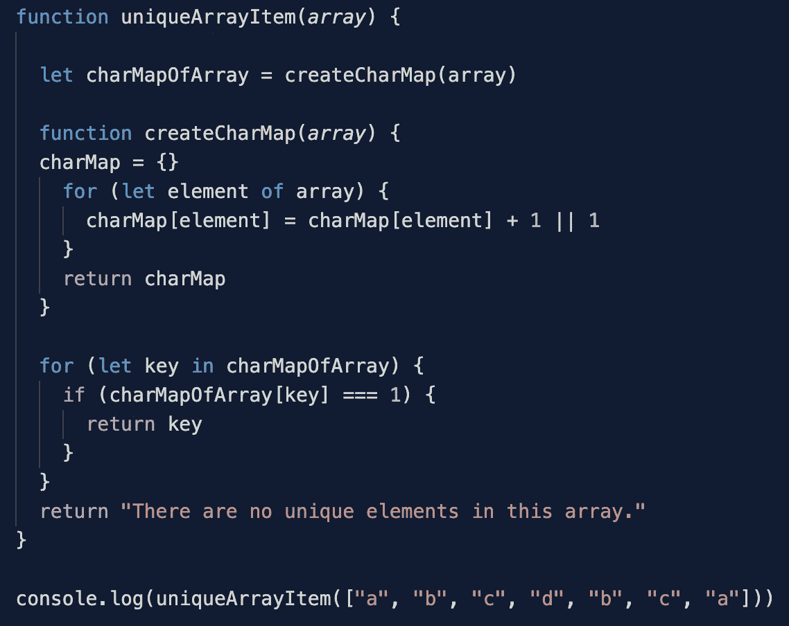
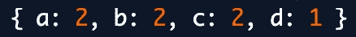
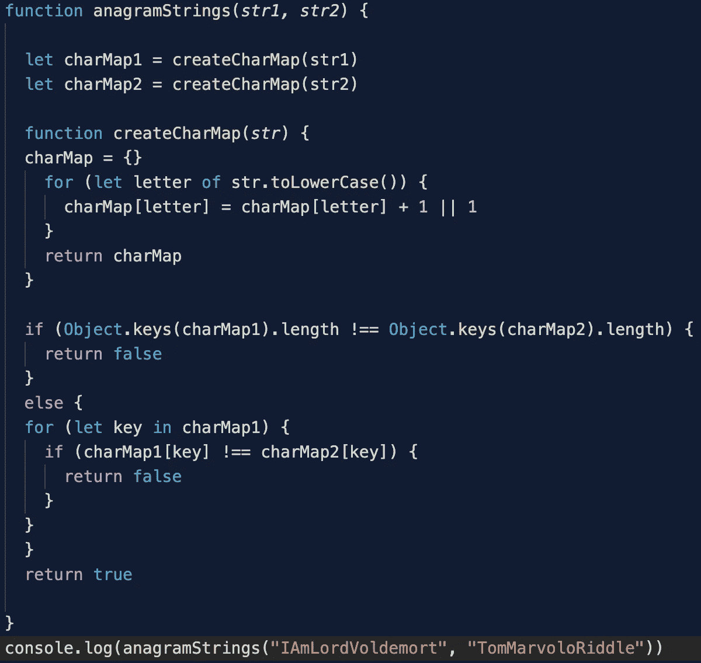

# 用字符映射表解决算法问题

> 原文：<https://javascript.plainenglish.io/solving-algorithm-questions-with-character-maps-73be3f4f1e1e?source=collection_archive---------6----------------------->

当我开始研究算法问题时，我没有意识到许多问题在方法上的相似性。想确定两个字符串是不是字谜？使用角色图。想要在一个数组中找到一个唯一的值？使用角色图。

让我们首先在数组中找到一个唯一的值。

Writing this code in your console will return “d”, the unique item of the input array.

我的助手函数 createCharMap 将为一个数组创建一个字符映射表。将每个元素的值设置为+ 1(如果存在)或 1(如果尚未添加到对象中)是很重要的。(简单的 if、else 语句或三元工作。)

Here is the return value of the createCharMap function from above.

最后使用 for..在循环中，我们可以遍历对象的值，找出哪个键的值为 1。这将返回上例中的 d。

让我们跳到第二个例子，确定“我是伏地魔”和“汤姆·马沃罗·里德尔”是否是彼此变位词。梅洛普·冈特给他取名“汤姆·里德尔”而不是“托马斯·里德尔”，这一直让我感到困惑我想这一切都要从老汤姆·里德尔的祖父母说起。他们给他取名叫汤姆吗？我觉得很奇怪。你同意吗？谁知道呢！

代码中有很多方法可以删除空格和其他字符，regEx 是你最好的朋友。我只用下面的两个字符串。"我是伏地魔"和"汤姆马沃洛德"

Return value of true on the strings above. (Note if the strings have different lengths they cannot be anagrams, I added this condition in because if your first string is smaller than your second string, say str1=cat and str2=catdog, this would return true because it iterates through the keys in charMap1 only and finds the same values as charMap2.)

我们的 createCharMap 函数与上面的完全相同。我在这里的字符串中添加了一个. toLowerCase()。首先检查两个字符映射表中是否有相同数量的键。如果没有，那么这两个不可能是变位词。然后，遍历其中一个字符映射表中的每个键，如果值不等于第二个字符映射表中的值，它就不能是变位词。如果 charMap1 中所有键的值都等于 charMap2 中相同键的值，那么我们就有了一个变位词。

在两种情况下，字符映射表非常有用。我知道在很多情况下，字符映射表应该是你在算法问题上的策略。祝你好运！