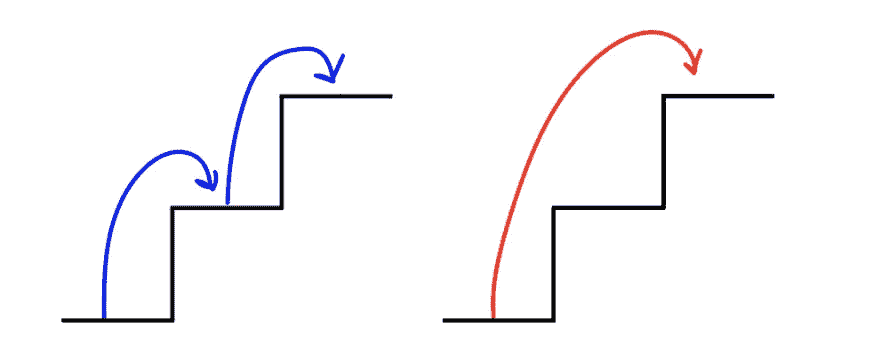
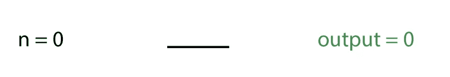
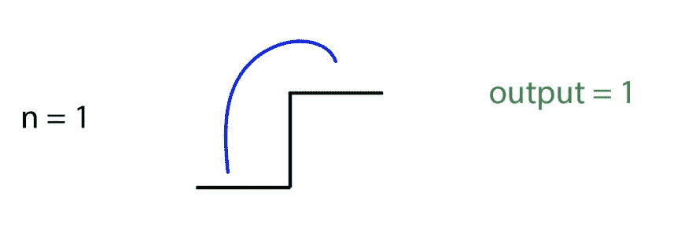
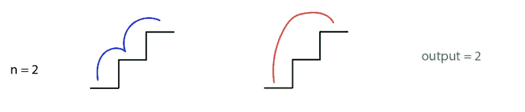
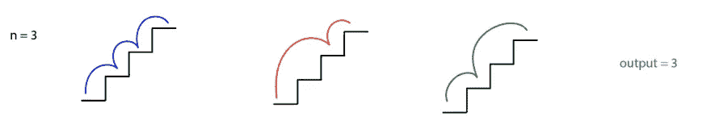
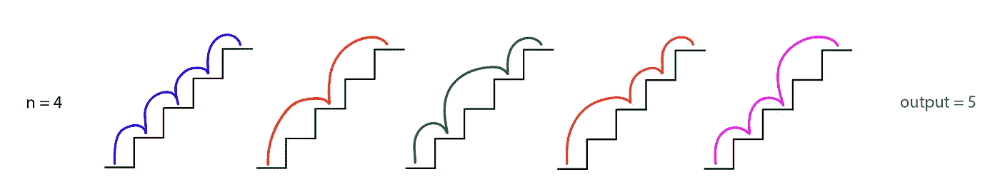
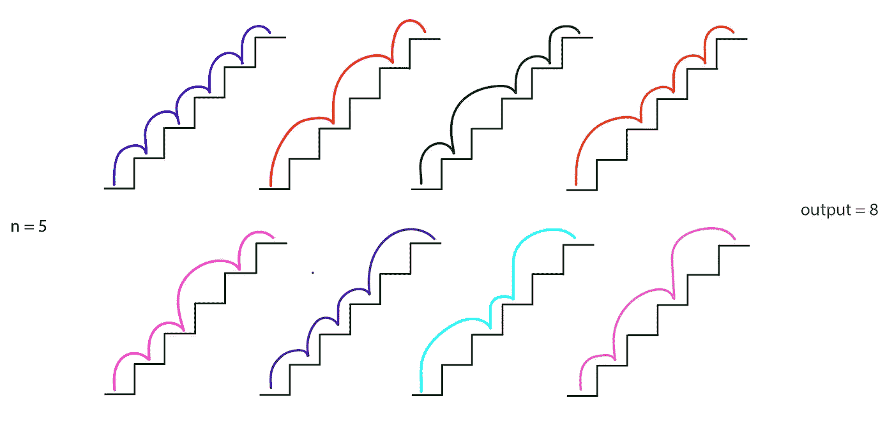
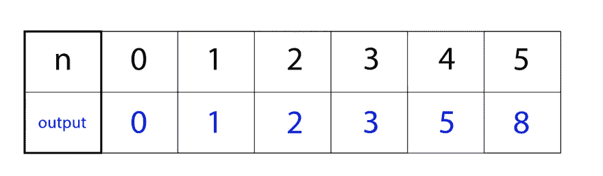

# 解决爬楼梯问题

> 原文：<https://javascript.plainenglish.io/solving-the-climbing-staircase-problem-e412cf761636?source=collection_archive---------5----------------------->

## 使用斐波那契数来接近这个普通算法

技术访谈中常见的算法是[爬楼梯问题](https://leetcode.com/problems/climbing-stairs/):

> 你在爬楼梯。要走 n 步才能到达顶端。每次你可以爬 1 或 2 级台阶。有多少种不同的方式可以让你爬上顶峰？

例如，如果输入为 2(楼梯中有 2 级楼梯)，那么有 2 种不同的方式可以爬到顶部。你可以一次爬一级台阶，也可以两级都爬。

Two 2-step staircases. The first staircase is one step at a time, the second staircase is two steps at once.

这是有很多方法可以解决的问题之一，包括递归、记忆和动态编程，但我最喜欢的解决方案是斐波那契数。在这篇文章中，我将解释什么是斐波那契数列，它们与这个问题的相关性，以及如何解决这个算法。

Photo by [Reid Zura](https://unsplash.com/@reidzura?utm_source=medium&utm_medium=referral) on [Unsplash](https://unsplash.com?utm_source=medium&utm_medium=referral)

# Fibonnaci 数字

斐波纳契数列(也称为斐波纳契数列)是由递归等式定义的一系列数字:

> Fn = Fn-1 + Fn-2

该序列从 F0 = 0 开始，F1 = 1。这意味着 F2 = 1，因为 F2 = F1 + F0 = 1 + 0。那么，F3 = 2，因为 F3 = F2 + F1 = 1 + 1。这个序列无限继续下去:0，1，1，2，3，5，8，13，21，34…你可以在这里阅读更多关于斐波纳契数列的内容。

让我们看几个楼梯问题的期望输出的例子。我们可以从`n = 0`开始。这意味着楼梯有 0 级台阶。爬这个楼梯有 0 种方法，所以当`n = 0`时，输出= 0。

n = 0; 0 ways to climb the staircase; output = 0

当`n = 1`出现时，楼梯有 1 级台阶。爬这个楼梯有一条路，所以当`n = 1`时，输出= 1。

n = 1; one way to climb the staircase; output = 1

当`n = 2`出现时，楼梯有 2 级台阶。因为我们可以一次爬 1 或 2 级楼梯，所以有 2 种方式爬这个楼梯。所以，当`n = 2`时，输出= 2。

n = 2; two different ways to climb the staircase; output = 2

当`n = 3`时，楼梯有 3 级台阶。我们有三种方式可以爬这个楼梯。

n = 3; three different ways to climb the staircase; output = 3

我们可以继续这样做，直到`n = 4`(输出= 5)…

n = 4; five different ways to climb the staircase; output = 5

…和`n = 5`(输出= 8)。

n = 4; eight different ways to climb the staircase; output = 8

注意到输出中的任何模式了吗？

When n = 0, output = 0; n = 1, output = 1; n = 2, output = 2; n = 3, output = 3; n = 4, output = 5; n = 5, output = 8

我们可以在输出中看到斐波那契数列！我们每增加一次`n`，爬楼梯的方式数就是前面两种方式的总和。这意味着我们可以通过求解每个楼梯上的斐波那契数来解决楼梯问题，直到我们到达`n`。

# 求解算法

现在我们已经识别了输出中的模式，我们可以继续求解算法了。首先，我们需要写出几个基本案例。当`n`为 0、1 和 2 时，爬楼梯的方式数为 0、1 和 2(按此顺序)——所以如果`n`是这些数中的一个，我们可以返回`n`。

我们需要初始化两个常量，一个叫做`first`，一个叫做`second`。我们将从设置`first`等于 1 和`second`等于 2 开始。我们将使用这些数字来增加我们当前的数字，并将继续更改它们。

现在，从数字 2 开始，一直到到达`n`，我们可以让 for 循环一次递增一个数字。在 for 循环中，我们将初始化一个名为`current`的新变量，它将存储`first`和`second`的和。然后，我们可以将`first`移至等于`second`，将`second`移至等于`current`。

一旦 for 循环结束，我们将返回`second`号。

如果你有任何问题或其他解决方法的想法，请在评论中告诉我！

**资源**:

*   [https://leetcode.com/problems/climbing-stairs/](https://leetcode.com/problems/climbing-stairs/)
*   [https://mathworld.wolfram.com/FibonacciNumber.html](https://mathworld.wolfram.com/FibonacciNumber.html)