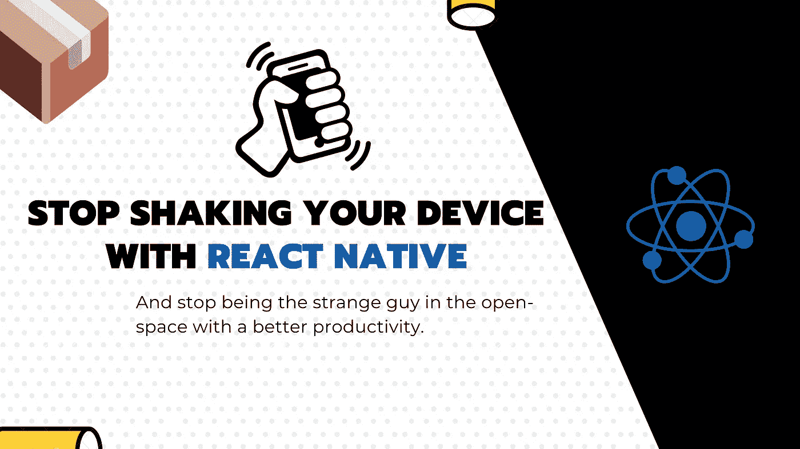

# 一些比摇动你的设备更好的方法来在 React Native 中显示菜单

> 原文：<https://javascript.plainenglish.io/some-better-ways-than-shaking-your-device-to-show-dev-menu-in-react-native-1fd6d051bf90?source=collection_archive---------6----------------------->

## 反应自然

## 用简单的动作拯救你的手机和你的手，不要在整天摇晃的露天空间里做那个奇怪的家伙。



大约 3 年来，我一直在移动设备上开发 react 本地应用程序，而不是模拟器。我经常喝咖啡，不可避免地需要显示我的 react 应用程序的开发者菜单。

为了显示菜单，你需要使用一些物理手势:**摇动。**

尽管人们奇怪地看着我，问我是哪种外星人，但这在一天结束时会变得很麻烦。甚至对手机本身也很危险，可以扔在地上…

之后，我问自己:“**我到底能做些什么来防止这种情况发生？”**

经过一些研究，有许多提示有些来自计算机端，有些来自设备端，让我们一起看看我们能做些什么。

# 💻从您的计算机

*   **在仿真器上**

按住`ctrl+m`(对于 Linux/Windows)和`⌘+m`(对于 Mac OS X ),同时让键盘聚焦在仿真器上。

*   **在 Android 上，使用外壳:**

摇动手势是产生按键事件的动作，由代码`82`标识。所以基本上只要你的设备连接上了，你就可以运行这个 shell 脚本来显示 dev 菜单。

```
adb shell input keyevent 82
```

您可以随意将脚本绑定到您键盘/鼠标上的某个快捷键或按键，或者其他地方的。

*   **使用 CLI 或 Flipper**

我目前正在写一篇关于它的新文章:)订阅时事通讯，以便在它将要出版时得到提醒，或者只订阅我的媒体频道。:)谢谢

# 📱从设备本身

React native 公开了一个 JS 桥来与 Dev 菜单交互。您可以使用您选择的任何事件来触发它。

为此，您只需要导入`NativesModules`。

```
import { NativeModules } from "react-native";// Somewhere in code
NativeModules.DevMenu.show();
```

一些 commons 模式是用 3 个手指触摸，来触发菜单。或者在开发模式下，调试按钮必须完全位于应用程序的某个角落。

对于第一种模式，有些人已经创建了一个您可以使用的库

[](https://github.com/pie6k/react-native-dev-menu-on-touch) [## pie6k/react-native-dev-menu-on-touch

### 用三个手指触摸而不是摇动来打开开发菜单。当你想重新加载应用程序时，摇动真实设备很烦人…

github.com](https://github.com/pie6k/react-native-dev-menu-on-touch) 

但现在它可能会适应你的需要，所以请随意编程任何覆盖按钮。