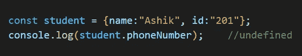
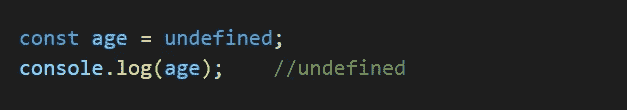
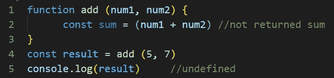
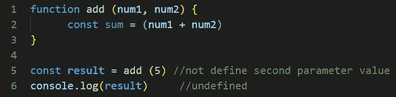
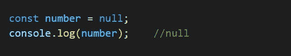
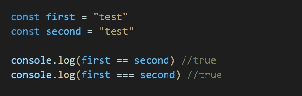
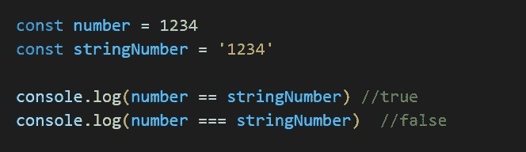
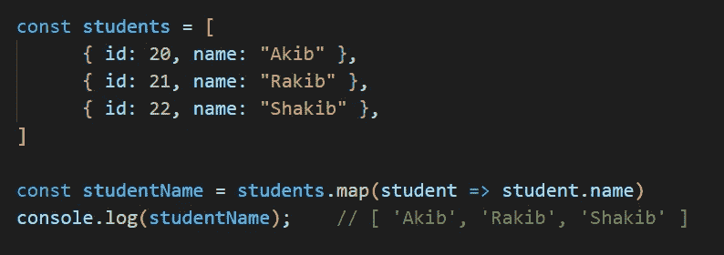
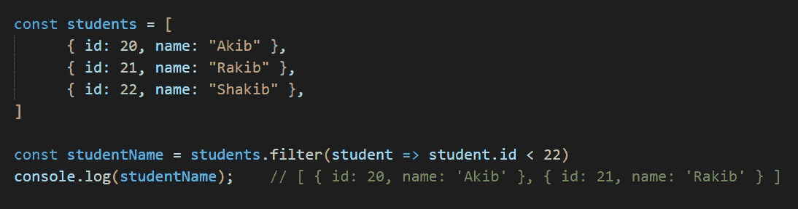
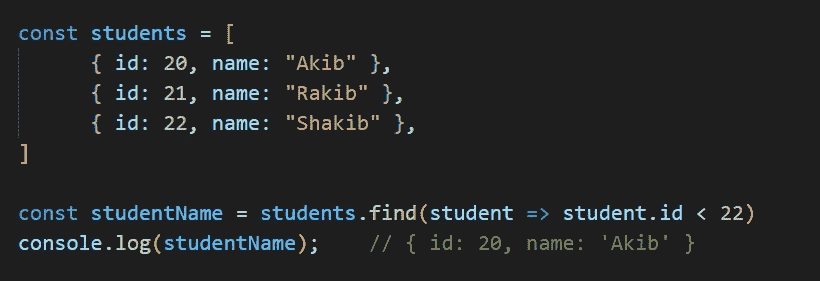

# 我们都必须熟悉的 JavaScript 中间概念

> 原文：<https://javascript.plainenglish.io/some-javascript-intermediate-concept-that-we-all-have-to-know-9ffcf85f2d3a?source=collection_archive---------14----------------------->

# 真值和假值

在 JavaScript 中，我们有不同类型的值。其中，最常见和最常用的值是真值和假值。在这一部分，我们将对此进行讨论。

# 真实价值

在这种情况下，真值可能-

1.  如果变量有空白字符串值( **" "** )空。 **Ex** - ( **const name =** " ")
2.  如果一个变量有 **0** 作为字符串值。**Ex**-(**const age = " 0 "**)，
3.  如果一个变量有 ***false*** 作为字符串值。**Ex**-(**const age =****【false】**)，
4.  如果一个变量有( **{}** )空对象值。ex-(**const name =**(**{ }**)
5.  如果一个变量有( **[]** )空对象值。Ex- ( **常量名称=** ( **[]** )

# 虚假值

在这种情况下，真值可能-

1.  如果一个变量有( **0** )值。Ex- ( **const age = 0** )，
2.  如果一个变量有( **""** )空字符串值。ex-(**const name =****)**
3.  **如果一个变量有 ***Null*** 值。Ex- ( **常量名称= Null** )**
4.  **如果一个变量有 ***未定义的*** 值。Ex- ( **让名**)**
5.  **如果一个变量将 ***楠*** 。Ex- ( **let name = NaN** )**
6.  **如果一个变量将 ***假*** 。Ex- ( **let name = false** )**

# **空 vs 未定义**

**Null 和 Undefined 也是 JavaScript 中最常见的。我们可能认为它们工作原理相同，但实际上它们是不同的。在这一部分，我们将讨论它。**

# **不明确的**

**在下列情况下，我们可以找到未定义的值。它们是:**

**1.在一个对象中，如果我们可以访问不属于该对象的属性。示例-**

****

**2.如果我们将 undefined 定义为一个变量的值，那么它将显示 undefined。示例-**

****

**3.在函数中，如果我们不返回任何东西或者没有定义将返回什么。示例-**

****

**2.如果我们不设置参数值，它将显示结果*未定义。*例子-**

****

# **空**

**我们可以有意或无意地发现*未定义的*值。但是对于空值，我们需要手工定义空值。如果不手工定义，我们就找不到空值。空意味着空，意味着不存在。示例-**

****

# **双倍相等对三倍相等**

**对于初学者或开发者来说，这是一个常见的困惑。但是双等和三等区别不大。在这一部分，我们将讨论它。**

**Double Equals ( `==`)只检查值是否相等。在检查值之前，它转换变量的类型以使它们相互匹配。**

**另一方面，Triple Equals ( `===`)不仅检查类型，还检查该值的类型。如果不匹配，会显示**假**。**

## **示例 1:**

****

**`first`和`second` 的值和类型相同。因此两者的结果都是`true`。**

## **示例 2:**

****

**这里，`number`和`stringNumber`的值看起来差不多。但是`number`的类型是`Number`而`stringNumber`的类型是`string`。即使值相同，类型也不相同。因此`==`检查返回`true`，但是当检查值和类型时，值是`false`。**

## **示例 3:**

****

**一个有趣的案例在这里。当`0`与`false`检查时相同。这是因为`0`和`false`对于 JavaScript 具有相同的值，但是当检查类型和值时，该值为 false，因为`0`是一个`number`而`false`是`boolean`。**

# **对象数组中的 map()、filter()、find()方法**

**在这一部分，我们将讨论对象数组中的 JavaScript map()、filter()和 find()方法。**

# **地图()**

**在 JavaScript 中，当我们对父数组中的每个元素调用特定函数时， **map()** 方法会创建一个数组。一般来说， **map()** 方法用于迭代一个数组，并对数组的每个元素调用一个函数。示例-**

****

# **过滤器()**

**在 JavaScript 中， **filter()** 方法创建一个新数组，其中的元素符合或通过给定的标准和条件。示例-**

****

# **查找()**

**在 JavaScript 中， **find()** 方法用于在条件下从给定数组中获取第一个元素的值。它检查数组的所有元素，并打印第一个与条件匹配的元素。示例-**

****

***更多内容看*[***plain English . io***](http://plainenglish.io/)**