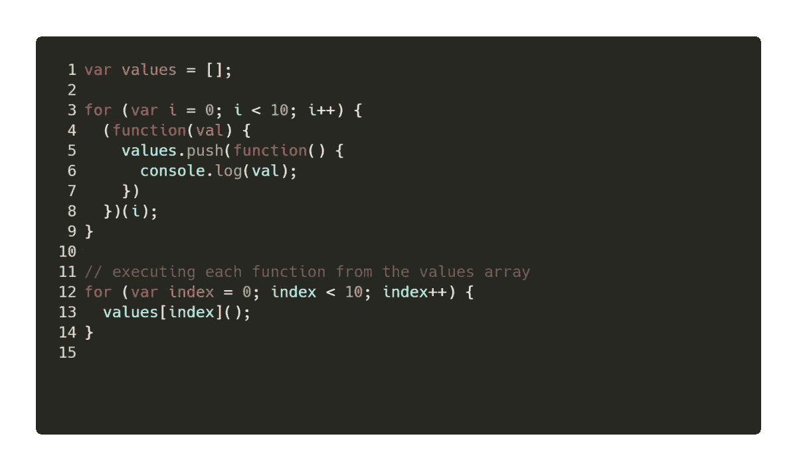

# 面向产品的 JavaScript 面试问题

> 原文：<https://javascript.plainenglish.io/some-javascript-interview-questions-asked-in-interviews-of-product-companies-ec5fbca3aa5d?source=collection_archive---------0----------------------->

## 在谷歌、亚马逊和优步等公司的面试中被问到的面试问题

注意:在没有看到答案的情况下，尝试解决这些问题。

每个问题后都有一些空白，这样你就不会直接看到答案，并有机会自己解决这些问题。

# 问题 1

考虑下面的代码片段，并尝试确定它的输出是什么。

你猜到了吗？

.

.

.

让我想想…

## 回答

下面的代码将写入值`10`次。

当变量`i`被提升到代码片段的顶部时，值 10 被打印十次，在代码执行后，`i`的最终值是 10。

# 问题 1 —第二部分

此时，面试官一般会问:“如果我想要控制台中`0-9`的值怎么办？”

在滚动到解决方案之前，尝试猜测一下…

## 在控制台中打印 0–9 的值

实现这一点有不同的方法。

## 用生命

*life*是立即被调用的函数表达式。通过使用 IIFE 的，我们还可以确定变量`i`的值的范围，以打印当前索引，而不是将最终值打印为`10`。

下面是使用 IIFE 的打印值`0-9`的解决方案。

这里，我们将第一个循环的代码包装在一个 IIFE 中，它将在控制台中打印以下输出:

## 使用 ES6 语法

有另一种方法可以使用 ES6 语法来解决这个问题。要在控制台中打印来自`0-9`的值，只需用`let`关键字替换第一个循环中的`var`关键字。

这样，变量`i`不会被提升到代码的顶部，它的作用域被限制在循环的块作用域内。

输出:

# 问题 2

让我们看看下面的 JavaScript 代码片段:

你能确定这里可能会出什么问题吗？

花些时间，试着确定这里是否会出错。

.

.

.

## 回答

我们在玩引用。代码执行后，我们将拥有一个包含五个元素的数组，这样每个元素都引用同一个对象。

`arr`的最终值如下所示:

# 结论

这些问题初看起来很难，但是如果你从更广的角度来看，你会发现它们什么都不是，只是 JavaScript 的核心基本概念组合在一起产生了一个问题。

第一个问题是以下几个方面的结合:

*   词法范围。
*   JavaScript 中的`var` / `let` / `const`。
*   生活。

第二个问题结合了:

*   复制对象引用而不是对象值。
*   JavaScript 中的数组。

如果你在真正的面试中遇到任何难题，只要冷静下来，开始思考产生问题的基本概念，你肯定会轻松得出正确的结论。

# 喜欢这篇文章吗？支持我写作…

**帕特里翁—**[https://www.patreon.com/kunaltandon](https://www.patreon.com/kunaltandon)
**贝宝—**[https://www.paypal.com/paypalme2/kunaltandon94](https://www.paypal.com/paypalme2/kunaltandon94)