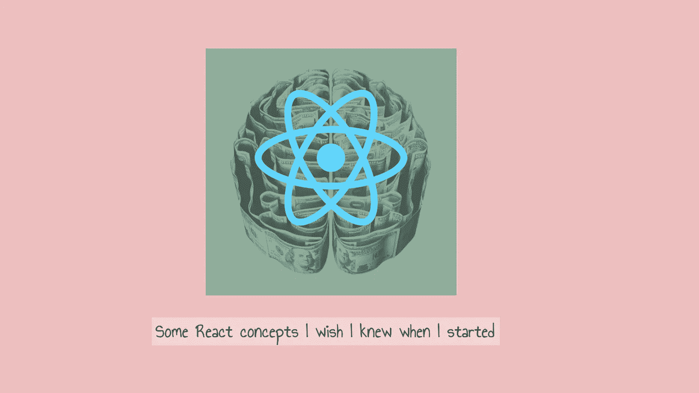
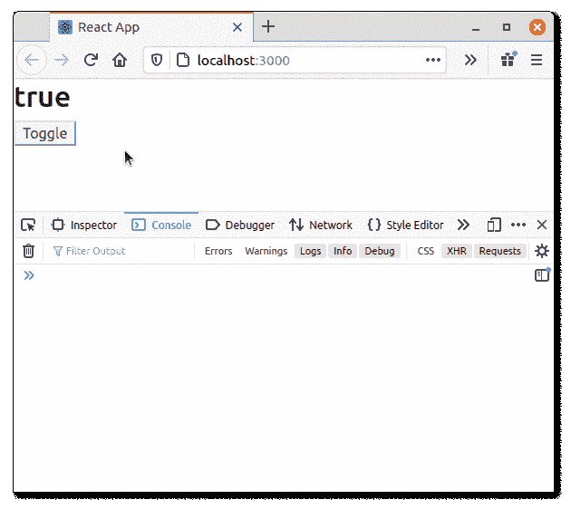
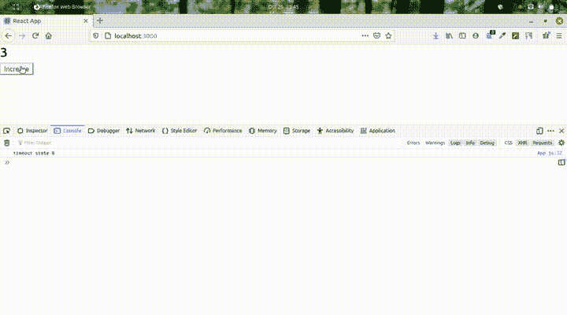

# 3 个反应概念我希望在开始时就知道

> 原文：<https://javascript.plainenglish.io/some-react-concepts-i-wish-i-knew-when-i-started-6fd25c466f80?source=collection_archive---------1----------------------->

当我偶然发现**反应**时，我几乎没有任何 JS 知识。当然，我的同行和互联网告诉我，开始使用 React JS 需要一些 JavaScript 知识，但是，我抓住了机会。属于那种“边做边学”的人，我继续探索 JavaScript 世界和 React 自带的 JSX。



Cover image.

这是给初学者和同类人的。

## 1.严格模式

我不熟悉这个概念，当我观察到这种奇怪的行为时，我花了一些时间才明白发生了什么

在 App.js 里面，我有一些非常简单的东西，

```
**function** App() { console.log("app") **const** [state, toggle] = useState(true); return ( <div> <h2>{`${state}`}</h2> <button onClick={() **=>** { toggle(!state) }}>Toggle</button> </div>
 )}
```

我有一个标题和一个切换内容的按钮。我在函数中还有一个 console.log 来记录每次状态改变和重新渲染被触发时的消息。

我期望每个按钮点击都有一个日志。但是我注意到每次点击按钮，都会有两个日志。



Notice the logs.

我继续前进，没有被这种行为所困扰。

后来，当我在更复杂的事情中注意到同样的行为时，这让我很困扰。那时我意识到这种行为只在开发中可见，在生产中不可见。我在网上搜了一下发现，是因为*严格模式。*我注意到在 index.js 中，我的 app 被包裹在 ***< React 内。StrictMode > < /React。严格模式>。***

引用 ReactJS 文档本身:“*严格模式不能自动为您检测副作用，但它可以通过使副作用更具确定性来帮助您发现它们。这是通过有意地双重调用以下函数来实现的:类组件* `*constructor*` *、* `*render*` *和* `*shouldComponentUpdate*` *方法*

如果你正在使用 create-react-app，你可能会注意到你的应用被包裹在 ***< React 中。StrictMode > < /React。index.js 中的 StrictMode >***

这就是问题所在。这就是为什么我每次渲染都有两个日志。我希望我知道这件事。点击阅读更多关于严格模式检查[的内容。](https://reactjs.org/docs/strict-mode.html)

## 2.键

当呈现多个组件时，我们通常映射列表，

```
const numbers = [1, 2, 3, 4, 5];
const listItems = numbers.map((number) =>
  <li key={number.toString()}>    {number}
  </li>
);ReactDOM.render(
  <ul>{listItems}</ul>,  document.getElementById('root')
);
```

React 使用*键*来优化性能*。*在这里阅读更多关于为什么需要钥匙的信息。

从官方文档:*"关键字帮助 React 识别哪些项目已更改、添加或删除。应该给数组内部的元素赋予键，以给元素一个稳定的标识。*

现在一个显而易见的想法浮现在脑海中:我们可以使用数组索引作为键。但是等等，再想想，因为这不是推荐的方法。

想想如果列表被预先考虑会发生什么，因为 React 只依赖键来决定 DOM 是否应该更新。在这里了解这个[。本文使用一个非常好的文本输入例子来演示这个问题。](https://medium.com/@robinpokorny/index-as-a-key-is-an-anti-pattern-e0349aece318)

## 3.陈旧状态

问题是，在某些情况下，您无法掌握最新的状态。

这一次，我费了很大的劲才明白过来。对于一个不知道闭包以及它们为什么在 React 环境中如此重要的人来说，我不得不阅读很多关于 React“幕后”的东西。

考虑这段代码，

```
function App() {

    const [state, toggle] = useState(0);

    useEffect(()=>{

    setInterval(()=>{
      console.log(`state ${state}`);
    },3000)

},[])
    return ( <div> <h2>{`${state}`}</h2> <button onClick={() => { toggle(state+1) }}>Increase</button> </div>
)
}
```

单击按钮并更新状态后，日志中没有变化。日志显示初始状态为 0。看下面的 GIF。



stale state in setInterval

“为什么”的答案不在于 React，而在于 JavaScript 本身。这与所谓的*关闭*有关。*在这里* *阅读关于闭包的* [*。*](https://developer.mozilla.org/en-US/docs/Web/JavaScript/Closures)

这在这里不是一个大问题，但是想象一个事件监听器被附加到一个对象，在 *useEffect* 中，并在其中获得陈旧状态。查看[这个](https://stackoverflow.com/a/55156813/10996126) SO 答案，它显示了在 *useEffect* 中使用事件监听器的正确方法。

重要的是要知道，拥有基本的 JS 知识应该比拥有框架或特定于库的知识更重要。因为，不管你用什么库，你还是要写 JS 代码，处理 JS 相关的顾虑。重要的是不要把自己局限于某个特定的框架/库，只有拥有强大的 JS 基础才有可能。

永远不要低估你仅仅通过看文档获得的知识，尤其是当它们和 React 的一样好的时候。

感谢您的阅读！