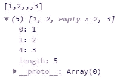
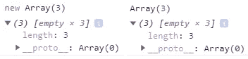
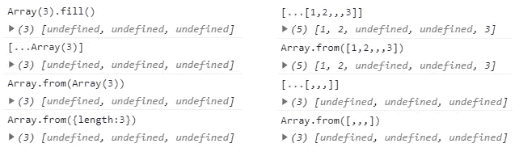
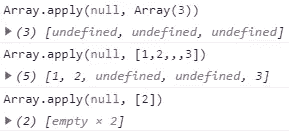

# JavaScript 中的稀疏和密集数组

> 原文：<https://javascript.plainenglish.io/sparse-and-dense-arrays-in-javascript-4ba874fc243c?source=collection_archive---------13----------------------->

你听说过数组省略吗？这是动词“elide”的动作，意思是不发一个单词中的特定音。正如[剑桥词典](https://dictionary.cambridge.org/dictionary/english/elide)所说，如果某人说话很快，t*he*[*acts*](https://dictionary.cambridge.org/tr/s%C3%B6zl%C3%BCk/ingilizce/act)*【t】常常被省略。*

说到 JavaScript，当数组中使用了多个尾随逗号时就会出现省略，这会导致生成空洞，从而使该数组成为**稀疏数组**。相反，一个**密集阵**没有孔。

Photo by [Masaaki Komori](https://unsplash.com/@gaspanik?utm_source=medium&utm_medium=referral) on [Unsplash](https://unsplash.com?utm_source=medium&utm_medium=referral)

在整个讨论中，主要焦点将集中在用于形成和初始化数组的数组构造函数、在关注稀疏数组时遇到的问题、寻找创建密集数组的不同解决方案，以及大量适用于数组的实践。

根据[语言规范](http://www.ecma-international.org/ecma-262/6.0/index.html#sec-array-initializer)中的相关文章，数组元素可以在元素列表的开头、中间或结尾省略。只要元素列表中的逗号前面没有赋值表达式(一个逗号在另一个逗号的开头或后面)，缺少的数组元素就会增加数组的长度。此外，如果一个元素在数组的末尾被省略，该元素也不会增加数组的长度。为了简单的形象化这个事实，打开一个控制台(这就是我爱 JS 的原因)，请写下以下内容，然后按“回车”。

如您所见，创建了两个洞，并且没有形成相关的索引。省略的数组元素没有定义，数组的长度是五。

另一方面，使用数组构造函数创建一个指定长度的数组，并观察输出。

Array constructor function with/without new operator.

从这个角度来看，很明显稀疏数组的长度大于插入的元素总数。

请注意，数组初始值设定项根据提供的参数计数和类型进行操作:

*   如果提供了一个数字，则它被接受为数组的长度。
*   如果传递了多个参数，则它们被评估为数组元素。
*   如果传递的是单个参数而不是一个数字，则它也被视为要插入的单个元素。

让我们用一些`Array.prototype`方法迭代一个稀疏数组。

`Array.prototype.forEach`跳过如上所述的孔，并且在该索引处不执行回调(预期操作)。

`Array.prototype.map`的行为稍有不同，例如回调不是针对孔操作的，而是在新数组中保留并可用。

由于`Array.prototype.filter` 方法保留了回调函数返回真值的元素，因此这些洞被评估为假(因为它们没有被定义)并从生成的数组中删除。`Array.prototype.reduce`也不执行回调函数，在特定索引处没有达到累加。

作为稀疏阵列问题的解决方案，有许多方法可以产生具有给定长度的密集阵列，或者通过堵塞孔(如果存在的话)来产生密集阵列。

Potential ways to produce a dense array.

`fill()`方法用提供的值填充数组(本例中没有提供值，因此未定义)，从索引(默认为零)开始到结束索引(默认为数组长度)。展开运算符和`from()`方法将孔视为`undefined`。

你注意到上面的花式练习了吗？您应该已经注意到类似数组的对象(只提供长度)是如何被转换成密集数组的。通过提供非负整数的长度属性和可选的索引属性，可以手动生成类似数组的对象。

另一种方法是使用从`Function.prototype`继承而来的`apply()` 数组。`Function.prototype.apply`以数组的形式向函数提供参数。

Plugging holes using apply method

请注意，最后一种情况是危险的，因为`array()`函数将单个参数(如果是 number)计算为数组长度，而不是数组元素。讨论一开始就指出来了。因此，创建了两个孔，而不是创建密集阵列。

小心处理潜在的稀疏数组、有孔数组可能真的是一个问题，因为它可能会导致意想不到的结果和性能下降。如果在这次讨论中提出一些替代方案，我希望这些问题可以很容易地得到解决。

感谢阅读！

## **用简单英语写的便条**

你知道我们有四份出版物和一个 YouTube 频道吗？你可以在我们的主页[**plain English . io**](https://plainenglish.io/)找到所有这些内容——关注我们的出版物并 [**订阅我们的 YouTube 频道**](https://www.youtube.com/channel/UCtipWUghju290NWcn8jhyAw) **来表达你的爱吧！**