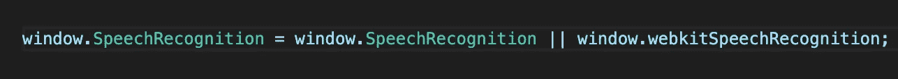
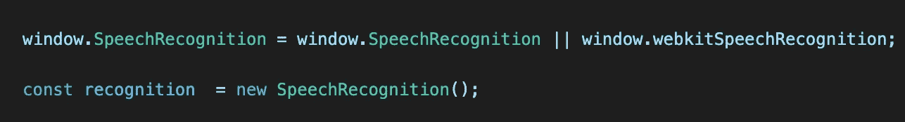
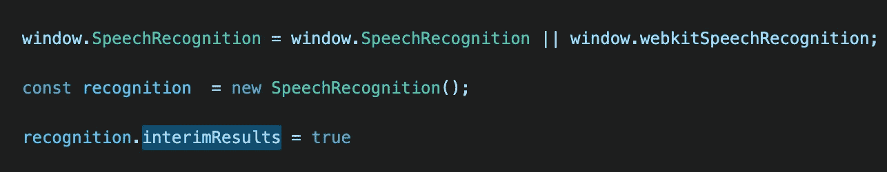
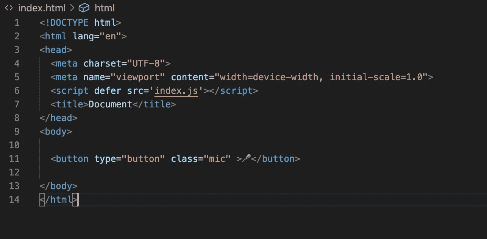
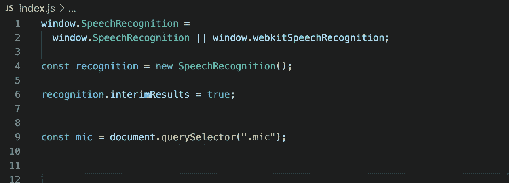
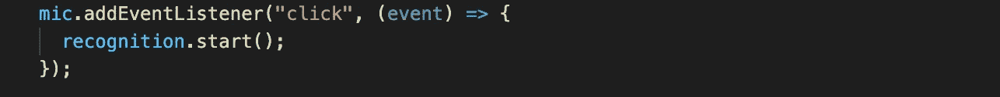
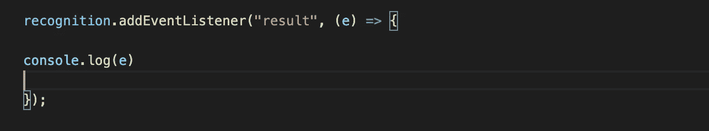
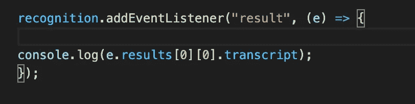

# 用 JavaScript 创建一个语音笔记应用

> 原文：<https://javascript.plainenglish.io/speech-recognition-javascript-create-vocal-note-taking-app-in-5-minutes-11444069d8e5?source=collection_archive---------9----------------------->

## 如何在 JavaScript 中使用语音识别

语音识别不需要任何库或外部 API，我们可以直接在浏览器中实现。

那么什么是语音识别呢？是一个全局变量，存在于浏览器的窗口对象中。如果您在浏览器中打开任何控制台，并键入以下内容，您可以自己检查。

```
window.SpeeechRecognition
```

这适用于 Firefox，对于 Chrome，您需要使用以下命令:

```
window.webkitSpeechRecognition
```

首先，我们需要在文件中调用它。



现在我们需要创建一个新的`SpeechRecognition`实例并赋给一个变量。



为了能够在说话时看到结果，我们需要设置一个叫做`interimResults true`的东西:



如果您将它设置为 false，将等到您结束讲话时显示结果，但理想情况下，您希望在讲话时看到您在说什么，因此最好将该值设置为`true`。

现在为了测试它是否工作，您可以创建一个按钮来启动事件监听器。在 HTML 中创建一个简单的按钮，并将 HTML 连接到您的 JavaScript 文件，给按钮元素一个您可以定位的类，例如 btn 或 mic。

HTML 文件:



我在我的按钮上添加了一点表情符号，给了一些风格。

现在选择 JS 文件中的 mic 类元素，并将其存储在一个变量中。



现在我们需要向按钮添加一个事件监听器来启动`SpeechRecognition`，在这种情况下，我们的事件将监听点击。



在事件侦听器中，我们调用`recognition. start()`方法开始记录。现在一切都设置好了，但是为了查看并能够处理结果，我们还需要向我们的识别实例添加一个事件侦听器。

在这种情况下，我们将听到一个结果事件:



目前，我们可以在浏览器中控制台记录结果，看看它是否工作。现在在浏览器上打开 index.html，当你点击按钮时，你可能会得到如下信息，点击允许开始记录。


现在，如果您对着麦克风说话，您应该会在控制台中看到一些事件正在运行，如下例所示。


太神奇了！现在，我们已经能够将此功能添加到我们的应用程序中，以访问结果，并查看您所说的是否正确记录

```
e.results[0][0].transcript
```

事件访问索引 0 的结果索引 0，您会在抄本中找到它。



现在做同样的事情并说话，你应该看到结果而不是事件，我会说“希望你喜欢我的博客。”


酷！

现在我们将在 HTML 中显示它，并创建一个简单的语音笔记应用程序。

首先，我们需要在 HTML 中创建一个`<div>`元素，并给出`words`的类。

HTML:

```
<!DOCTYPE html><html lang="en"><head><meta charset="UTF-8"><meta name="viewport" content="width=device-width, initial-scale=1.0"><script defer src='index.js'></script><title>Document</title></head><body><div class="words"></div><button type="button" class="mic" >🎤</button></body></html>
```

在我们的 JavaScript 文件中，我们需要获取这个元素并创建一个`p`元素，我们将把我们的结果插入到这个`p`元素中，并将它附加到`div`元素上，以便能够在浏览器中看到我们的结果。


现在我们可以在我们的浏览器中测试它，看看它是否工作。


感谢您的阅读。我希望你觉得这有用！