# 使用 Emmet 加速您的编码——一个真正强大的工具

> 原文：<https://javascript.plainenglish.io/speed-up-your-coding-using-emmet-a-really-powerful-tool-6b0b2b16032d?source=collection_archive---------4----------------------->

## 提高编码效率的最佳方法

Photo by [Florian Olivo](https://unsplash.com/@florianolv?utm_source=medium&utm_medium=referral) on [Unsplash](https://unsplash.com?utm_source=medium&utm_medium=referral)

# 介绍

本文我们就来说说[埃米特](https://emmet.io/)。一个非常流行和非常有用的工具，几乎内置于所有的 IDE 中，比如 Visual Studio 代码、Sublime Text 等。

如果你正在使用 [Codepen](https://codepen.io/) ，那么你可能会很高兴知道 emmet 也可以在 Codepen 中使用。所以可以在 Codepen 中键入缩写生成代码。

# 埃米特有什么特别的？

它允许我们只键入一些缩写，并生成输出的 HTML 和 CSS 代码。

它在很大程度上提高了您的生产力，因此您不必一次又一次地键入相同的重复代码。

# 装置

Emmet 已经可以在几乎所有的 IDE 中使用，所以你不需要安装它。

如果由于某种原因，它在你的 IDE 中不可用，你可以从[这个页面](https://emmet.io/download/)安装扩展。

# 怎么用？

我们只需输入缩写并按下`Tab`键，emmet 就会将其转换成相应的代码。

# HTML 文件内部

*   如果您已经创建了一个新的`.html`文件，那么不需要手动键入 doctype、head、meta、body，只需键入！(感叹号)并按 tab，emmet 将添加默认的 HTML 代码

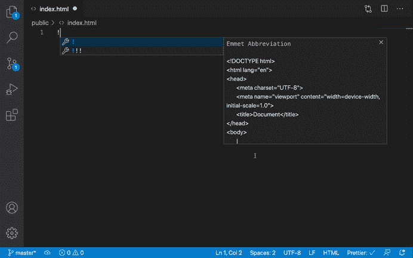

*   如果你想用类`hero-banner`创建一个 div，那么不要手动输入`
Some content
`，只需输入`.hero-banner`并按 tab 键，整个代码就会自动生成。

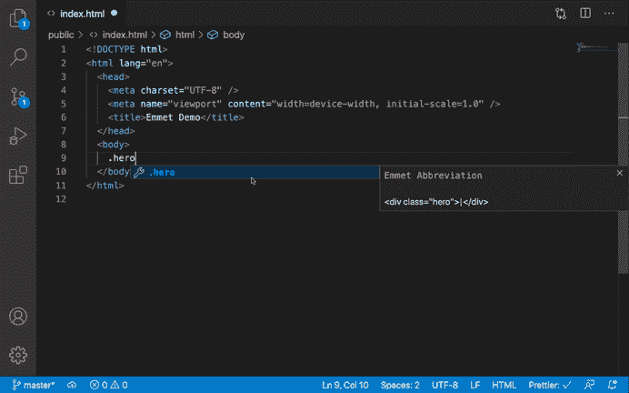

如您所见，代码生成后，emmet 会自动将光标放在 div 内部，这样您就不需要在 div 内部单击来键入内容。

*   默认情况下，当您没有指定标签名称时，emmet 会考虑使用`div`。

但是您也可以指定自己的标记名。

假设您想要创建一个包含两个类的部分，即`box`和`showcase`，那么您只需要键入`section.box.showcase`并按 tab 键。

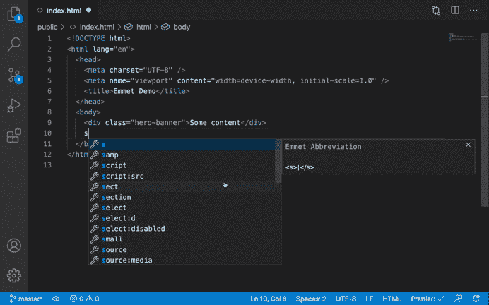

*   生成 id 为`numbers`的 div

缩写:#数字

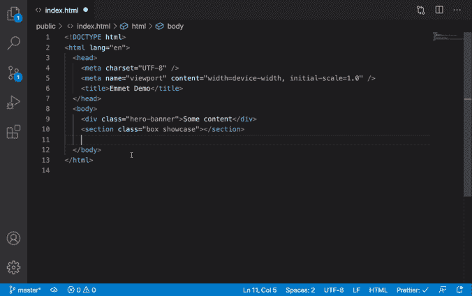

*   生成包含 3 个段落的 div

缩写:div>p*3

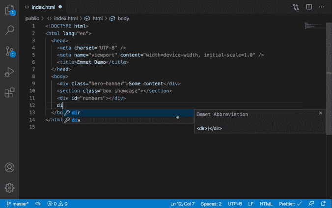

如您所见，代码生成后，emmet 会自动将光标放在段落内，因此您只需按 tab 键即可移动到下一个段落，在其中键入内容

*   用 div 中的 lorem ipsum 文本生成 3 个段落

缩写:div>p*3>lorem

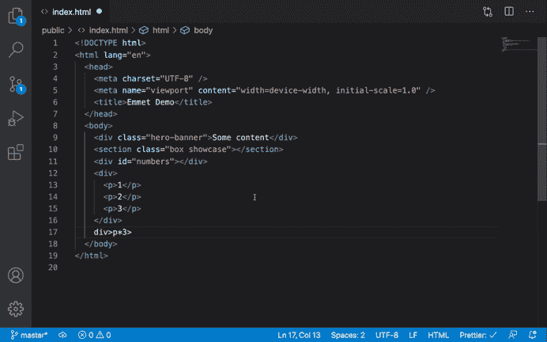

*   生成一个具有 id `btn`和类`primary-btn`的 div

缩写:div#btn.primary-btn

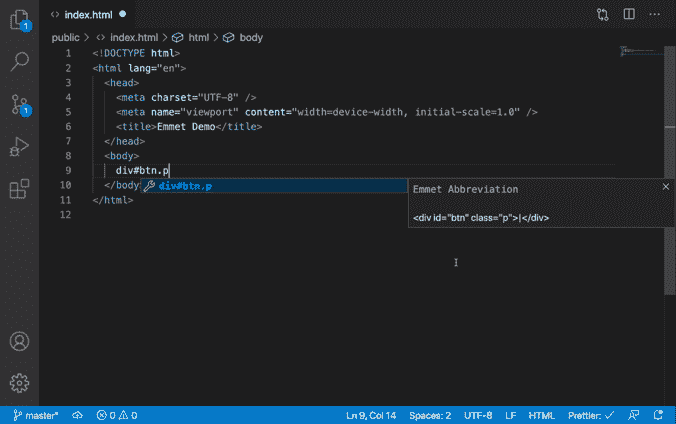

*   生成包含 3 个 li 的 ul，其中包含一个锚标记

缩写:ul>li*3>a

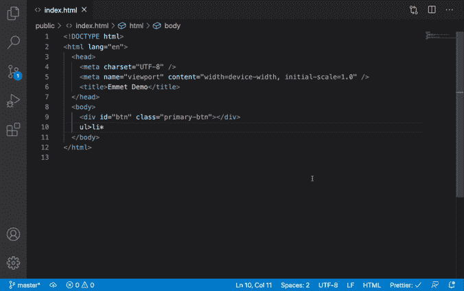

*   用类`menu-items`生成 ul，用类`menu-item`生成 3 li，并在其中添加一个锚标记

缩写:ul.menu-items>li*3.menu-item>a

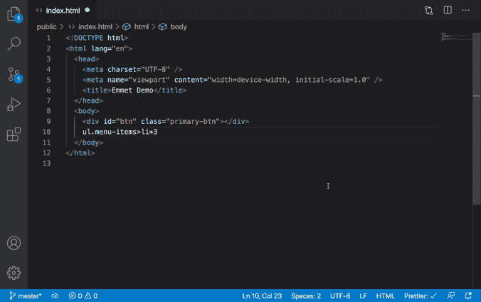

*   生成 4 个 div，其中包含 h2 和 ul，2 个 li 包含 ul

缩写:div*4>h2+ul>li*2

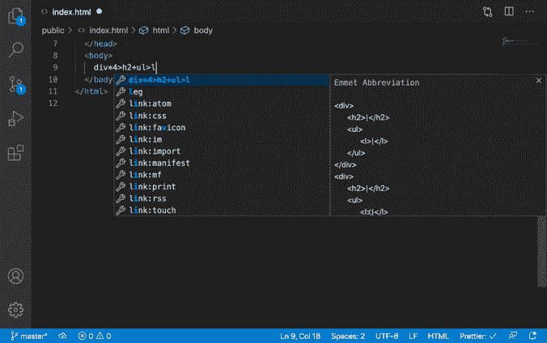

这里，我们希望 h2 和 ul 并排，所以我们使用了+运算符

*   生成包含 4 个 li 的 ul，其中包含类 item1、item2、item3 和 item4

缩写:ul>li.item$*4

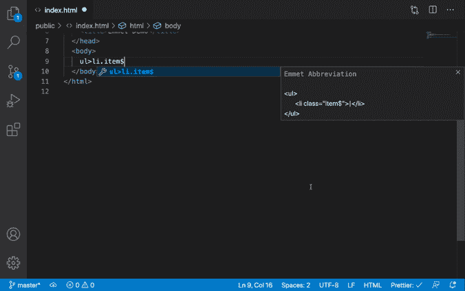

这里，$表示从 1 开始的递增数。

如果出于某种原因，你想生成一个从 0 开始的数字，使用缩写`ul>li.item$@0*4`

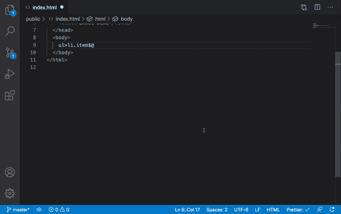

这里，我们用@符号指定了$后面的数字

*   生成一个内部带有文本`click here`的按钮

缩写:button {单击此处}

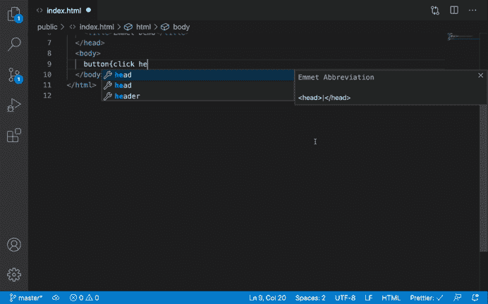

*   生成包含文本`Click here to continue`的段落，其中`here`是一个链接

缩写:p > {单击}+a {此处}+{继续}

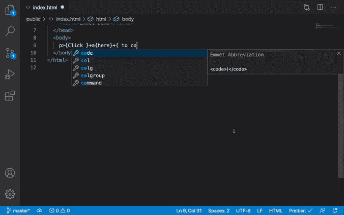

*   使用类型复选框生成输入

缩写:输入:c 或输入:复选框

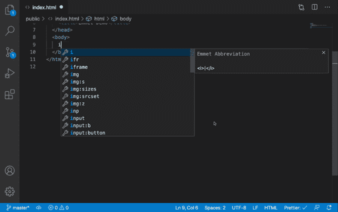

你实际上不需要记住像 input 这样的缩写，只需要键入 input:而 VS 代码会用各种 emmet 缩写提示你

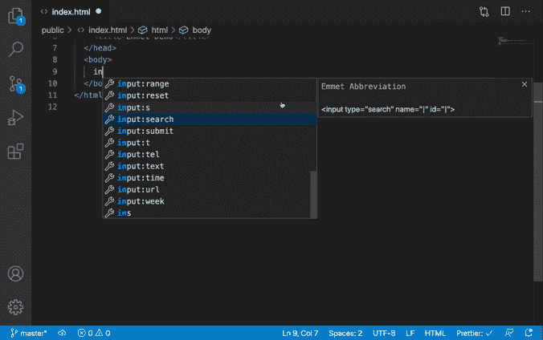

*   使用 src 属性生成脚本标记

缩写:脚本:src

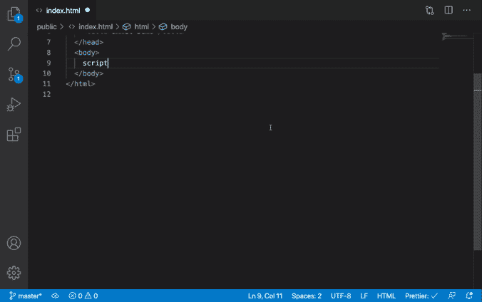

*   要生成具有某种属性的标签，请在括号内指定属性

缩写:a[href='#']

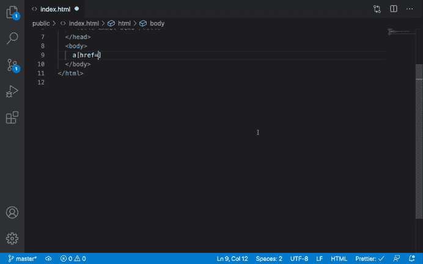

要指定多个属性，请用括号内的空格将它们分隔开

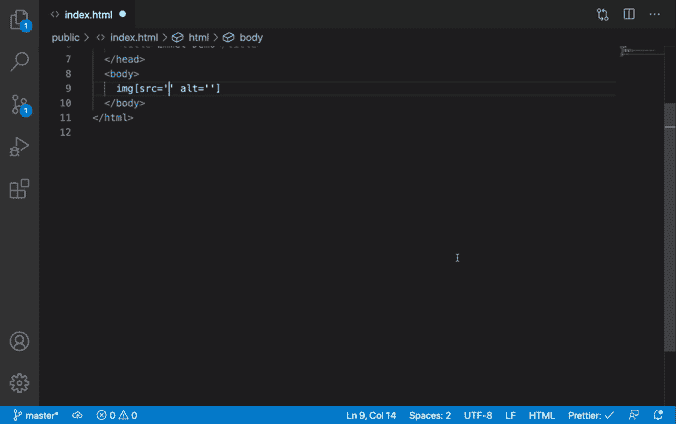

> *注意:如果由于某些原因，emmet 建议被隐藏，并且按 tab 不能完成代码，只需删除缩写的最后一个字符或按 ctrl + space 获得 emmet 建议，然后按 tab 键。*

# CSS 文件内部

Emmet 也处理 CSS 文件。

*   向选择器添加背景

缩写:bg

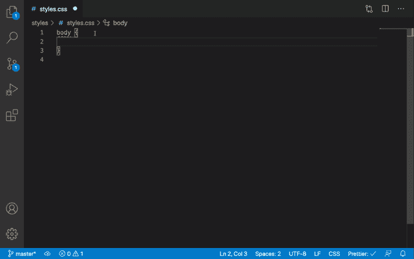

*   向选择器添加绝对位置

缩写:pos:a

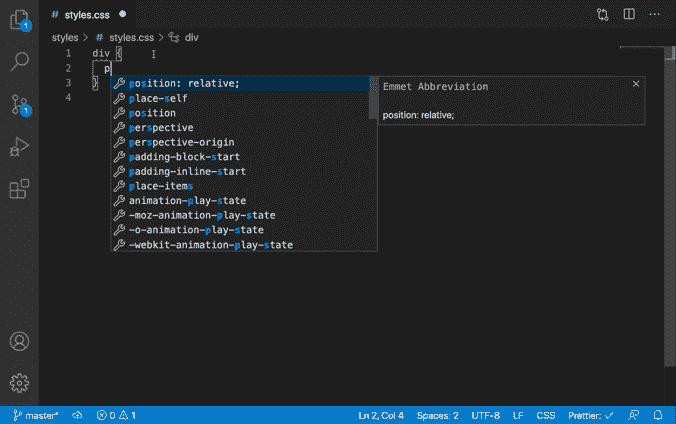

CSS 有很多缩写，但是你不需要记住它们中的任何一个。VS 代码通过在输入时提供建议使它变得非常简单

*   要将任何属性添加到选择器中，只需键入首字符，然后键入该属性的下一个单词。

因此，要添加背景色，只需键入 backc(back 表示背景，c 表示颜色)

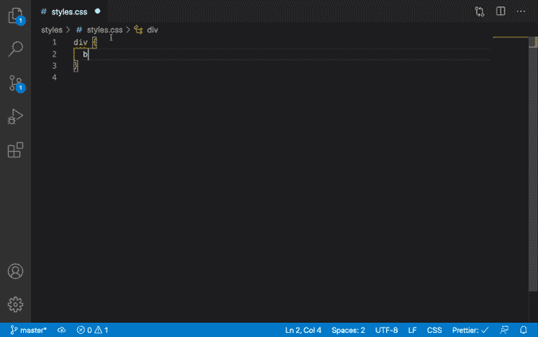

*   要添加背景大小的属性，只需键入 backs

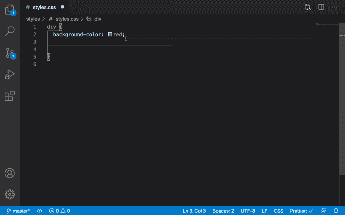

所以对于 CSS，你不需要记住 emmet 的缩写。VS 代码会通过提供建议来帮助你。

# 在 React 中启用 emmet

默认情况下，在 VS 代码中，Emmet 不支持 JSX。
但是您可以通过以下步骤启用它:

*   在 Visual Studio 代码中，按`Control + Shift + P`或`Command + Shift + P (Mac)`打开命令面板，键入`setting`，然后选择“首选项:打开用户设置”选项

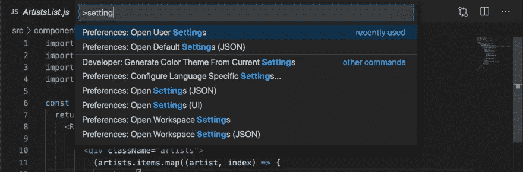

*   在左侧，展开扩展菜单并点击 Emmet

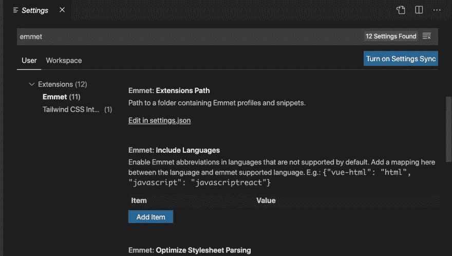

*   在`Include Languages`部分，点击`Add Item`按钮，添加`javascript`为键，添加`javascriptreact`为值，点击`Ok`

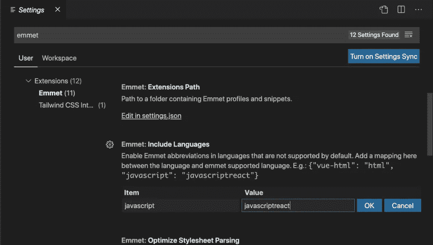

现在在 React 中打开任何组件文件，输入`.albums`并按 tab 键，它将被转换为`

`

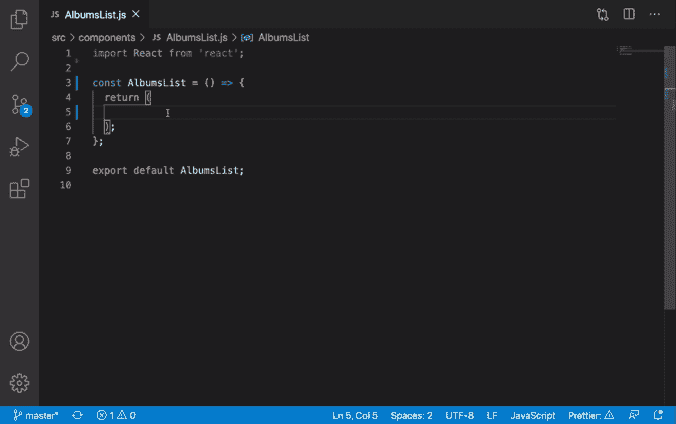

如你所见，如果我们在一个`.js`文件中，Emmet 会自动将`class`转换为`className`。

*   emmet 的伟大之处在于，你可以只用一行 Emmet 缩写`div.container>h1.title+h2.subtitle+div>div*4>h3+ul>li*4>a`就生成一个完整的 HTML 页面结构

**要了解更多关于这些惊人缩写的信息，请查看**[**Emmet cheat sheet**](https://docs.emmet.io/cheat-sheet/)**。**

# 结论

关于这篇文章就是这样。在这篇文章中，我们看到，

*   在 HTML、CSS 甚至 React javascript 文件内部使用 Emmet，大大提高了生产力。
*   我们可以只用一行 emmet 缩写就生成一个完整的 HTML 页面结构。
*   所以没有必要再浪费时间手动输入 div、classes、id，让 emmet 为您完成这项工作。

看看我最近出版的[掌握 Redux](https://master-redux.yogeshchavan.dev/) 课程。

在本课程中，您将构建 3 个应用程序以及一个点餐应用程序，您将了解:

*   基本和高级冗余
*   如何管理数组和对象的复杂状态
*   如何使用多个减速器管理复杂的冗余状态
*   如何调试 Redux 应用程序
*   如何在 React 中使用 Redux 使用 react-redux 库让你的 app 反应性。
*   如何使用 redux-thunk 库处理异步 API 调用等等

最后，我们将从头开始构建一个完整的[订餐应用](https://www.youtube.com/watch?v=2zaPDfCKAvM)，集成 stripe 以接受支付，并将其部署到生产中。

**别忘了直接在你的收件箱** [**这里**](https://yogeshchavan.dev/) **订阅我的每周简讯，里面有惊人的技巧、诀窍、文章和折扣优惠。**