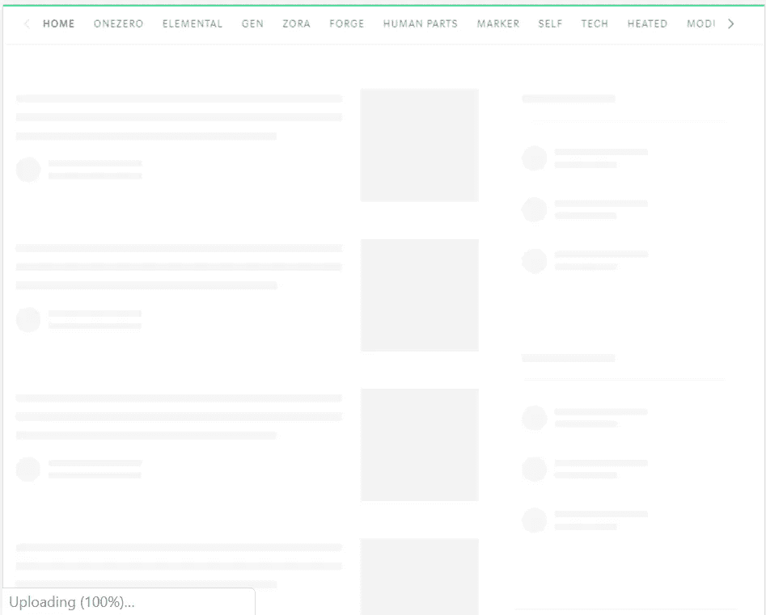
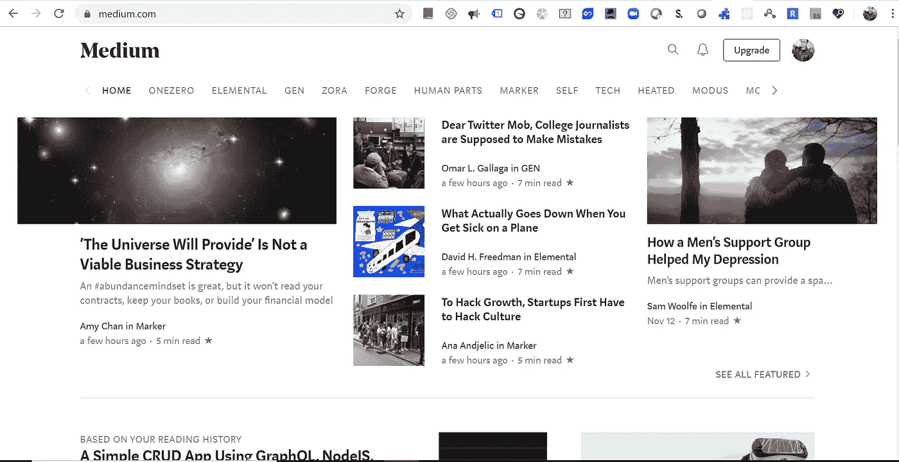

# 加快你的骨架屏幕反应 UX

> 原文：<https://javascript.plainenglish.io/speed-up-your-react-ux-with-skeleton-screens-f7b5831ef635?source=collection_archive---------5----------------------->

Medium Skeleton Screen

一项研究表明，人眼可以在不到 1 秒的时间内感知离散的图像，并且在这段时间内，他们继续专注于他们正在寻找的内容。如果加载实际内容的时间超过 5 秒，他们就会失去兴趣并逐渐转移。

为了让人们开心，我们需要给出一个指示，说明即使我们的内容没有加载或者发生了错误，也有一些事情正在发生。

对于一个网络应用， ***骨架屏幕*💀是添加文字&图像*等实体模型的方式。许多公司像脸书、谷歌、Slack 和其他公司都使用了这个概念。***

Medium 也使用如下所示的骨架 UI:

Medium

Skeleton Screen of Medium Website

# 它是如何工作的

首先，加载一个骨架而不是图像(通常带有灰色或灰白色背景)。

获取数据后，从图像元数据中加载图像的实际颜色。

最后，延迟加载图像，以允许用户使用交叉点观察器 API 实际查看内容。

# 履行

在 React 中，有一些流行的库可以帮助我们实现骨架屏幕。

1.  [React 内容加载器](https://github.com/danilowoz/react-content-loader)
2.  [React 占位符](https://github.com/buildo/react-placeholder)
3.  [反作用加载骨架](https://github.com/dvtng/react-loading-skeleton)

为了便于理解和演示，我做了一个[代码沙箱](https://codesandbox.io/s/hopeful-shamir-3g1n0)。

骨架屏幕大大提高了 UX，因为它减轻了用户对完全空白屏幕的挫折感，并让用户在加载内容之前就知道内容是什么样子的。

在 React 应用程序中使用框架 UI 很容易。快乐编码:)