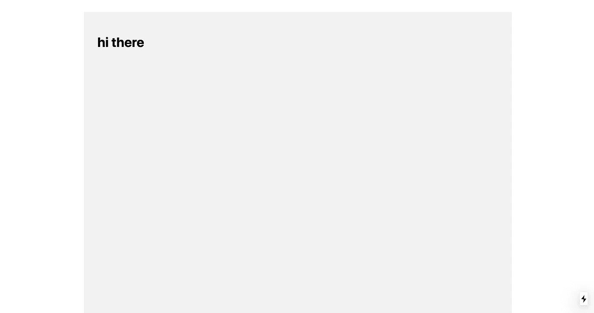

# 带有 Next.js、样式化组件和材料 UI 的 SSR

> 原文：<https://javascript.plainenglish.io/ssr-with-next-js-styled-components-and-material-ui-b1e88ac11dfa?source=collection_archive---------1----------------------->

## 使用 ServerStyleSheets 在 Next.js 中使用 styled-component 和 Material UI 进行服务器端渲染。


Material-UI

材质-UI 和样式-组件在所有组件上都能很好地工作。本文的目标是分享如何在 Next.js 应用程序上使用带有样式化组件和材质 UI 的服务器端渲染。

# 回购示例

您可以在以下位置查看最终的工作示例:

[](https://github.com/manakuro/nextjs-styled-component-material-ui-example/tree/master) [## mana kuro/nextjs-样式-组件-材料-ui-示例

### nextjs+Styled-component+Material UI+SSR。投稿至 manakuro/nextjs-风格-组件-材质-ui-实例…

github.com](https://github.com/manakuro/nextjs-styled-component-material-ui-example/tree/master) 

# 属国

确保使用下面显示的依赖关系。

*   Next.js@9.1.1
*   4.4.0 版本中的样式组件
*   Materil-UI@4.5.1

# 设置 Next.js 应用程序入门

首先，我们用`create-next-app`快速设置一下 Next.js。

设置 Next.js 应用程序:

```
$ create-next-app my-app
```

# 安装样式-组件和材料-用户界面

接下来，安装样式组件和材质 UI。

```
$ yarn add styled-components@4.4.0 [@](http://twitter.com/material)material-ui/core@4.5.1
```

现在，您已经考虑了所有的依赖项，并且已经准备好启动服务器了。

```
$ yarn dev
```

# 使用样式化组件的服务器端呈现

样式化组件支持使用样式表再水合的服务器端呈现，这允许您每次在服务器上呈现应用程序时使用 React DOM 的样式化组件。

为了在 Next.js 中做到这一点，您需要遵循其文档中的一些设置[:](https://www.styled-components.com/docs/advanced#server-side-rendering)

*   安装巴别塔插件
*   创建和定制`pages/_document.js`
*   创建和定制`pages/_app.js`

让我们一步一步地开始。

## 安装巴别塔插件

首先，安装他们的巴别塔插件:

```
$ yarn add -D babel-plugin-styled-components
```

并在项目的根目录下创建`.babelrc`并启用它:

配置已经完成，但在我们进行下一步之前，让我们尝试创建样式化组件，看看它是如何工作的。

在`pages/index.js`中，添加一些组件:

现在你会这样:



目前，样式不是在服务器上呈现，而是在客户端呈现。通过查看页面源代码，您可以看到它只是普通的 HTML，没有样式表。


View page source

因为它们在执行 JavaScript 后在样式标签中注入样式表:


因此，为了在 Next.js 中在服务器端呈现样式，您需要创建`pages/_document.js`和`pages/_app.js`并扩展它。

## 创建和定制`pages/_document.js`

Next.js 提供了定制`<html>`和`<body>`标签的能力，并默认支持 CSS-in-JS 库的 SSR。要覆盖它，创建`pages/_documents.js`:

这是自定义`_document.js`的样子，一旦添加了 SSR 样式组件，它应该:

*   创建一个`ServerStyleSheet`的实例
*   从页面中的组件检索样式
*   提取样式作为
*   将`styles`作为道具传递给 HTML 模板

styled-components 公开了`ServerStyleSheet`,允许您从应用程序中的所有样式组件创建样式表。`sheets.collectStyles`从组件中收集所有样式。`sheets.getElement()`生成风格标签，需要作为道具返回，名为`styles`。

原来的`Document.getInitialProps`返回`{ html, head, styles, dataOnly }`所以我们只是在这里扩展`styles`。

```
static async *getInitialProps*({ renderPage}) {
  const { html, head, dataOnly } = await renderPage()
  const styles = flush()
  return { html, head, styles, dataOnly }
}
```

您可以在以下网址查看原始脚本:

[](https://github.com/zeit/next.js/blob/canary/packages/next/pages/_document.tsx#L55-L61) [## zeit/next.js

### 此时您不能执行该操作。您已使用另一个标签页或窗口登录。您已在另一个选项卡中注销，或者…

github.com](https://github.com/zeit/next.js/blob/canary/packages/next/pages/_document.tsx#L55-L61) 

## 创建和定制`pages/_app.js`

接下来，创建`pages/_app.js`来使用 provider:

现在它已经呈现在服务器上，您可以在查看源代码页面上看到样式表:


Rendered on the server

第一幅画还是没有闪现。

# 使用材质的服务器端渲染-用户界面

如上例，Material-UI 也提供了相同的渲染系统。根据[的文件](https://material-ui.com/guides/server-rendering/#material-ui-on-the-server)，您需要:

*   为每个请求创建一个全新的`ServerStyleSheets`实例
*   使用服务器端收集器呈现 React 树
*   拉出 CSS
*   将 CSS 传递给客户端

与样式化组件非常相似，但是除此之外，为了避免 CSS 的重复注入，您需要在客户端移除服务器端注入的 CSS。

让我们在`pages/_document.js`中编辑它:

在客户端，您需要做的就是删除`pages/_app.js`中服务器端生成的 CSS:

把事情做好。让我们添加一些 Material-UI 组件来检查它是否工作:

你会得到这样的结果:


您可以在视图页面源代码中检查服务器端生成的样式表:


View page source

它非常好用。

# 结论

就是这样。如果您已经构建了一个现有的 Next.js 应用程序，您只需添加几个步骤。概括一下:

*   安装巴别塔插件
*   创建`pages/_document.js`并覆盖`Document`
*   创建`pages/_app.js`并覆盖`App`

希望对你有帮助。

您可以在以下位置查看最终的工作示例:

[](https://github.com/manakuro/nextjs-styled-component-material-ui-example/tree/master) [## mana kuro/nextjs-样式-组件-材料-ui-示例

### nextjs+Styled-component+Material UI+SSR。投稿至 manakuro/nextjs-风格-组件-材质-ui-实例…

github.com](https://github.com/manakuro/nextjs-styled-component-material-ui-example/tree/master) 

## 进一步阅读

[](https://bit.cloud/blog/how-to-build-material-ui-components-with-bit-l3isiibs) [## 如何用 Bit 构建 React 材质 UI 组件

### Material UI 是一个流行的开源()UI 组件库，它将材质设计与 React 结合在一起。材料 UI 是…

比特云](https://bit.cloud/blog/how-to-build-material-ui-components-with-bit-l3isiibs) 

*更多内容请看*[***plain English . io***](https://plainenglish.io/)*。报名参加我们的* [***免费周报***](http://newsletter.plainenglish.io/) *。关注我们关于*[***Twitter***](https://twitter.com/inPlainEngHQ)[***LinkedIn***](https://www.linkedin.com/company/inplainenglish/)*[***YouTube***](https://www.youtube.com/channel/UCtipWUghju290NWcn8jhyAw)***，以及****[***不和***](https://discord.gg/GtDtUAvyhW) *对成长黑客感兴趣？检查* [***电路***](https://circuit.ooo/) ***。*****