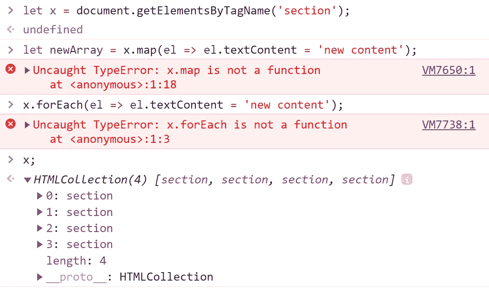
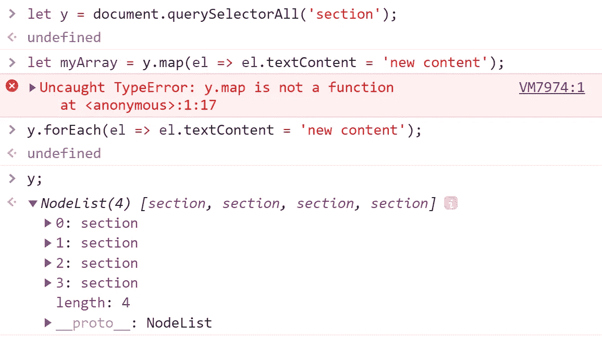
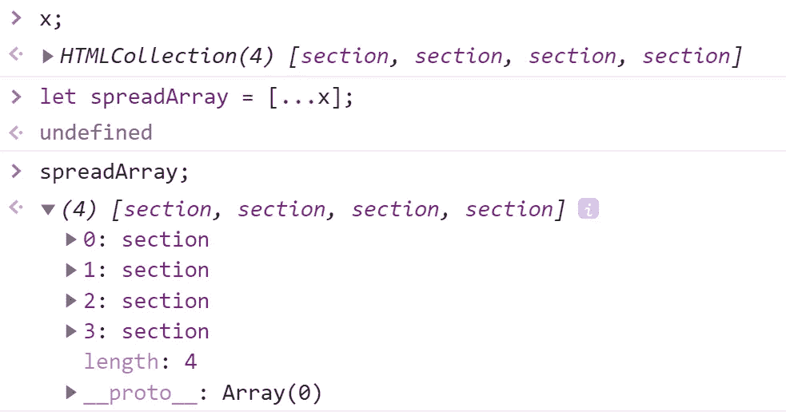

# 开始对 DOM 选择使用 forEach()和 map()

> 原文：<https://javascript.plainenglish.io/start-using-foreach-and-map-with-dom-selections-754616f8e7a7?source=collection_archive---------3----------------------->

## 避免这个容易犯的错误。


Photo by [Filip Mroz](https://unsplash.com/@mroz?utm_source=unsplash&utm_medium=referral&utm_content=creditCopyText) on [Unsplash](https://unsplash.com/s/photos/loop?utm_source=unsplash&utm_medium=referral&utm_content=creditCopyText)

# 试图脱离 for 循环

*给自己的备忘录*:我正在使用 [DOM](https://developer.mozilla.org/en-US/docs/Web/API/Document_Object_Model/Introduction) (文档对象模型)。我需要选择文档中所有的<部分>元素。然后我需要迭代结果，以某种方式改变每个元素。我以前做过这个。我的第一反应是伸手去拿那个可靠的老虎机…

但是等等，也许是时候尝试一下 [forEach()](https://developer.mozilla.org/en-US/docs/Web/JavaScript/Reference/Global_Objects/Array/forEach) 或 [map()](https://developer.mozilla.org/en-US/docs/Web/JavaScript/Reference/Global_Objects/Array/map) 方法了？

为什么不呢！所以我做出选择，并尝试使用[地图(](https://developer.mozilla.org/en-US/docs/Web/JavaScript/Reference/Global_Objects/Array/map))。并收到一个错误…

```
let x = document.getElementsByTagName('section');let newArray = x.map(el => el.textContent = 'new content');
```

*未捕获的类型错误:x.map 不是函数…* 😨

啊！现在回到 for 循环并把这个错误远远抛在后面是很诱人的，但是我不会那么容易放弃。我要去试试 [forEach()](https://developer.mozilla.org/en-US/docs/Web/JavaScript/Reference/Global_Objects/Array/forEach) 。无论如何，我不需要返回一组新的结果。我只需要对每个元素进行修改。但是我收到了相同类型的错误…

```
x.forEach(el => el.textContent = 'new content');
```

*未捕获的类型错误:x.forEach 不是函数…* 😨 😨



Array methods will not work with an HTMLCollection.

# 那么问题出在哪里？

问题是我没有一个数组与 [map()](https://developer.mozilla.org/en-US/docs/Web/JavaScript/Reference/Global_Objects/Array/map) 或 [forEach()](https://developer.mozilla.org/en-US/docs/Web/JavaScript/Reference/Global_Objects/Array/forEach) 一起使用。*我有一个*[*html collection*](https://developer.mozilla.org/en-US/docs/Web/API/HTMLCollection)。

使用[document . getelementsbytagname()](https://developer.mozilla.org/en-US/docs/Web/API/Document/getElementsByTagName)返回一个 [HTMLCollection](https://developer.mozilla.org/en-US/docs/Web/API/HTMLCollection) 。for 循环将迭代一个 [HTMLCollection](https://developer.mozilla.org/en-US/docs/Web/API/HTMLCollection) 。没有像 [forEach()](https://developer.mozilla.org/en-US/docs/Web/JavaScript/Reference/Global_Objects/Array/forEach) 或 [map()](https://developer.mozilla.org/en-US/docs/Web/JavaScript/Reference/Global_Objects/Array/map) 这样的内置方法可用。

用[document . queryselectorall()](https://developer.mozilla.org/en-US/docs/Web/API/Document/querySelectorAll)怎么样？问得好，答案是有和没有。我仍然没有一个数组。这个方法将返回一个[节点列表](https://developer.mozilla.org/en-US/docs/Web/API/NodeList)。节点列表确实有一些内置方法，包括 [forEach()](https://developer.mozilla.org/en-US/docs/Web/API/NodeList/forEach) ，但是它们不支持 map()。



Node Lists do have a forEach() method available, but not map().

# 传播语法来拯救！

好消息是:我可以通过一行代码从我的 [HTMLCollection](https://developer.mozilla.org/en-US/docs/Web/API/HTMLCollection) 或[节点列表](https://developer.mozilla.org/en-US/docs/Web/API/NodeList)中轻松创建一个新数组。它只需要使用[展开语法](https://developer.mozilla.org/en-US/docs/Web/JavaScript/Reference/Operators/Spread_syntax)！

```
let spreadArray = [...x];
```

现在，我可以在新数组上使用 [forEach()](https://developer.mozilla.org/en-US/docs/Web/JavaScript/Reference/Global_Objects/Array/forEach) 或 [map()](https://developer.mozilla.org/en-US/docs/Web/JavaScript/Reference/Global_Objects/Array/map) 。😎



Use the spread operator to easily make a new array from an HTMLCollection or Node List.

# 结论

综上所述，记得用[document . getelementsbytagname()](https://developer.mozilla.org/en-US/docs/Web/API/Document/getElementsByTagName)、[document . getelementsbyclassname()](https://developer.mozilla.org/en-US/docs/Web/API/Document/getElementsByClassName)或[document . query selectorall()](https://developer.mozilla.org/en-US/docs/Web/API/Document/querySelectorAll)从 [DOM](https://developer.mozilla.org/en-US/docs/Web/API/Document_Object_Model/Introduction) 中选择不会返回结果数组。然而，利用 [spread 语法](https://developer.mozilla.org/en-US/docs/Web/JavaScript/Reference/Operators/Spread_syntax)的一行快速代码将从这些结果中创建一个数组。而且数组有这么多方法可以选择，包括 [map()](https://developer.mozilla.org/en-US/docs/Web/JavaScript/Reference/Global_Objects/Array/map) 和 [forEach()](https://developer.mozilla.org/en-US/docs/Web/JavaScript/Reference/Global_Objects/Array/forEach) 。

在 LinkedIn 或 Twitter 上随时联系我。如果你喜欢这篇文章，给它一些掌声。我将真诚地感谢它。

[https://www.linkedin.com/in/davidagray/](https://www.linkedin.com/in/davidagray/)

[](https://twitter.com/yesdavidgray) [## 戴夫·格雷

### 戴夫·格雷的最新推文(@ yesdavidgray)。解决方案架构师*讲师*音乐家*企业家*上瘾…

twitter.com](https://twitter.com/yesdavidgray)