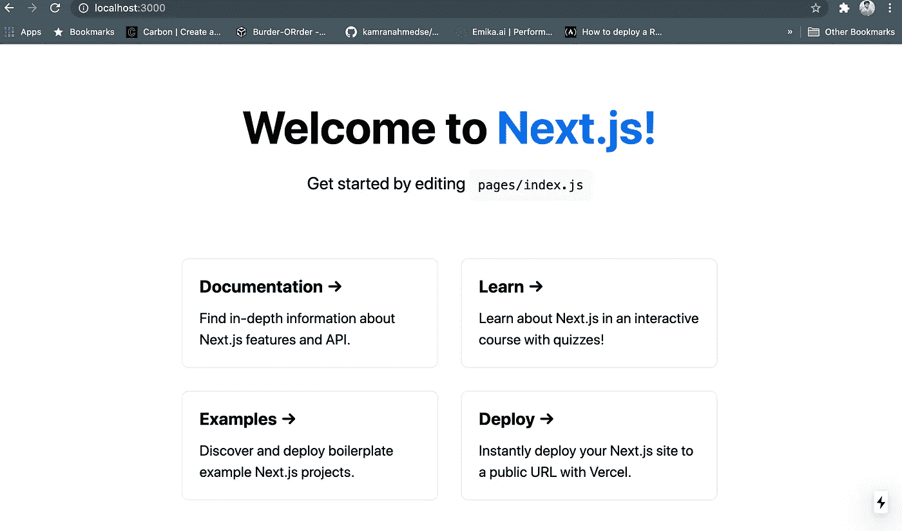
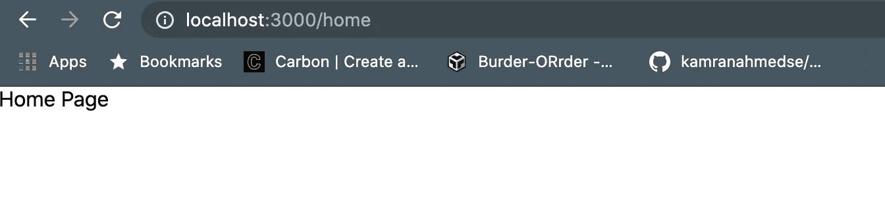

# 从 Next.js 开始您的旅程

> 原文：<https://javascript.plainenglish.io/start-your-journey-with-next-js-958705cfc299?source=collection_archive---------9----------------------->

## React 开发人员的一个很好的框架


image credit : google

# Next.js 是什么？

Next.js 是 React 的一个框架。它使得 React 的开发更加干净和高效。在他们的[文档](https://nextjs.org/)中，他们将 Next.js 定义为:“t*he React Framework for Production”*

它的特征确实证明了这种说法。我们稍后会谈到它们。

# 为什么是 Next.js？

Next.js 为您提供了最佳的开发体验，拥有生产所需的所有特性。混合静态和服务器渲染、类型脚本支持、智能捆绑、路由预取等等。不需要配置。

一坏(还是好？React 的特点是它非常不固执己见。它并不强迫开发者为特定的任务使用特定的库。

但是这是有代价的。大多数时候，你不得不求助于外部库或社区支持，甚至是路由、优化等最常见的功能。

但 Next.js 却不是这样，它内置了很多功能。你可以立即开始使用它。此外，它还支持 **SSR** (服务器端渲染)，这是 **SEO** 优化所必需的。因此，如果你正在建立一个类似电子商务的东西，你关心的是搜索引擎优化，那么 Next.js 可能是一个不错的选择。

# 好的，我听到了。给我看看代码！

你可以像 **React** 一样构建一个 Next.js 应用程序。打开您的终端并键入以下命令

```
npx create-next-app name-of-your-app
```

要运行开发服务器

```
cd name-of-your-app
yarn dev
```

转到 [http://localhost:3000](http://localhost:3000) ，你会看到你那令人敬畏的应用程序的登陆页面。就这么简单。



Landing page of Next.js application

# 下一步是什么？

Next.js 有很棒的文档(是我见过的最好的文档之一)。你可以(也应该)从那里学到所有基本的东西。但是如果你想留下来，我会在这里解释一些基本概念。我们开始吧

# 声明路由

Next.js 遵循声明式路由。在您的项目目录中有一个名为`pages`的文件夹(您不应该弄乱它)。在该组件中，您可以创建一个名为`home.js`的新组件

现在，如果你打开浏览器，浏览 http://localhost:3000/home ，你可以看到主页。



Home page

那超级简单。无需安装 react-router 或任何其他库。不需要将页面导入到任何其他页面。只要创建文件，它就在你的浏览器上。

*   如果您需要复杂的路由结构，您可以创建另一个页面，如 home/details.js，您的新页面将在[http://localhost:3000/home](http://localhost:3000/home)下提供
*   如果您需要动态路由，您可以添加一个新页面，如 user/[id]。如果你去[http://localhost:3000/user/1](http://localhost:3000/user/1)或者[http://localhost:3000/user/2](http://localhost:3000/user/2)你会看到你的新页面。

# 航行

您不需要安装 react-router 或任何其他导航库。Next.js 为您提供了一个名为`Link`的组件，您可以使用它在页面之间导航。

*   如果你想导航到一个名为`/about`的路径，你可以在你的主页上这样声明。

*   href 属性将决定您要走的路线。

# 静态资产

您可以将图像等静态资产放在顶级公共目录中。例如，将一个名为`user.png`的图像放入`public`文件夹中，您可以像这样提供该图像

```

```

# 式样

*   在新的顶层`component`文件夹下创建一个名为`layout.jsx`的新组件。
*   在某个地方创建一个名为`layout.module.css`的样式文件(我在同一个文件夹中做)。
*   记住一件事，样式文件名必须有 **.module.css** 作为后缀。
*   现在将文件导入到您的`Layout`组件中。并将该样式用作一个 **className** 属性。

它的一个优点是 Next.js 会自动创建一个格式为`layout_container_random`的类属性。随机后缀有助于避免类名冲突。多棒啊。

如果你想使用 **sass** 来设计你的风格，那么Next.js 也支持开箱即用。但是不要忘记首先安装依赖项。

```
npm install sass
```

安装后，您可以开始直接使用`.scss`或`.sass`文件。

# 全球国家的概念

通常我们在 **React** 项目中有一个`App.js`文件。该组件充当我们所有子组件的容器。但是在 Next.js 中我们没有这样的组件。

注意一件事。我们没有将页面导入任何其他组件。所以没有可以被认为是全局子持有人的组件。但是有一个名为`_app.js`的文件。这充当了母组件。它执行一个`App.js`组件的动作。

它可以应用所有样式，并可以处理页面之间的全局变量。因此，如果我们想在所有页面之间应用全局样式或某种公共状态，那么`_app.js`就是这样做的地方。

# 预渲染

预渲染是 Next.js 中一个非常重要的概念，默认情况下，Next.js 会预渲染每个页面。这意味着所需的 HTML 文件是预先构建的，与 React 相反，JavaScript 代码负责构建 HTML

有两种类型的预渲染

*   静态站点生成(SSG)
*   服务端渲染(SSR)

让我们简单地讨论一下它们，并尝试理解它们的用例。

# 静态站点生成

如果你的网站有一些不太可能经常改变的静态内容(比如你的作品集),那么你不必担心任何事情。Next.js 会自动为你做 SSG。因为它已经知道要渲染什么了。所以它会提前生成所需的 HTML，从而带来超快的体验。

但是在任何严肃的 web 应用程序中，我们都依赖于一些来自外部 API 源(您的后端服务器)的动态内容。那么 Next.js 究竟要如何预渲染一个依赖于一些外部 api 数据的页面呢？

方法是由名为`getStaticProps`的 **NestJS** 提供的一个函数。

这是一个可以从页面返回的异步函数。它将提前交付一些 api 调用的结果，并将结果作为道具传递给页面组件。

因此，Next.js 将提前从这个函数中解析必要的属性，并预先呈现您的页面。需要注意的一点是， ***你只能从你的页面类型组件内部返回这个函数。您不能在任何其他组件中定义它。***

## SSG 的使用案例

当你已经提前知道 api 的结果时，你只能使用`getStaticProps`。这里我们使用[**JsonPlaceHolder**](https://jsonplaceholder.typicode.com/)API 来获取博客文章列表。在你的主页中，你已经知道你将要调用的 api 来获取你所有的文章。它不依赖于在每次请求时都会改变的某些路由参数。所以你可以在这样的场景中使用`getStaticProps`它。

Static Site Generation (SSG)

但是，如果你有一个像`blogs/[id]`这样的路径，用一个特定的 id 显示一篇博文的细节，会发生什么呢？Next.js 如何提前知道要传递哪个 id 并渲染页面？

不幸的是，你不能在这个场景中使用 SSG。我们必须使用服务器端渲染(SSR)。

# 服务器端渲染

我们将从前面的例子继续我们的讨论。我们需要通过 id 获取具体的博客细节，并显示在我们的`blogs/[id]`页面上。这里我们将使用另一个名为`getServerSideProps`的函数。

这个函数有一个名为 **context** 的额外参数，可以用来获得关于所请求路线的额外信息。因此，我们可以从请求的路由中获取博客 id，获取博客详细信息，并将其作为道具传递到详细信息页面。

Server Side Rendering (SSR)

这里发生了什么？

*   首先，我们的`getServerSideProps`函数获取路由请求的 id。例如，如果请求的路由是[http://localhost:3000/blogs/2](http://localhost:3000/blogs/2)，那么博客 id 是 2。
*   然后，它获取这个特定博客的详细信息。
*   将数据作为道具传递给我们的组件。
*   然后，我们的页面用服务器生成的 HTML 呈现。

这就是开始使用 Next.js 需要知道的所有基本概念。你可以认真考虑用它来构建你的下一个项目。工作起来真是轻而易举。

如果你已经知道 React，那么 Next.js 可以成为你的工具箱的另一个重要的补充。

谢谢你能走到这一步。编码快乐！

**通过**[**LinkedIn**](https://www.linkedin.com/in/56faisal/)**或我的** [**个人网站**](https://www.mohammadfaisal.dev/) **与我取得联系。**

## **延伸阅读**

[](/data-fetching-with-next-js-13s-bleeding-edge-features-a-primer-a60ddd3f7570) [## 使用 Next.js 13 的前沿特性获取数据——入门

### NextJS 13 中的数据获取使用了应用程序目录、流、暂挂以及混合服务器和客户端组件。

javascript.plainenglish.io](/data-fetching-with-next-js-13s-bleeding-edge-features-a-primer-a60ddd3f7570)