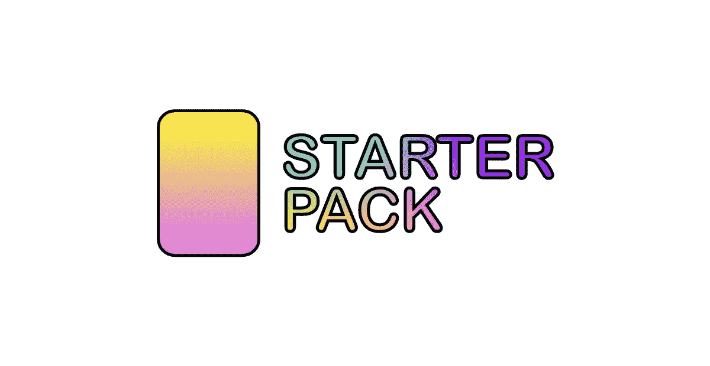
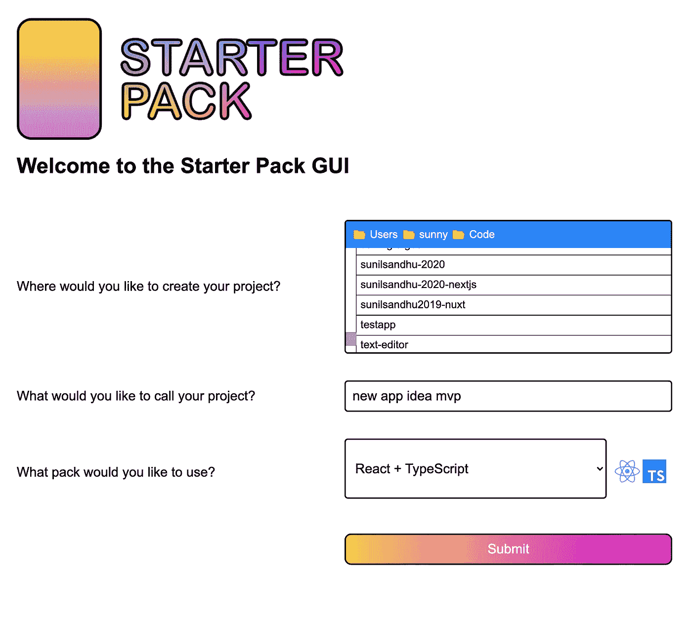

# Starter Pack 将改变开发人员构建应用程序的方式

> 原文：<https://javascript.plainenglish.io/starter-pack-will-change-how-developers-build-apps-b7071a81c81c?source=collection_archive---------11----------------------->

## 用一个命令访问您最喜欢的所有 CLI 工具(还有更多)

## 什么是入门包？

Starter Pack 统一了所有其他 CLI 工具。忘记必须安装/记住/谷歌许多不同的命令，通过入门包访问它们！

这也意味着您不必担心总是保持您使用的各种 CLI 工具是最新的，因为 Starter Pack 会为您做好准备。让初学者工具包保持最新，您的所有其他 CLI 工具也将保持最新！

## 入门包是给谁的？

所有人！我们已经创建了一个工具，希望所有技能水平的开发人员都可以使用。

## 但是竞争标准呢？这不是又创造了一个吗？

这是一种可以理解的担忧。所以让我们解释一下为什么这不是你需要担心的事情。

入门包由许多“包”组成。一个包就是一个项目。虽然我们提供的一些包是从头开始创建的，但大多数都是基于现有 CLI 工具的接口。

一个这样的例子就是我们的超薄包装。这只是使用了与使用 Svelte CLI 工具创建 Svelte 项目相同的命令。这里唯一的不同是，每次你想创建一个新项目时，你都不必担心下载或明确使用 Svelte 自己的 CLI 工具。同样适用于 React、Vue 和 Angular。

Starter Pack 在所有这些工具的基础上提供了一个单一的界面，您不必下载、安装并记住它们各自的 CLI 工具命令。因为它只是一个接口(而不是一个实现)，所以每当这些单独的 CLI 工具更新它们的任何依赖项时，您可以确保 Starter Pack 将始终使用最新版本。

## 可用包

目前，Starter Pack 提供以下功能:

*   有角的
*   反应
*   React (Next.js)
*   反应+表达
*   反应+打字稿
*   苗条的
*   某视频剪辑软件
*   Vue +类型脚本
*   网站(全球资讯网的主机站)

我们计划在未来增加更多。与此同时，如果您有任何包装建议/要求，请通过 [Twitter](https://twitter.com/StarterPackCLI) 联系我们。

## 入门指南

有两种方法可以开始。第一种是通过运行`npm i -g @starter-pack/cli`或者运行`npx @starter-pack/cli`在你的设备上安装 Starter Pack，这样你就可以在任何时候访问最新的版本(假设你已经可以在你的设备上访问 npx)。

如果你选择了第一个选项，一旦安装完毕，你应该能够在命令行中输入`@starter-pack/cli`。这将启动 CLI 工具。

然后会问你两个问题:

1.  您希望如何命名您的项目？
2.  您想使用哪个入门包？

你对第一个问题的回答将成为你项目的名称。这将作为名称出现在您的`package.json`中，并将成为您的项目文件夹的名称。

你对第二个问题的回答决定了你将拥有什么样的背包。

例如，如果您决定将您的项目称为“最佳应用程序”并选择使用 Vue，Starter Pack 将创建一个名为“最佳应用程序”的 Vue 项目。

请记住，项目将创建在与您执行命令的目录相同的目录中。

因此，CLI 是您开始使用 Starter Pack 的第一种方式。但是第二种方式呢？

## 图形用户界面

我们希望确保 Starter Pack 对开发人员和初学者尽可能友好。现在也是 21 世纪了，当有更好的解决方案时，并不是每个技术任务都必须在命令行中执行。因此，我们从 Vue CLI UI 中获得灵感，制作了一个 Starter Pack GUI 工具。

The Starter Pack GUI

用户可以使用 CLI 工具中的所有选项，还可以选择在设备上创建项目的位置。

## 未来的计划

初学者工具包计划使他们的工具可扩展。也许有一个您经常使用的包，您想对它进行一些定制。这是 Starter Pack 计划在未来版本中包含的内容。

Starter Pack 也有雄心勃勃的计划来帮助推广最佳实践。除了 CLI/GUI 工具，他们还致力于制作一流的文档来帮助您构建自己的项目。开发者技术在不断更新。但是当技术进步时，伴随的文档却没有进步。这可能是上述技术所有者的过错，或者仅仅是因为社区编写的教程和指南没有更新(这是一项艰巨的任务，所以实际上没有人真正应该受到责备)。无论哪种方式，我们计划通过创建统一的文档来解决这个问题，这些文档将由该领域的专家管理和更新。

## 结论

Starter Pack 是一项新技术，它提供了很多承诺，并有望改善开发人员的体验，以及所构建软件的整体质量。这是一个完全开源的项目，仍有许多工作要做。如果你感兴趣，去看看他们的网站[starterpk.com](http://starterpk.com)，通过[推特](https://twitter.com/StarterPackCLI)，或者向他们的[回复](https://github.com/starterpk)中的任何一个发出请求。