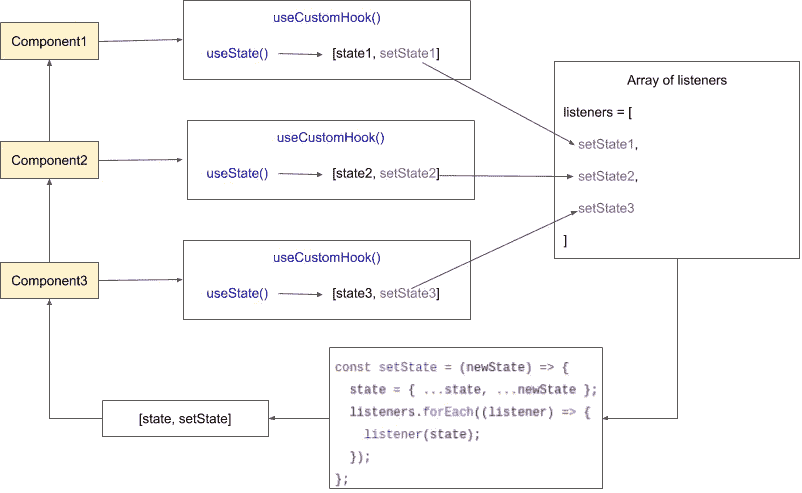

# 使用 React 挂钩进行状态管理——没有冗余或上下文 API

> 原文：<https://javascript.plainenglish.io/state-management-with-react-hooks-no-redux-or-context-api-8b3035ceecf8?source=collection_archive---------0----------------------->

## 反应钩比你想象的更强大。

今天，我们将探索它并开发一个定制的钩子来管理全局状态——一个比 Redux 更容易使用的方法，并且比 Context API 更高效。


# 钩子的基础

如果你已经熟悉 React 钩子，你可以跳过这一部分。

## 使用状态()

在钩子出现之前，功能组件没有状态。现在，有了`useState()`，我们可以做到了。


它通过返回一个数组来工作。上述数组的第一项是一个变量，它提供了对状态值的访问。第二项是更新组件状态以反映 DOM 上新值的函数。

## useEffect()

类组件使用生命周期方法管理副作用，比如`componentDidMount()`。`useEffect()`功能允许您在功能组件中执行副作用。

默认情况下，效果在每次完成渲染后运行。但是，您可以选择仅在某些值发生更改时触发它，将变量数组作为第二个可选参数传递。

为了得到与`componentDidMount()`相同的结果，我们可以发送一个空数组。知道一个空集永远不变，效果只会运行一次。

# 共享状态

我们可以看到钩子状态的工作方式与类组件状态完全一样。组件的每个实例都有自己的状态。

为了解决在组件之间共享状态的问题，我们将创建一个自定义钩子。



这个想法是创建一个监听器数组和一个状态对象。每当一个组件改变状态时，所有订阅的组件都会触发它们的`setState()`函数并得到更新。

我们可以通过调用自定义钩子中的`useState()`来实现。但是，我们没有返回`setState()`函数，而是将它添加到一个侦听器数组中，并返回一个更新状态对象并运行所有侦听器函数的函数。

## 等等。这不是应该让我的生活更轻松吗？

是的。我创建了一个封装了所有这些逻辑的 NPM 包。

[](https://www.npmjs.com/package/use-global-hook) [## 使用全局钩子

### 使用不到 1kb 的钩子轻松管理 react 的状态。

www.npmjs.com](https://www.npmjs.com/package/use-global-hook) 

你不需要在每个项目上都重写这个定制钩子。如果您只想跳过这一步并使用最终的解决方案，您可以通过运行以下命令轻松地将其添加到您的项目中:

```
npm install -s use-global-hook
```

您可以通过软件包文档中的示例来学习如何使用它。但是，从现在开始，我们将关注它是如何工作的。

# 第一个版本

## 要在组件上使用它:

这个第一个版本已经在共享状态下工作。您可以在应用程序中添加任意数量的计数器组件，它们都将具有相同的全局状态。

# 但是我们可以做得更好

我不喜欢第一个版本:

*   我想在卸载组件时从阵列中删除侦听器。
*   我想使它更通用，所以我们可以在其他项目中使用。
*   我想通过参数设置一个`initialState`。
*   我想使用更多面向函数的编程。

## 在组件卸载之前调用函数

我们了解到，用一个空数组调用`useEffect(function,[])`，与`componentDidMount()`有相同的用途。但是，如果第一个参数中使用的函数返回另一个函数，那么第二个函数将在组件被卸载之前被触发。跟`componentWillUnmount()`一模一样。

这是从 listeners 数组中删除组件的最佳位置。

# 第二个版本

除了最后的修改，我们还将:

*   将 React 设置为参数，不再导入它。
*   不是导出 customHook，而是导出一个函数，根据`initialState`参数返回一个新的 customHook。
*   创建一个包含`state`值和`setState()`函数的`store`对象。
*   将箭头函数替换为`setState()`和`useCustom()`中的常规函数，这样我们就可以有一个上下文来将`store`绑定到`this`。

因为我们现在有了一个更通用的钩子，所以我们必须在一个存储文件中设置它。

# 将动作与组件分离

如果您曾经使用过复杂的状态管理库，您会知道直接从组件操纵全局状态并不是最好的主意。

最好的方法是通过创建操作状态的动作来分离业务逻辑。出于这个原因，我希望我们解决方案的最后一个版本没有给组件提供对`setState()`函数的访问，而是提供一组动作。

为了解决这个问题，我们的`useGlobalHook(React, initialState, actions)`函数将接收一个`action`对象作为第三个参数。关于这一点，我想补充几点:

*   动作将可以访问`store`对象。因此，动作可以用`store.state`读取状态，通过`store.setState()`写入状态，甚至用`state.actions`调用其他动作。
*   对于组织，操作对象可能包含其他操作的子对象。所以，你可能有一个`actions.addToCounter(amount)`或一个子对象，所有的计数器动作都用`actions.counter.add(amount)`调用。

# 最终版本

以下文件是 NPM 包`use-global-hook`中的实际文件。

# 使用示例

你再也不需要触摸`useGlobalHook.js`了。您现在可以专注于您的应用程序了。这里有两个在现实生活中如何使用的例子。

## 几个计数器，一个值

添加任意数量的计数器，它们将共享相同的全局值。每当一个计数器在全局值上加 1 时，所有计数器都会呈现。父组件不需要再次渲染。

Click in “Open in Editor” to view the code in a new tab

## 异步 ajax 请求

通过用户名搜索 GitHub 库。用 async/await 异步处理 ajax 请求。每次搜索时更新请求计数器。

Click in “Open in Editor” to view the code in a new tab

# 我们做到了！

我们自己的带有 React 钩子的状态管理库！

# 更新—2019 年 9 月

在版本 0.1.10 中，我们向库中添加了一个重要的特性。现在我们可以在使用它之前映射全局状态的子集。这将避免每次全局状态改变时不必要的渲染。

在下面的例子中，我们在全局状态上有两个计数器:counterA 和 counterB。当您向 counterA 添加值时，counterB 组件将不会重新呈现，反之亦然。

尝试按钮添加 10.000 个抵靠组件。这将使更新 counterB 的值非常慢，但更新 counterA 将继续快速。

*更多内容尽在*[***plain English . io***](http://plainenglish.io)**和上**[**我们的 YouTube 频道**](https://www.youtube.com/channel/UCtipWUghju290NWcn8jhyAw) **！****

**[](https://newsletter.plainenglish.io/) [## 上周简明英语杂志

### 《上周简明英语》——科技世界的每周综述，包含我们认为你会…

时事通讯. plainenglish.io](https://newsletter.plainenglish.io/)**