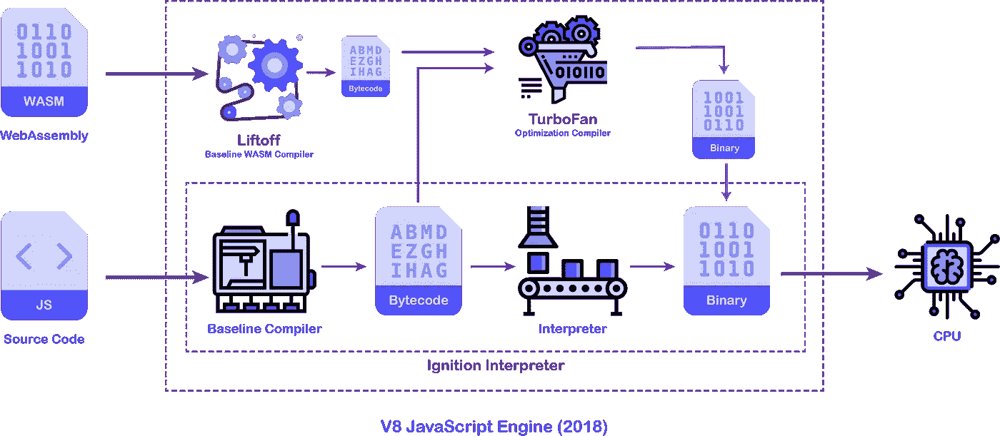
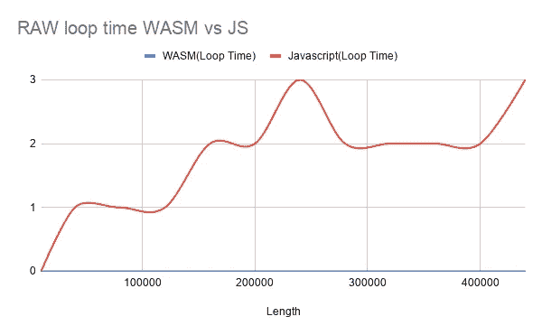
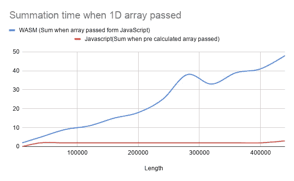
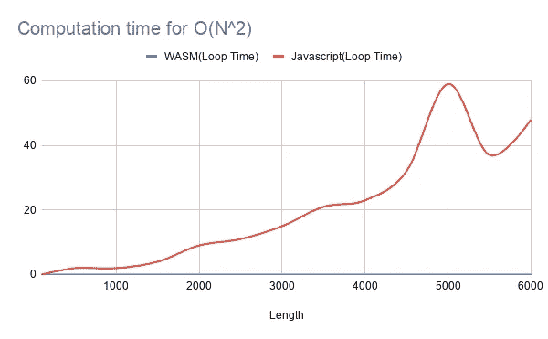
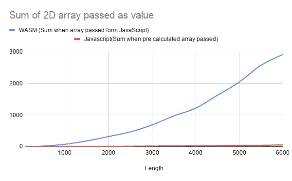
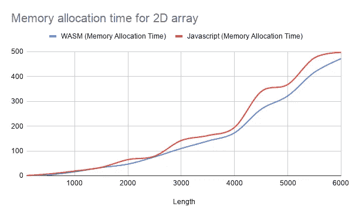

# 2020 年的网络组装状况

> 原文：<https://javascript.plainenglish.io/state-of-web-assembly-2020-674ced038ea8?source=collection_archive---------2----------------------->



Architecture of V8

帮助您决定何时**不**使用 Web 组装的基准概述。

JS 世界有了新的炒作， **Web 组装。**那些熟悉涡扇的编译管道的人，我们有理由认为 liftoff 产生的代码跳过了普通 javascript 的许多步骤。让你的代码“热”得更快。根据 WebAssembly 官方页面上的经验法则:“**将 Web Assembly 用于计算密集型任务，如游戏、图像处理、数学、物理、音频效果等……**。”。首先想到的问题是，为什么不在 web 汇编中编写每个小函数？整数的每一次增量，每一次加法。代价是什么？好吧，让我们来看看。

## 用于基准测试的配置

**处理器:**英特尔酷睿 i5–8265 u CPU @ 1.60 GHz
**内存:** 16GB
**操作系统:** Ubuntu 20.04 LTS

*免责声明。性能指标评测结果可能因电脑而异。以下数据不应作为 WASM 和 JS 文件的最终执行时间，而是提供一个相对比较，以便在 JS 和 WASM 之间画一条线，供您计算。另外下面的数据比较了 JS 与* ***Rust，*** *的速度与 C++或其他语言可能有所不同。*

## **目的:测量 O(N)和 O(N** **)循环在以下条件下所需的时间:**

a.原始循环时间
b .作为值传递的数组元素的总和
c .数组的内存分配

# O(N)循环的基准测试:

## 原始循环时间:

```
**//Rust example that iterates over 0 to length(variable)**#[wasm_bindgen]pub fn loop_time_1d_arr() {let mut sum = 0;*for* i *in* 0..440000 {sum += i;}} **//Javascript loop that iterates from 0 to length1d(variable)**function loopTime1DArr() {let sum = 0;*for* (let i = 0; i < length1d; i++) {sum += i;}}
```



Time in milliseconds

WASM 以某种方式保持了一个恒定的执行时间，结果执行时间为 0 毫秒。然而 javascript 的执行时间似乎是线性增长的。然而，200，000 到 300，000 之间的波动可能是由于 CPU 过热或任何可能已经在后台运行的后台任务。

## 作为值传递的数组元素的总和:

```
**//Rust program to pass array as a value to a function to calculate the sum**#[wasm_bindgen]pub fn sum_of_arr(arr: &JsValue) -> i32 {let mut sum = 0;let elements: Vec<i32> = arr.into_serde().unwrap();*for* i *in* 0..elements.len() {sum += elements[i];}*return* sum;}**//Javascript program to pass array as a value to a function to calculate the sum** function sumOfArr(arr) {let result = 0;*for* (let i = 0; i < arr.length; i++) result += arr[i];*return* result;}
```



Time in milliseconds

嗯……WASM 在之前的基准测试中轻松过关，但是现在发生了什么？原来这里使用的`into_serde()` 方法增加了大量解析和优化 JavaScript 动态类型代码的负载，从而给了我们这个图。

## 阵列的内存分配:

```
**//code to allocate array of dynamic length in Rust**#[wasm_bindgen]pub fn malloc_1_d_arr() {let mut vec: Vec<i32> = [].to_vec();*for* i *in* 0..440000 {vec.push(i);}}**//code to allocate array of dynamic length in Javascript** function malloc1darr() {let result = [];*for* (let i = 0; i < length1d; i++) result.push(i);}
```


Time in milliseconds

这里可以看到，与 JavaScript 相比，WASM 的业绩提高了 4-6 倍。

# O(N)循环的基准测试:

## 原始循环时间:

```
**// Code to perform O(N^2) loop in rust**
#[wasm_bindgen]pub fn loop_time_2d_arr() {let mut sum = 0;let length = 6000;*for* _ *in* 0..length {*for* j *in* 0..length {sum += j;}}}**// Code to perform O(N^2) loop in Javascript** function loopTime2DArr() {let sum = 0;*for* (let i = 0; i < length2d; i++)*for* (let j = 0; j < length2d; j++) sum += j;}
```



Time in milliseconds

选择的大小是任意的，以便产生最快的输出来适应我的时间表。与前面的结果相同，我们可以看到 javascript 的执行时间偏高。

## 作为值传递的数组元素的总和:

```
**//Sum of 2D Array passed as value Rust** #[wasm_bindgen]pub fn sum_of_n2_arr(arr: &js_sys::Array) -> i64 {let mut sum = 0;let elements: Vec<Vec<i32>> = arr.into_serde().unwrap();*for* i *in* 0..elements.len() {*for* j *in* 0..elements[i].len() {sum += elements[i][j];}}*return* sum.into();}**// Sum of 2D array passed as value Javascript** function sumOfN2Array(arr) {let result = 0;*for* (let i = 0; i < arr.length; i++) {*for* (let j = 0; j < arr[i].length; j++) {result += arr[i][j];}}*return* result;}
```



正如前面的基准测试所证实的，可以看出 Rust 端的解析时间随着有效负载的增加而增加。

## 阵列的内存分配:

```
**//Allocation of 2D Array Rust**#[wasm_bindgen]pub fn malloc_2_d_arr() {let mut vec: Vec<Vec<i64>> = [].to_vec();let length = 6000;*for* i *in* 0..length {vec.push([].to_vec());*for* j *in* 0..length {vec[i].push(j as i64);}}}**// Allocation of 2D array JavaScript** function malloc2darr() {const demoArrayOfNumber = new Array(new Array());*for* (let i = 0; i < length2d; i++) {demoArrayOfNumber[i] = [];*for* (let j = 0; j < length2d; j++) demoArrayOfNumber[i].push(j);}}
```



Time in milliseconds

与以前的基准不同，JavaScript 似乎跟上了 Rust，并给出了与 Rust 相当的输出。

## 结论:

Rust sure 被证明是高性能的，在速度上比 Javascript 更好。然而，正如基准测试所示，将静态类型的数据从 JS 传输到 Rust 需要大量的计算。因此，只有当进入 rust 的数据经过大量迭代并使处理变得值得时，性能的提高才是可见的。例如，WASM 作为条形码扫描仪、游戏等的当前使用情况需要大量的计算，而不仅仅是循环遍历一个数组。如果你发现自己被困在这样一个计算循环中，你会看到丢帧和滞后浏览器，WASM 肯定会被证明是一个救世主。否则，作为计算的一部分，你从 WASM 获得的 2-3 倍的收益将很容易被 WASM 巨大的数据传输速率所掩盖。

如果你想在你的电脑上重复下面的测试或者查看原始数据。找到下面所有的资源。

[](https://docs.google.com/spreadsheets/d/17Grdg1QcZNe20obsEtKp6ti0OFPhaJbDJwJ7P2Soy04/edit?usp=sharing) [## WASM-JS 基准数据

### 基准长度、WASM(循环时间)、Javascript(循环时间)、WASM(数组通过表单时的总和…

docs.google.com](https://docs.google.com/spreadsheets/d/17Grdg1QcZNe20obsEtKp6ti0OFPhaJbDJwJ7P2Soy04/edit?usp=sharing) [](https://github.com/aesher9o1/wasm-boilerplate) [## AE sher9o 1/wasm-样板文件

### 通过在 GitHub 上创建一个帐户，为 aesher9o1/wasm-boilerplate 开发做出贡献。

github.com](https://github.com/aesher9o1/wasm-boilerplate) 

## 简单英语的 JavaScript

你知道我们有三份出版物和一个 YouTube 频道吗？在 [**寻找一切的链接 plainenglish.io**](https://plainenglish.io/) ！