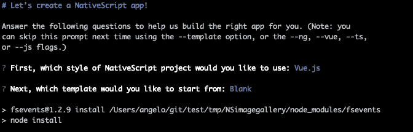
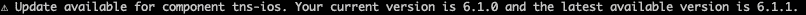
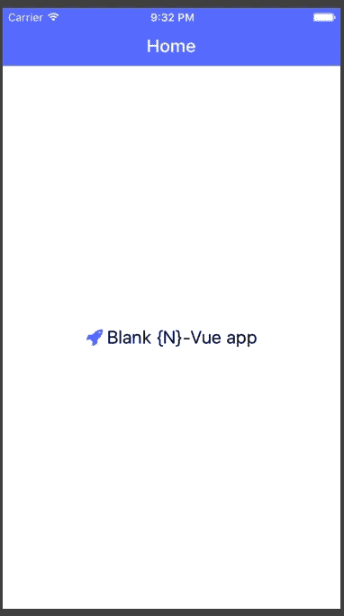
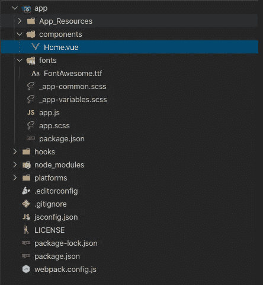
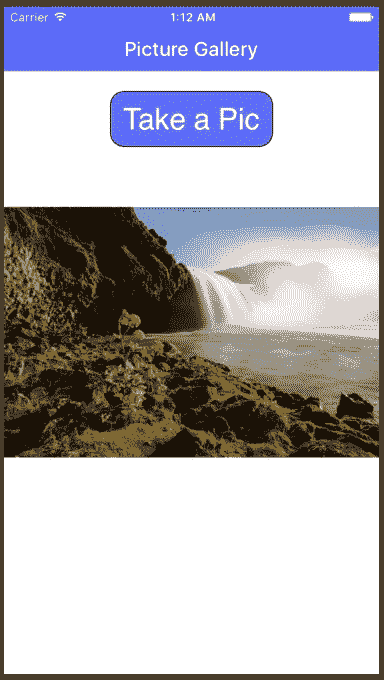
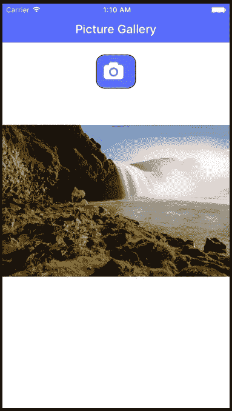
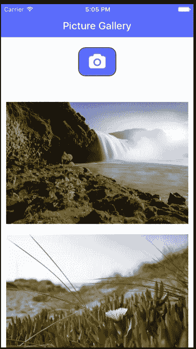
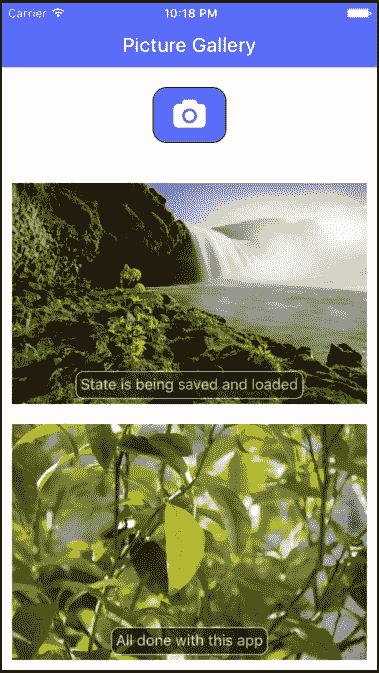

# 使用 Nativescript Vue 创建一个字体为 Awesome 的全状态相机图库应用程序

> 原文：<https://javascript.plainenglish.io/stateful-nativescript-vue-camera-gallery-app-with-font-awesome-37bd7d19c16?source=collection_archive---------6----------------------->

在这篇文章中，我将介绍如何使用 Nativescript 创建一个简单的应用程序，该应用程序使用设备摄像头拍摄照片，在一个简单的图像库中显示这些照片，使用字体很棒的图标，并在应用程序运行期间维护图库的状态。这是[上一篇文章](https://blog.angelengineering.com/stateful-picture-gallery/)的更新版本，但是现在使用的是带有 Vue 的 Nativescript 6.1.2，而不是 Javascript。

# 使用 Nativescript CLI 创建新应用程序

Nativescript 6.1.2 是最近发布的，我将在帖子中使用这个版本。我使用以下命令升级到最新版本的 CLI:

```
npm install -g nativescript
```

安装新的 CLI 后，我们将使用 Nativescript CLI 创建一个新的应用程序，执行 Nativescript CLI 诊断检查，然后在 iOS 模拟器中运行基本应用程序，以确保一切正常工作。我们将开始使用下面的命令设置一个名为`NSimagallery6`的新应用程序。

```
tns create NSimagegallery6
```

CLI 将询问您希望使用哪种语言风格，以及使用哪种模板结构来构建您的新应用程序。选择“Vue.js”作为样式，“Blank”作为模板。



一旦搭建完成，您可以切换到该目录，添加 iOS 平台，然后使用`tns doctor` CLI 命令确保您的 Nativescript 应用程序环境正常。

```
cd NSimagegallery6 
tns platform add ios
tns doctor 
```

下载的模板可能会针对稍微旧一点的 Nativescript 平台版本，所以在运行`tns doctor`后，您可能会看到如下警告。



使用 Nativescript CLI 更新移动平台版本可以通过使用以下命令移除平台并将其重新添加到项目中来完成。CLI 将使用当前平台版本更新 package.json 文件。或者，您也可以手动编辑`package.json`中的包版本。

```
tns platform remove ios 
tns platform add ios
```

使用以下工具在模拟器或设备上运行应用程序:

如果一切运行正常，您应该会在 iPhone 模拟器上看到以下屏幕。



接下来，查看新创建的应用程序的文件夹结构，您会看到以下内容:



这个新版本的 Vue Blank 应用程序模板的一个主要区别是，它现在预配置为支持在 Nativescript 应用程序中使用字体很棒的图标。你会在`/app/fonts`文件夹中看到`FontAwesome.ttf`文件，它由`/app/app.scss`作为`/app/_app-common.scss`的导入加载，并通过一个名为`fa`的 CSS 类使用。模板应用程序使用字体牛逼图标显示在中心文本的开始。你可以在 Github 上的 [Nativescript 应用模板报告中找到其他(以及更新的)版本的应用模板。](https://github.com/NativeScript/nativescript-app-templates)

# 创建基本的相机应用程序

模板应用程序由一个显示 Vue 组件页面的页面组成，页面中央有一条简单的消息，作为主入口页面加载到`app/app.js`内的应用程序中。通过在初始导入代码后添加`Vue.config.silent = false;`,您可以在这个文件中启用来自 Vue 解释器的更详细的调试消息。我们希望我们的应用程序的第一个版本是一个单独的页面，显示一个拍照按钮和一个显示应用程序拍摄的最后一张照片的图像字段，所以我们将使用现有的模板结构，并替换应用程序主页的内容。

首先，使用以下 CLI 命令安装 [Nativescript 相机插件](https://github.com/NativeScript/nativescript-camera)，这将允许我们访问设备相机来拍照。

```
tns plugin add nativescript-camera
```

我们现在将把`/app/components/Home.vue`中的主页组件修改为:

```
<template>
    <Page class="page">
        <ActionBar class="action-bar">
            <Label class="action-bar-title" text="Picture Gallery"></Label>
        </ActionBar>
        <StackLayout>
            <Label text="Take a Pic" [@tap](http://twitter.com/tap)="takePicture" class="take-picture-icon" />
            <Image :src="cameraImage" class="picture-gallery" stretch="aspectFit" />
        </StackLayout>
    </Page>
</template><script>
const cameraModule = require("nativescript-camera");
export default {
    computed: {
    },
    data() {
        return {
            cameraImage: null
        };
    },
    methods: {
        takePicture() {
            let that = this;
            cameraModule
                .takePicture({
                    width: 300,  //these are in device independent pixels
                    height: 300, //only one will be respected depending on os/device if
                    keepAspectRatio: true, //    keepAspectRatio is enabled.
                    saveToGallery: false //Don't save a copy in local gallery, ignored by some Android devices
                })
                .then(imageAsset => {
                    that.cameraImage = imageAsset
                })
        }
    },
    mounted() {
        cameraModule.requestPermissions().then( //request permissions for camera
            success => { //have permissions  
            },
            failure => { //no permissions for camera
            }
        )
    }
}
</script><style scoped lang="scss">
.take-picture-icon {
    horizontal-align: center;
    background-color: rgb(105, 105, 241);
    padding: 12;
    border-width: 1.2;
    border-color: black;
    border-radius: 14;
    margin-top: 20;
    color: white;
    font-size: 30;
}
.picture-gallery {
    margin-top: 60;
}
</style>
```

我们已经从 Vue 模板中删除了示例消息，并添加了一个行为和外观都像按钮的标签，以及一个将显示相机拍摄的最后一张照片的图像元素。代码部分内部是`takePicture()`函数，它调用 Nativescript Camera 插件在点击按钮时拍照，然后将该图片设置为按钮下方显示的图像源。页面加载后运行`mounted()`函数，调用 Camera 插件中的`requestPermissions()`来获得应用程序访问设备摄像头的本地权限(当使用 iOS 模拟器选择设备图像时，还会访问照片库，因为模拟器没有摄像头)。

使用`tns run ios`在 iOS 模拟器上运行应用程序，点击“拍照”按钮，从模拟器图库中选择一张图片，您应该会看到类似于以下内容的内容:



# Android 和 iOS 版本的相机权限

除了本地权限之外，您还需要为构建过程添加一些额外的权限，以允许摄像机访问。对于 iOS，编辑“App/App _ Resources/iOS/info . plist”并添加以下键:

```
<key>NSPhotoLibraryUsageDescription</key>
<string>To access saved pictures</string>
<key>NSCameraUsageDescription</key>
<string>To take new pictures</string>
```

对于 Android，编辑“App/App _ Resources/Android/Android manifest . XML”并添加以下权限:

```
<uses-permission android:name="android.permission.CAMERA"/>
```

# 在 Nativescript 中使用字体超赞图标

除了使用文本作为图片按钮，你还可以使用字体很棒的图标。Font Awesome 库可用于在您的 Nativescript 应用程序中注入可缩放的图标，让您不必再为设计自己的图像和 Android 和 iOS 上所有可能的屏幕尺寸所需的多分辨率版本而头疼。它们在 Nativescript 应用程序中也非常容易使用，特别是因为空白应用程序模板附带了已经设置好的字体文件和 css 类。

当你想使用一个特定的图标时，你必须首先[查找图标](https://fontawesome.com/icons?d=gallery&q=camera&m=free)的 unicode 值。对于这个应用程序，我将使用[固体相机图标](https://fontawesome.com/icons/camera-retro?style=solid)，因为常规和轻型版本仅作为 Font Awesome Pro 包的一部分提供。在信息页面上，您会看到这个特定图标的 unicode 编码，即`f030`。每当你想在应用程序中使用图标时，记下代码，然后使用格式化为`&#xf030;`的 unicode 作为标签的`text.decode`值，并分配`fa`类。

让我们用这个图标更新我们的应用程序，将标签从`<Label text="Take a Pic" @tap="takePicture" class="take-picture-icon" />`改为`<Label text.decode="&#xf030; " @tap="takePicture" class="take-picture-icon fa" />`。

保存并重新运行应用程序，它现在应该看起来像:



# 显示多张图片

现在让我们让这个应用程序更有用，我们将使用一个简单的图片库来显示到目前为止拍摄的所有照片，而不是只显示最后拍摄的照片。我们将在 Image 元素上使用 Vue `v-for`指令，并将其嵌套在 StackLayout 中，以呈现相机拍摄的所有图片，这些图片现在将存储在一个数组中。这将嵌套在一个 ScrollView 容器中，这样我们就可以上下滚动图像。

编辑`/app/components/Home.vue`，使其包含:

```
<template>
    <Page class="page">
        <ActionBar class="action-bar">
            <Label class="action-bar-title" text="Picture Gallery"></Label>
        </ActionBar>
        <StackLayout>
            <Label text.decode="&#xf030; " [@tap](http://twitter.com/tap)="takePicture" class="take-picture-icon fa" />
            <ScrollView class="picture-gallery" orientation="vertical">
                <StackLayout>
                    <Image v-for="image in arrayPictures" class="gallery-item" :src="image" stretch="aspectFill" />
                </StackLayout>
            </ScrollView>

        </StackLayout>
    </Page>
</template><script>
const cameraModule = require("nativescript-camera");
export default {
    computed: {},
    data() {
        return {
            arrayPictures: []
        };
    },
    methods: {
        takePicture() {
            let that = this;
            cameraModule
                .takePicture({
                    width: 300, //these are in device independent pixels
                    height: 300, //only one will be respected depending on os/device if
                    keepAspectRatio: true, //    keepAspectRatio is enabled.
                    saveToGallery: false //Don't save a copy in local gallery, ignored by some Android devices
                })
                .then(imageAsset => {
                    that.arrayPictures.unshift(imageAsset)
                })
        }
    },
    mounted() {
        cameraModule.requestPermissions().then( //request permissions for camera
            success => { //have permissions  
            },
            failure => { //no permissions for camera
            }
        )
    }
}
</script><style scoped lang="scss">
.take-picture-icon {
    horizontal-align: center;
    background-color: rgb(105, 105, 241);
    padding: 12;
    border-width: 1.2;
    border-color: black;
    border-radius: 14;
    margin-top: 20;
    margin-bottom: 20;
    color: white;
    font-size: 30;
    padding-left: 20;
}.picture-gallery {
    margin-top: 20;
}.gallery-item {
    margin: 10;
}
</style
```

`takePicture()`功能现在将保存在`arrayPictures`数组中拍摄的每张照片(使用`unshift`而不是`push`来首先显示最新的照片)。Nativescript Vue 现在将在按钮下方的可滚动区域中为数组的每个元素呈现一个图像。

运行应用程序，拍摄两张或更多照片，你会看到每张照片垂直显示在一个可滚动区域，类似于下面的截图。



# 添加注释和删除的详细信息页面

到目前为止，我们已经有了一个简单的带有图片库的相机应用程序，但它有点基础。让我们通过添加一个新的详细信息页面来使它更有用，以便在点击图库项目时全屏查看图像。在这个新页面上，我们将添加对每张图片进行注释的支持(注释显示在每个图库图片的顶部)，以及一个从图库中删除图片的按钮。

首先，通过将`/app/components/Home.vue`中的图像标签(`<Image v-for="image in arrayPictures" class="gallery-item" :src="image" stretch="aspectFill"/>`)替换为:

```
<GridLayout cols="*" rows="*" [@tap](http://twitter.com/tap)="tapPicture" v-for="image in arrayPictures">
    <Image class="gallery-item" col="0" row="0" :src="image" stretch="aspectFill" />
    <StackLayout :visibility="image.note&&(image.note.length>0)  ? 'visible' : 'hidden'" col="0" row="0" class="note-picture-wrapper">
        <Label textWrap="true" verticalAlignement="bottom" :text="image.note" class="note-picture-text"></Label>
    </StackLayout>
</GridLayout>
```

GridLayout 用于在图像上覆盖一个标签，方法是将它们放在同一行和同一列。标签嵌套在 StackLayout 中，以允许对其进行样式化，从而文本区域可以是阴影和半透明的。标签中的`v-if`语句确保只有在该图片有任何文本的情况下才显示这个阴影覆盖。我们需要在新标签的`/app/components/Home.vue`底部添加一些新的样式类:

```
.note-picture-wrapper {
  background-color: #1a1919;
  opacity: 0.7;
  border-width: 1;
  border-radius: 8;
  color: #ffffff;
  border-color: #ffffff;
  margin: 15;
  vertical-align: bottom;
  horizontal-align: center;
}
.note-picture-text {
  font-size: 15;
  vertical-align: center;
  horizontal-align: center;
  padding: 4;
}
```

现在我们将添加新的`tapPicture()`函数，并更新`takePicture()`函数，为每个图像分配一个惟一的 id(设置为当前的 Unix 时间戳，并用作`v-for`指令中的键)，并初始化一个与每个图像相关联的空注释字符串。将`methods:{}`部分改为:

```
 methods: {
        tapPicture(image) {
            let navContextObj = {
                image: image,
                arrayPictures: this.arrayPictures
            };
            this.$navigateTo(ImageDetails, {
                animated: true,
                transition: {
                    name: "slideLeft",
                    curve: "easeInOut",
                    duration: 100
                },
                props: { navObject: navContextObj }
            });
        },
        takePicture() {
            let that = this;
            cameraModule
                .takePicture({
                    width: 300, //these are in device independent pixels
                    height: 300, //only one will be respected depending on os/device if
                    keepAspectRatio: true, //    keepAspectRatio is enabled.
                    saveToGallery: false //Don't save a copy in local gallery, ignored by some Android devices
                })
                .then(imageAsset => {
                    imageAsset.note = ''
                    imageAsset.id = new Date().getTime()
                    that.arrayPictures.unshift(imageAsset)
                })
        }
    },
```

`tapPicture`功能将导航到一个新页面(`/app/components/ImageDetails.vue`)，并将点击的图像和图像库数组作为道具传递。将它们作为对象的成员传递可以确保传递对原始图像数组的引用，以便在详细信息页面中使用。让我们创建并编辑该文件，使其包含:

```
<template>
    <Page class="page" ref="page" actionBarHidden="false" backgroundSpanUnderStatusBar="true">

        <ActionBar class="action-bar" title="Picture Details">
            <NavigationButton text="Done" android.systemIcon="ic_menu_back" [@tap](http://twitter.com/tap)="$navigateBack()" />
            <Label class="action-bar-title" text="Picture Details"></Label>
        </ActionBar>
        <ScrollView orientation="vertical">
            <StackLayout>
                <Image class="picture-full" stretch="aspectFit" :src="navObject.image" />
                <GridLayout columns="*,*" rows="60,30,*,300">
                    <StackLayout col="1" row="0" class="delete-picture-icon-wrapper" [@tap](http://twitter.com/tap)="deletePicture">
                        <Label verticalAlignement="bottom" text="delete" class="delete-picture-icon"></Label>
                    </StackLayout>
                    <Label col="0" colSpan="2" row="1" text="Note:" class="section-label" />
                    <TextView col="0" colSpan="2" row="2" class="text-picture" hint="Add a note for this picture here" editable="true" v-model="navObject.image.note" />
                    <Label col="0" colSpan="2" row="3" text="" />
                </GridLayout>
            </StackLayout>
        </ScrollView>
    </Page>
</template><script>
export default {
    name: "image-details-page",
    data() {
        return {};
    },
    props: {
        navObject: {
            type: Object
        },
    },
    components: {},
    computed: {},
    created() {},
    mounted() {},
    methods: {
        deletePicture() {
            let pictureIndex = this.navObject.arrayPictures.indexOf(this.navObject.image);
            this.navObject.arrayPictures.splice(pictureIndex, 1);
            this.$navigateBack()
        }
    }
};
</script><style scoped>
.delete-picture-icon {
    font-size: 15;
    vertical-align: center;
    horizontal-align: center;
}.delete-picture-icon-wrapper {
    background-color: #000000;
    border-width: 1;
    border-radius: 8;
    color: #ffffff;
    border-color: #ffffff;
    margin: 15;
    vertical-align: center;
    horizontal-align: right;
    height: 30;
    width: 60;
}.text-picture {
    border-width: 1;
    border-style: solid;
    border-color: #01060c;
    height: 80;
    background-color: rgb(235, 233, 233);
}.section-label {
    background-color: #292b2b;
    border-width: 1;
    border-style: solid;
    border-color: #01060c;
    color: white;
    padding-left: 10;
    padding-top: 5;
    padding-bottom: 5;
}.picture-full {
    border-width: 1;
    border-color: gray;
}
</style>
```

查看顶部的 XML，您会看到 ActionBar 元素类似于主页，但是我们现在添加了一个 NavigationButton，让用户导航回第一页。在它下面，我们显示了在第一页上点击的图像、一个删除按钮和一个文本区域，以便用户可以为所选图像输入注释(绑定到图像对象的注释变量)。底部的额外标签 GridLayout 分配的高度为 300，用于在更改图像注释文本时屏幕键盘弹出时提供一些缓冲空间。`deletePicture()`函数是该页面上唯一的方法，它在导航回主页之前从图像库数组中移除当前图像。

# 维护图像库状态

现在，我们有了一个功能强大的图片库应用程序，允许我们从相机中添加新图片，给它们添加注释，以及删除图像。现在最大的问题是，当我们关闭应用程序并重新打开它时，所有的图像和它们的注释都将消失。我们使这成为一个有用的应用程序的最后一步是在应用程序运行期间维护图像及其相关注释的状态。[native script application settings 模块](https://docs.nativescript.org/ns-framework-modules/application-settings)允许我们从应用的本地存储中保存和加载文本数据，因此我们可以使用它来维护应用运行期间的状态。为了将它用于此图片库，我们需要开始将图片保存为设备上的文件，因为我们无法使用此模块轻松存储二进制数据。相反，我们将使用这个模块来存储一个有状态的文件名和注释数组，每当发生更改时都会更新，并在下次运行应用程序时重新加载。

我们将使用更多的库模块，所以将以下内容添加到`/app/components/Home.vue`中代码部分的顶部:

```
const applicationSettings = require("application-settings"); 
const fsModule = require("tns-core-modules/file-system"); 
const imageSourceModule = require("tns-core-modules/image-source");
```

`applicationSettings`将用于[保存和加载设备上的应用状态](https://docs.nativescript.org/ns-framework-modules/application-settings)。`fsModule`与`imageSourceModule`配合使用时将用于[将图片保存并加载到本地设备存储器](https://docs.nativescript.org/ns-framework-modules/file-system)，本地设备存储器用于[处理图像](https://docs.nativescript.org/ns-framework-modules/image-source)。

修改`takePicture()`方法，使其包含以下内容:

```
 takePicture() {
            let that = this;
            cameraModule
                .takePicture({
                    width: 300, //these are in device independent pixels
                    height: 300, //only one will be respected depending on os/device if
                    keepAspectRatio: true, //    keepAspectRatio is enabled.
                    saveToGallery: false //Don't save a copy in local gallery, ignored by some Android devices
                })
                .then(imageAsset => {
                    imageSourceModule.fromAsset(imageAsset).then(
                        savedImage => {
                            let filename = "image" + "-" + new Date().getTime() + ".png";
                            let folder = fsModule.knownFolders.documents();
                            let path = fsModule.path.join(folder.path, filename);
                            savedImage.saveToFile(path, "png");
                            var loadedImage = imageSourceModule.fromFile(path);
                            loadedImage.filename = filename;
                            loadedImage.note = "";
                            that.arrayPictures.unshift(loadedImage);
                            that.storeData();
                        },
                        err => {
                            console.log("Failed to load from asset");
                        }
                    );
                })
        },
```

我们还需要一些新的方法来加载和保存当前的图片库状态。将以下功能添加到`methods:{}`部分

```
 storeData() {
            let localArr = [];
            this.arrayPictures.forEach(entry => {
                localArr.push({ note: entry.note, filename: entry.filename });
            })
            applicationSettings.setString("localdata", JSON.stringify(localArr));
        },
        loadData() {
            let strData = applicationSettings.getString("localdata");
            console.log(strData)
            if (strData && strData.length) {
                let localArr = JSON.parse(strData);
                localArr.forEach(entry => {
                    const folder = fsModule.knownFolders.documents();
                    const path = fsModule.path.join(folder.path, entry.filename);
                    var loadedImage = imageSourceModule.fromFile(path);
                    loadedImage.filename = entry.filename;
                    loadedImage.note = entry.note;
                    this.arrayPictures.unshift(loadedImage);
                })
            }
        },
```

拍照后，我们现在将图片作为图像文件保存到应用程序的本地设备存储中，并使用从保存的图像中加载的图像资产。每当添加或删除图片时，我们都会调用新函数`storeData`将图像注释和文件名数组保存到本地存储。

当使用`deletePicture`从图库中移除图像时，或者当它们的注释发生变化时，我们需要更新保存的状态。我们可以通过在从详细信息页面返回之前更新状态来处理这两个问题。我们将使用细节页面上的`beforeDestroy` Vue 生命周期挂钩来调用我们的`storeData`函数。因为该函数是在主页上定义的，所以我们还需要传递对该函数的引用，作为导航上下文的一部分。将以下内容添加到`/app/components/ImageDetails.vue`中的`export default {`

```
beforeDestroy() { 
    this.navObject.storeData() 
},
```

我们将通过修改`/app/components/Home.vue`中的`tapPicture`来传递这个函数引用，作为主页导航上下文的一部分:

```
let navContextObj = { 
    image: image, arrayPictures: this.arrayPictures, storeData:this.storeData 
};
```

每当用户离开详细信息页面时都会运行这个钩子，因此在返回到主页之前，对图像注释的任何更改或图像的任何删除都会保存到 state 中。



# 搞定了。

这个帖子到此为止。如果你想下载最终的源文件，你可以在 [Github](https://github.com/drangelod/nsimagegallery6) 上找到它们。

*原载于 2019 年 11 月 1 日*[*https://blog.angelengineering.com*](https://blog.angelengineering.com/nativescript6-picture-gallery/)*。*