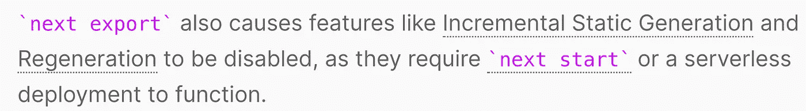
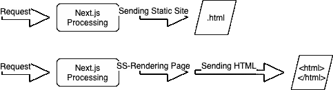

# Next.js 中的静态再生是什么？

> 原文：<https://javascript.plainenglish.io/static-regeneration-next-js-fca80134991a?source=collection_archive---------4----------------------->

## 静态页面和服务器端呈现相结合

Source: The Author

Next.js 目前版本为 9.5。随着最近一次重大更新，有一个特性尤其吸引了很多关注:**静态再生**，它现在是 Next.js 不可或缺的一部分

# 静态再生是什么意思？

如果你只是想看一个代码示例，并且已经理解了这个原理是如何工作的，你可以跳过这一部分。

顾名思义，它是关于重新生成静态交付的页面。与交付的静态页面相反的是服务器端呈现——在用户请求后显示给用户的内容尚未生成的过程。

服务器端呈现的一个很好的例子是新闻页面。当用户请求页面时，服务器在后台从数据库中检索最新的条目，组装一个 HTML 结构，然后进行回复。

从逻辑上讲，这个过程比简单地一遍又一遍地发送同一个 HTML 文件更耗费时间和性能。

静态页面的缺点是不能动态改变。

Next.j 的新特性叫做静态再生，结合了两者的优点。我们发布静态页面，但在某些情况下，我们会重新生成它们，从数据库或 API 获取最新数据。

**重要提示:**静态再生不适用于 Next.js 的静态导出。

Source: [nextjs.org](https://nextjs.org/docs/advanced-features/static-html-export)

理解这一点很重要。当您对 Next.js 使用静态导出时，您必须将`next export`添加到 package.json 中，静态页面会生成一次并存储在*/out*-目录中。

因为页面是完全静态的，所以页面可以托管在几乎任何 web 服务器上。

**另一方面，静态再生**通过我们 Next.js 应用程序的经典构建版本工作。我们仍然需要启动服务器，然后它会自动将我们的应用程序作为静态页面发送，所以在后台，页面会作为 HTML 文件发送。

Static vs. active SSR (below)

对于静态重新生成，我们仍然需要下一个服务器，因为它必须重新生成页面。

让我们看一下代码，然后我们理解其余的部分。

# 代码示例

在本例中，我们有一个 Node.js API，它返回 Date.now()，这是当前时间(自 1970 年 1 月 1 日以来以毫秒为单位)。因此，如果我们发出第一个请求，两秒钟后又发出另一个请求，我们会得到两个不同的响应。

Next.js 应用程序将获取这个 API，然后从 API 输出 Date.now()。我决定使用 Date.now()，因为这样我们可以监控我们的静态页面是否真的定期更新。

让我们将这一切付诸实践:

1.  为项目创建一个新目录。
2.  `npm init -y` & `npm install express react react-dom cors next`
3.  创建一个名为 *pages* 的文件夹。这里我们将保存 Next.js 应用程序。在项目文件夹的根目录下，我们可以创建一个 *server.js* 。
4.  在 pages 文件夹中，我们创建一个 *index.js* ，即登陆页面，它应该由 Next.js 交付。
5.  之后必须对 *package.json* 进行调整，这样我们才能运行我们的应用程序。添加以下代码:

**server.js:**

**注意:**CORS 中间件只确保我们不会遇到 CORS 问题。

pages 文件夹中的 **index.js** :

呈现的是 app 组件，它作为函数存储在下面。为了让静态再生工作，我们需要 getStaticProps 函数。重要的是，它也必须出口。
该函数自动执行，查询我们的 API，然后将响应作为道具传递给我们的应用程序。

指定页面应该以 10 秒的间隔静态重新生成——这就是神奇之处。

现在我们应该运行 Node.js API 服务器。然后我们可以执行`npm run build`和`npm start`。这将启动我们的 Next.js 应用程序的生产版本。

**重要提示:**在生成的时候，API 必须和`npm run build`一起运行——毕竟，它必须被应用程序获取。但是如果在那之后 API 再次不可达，那也没什么大不了的。如果 Next.js 不能重新生成 API，它将会以先前的状态交付——因此总会有一个后备，即先前生成的静态页面。

我们设置的时间间隔并不意味着每 x 秒静态生成一次页面。这将非常耗时，而且通常没有帮助，因为我们的页面不需要每隔几秒钟就被调用一次。

下面是它的详细工作原理。例如，我们取 10 秒的间隔。

*   通过`npm run build`,我们生成了 Next.js 应用程序的生产版本。在这个过程中，我们获取 API——它必须可用。
*   从现在开始倒计时。如果用户在上线大约 5 秒后调用页面，应用程序将提供一个静态页面，显示构建过程的状态。
*   如果用户在上线 15 秒后调用应用程序，Next.js 会注意到必须执行重新生成。
    然后再次提取 API 并交付当前状态。

它也不是客户端缓存。如果您硬重新加载页面并且当前在 10 秒的时间范围内，输出不会改变。只有在 10 秒后刷新，并且距离上次重建已经过去了更长时间，您才会看到以秒为单位的新时间。

# 静态再生什么时候有用？

当然，此过程中的决定性因素是，不一定要交付所有最新的数据。然而，通过重新验证，可以自由定义间隔。
该程序对于不需要提供最新数据的站点非常有用。将 revalidate 设置为 1 当然也没有用——然后我们又有了经典的服务器端呈现。

对于一个博客来说，我觉得静态再生是一个合适的方法。它提供了静态页面的速度，并且您不必向用户发送大量的 JavaScript 代码来更新界面。

[**加入我的简讯获取更新**](http://eepurl.com/hacY0v)