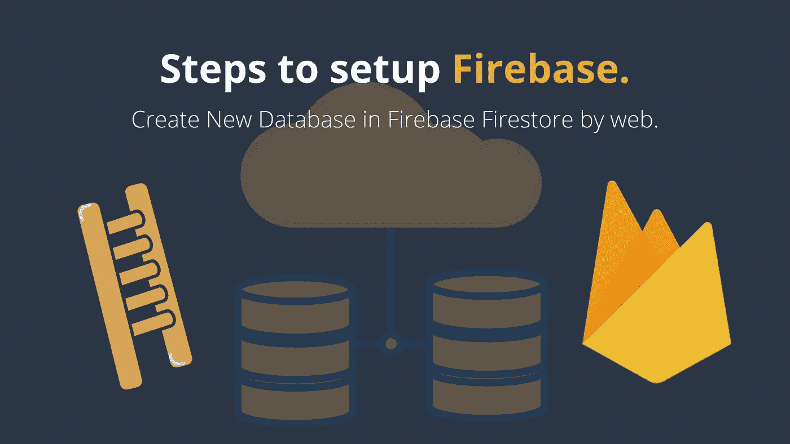

# 设置 Firestore 数据库简介

> 原文：<https://javascript.plainenglish.io/steps-to-setup-firebase-firestore-instruction-to-setup-firebase-firestore-database-c7cc49ce96de?source=collection_archive---------1----------------------->



Firebase 数据库/托管非常容易使用，而且它是免费的，并提供许多好处，包括快速响应时间(感谢 CDN)，默认启用 HTTPS，支持 HTTP2 推送。

请跟我来，我将向您展示如何创建和部署我们的项目到新的 Firebase 帐户。

# 首先，我们需要一个 Firebase 项目。

跟着这些👇从[视频](https://youtu.be/S1zLRHqGkOA)到创建和设置[新 Firebase 项目](https://console.firebase.google.com/)的步骤。

好吧，我假设你已经按照视频中的每个步骤创建了 Firebase 项目。

> 如果有任何不适合你的地方，请在下面的评论框中评论！我很乐意帮忙:)

# 到目前为止，我们已经做到了:

1.  打开谷歌搜索:“Firebase 控制台”。
2.  使用 Gmail 帐户登录。
3.  创建新项目。
4.  在新项目中创建 Web 应用程序。
5.  安装 Firebase CLI。
    (确保在你的项目根目录下运行下面的命令)
    👉`npm install -g firebase-tools`
6.  请登录 Firebase。
    (确保在你的项目根目录下运行下面的命令)
    👉`firebase login`
7.  在项目目录中初始化 Firebase。
    (确保在你的项目根目录下运行下面的命令)
    👉`firebase init`
    (该命令会生成一个`firebase.json`配置文件，供我们调整部署细节)

# #2 更新 firebase.json 文件。

在我们的项目根目录中，确保我们的`firebase.json`文件看起来像下面的 JSON 文件。转到您的项目根目录并检查`my-project/firebase.json`

(如果没有，只需复制下面的代码👇并替换为您的“firebase.json”文件)。
不要忘记更改`target and public.`的` **YourProjectName`** 值

## 对于 Angular 项目(firebase.json)

```
{
  "hosting": [
    {
      "target": "**YourProjectName**",
      "public": "dist/**YourProjectFolderName**",
      "ignore": [
        "firebase.json",
        "**/.*",
        "**/node_modules/**"
      ],
      "rewrites": [
        {
          "source": "**",
          "destination": "/index.html"
        }
      ]
    }
  ]
}
```

## 对于 Ionic 项目(firebase.json)

```
{
  "hosting": [
    {
      "public": "www",
      "ignore": [
        "firebase.json",
        "**/.*",
        "**/node_modules/**"
      ],
      "headers": [
        {
          "source": "/build/app/**",
          "headers": [
            {
              "key": "Cache-Control",
              "value": "public, max-age=31536000"
            }
          ]
        },
        {
          "source": "sw.js",
          "headers": [
            {
              "key": "Cache-Control",
              "value": "no-cache"
            }
          ]
        }
      ]
    }
  ]
}
```

# 搞定了。🤩设置 Firebase 就是这么简单。

再见👋👋

# 接下来，您可以涵盖:

1.  如何使用 Firestore 在 Firebase 中进行 [CRUD 操作？点击这里👆](https://medium.com/@AnkitMaheshwariIn/how-to-do-crud-query-operations-in-firebase-with-firestore-angular-ionic-web-cfd662165fd7))
2.  [使用 AngularFire 将 Firebase 认证](https://medium.com/@AnkitMaheshwariIn/how-to-add-firebase-authentication-to-pwa-or-angular-project-using-angularfire-83a8f61d367c)添加到 PWA 或 Angular 项目。([点击这里👆](https://medium.com/@AnkitMaheshwariIn/how-to-add-firebase-authentication-to-pwa-or-angular-project-using-angularfire-83a8f61d367c))
3.  [部署项目](https://medium.com/@AnkitMaheshwariIn/deploy-project-to-firebase-hosting-ce6acbd06435)到 Firebase 托管。([点击这里👆](https://medium.com/@AnkitMaheshwariIn/deploy-project-to-firebase-hosting-ce6acbd06435))

> 请在评论框中随意评论…如果我错过了什么，或者什么是不正确的，或者什么对你不起作用:)
> 
> 更多文章敬请关注:
> [https://medium.com/@AnkitMaheshwariIn](https://medium.com/@AnkitMaheshwariIn)

如果你不介意给它一些掌声👏 👏既然有帮助，我会非常感谢:)帮助别人找到这篇文章，所以它可以帮助他们！

永远鼓掌…


*原载于 2019 年 12 月 24 日*[*https://www.codewithchintan.com*](https://www.codewithchintan.com/steps-to-setup-firebase-create-new-database-in-firebase-firestore-by-web/)*。*