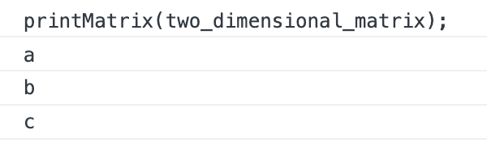
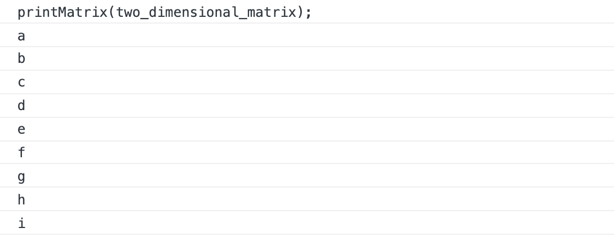

# 停止在 JavaScript 中做这些

> 原文：<https://javascript.plainenglish.io/stop-doing-these-this-in-javascript-fd4be22f7a85?source=collection_archive---------0----------------------->

## 成为更好的开发人员的一些技巧


Photo by [Markus Spiske](https://unsplash.com/@markusspiske?utm_source=medium&utm_medium=referral) on [Unsplash](https://unsplash.com?utm_source=medium&utm_medium=referral)

在我职业生涯的初期，每当我使用 JavaScript 时，我总是怀疑我写代码的方式是否正确。因为，在任何编程语言中，都没有一种正确的工作方式。然而，一个人必须永远记住那些不应该做的事情。所以，这里有一个精选的清单，列出了 JavaScript 中不应该做的事情，我想分享一下。

# 1.避免使用`var`

当你试图声明一个变量时，总是使用`let`或`const`。如果你有一个不需要改变的变量，那么最好使用`const`。你可以问，*为什么不用* `*var*` *？*这是因为 **ES6** 给了我们`let`，它为我们提供了块作用域，这将避免使用`var`时会出现的许多问题——这是函数作用域。由于是函数作用域，它很容易被覆盖。

考虑下面的例子，我们试图打印一个二维矩阵。请注意声明循环变量 I:

## 使用 var:

```
function printMatrix (matrix) {
  for (var i = 0; i < matrix.length; i++) {
    var line = matrix[i];
    for (var i = 0; i < line.length; i++) {
      var element = line[i];
      console.log(element);
    }
  }
}var two_dimensional_matrix = [['a', 'b', 'c'], ['d', 'e', 'f'], ['g', 'h', 'i']];printMatrix(two_dimensional_matrix);
```



Output using var

## 使用 let 和 const:

```
function printMatrix (matrix) {
  for (let i = 0; i < matrix.length; i++) {
    let line = matrix[i];
    for (let i = 0; i < line.length; i++) {
      let element = line[i];
      console.log(element);
    }
  }
}const two_dimensional_matrix = [['a', 'b', 'c'], ['d', 'e', 'f'],['g', 'h', 'i']];printMatrix(two_dimensional_matrix);
```



Output using let and const

要了解 const，let 和 var 是如何工作的，查看我的文章[这里](https://codeburst.io/using-var-let-and-const-appropriately-in-js-2dab2086e962)。

# 2.停止使用`==`

最好总是使用强类型检查`===`而不是弱类型检查`==`。考虑下面的例子:

```
1 == true // true
1 === true // false
1 == “1” // true
1 === “1” // false
```

# 3.不要使用无意义的变量名

这是一条适用于任何编程语言的严格规则。为变量取一个有意义的名字有助于我们写出更好更干净的代码。这也有助于其他开发人员轻松理解代码。不要在变量名中添加不必要的单词，保持简短，并确保它代表上下文。

# 4.不要把一个功能和多个功能混在一起

永远记住模块化——一个功能一次只能完成一项任务。此外，命名与该任务相匹配的函数。这不仅仅适用于 JavaScript，对于所有编程语言都是如此。编写一个只做一项工作的函数也有助于我们遵循 **DRY(不要重复自己)**。也就是说，当该方法不执行太多复杂的功能并且仅仅执行一个任务时，该方法的可重用性增加。为了可读性和效率，任何函数都不应该做很多事情。

*例子:*

```
/** DONT DO THIS **/
function table (columns, rows, item){
  //creates table and searches it for the passed item
} /** BETTER WAY **/function createTable (columns, rows){
  //creates table
}function searchTable (table, item) {
  //searches table for the passed item
}
```

# 5.避免大量嵌套

嵌套代码解释了它的逻辑，使它更容易阅读。然而，把它嵌套得太远也会让你很难理解你想做什么。您的代码的读者不应该水平滚动，或者当他们的代码编辑器换行时感到困惑。

嵌套的另一个问题是变量名和循环。因为您通常以`i`作为迭代器变量开始第一个循环，所以您将继续进行`j`、`k`、`l`等等。这会很快变得混乱。所以最好避免这些用例。

# **结论**

遵循 JavaScript 中的这些严格禁忌，成为一名优秀的开发人员。我希望这些能帮助您理解 JavaScript 中的一些好的实践。如果您知道 JavaScript 中还有一些不要的地方，请随意将它们作为评论分享。

谢谢你的阅读！