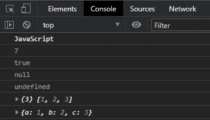
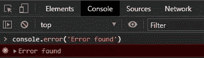
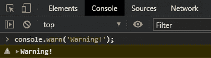
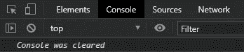
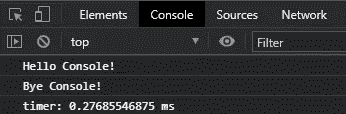
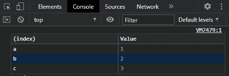
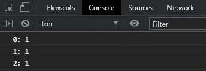
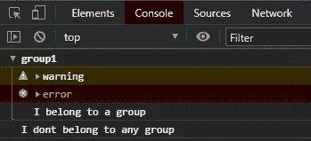
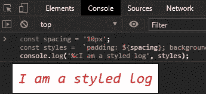

# 停止在 JavaScript 中使用 console.log()

> 原文：<https://javascript.plainenglish.io/stop-using-console-log-in-javascript-d29d6c24dc26?source=collection_archive---------0----------------------->

## 有更好的选择


Photo by [Hugo Rocha](https://unsplash.com/@hugorrocha?utm_source=medium&utm_medium=referral) on [Unsplash](https://unsplash.com?utm_source=medium&utm_medium=referral)

你是经常使用`console.log()`调试代码的 JavaScript 开发人员吗？这没有错。但是如果你没有意识到的话，那么`console` object 还有很多其他的方法是相当神奇的。在这篇文章中，我想解释这些方法的有效使用。

# 为什么使用控制台对象？

JavaScript 中的`console`对象提供了对浏览器调试控制台的访问，您可以在那里打印代码中使用的变量的值。通常，这可以用来调试代码中是否传递了正确的值。

我很确定我们大多数开发人员都使用过`console.log()`在我们的浏览器控制台中打印值。`log`只是`console`对象的一种方法。还有其他几种非常有用的方法。

# 1.console.log()

该方法主要用于将传递给它的值打印到控制台。在 log()中可以使用任何类型，可以是字符串、数组、对象、布尔值等。

## **例子**

```
console.log('JavaScript');
console.log(7);
console.log(true);
console.log(null);
console.log(undefined);
console.log([1, 2, 3]);
console.log({a: 1, b: 2, c: 3});
```



Output

# 2.console.error()

这个方法在测试代码时很有用。它用于将错误记录到浏览器控制台。默认情况下，错误消息将以红色突出显示。

## 例子

```
console.error('Error found');
```



Output

# 3.console.warn()

此方法也用于测试代码。通常，它有助于向控制台发出警告。默认情况下，警告消息将以黄色突出显示。

## 例子

```
console.warn('Warning!');
```



Output

# 4.console.clear()

此方法用于清除控制台。如果控制台被消息/错误堵塞，经常使用它。控制台将被清除，控制台上将打印一条消息*控制台被清除*。

## 例子

```
console.clear()
```



Output

# 5. **console.time()和 console.timeEnd()**

这两种方法相互结合使用。每当我们想知道一个块或一个函数花费的时间，我们可以使用`time()`和`timeEnd()`方法。这两个函数都将字符串作为参数。确保这两个函数使用相同的字符串来测量时间。

## 例子

```
console.time('timer'); const hello =  function(){
  console.log('Hello Console!');
}const bye = function(){
  console.log('Bye Console!');
}hello(); // calling hello();
bye(); // calling bye();console.timeEnd('timer');
```



Output

# 6.console.table()

该方法在控制台中生成一个表格，以提高可读性。将为数组或对象自动生成一个表。

## 例子

```
console.table({a: 1, b: 2, c: 3}); 
```



Output

# 7.console.count()

此方法用于计算函数通过此计数方法命中的次数。这可以在一个循环中用来检查一个特定的值被执行了多少次。

## 例子

```
for(let i=0; i<3; i++){
  console.count(i);
}
```



Output

# 8. **console.group()和 console.groupEnd()**

这些方法`group()`和`groupEnd()`允许我们将内容分组到一个单独的块中，该块将被缩进。就像`time()`和`timeEnd()`一样，他们也接受相同价值的标签。您可以展开和折叠该组。

## 例子

```
console.group('group1'); 
  console.warn('warning'); 
  console.error('error'); 
  console.log('I belong to a group'); 
console.groupEnd('group1'); 
console.log('I dont belong to any group');
```



Output

# 额外收获:打造日志风格

您也可以将 style 添加到控制台日志中，以使日志看起来更漂亮。这很简单。您只需要将 CSS 样式作为第二个参数添加到`log()`函数中，同时从 **%c** 开始第一个参数。样式将替换日志中的%c。

## 例子

```
const spacing = '10px'; 
const styles =  `padding: ${spacing}; background-color: white; color: red; font-style: italic; border: 1px solid black; font-size: 2em;`; 
console.log('%cI am a styled log', styles);
```



Output

# 结论

`console`对象对于开发人员调试代码非常有用。我们作为开发者经常只使用`log`功能。让我们开始充分利用控制台对象，以便更容易调试和生动地查看浏览器日志。我希望本文能有所帮助。

谢谢你的阅读！