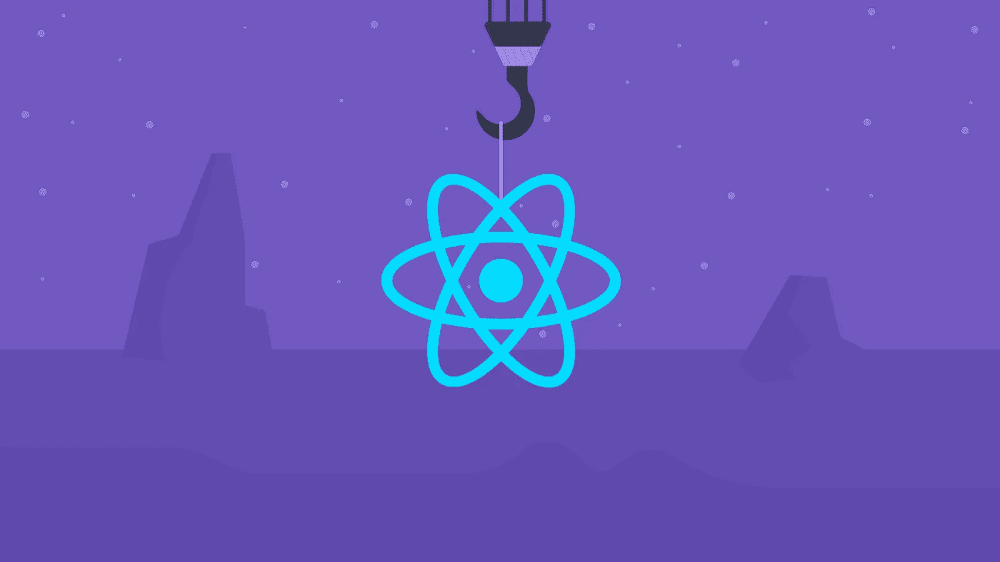

# 停止使用 React componentDidMount/Update

> 原文：<https://javascript.plainenglish.io/stop-using-react-componentdidmount-and-componentdidupdate-1b6a2d87830c?source=collection_archive---------5----------------------->



Blog Rocketseat — [https://blog.rocketseat.com.br/](https://blog.rocketseat.com.br/)

# React 库中有哪些钩子？

> 钩子是一组方法，让我们从功能组件中**获得**进入**反应**状态和生命周期特性，并更容易地在其他组件中重用它们。

React 团队相信，随着他们的最新发布，一些老问题已经不复存在，一些痛点可能最终会被消除。组件往往聚集了很多逻辑，有时似乎很难提取它们并在其他组件中重用它们。

让我们通过这些问题来理解他们的动机。

# 1.很难在组件之间重用有状态逻辑

在最近的版本中，功能组件似乎取代了旧的基于类的组件，钩子是主要原因。由于类组件有其适当的生命周期方法，使用功能组件给开发人员更多的灵活性来编写和重用他们的代码。因为生命周期方法由类组件拥有，所以它们不能在另一个组件中使用。

# 2.管理状态现在更简单了

让我们看一个基于类的组件的简单例子:

```
class Clock extends React.Component {
  constructor(props) {
    super(props);
    this.state = { date: new Date()}; 
  }

  render() {
    return (
      <div>
        <h1>Hello, world!</h1>
        <h2>It is {this.state.date.toLocaleTimeString()}.</h2>
      </div>
    );
  }
}
```

类组件使用构造函数方法声明初始设置，并使用超级方法声明组件的属性。现在，让我们来看看使用**使用状态**钩子的功能组件:

```
const Clock = (props) => {
    const [date, setDate] = useState({ date: new Date() }); return (
        <div>
            <h1>Hello, world!</h1>
            <h2>It is {date.toLocaleTimeString()}.</h2>
        </div>
    );
};
```

有了 **useState** hook 就更容易声明你需要什么，也更容易返回。

# 3.大型组件可能很难理解它们的逻辑

在我们的生活中，我们都有一个非常复杂的项目，它让我们的组件像杂草一样生长。问题是每个生命周期方法都有一部分所有的组件逻辑，例如，**componentdimount**有一些逻辑，而 **componentDidUpdate** 有另一部分逻辑，而**componentdimunmount**有其他部分的逻辑，但最终，它可能与某种 UI 动作中的同一部分逻辑相关。有了钩子，我们可以将那部分逻辑分解成函数，并根据需要多次重用。

现在我们确信 Hooks 是我们项目的更好的方法，让我们看看 **useEffect** hook 并理解为什么它可以帮助我们降低组件的复杂性。

我在前面的第三点中说过，在一个基于类的组件中，每一块逻辑都分布在每个生命周期方法之间。想象一下，我们正试图展示我们所宣称的状态。没有 **useEffect** 我们需要在同一段代码中使用**componentid mount**和**componentid update**。通过**使用效果**，我们可以避免:

```
function Toggle() {
    const [toggle, setToggle] = useState(false); useEffect(() => {
        console.log(`Toggle is ${toggle}`);
    }, []); return (
        <div onClick={() => setToggle(!toggle)}>
            {toggle &&
                <div>Show me or not!</div>
            }
        </div>
    );
}
```

这是使用 **componentDidUpdate** 的克隆，如果我们需要为 UI 提供一些更新，我们需要将那个 console.log 添加到那个生命周期方法中，这样我们就复制了代码。有了钩子，更新 UI 更加简单。通常情况下， **ComponentDidUpdate** 使用两个参数来检测是否发生了变化(例如:prevProps，prevState)，而不是使用一个参数的 **useEffect** 。在前面的例子中，您可以在 **useEffect** 中使用空方括号。如果您不需要更新 UI，您可以简单地删除它，但是如果您想要更新，只需将状态作为参数传递，React 将检测状态是否已更改并更新 UI。

# 结论

钩子的存在是为了简化我们的工作，我认为我们需要用这种新特性逐步更新我们的项目，不仅是为了维护或使用最新版本，也是为了简化我们的代码片段，减少产生 bug 的可能性。生命周期方法很快就会被否决，所以只要我们更新代码，我们的项目就会变得更好，但是当然需要先看看利弊，就像我们以前做的那样。

## **用简单英语写的 JavaScript 笔记**

我们已经推出了三种新的出版物！请关注我们的新出版物，表达对它们的爱:[](https://medium.com/ai-in-plain-english)**[**UX**](https://medium.com/ux-in-plain-english)[**Python**](https://medium.com/python-in-plain-english)**——谢谢，继续学习！****

****我们也一直有兴趣帮助推广高质量的内容。如果您有一篇文章想要提交给我们的任何出版物，请发送电子邮件至[**submissions @ plain English . io**](mailto:submissions@plainenglish.io)，并附上您的 Medium 用户名，我们会将您添加为作者。另外，请让我们知道您想加入哪个/哪些出版物。****