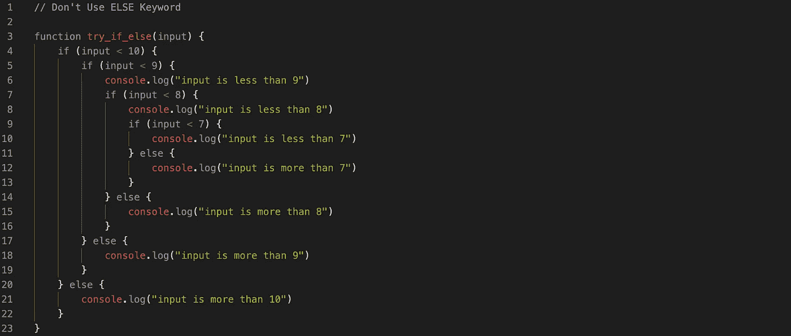

# 停止在代码中使用“else”关键字

> 原文：<https://javascript.plainenglish.io/stop-using-the-else-keyword-in-your-code-907e82b3054a?source=collection_archive---------0----------------------->

## [思维程序员](https://medium.com/tag/thought-programmer)

## 从今天开始，不要在 JavaScript 代码中使用它



don’t use else keyword

几乎每种编程语言都内置了关键字，简单的条件逻辑对任何人来说都很容易理解。如果你是程序员，你知道`else`关键字。但是如果你是一个优秀的程序员，就不要用这个关键词。我在开始时犯的最大错误之一是在写条件语句时过度使用 else 关键字。自从 5 年前，我就不再在我的程序中使用这个关键词了。让我解释一下！

# 为什么

想想还有什么意思，意思是“如果 A 那么这个，如果不是 A 那么那个；。如果 A 是二进制的，这不是问题——问题空间只有两种情况。但是如果 A 是二进制变量的组合，或者包含更大的变量，你的负问题空间会出乎意料的大，难以理解，测试和维护。避免 if/else if，只使用 if 语句，花时间确保 if 组的进入标准是互斥的，这样答案就不依赖于执行的顺序。

*   它促进了主执行通道，有一些特殊情况。
*   它迫使我们在每个函数的开头写下处理数据所需的所有条件。
*   用一个`switch — case`的说法。
*   使用多态处理复杂的条件情况，让代码更清晰像**状态模式**。

[](https://medium.com/datadriveninvestor/known-knowns-unknown-knowns-and-unknown-unknowns-b35013fb350d) [## 已知的已知，未知的已知，和未知的未知

### 你知道什么，不知道什么？

medium.com](https://medium.com/datadriveninvestor/known-knowns-unknown-knowns-and-unknown-unknowns-b35013fb350d) 

# 例子

我们的示例是一个交通灯(即 traffic light 对象),有三种不同的状态:红色、黄色和绿色，每种状态都有自己的一套规则。规则是这样的:

*   假设交通灯是红色的。延迟后，红色状态变为绿色状态。
*   然后，在另一个延迟之后，绿色状态变为黄色状态。
*   经过短暂的延迟后，黄色状态变为红色。
*   等等等等。

## 不要使用 if-else 关键字

## 简单的方法

我们只去掉 else 关键字，重写所有条件。

或者我们可以用一个`switch`代替`if-else`。A `switch`当你要合并案例的时候看起来干净多了。一个`if-else`就会迅速失控。

> 如果有很多好的例子，一个`switch`语句可能比`if-else` 语句更快。

样式约定是。

*   将每个`case`与`switch`对齐。
*   在每个`case`内缩进代码。
*   以一个清晰的`break`结束每个`case`。
*   避免失败。
*   用一个`default`结束切换，以确保即使没有匹配的情况，也总是有一个合理的结果。

## 我们可以使用状态模式来删除这些代码中的所有 if-else 关键字

这里，我们引入了许多 if-else 块/switch 语句来保护各种条件。状态模式适合这样的环境。它允许您的对象基于当前状态表现不同，并且您可以定义特定于状态的行为。在这个模式中，我们开始考虑交通灯的可能状态，您相应地分离代码。

*   对于特定于状态的行为，您有单独的对象。
*   交通灯中定义的操作将行为委托给当前状态的对象。
*   状态本身会触发状态转换。

红绿灯:`Green (1 minute) → Yellow (10 seconds)→ Red (1 minute)`

## 它们输出如下所示

```
Green → for 1 minute
Yellow → for 10 seconds
Red → for 1 minute
Green → for 1 minute
Yellow → for 10 seconds
Red → for 1 minute
Green → for 1 minute
Yellow → for 10 seconds
Red → for 1 minute
Green → for 1 minute
Yellow → for 10 seconds
```

就是这些坏代码和好代码的例子。最后，感谢阅读，希望我已经涵盖了一切。

[](https://medium.com/javascript-in-plain-english/dont-use-collection-directly-93a5457a8e40) [## 不要直接使用集合

### 创建一流的收藏

medium.com](https://medium.com/javascript-in-plain-english/dont-use-collection-directly-93a5457a8e40) 

# 参考

[1]埃里希·伽马&理查德·赫尔姆&拉尔夫·约翰逊&约翰·维里西德斯。*设计模式:可重用面向对象软件的要素*。艾迪森-韦斯利专业版，1994 年。

感谢阅读😘，再见👋，别忘了👏最多 50 次并跟随！