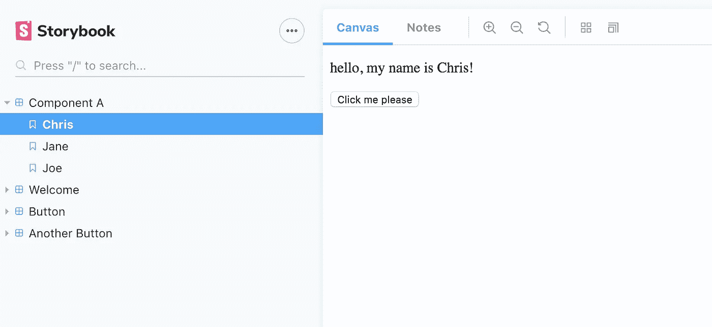
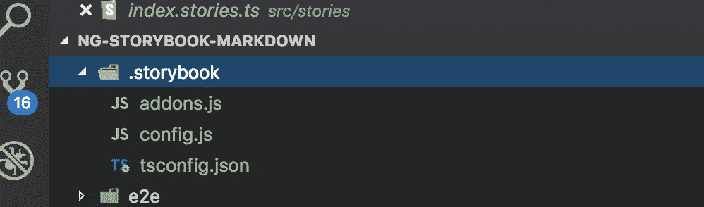
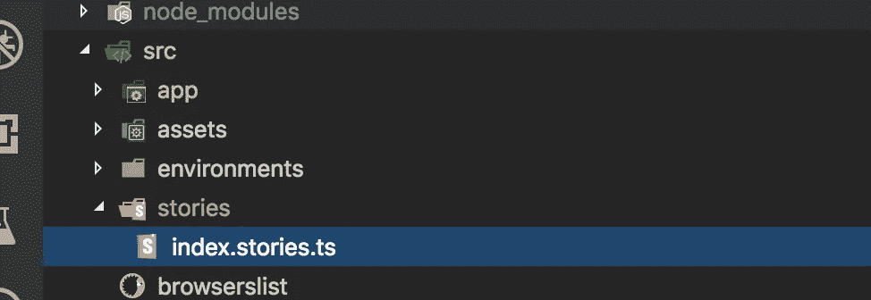
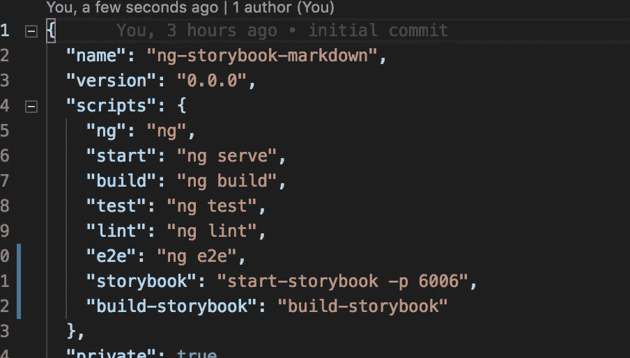
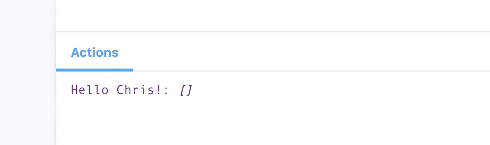
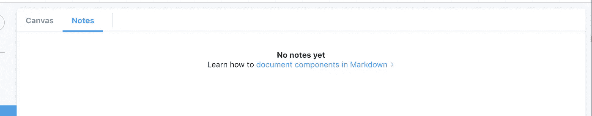
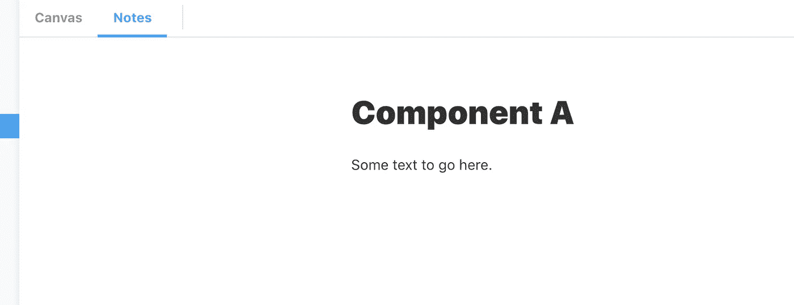
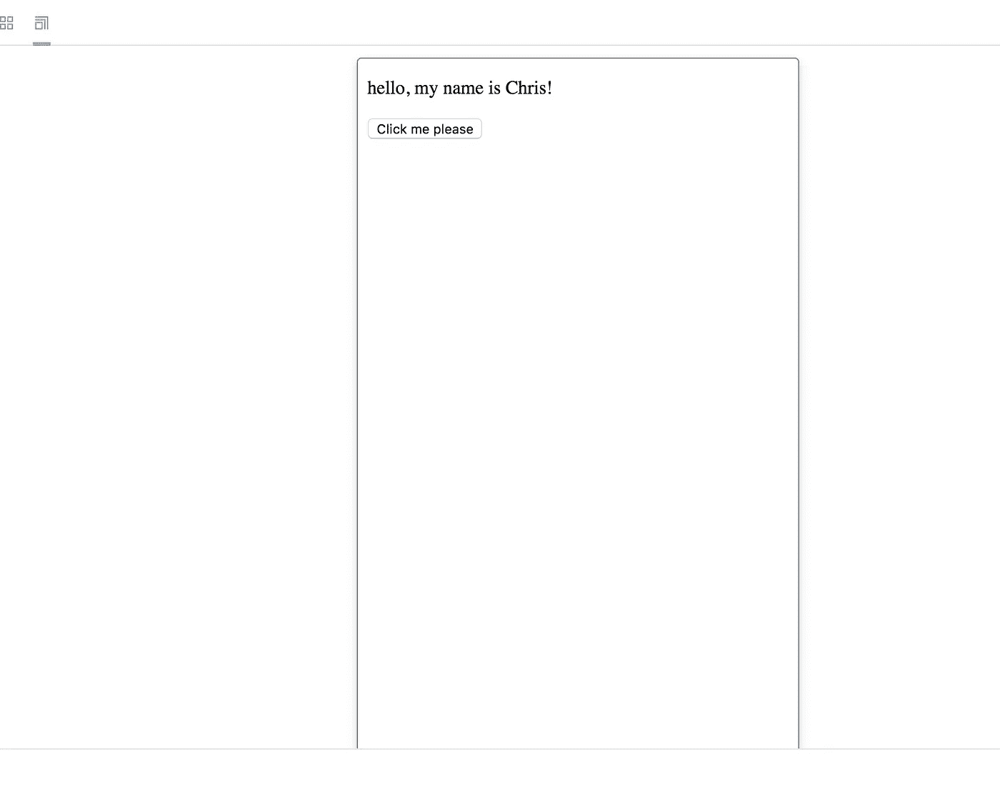

# 用角和故事书构建组件

> 原文：<https://javascript.plainenglish.io/storybook-for-angular-components-with-markdown-support-72950cc3d9ee?source=collection_archive---------0----------------------->

## 加上对 Markdown 的支持！


每个开发人员的噩梦都是保持文档更新，对吗？永远不会有什么灵丹妙药可以让这种需求消失，但是有一些工具可以让它变得更加令人愉快……故事书就是其中之一。

故事书是用 React 写的，但是也有对 Angular 和 Vue 的支持。在这篇文章中，我将探讨他们对 Angular 的支持。

> [Storybook](https://storybook.js.org/) 是一款开源工具，用于独立开发 React、Vue 和 Angular 的 UI 组件。它使构建令人惊叹的 ui 变得有条理和高效。



Storybook UI

Storybook 最大的优点之一是能够独立配置组件。将它们完全*脱离应用程序的上下文*可以让你思考和测试*的不同排列方式*组件在不同属性下的外观和行为等。这也使得检测那些棘手的边缘情况变得更加容易。

Storybook 还提供了一个漂亮的平台来记录和展示每个用例，并与其他开发人员分享。

# 创建一些角度组件

我在使用 React 时使用了 Storybook，它是一个很好的工具。我最近在 Angular 中实现了它，我想分享一下我是如何配置它的。我将从头开始创建一个新的 **ng** 项目，并完成设置:

```
ng new ng-storybook-markdown
```

让我们添加一些组件，我们可以在 Storybook 中记录这些组件:

```
ng generate component componentA
ng generate component componentB
```

对于绝大多数用例，角度**组件**将基于**输入**参数进行渲染。这些是在组件级别定义的，通常告诉组件它需要知道什么，以便呈现它自己。组件还可以使用**输出**来分发事件，然后输出可以告诉父组件或应用服务在用户与组件交互(通常以事件的形式)时做什么。

让组件对外部发生的事情保持沉默是一个好的设计。组件不需要关心周围发生的任何其他事情，除了应用程序告诉它们的内容(输入)和它们需要根据事件告诉应用程序的内容(输出)。

*component-a . component . ts:*

```
import { Component, OnInit, **Input, Output, EventEmitter** } from '@angular/core'; @Component({
    selector: 'app-component-a',
    templateUrl: './component-a.component.html',
    styleUrls: ['./component-a.component.scss']
  }) export class ComponentAComponent implements OnInit { ** @Input() name: string;
    @Output() myEvent: EventEmitter<any> = new EventEmitter();** constructor() { }

    ngOnInit() { }}
```

现在组件有了一个 name 值和一个它可以触发的事件。在我们的模板中使用这些很简单:

*component-a . component . html:*

```
<p>hello, my name is **{{name}}**!</p>
<button (click)="**myEvent.next()**">Click me please</button>
```

记住 **myEvent** 是可观察的，所以我们需要调用 **next()** 。

现在我们有了一些组件，让我们开始运行 Storybook 并创建一些故事。


# 为角度配置故事书

首先，让我们通过运行以下命令向我们的项目添加 Angular storybook 支持:

```
npx -p [@storybook/cli](http://twitter.com/storybook/cli) sb init --type angular
```

*如果你卡住了，这里有一个像样的手工演练*[](https://storybook.js.org/docs/guides/guide-angular/)**。**

*此命令应该安装所有必需的依赖项，并为 Angular 配置 storybook，包括对 Typescript 的支持。*赢家！**

*让我们来看看重要的部分:*

**

*.storybook*

*所有的配置都保存在**中。故事书**目录。我们将在这里介绍一些选项。*

**

*src/stories*

*我们将把我们的“故事”添加到 **src/stories** 目录中。你会看到一个名为 **index.stories.ts** 的例子。*

**

*package.json*

*Storybook 也为我们创建了两个方便的脚本。一个用于启动本地开发实例，另一个用于将我们的故事书构建为静态 HTML 文件。*

*现在让我们通过运行`npm run storybook`并连接到`http://localhost:6006`来启动本地 dev 实例。*

**

# *创作一些故事书故事*

*让我们在 **src/stories** 中添加一个名为 **component-a.stories.ts** 的新文件。Storybook 将在该目录中查找任何以 **.stories.ts** 结尾的文件，并尝试将它们作为故事加载。*

*在下面的示例中，我们创建了 3 个故事，每个故事都有一个不同的名称属性，映射到组件输入:*

**src/stories/component-a-stories . ts:**

```
*import { storiesOf } from '@storybook/angular';import { ComponentAComponent } from '../../src/app/component-a/component-a.component';storiesOf('Component A', module)
  .add('Chris', () => ({
    component: ComponentAComponent,
    props: {
      name: 'Chris',
    },
  }))
  .add('Jane', () => ({
    component: ComponentAComponent,
    props: {
      name: 'Jane',
    },
  }))
  .add('Joe', () => ({
    component: ComponentAComponent,
    props: {
      name: 'Joe',
    },
  }));*
```

*但是事件呢？ Storybook 提供了**动作**，可以作为事件触发，映射到角度分量输出:*

**src/stories/component-a-stories . ts:**

```
*import { storiesOf } from '@storybook/angular';
**import { action } from '@storybook/addon-actions';**import { ComponentAComponent } from '../../src/app/component-a/component-a.component';storiesOf('Component A', module)
  .add('Chris', () => ({
    component: ComponentAComponent,
    props: {
      name: 'Chris',
 **myEvent: action('Hello Chris!')**
    },
  }))
  .add('Jane', () => ({
    component: ComponentAComponent,
    props: {
      name: 'Jane',
 **myEvent: action('Hello Jane!')**
    },
  }))
  .add('Joe', () => ({
    component: ComponentAComponent,
    props: {
      name: 'Joe',
 **myEvent: action('Hello Joe!')**
    },
  }));*
```

*触发的动作随后在故事书用户界面中可视化:*

**

*上面的场景是基本的，如果一个组件有额外的需求，比如一个服务或者一个外部依赖，会发生什么，Storybook 能处理这些吗？*

*当然可以。类似于编写模块或单元测试，你可以通过**导入**和**提供者**进入你的故事:*

**src/stories/component-a-stories . ts:**

```
*storiesOf('Component A', module)
  .add('Chris', () => ({
    component: ComponentAComponent,
    props: {
      name: 'Chris',
      myEvent: action('Hello Chris!')
    },
 **imports: [ MyExampleModule ], 
    providers: [ MyExampleService ]**
  }))
  .add('Jane', () => ({
    component: ComponentAComponent,
    props: {
      name: 'Jane',
      myEvent: action('Hello Jane!')
    },
 **imports: [ MyExampleModule ], 
    providers: [ MyExampleService ]**
  }))
  .add('Joe', () => ({
    component: ComponentAComponent,
    props: {
      name: 'Joe',
      myEvent: action('Hello Joe!')
    },
 **imports: [ MyExampleModule ], 
    providers: [ MyExampleService ]**
  }));*
```

*故事的组成是在 JSON 中，所以你可以在如何组织它们上有创造性。*

*如果您发现自己在每个故事中声明了相同的导入和提供者，您可以添加一个装饰器来将它们添加到模块中的所有故事中:*

**src/stories/component-a-stories . ts:**

```
*import { storiesOf, **moduleMetadata** } from '@storybook/angular';
...storiesOf('Component A', module)
 **.addDecorator(
    moduleMetadata({
      imports: [ MyExampleModule ],
      providers: [ MyExampleService ]
    }),
  )**
  .add('Chris', () => ({
    component: ComponentAComponent,
    props: {
      name: 'Chris',
      myEvent: action('Hello Chris!')
    }
  }))
  .add('Jane', () => ({
    component: ComponentAComponent,
    props: {
      name: 'Jane',
      myEvent: action('Hello Jane!')
    }
  }))
  .add('Joe', () => ({
    component: ComponentAComponent,
    props: {
      name: 'Joe',
      myEvent: action('Hello Joe!')
    }
  }));*
```

**

# *添加降价支持*

*Storybook 的一个重要特性是它支持文档的降价。能够在源代码控制中记录组件和版本，并在 Storybook 干净的 UI 中呈现它们是一个很大的好处。*

> *[**Markdown**](https://en.wikipedia.org/wiki/Markdown) 是一种轻量级标记语言，具有纯文本格式语法。它的设计允许它被转换成许多输出格式，但是同名的原始工具只支持 HTML。*

*您可能已经注意到故事书用户界面中的“注释”选项卡:*

**

*让我们看看使用 [Markdown](https://github.com/adam-p/markdown-here/wiki/Markdown-Cheatsheet) 格式化文本会涉及到什么。*

*我将创建一个 **notes** 目录，放在我的 **stories** 目录中，并在那里为 **component-a.notes** 添加一个占位符:*

```
*cd src/stories/
mkdir notes
cd notes
touch component-a.notes.md*
```

**src/stories/notes/component-a . notes . MD:**

```
***# Component A**Some text to go here.*
```

*现在，让我们将降价文件导入到我们的故事模块中，并将其分配给我们的每个故事:*

**src/stories/component-a-stories . ts:**

```
***import * as markdown from './notes/component-a.notes.md';
...**storiesOf('Component A', module)
  .addDecorator(
    moduleMetadata({
      imports: [ MyExampleModule ],
      providers: [ MyExampleService ]
    }),
  )
  .add('Chris', () => ({
    component: ComponentAComponent,
    props: {
      name: 'Chris',
      myEvent: action('Hello Chris!')
    }
  })**, { notes: { markdown }}**)
  .add('Jane', () => ({
    component: ComponentAComponent,
    props: {
      name: 'Jane',
      myEvent: action('Hello Jane!')
    }
  })**, { notes: { markdown }}**)
  .add('Joe', () => ({
    component: ComponentAComponent,
    props: {
      name: 'Joe',
      myEvent: action('Hello Joe!')
    }
  })**, { notes: { markdown }}**);*
```

**轰！*当你尝试用上面的修改进行编译时，编译器会抱怨说找不到模块…*

*这是因为它本身不支持作为模块的 Markdown 文件，因此无法找到它:*

```
*ERROR in /ng-storybook-markdown/src/stories/component-a.stories.ts
ERROR in /ng-storybook-markdown/src/stories/component-a.stories.ts(4,27):
TS2307: **Cannot find module './notes/component-a.notes.md'.***
```

*为了解决这个问题，我们需要在**中添加一个名为 **typings.d.ts** 的新文件。故事书**文件夹:*

**。故事书/打字本**

```
*declare module '*.md' {
  const content: string;
  export = content;
}*
```

*最后，我们需要告诉 TypeScript 寻找 ***。参照 **tsconfig.json** 中的 **typings.d.ts** 文件，将 md** 文件作为模块:*

**。storybook/tsconfig.json:**

```
*{
  "extends": "../src/tsconfig.app.json",
  "compilerOptions": {
    "types": [
      "node"
    ]
  },
  "exclude": [
    "../src/test.ts",
    "../src/**/*.spec.ts",
    "../projects/**/*.spec.ts"
  ],
  include": [
    "../src/**/*",
    "../projects/**/*"
  ],
 **"files": [
    "./typings.d.ts"
  ]**
}*
```

**现在我们支持减价笔记了，看看吧！！**

****

# *配置插件*

*Storybook 是一个越来越受欢迎的平台，围绕它有一个强大的社区。Storybook 还以插件的形式发布了一些附加功能。*

**也有开源社区项目支持该平台的新特性，您甚至可以创建自己的项目:**

*有些还没有角撑，所以确保你在得意忘形之前找到它——[你可以在这里找到它](https://github.com/storybooks/storybook/blob/master/ADDONS_SUPPORT.md)。*

*[](https://storybook.js.org/addons/) [## 附件|故事书

### 插件支持高级功能和解锁新的工作流程。由核心维护者和令人惊叹的…

storybook.js.org](https://storybook.js.org/addons/) 

为了完成这篇文章，我将逐步添加**视口。**

> 故事书视窗插件允许你的故事在[故事书](https://storybook.js.org/)中以不同的尺寸和布局显示。这有助于在 Storybook 中构建响应组件。

配置插件非常简单，首先您需要安装附加的依赖项:

```
npm i --save-dev @storybook/addon-viewport
```

然后在**增加一行。故事书/插件. js** :

*。故事书/插件. js:*

```
import '@storybook/addon-viewport/register';
```

*就是这样！*现在我们有了**视口**，可以查看各种设备屏幕尺寸的组件。



*一如既往，这是我的 Github 的工作版本，请欣赏！！:*

[](https://github.com/chriskitson/ng-storybook-markdown) [## Chris kitson/ng-故事书-降价

### 通过在 GitHub 上创建一个帐户，为 Chris kitson/ng-故事书降价开发做出贡献。

github.com](https://github.com/chriskitson/ng-storybook-markdown) 

> 谢谢你花时间阅读我的文章。*