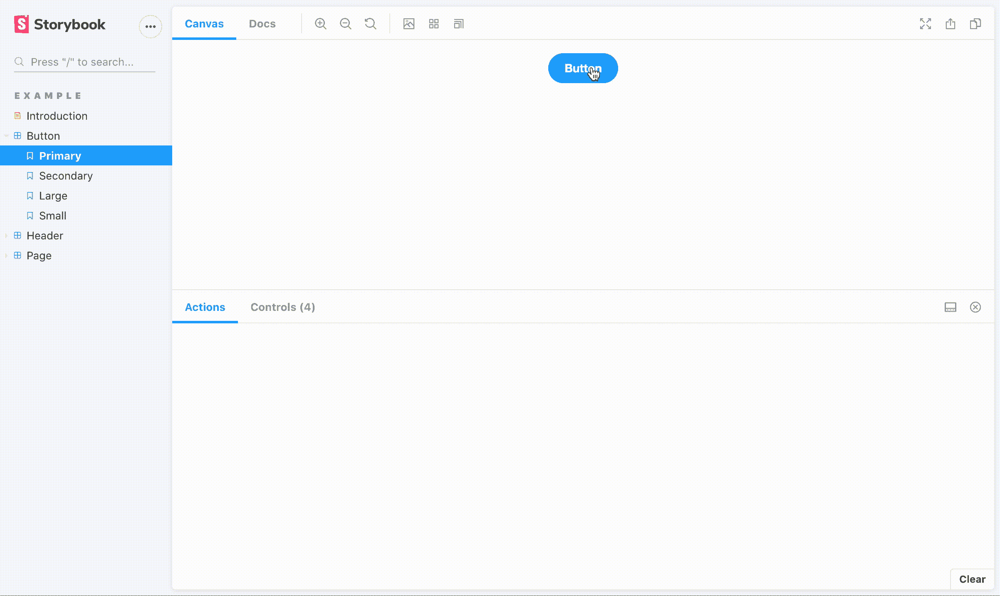
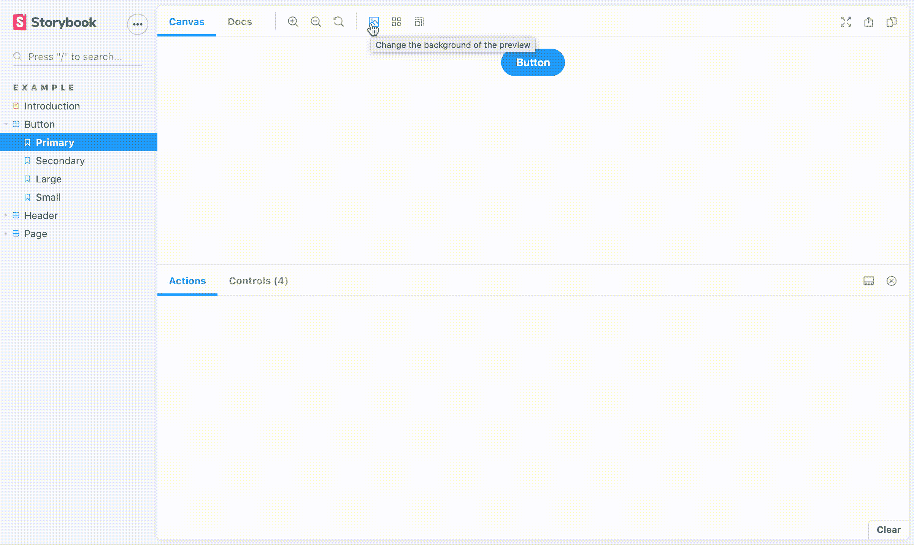
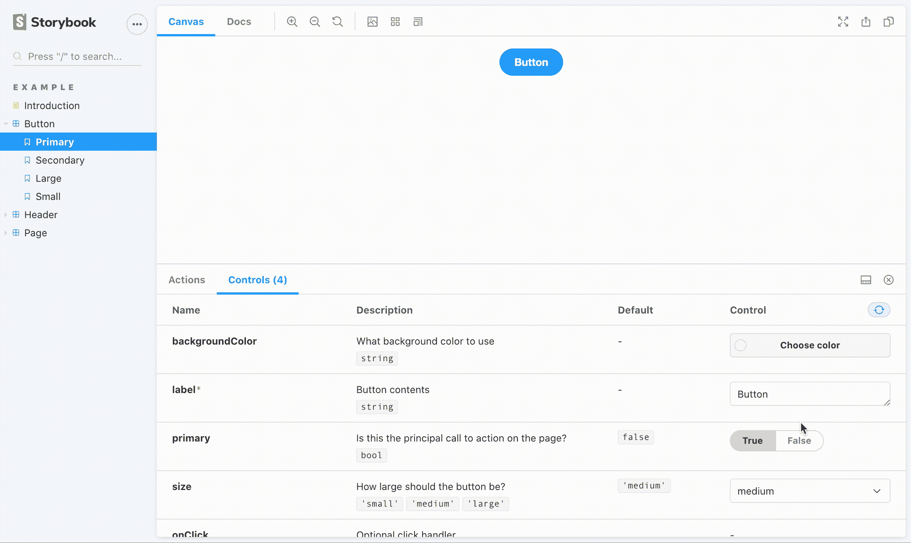
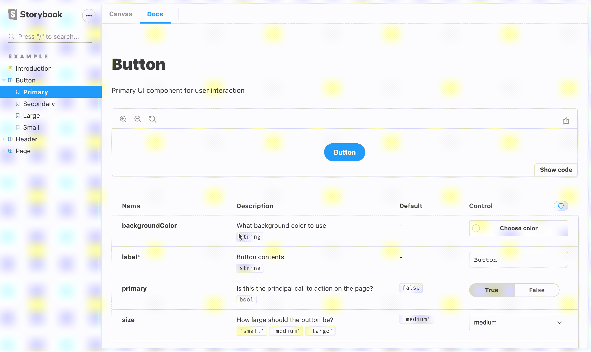
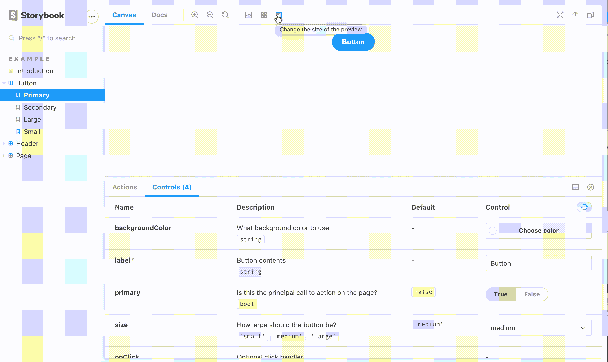
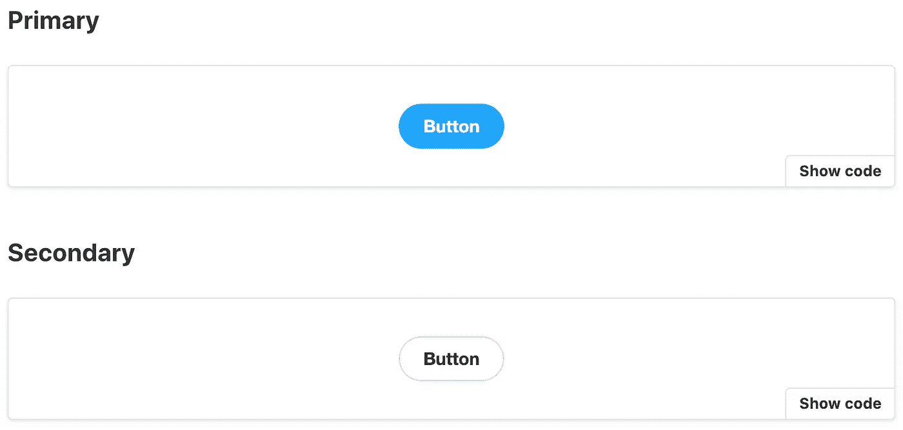

# 故事书是你新的 UI 组件浏览器

> 原文：<https://javascript.plainenglish.io/storybook-is-your-new-ui-component-explorer-22e9e69b9d0f?source=collection_archive---------7----------------------->

## 开发、演示和记录用户界面组件的单一工具


Photo by [Nick Fewings](https://unsplash.com/@jannerboy62?utm_source=medium&utm_medium=referral) on [Unsplash](https://unsplash.com?utm_source=medium&utm_medium=referral)

# 我的旅程

我的代码库有 50 多个不同的组件，用于输入、布局、导航和演示。这些组件中的每一个都有许多不同的道具来控制许多变化和功能。有这么多的可能性，很难跟踪和记住所有的功能。

不过对我来说，自从我开发它们以来，这并不是什么大问题。但是新的贡献者没有这个背景和经验，结果学习组件库很费劲。他们必须通读组件代码，或者查看产品代码中组件的实际用法才能理解它。不管怎样，这都不是一次对开发者友好的体验。很明显，围绕组件库的某种形式的文档是必要的。这就是故事书的由来。

# 故事书

[Storybook](https://storybook.js.org/) 是一个开发、演示和记录组件库的工具。它由一个个故事组成，每个故事都展示了一个特定的组成部分，提供了一个丰富的可视化和互动的平台。通过这个，用户可以了解一个组件是如何工作的以及它是如何被控制的。这些故事有效地变成了代码文档。

Storybook 的这些演示和文档功能也可以用于组件开发。Storybook 提供了一个非常适合创建通用组件的独立开发环境。它提供的平台可用于在不同的场景中快速测试新组件，以实现快速迭代开发。

# 故事书游乐场

如前所述，故事书不仅仅是故事的静态展示。它也是一个交互式游戏场，用户可以动态地更改组件及其环境，以查看它在不同场景下的外观和行为。

[**动作**](https://www.npmjs.com/package/@storybook/addon-actions) 允许您将模拟函数传递到您的组件中，该组件将在被调用时记录并显示动作选项卡中的输入数据，以便您可以了解这些函数是如何工作的。



Storybook Actions

[**背景**](https://www.npmjs.com/package/@storybook/addon-backgrounds) 允许你改变故事背景，这样你就可以看到组件在不同颜色环境下的样子。



Storybook Background Controls

[**控件**](https://www.npmjs.com/package/@storybook/addon-controls) 允许您直接根据组件定义的`propTypes`在 UI 中动态改变组件的属性，以便您可以了解属性如何影响组件。



Storybook Component Controls

[**Docs**](https://www.npmjs.com/package/@storybook/addon-docs) 自动为您的故事生成文档，包括道具表、源代码和降价文档，所有这些都在一个视图中。



Storybook Docs

[**视口**](https://www.npmjs.com/package/@storybook/addon-viewport) 允许你改变视口，这样你就可以看到组件在不同屏幕尺寸环境下的表现。



Storybook Viewport Controls

# 故事书设置

首先，Storybook 提供了一个方便的设置工具:`npx storybook init`。这将

*   安装故事书和所有必要的依赖项
*   向`package.json`添加`storybook`和`build-storybook`命令，它们将分别在开发模式下运行 Storybook 和为生产构建 Storybook
*   创建一个包含运行故事书所需配置的`.storybook`文件夹
*   创建一个`stories`文件夹，你所有的故事都将存在其中

# 故事设置

故事存在于以`.stories.js`结尾的文件中。其中的每一个都是给定组件的故事集合。组件故事的设置是通过默认导出完成的。

```
// Button.stories.js
import { Button } from './Button';export default {
  title: 'Example/Button',
  component: Button,
  argTypes: {
    backgroundColor: { control: 'color' },
  },
  args: {
    label: 'Button',
  },
  parameters: {
    controls: {
      expanded: true,
    },
  },
  decorators: [
    story => (
      <div style={{ display: 'flex', justifyContent: 'center' }}>
        {story()}
      </div>
    ),
  ],
};
```

**标题**定义组件故事的标题以及它应该属于哪个部分。这个组件故事的标题是`Button`，在`Example`部分。这个标题在你的故事书中必须是唯一的。

组件是一个可选的配置，你只需简单地传递组件本身。Storybook 将使用该组件自动生成一个道具表，并根据组件的`propTypes`和`defaultProps`创建控件来动态控制道具。

**ArgTypes** 是定义属性表内容的可选配置。大多数情况下，这是不必要的，因为您的故事书可以通过使用上面的`component`字段自动生成它们，但有时需要手动干预。在这个例子中，`backgroundColor`必须是一个颜色，但是为它定义的 propType 是`PropType.string`，Storybook 将把它解释为一个自由形式的文本输入控件。通过手动将控制设置为`color`，现在可以通过色轮控制`backgroundColor`。

**Args** 是一个可选的配置，它定义了组件的所有*故事都将拥有的道具，因此您不需要为单个故事反复定义道具。*

**参数**是可选配置，用于配置故事书功能。在本例中，Controls 有一个`expanded`属性，当使用参数将其设置为`true`时，将展开道具表以显示*描述*和*默认道具*列。

装饰者是一个可选的配置，它会用额外的 JSX 包装每个故事。在这个例子中，装饰者将使每个故事居中。当您的组件需要包装在 React Router 或 React Redux 之类的上下文中时，这尤其有用。

# 故事内容

故事内容是通过命名导出创建的。每个命名的导出都会呈现一个组件的变体或功能。

```
// Button.stories.js
import { Button } from './Button';const Template = args => <Button {...args} />;export const Primary = Template.bind({});
Primary.args = {
  primary: true,
};export const Large = Template.bind({});
Large.args = {
  size: 'large',
};
```



Story Content

`Template`是一个抽象层，定义了组件是如何呈现的。每个命名的导出使用`bind`创建这个模板的副本，并通过`args`定义故事的道具。Storybook 将采用这些并以导出名称作为标题展示故事。瞧，你有你的故事了！

现在，在你问之前，是的，有些看起来是不必要的，特别是对于 React，但是 Storybook 支持其他 Javascript 框架，比如 Vue 和 Angular，这种编码模式的好处更加明显。

# 最后的想法

故事书让我和我的团队受益匪浅。它使开发人员能够通过动态 UI 控件在不同的场景中快速开发和测试新组件。它使开发人员能够在一个地方展示和记录他们组件库的所有特性。它使用户能够在一个简单而强大的交互式平台上快速学习组件库的特性。简单来说，Storybook 是任何综合组件库的必备工具。

# 资源

*   [官方故事书文档](https://storybook.js.org/)
*   [本文 Github 回购](https://github.com/mjchang/medium/tree/master/storybook-1)