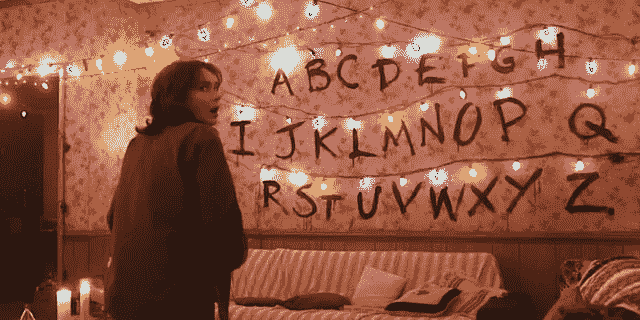
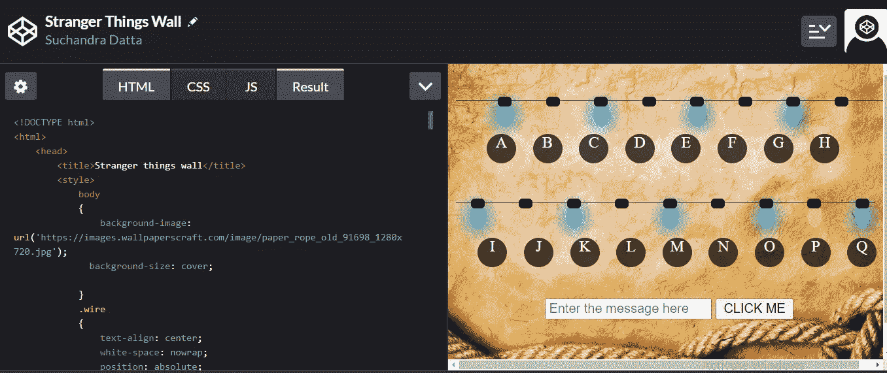

# 使用普通 JavaScript 的陌生事物字母墙场景

> 原文：<https://javascript.plainenglish.io/stranger-things-alphabet-wall-scene-using-vanilla-javascript-a4fb9866c87a?source=collection_archive---------10----------------------->

## 使用 HTML5、CSS3 和 JavaScript 重新创建你自己版本的幽灵字母墙场景



Stranger Things alphabet wall scene Season 1 episode 3

如果你是一个像我一样的陌生事物爱好者，那么我不需要进一步解释，你完全理解我们在这里想要做什么，对吗？回想第一季，威尔消失了，但在另一个维度却留在他家附近，用他母亲在他家放的圣诞灯警告她注意恶魔，并叫她快跑。如果你不是一个陌生事物迷，无论我如何清晰地解释，你都无法理解字母墙有什么令人兴奋的。我们将尝试使用 HTML5 和 CSS3 重新创建这面墙，以尽可能接近地模拟图片中显示的灯光；我们将有一个文本输入字段，它将一条消息作为输入，比方说运行并在字母墙上显示它，就像它在陌生人事物场景中发生的那样，也就是说，R 上面的灯短暂发光并熄灭，然后 U 上面的灯发光并停止，最后 n 上面的灯。JavaScript 计时器将用于实现这样的功能。



Screenshot of my Codepen featuring the alphabet wall we’re trying to build

为了便于在 Codepen 中显示，从 S 到 Z 的字母没有显示，而是在代码中注释掉了。为了开始建造字母墙，我们需要一些圣诞灯。这些灯需要一根线来挂起来。

```
<ul class="wire" id="setOne">
            <li></li>
            <li></li>
            <li></li>
            <li></li>
            <li></li>
            <li></li>
            <li></li>
            <li></li>
</ul>
```

8 个 li 元素的 ul 列表将被设计成看起来像悬挂在字母 A 到 h 上方的灯。接下来定义电线和每个列表项目的样式。

```
 .wire
            {
                text-align: center;
                white-space: nowrap;
                position: absolute;
                padding: 0;
                width: 100%;
                top: -80px;
                border-bottom: 1px solid black;
                height: 100px;
            }
            .wire li
            {
                position: relative;
                list-style: none;
                margin: 0 15px;
                padding: 0;
                display: inline-block;
                width: 15px;
                height: 25px;
                border-radius: 50%;
                top: 102px;
                background: white;
            }
```

圣诞灯的整个造型是从网络忍者 YouTube 频道的一个很棒的视频中学来的(经过大量的在线搜索)，链接如下[https://youtu.be/B9OZkATMbag](https://youtu.be/B9OZkATMbag)这些步骤以一种引人入胜的方式详细描述，它对我帮助很大，希望你也会喜欢这个视频！

一旦灯光设置好，我们就需要字母。

```
.eachKey
            {
                height: 30px;
                width: 30px;
                background-color: rgba(0,0,0,0.7);
                color: white;
                font-size: 1rem;
                border-radius: 50%;
                text-align: center;
                float: left;
                margin: 2%;
                box-shadow: 0.25rem 0.25rem 0.5rem 0.75rem rgba(255,255,255,0.2);
            }
            .keypad
            {
                position: relative;
                margin-top: 20vh;
                margin-left: 5vw;
                height: auto;
                width: 100%;

                text-align: center;
                color: white;
                background-color: rgba(0,0,0,0.5);
            }
```

每个键的样式和键的容器都非常简单。相同的 HTML 结构如下

```
<div class="keypad">
            <div class="eachKey">
                A
            </div>
            <div class="eachKey"> 
                B
            </div>
            <div class="eachKey">
                C
            </div>
            <div class="eachKey">
                D
            </div>
            <div class="eachKey">
                E
            </div>
            <div class="eachKey">
                F
            </div>
            <div class="eachKey">
                G
            </div>
            <div class="eachKey">
                H
            </div>
        </div>
```

这形成了字母墙的第一排，上面有灯。重复以上步骤，直到覆盖所有 26 个字母。接下来，我们设置一个文本字段，并从用户那里获得一条消息。

```
message=document.getElementById("message").value;
message=message.toLocaleUpperCase();
```

我们对消息长度进行循环。对于位置 I 处的每个字符，执行以下操作

```
index=message.charCodeAt(i)-65;
```

字母表的 ASCII 值从 0 到 25 映射到它们的预期范围 65 到 90，以便索引帮助访问所需的灯(或列表项)。根据行的结构，索引将是要打开的灯号。具体到我的例子，所需的代码是

```
if(index>=0 && index<=7)
    {
        ele=document.getElementById("setOne").getElementsByTagName("li")
    }
```

类似地，对于索引的其他值，将应用正确的 id setTwo 或 setThree。为了产生灯光打开的效果，我们给它添加了一个盒子阴影。例如，要打开蓝色的灯，我们需要下面的代码

```
//BLUE
            ele[index].style.backgroundColor='aqua';
            colorValue='rgba(0,153,255,0.8)'
            ele[index].style.boxShadow='0px 2px 20px 4px  #ffff00';
```

一旦灯被打开，我们在关掉它和打开下一盏灯之前等待一秒钟。考虑到代码的结构，setTimeout 本身并不提供这种功能。它是非阻塞的，所以它只是将回调函数放在队列中，然后继续执行接下来的语句。

在应用框阴影并定义回调函数以将光线重置回原始颜色后，setTimeout 调用不起作用。采用基于承诺的方法。

```
function sleep(ms) {
    return new Promise(resolve => setTimeout(resolve, ms));
//Inspired from an example on MDN 
```

MDN 文档中定义的 promise 对象是一个在创建 Promise 时未知的值的代理。当事件完成时，它保存异步事件的最终状态或结果。如果事件成功，则承诺被认为已解决或其状态已实现，并返回一个值。如果事件不成功，则拒绝该事件并返回错误对象。resolve 函数设置成功终止时的承诺值。

我们等待 sleep 函数的完成，从而确保程序控制一直等到超时返回，而不是直接进入下一行代码破坏整体效果。

等待承诺被返回的函数本身必须是异步的，我们也声明我们的驱动函数是异步的。一旦规定的延迟时间过去，我们将灯泡重置为其原始颜色。

## **结束**

我们刚刚做了我们自己的字母墙，我们可以一起玩，甚至给我们的陌生人展示一些东西，亲爱的朋友们也会喜欢的！我的 Codepen 上有完整的代码，链接如下:【https://codepen.io/Suchandra_Datta/pen/xxbEQdJ 

谢谢你读到这里，希望你喜欢。热切期待您的改进建议、最佳实践和任何您想分享的技巧。再次感谢您的时间，祝您愉快。注意安全，保重。编码快乐！