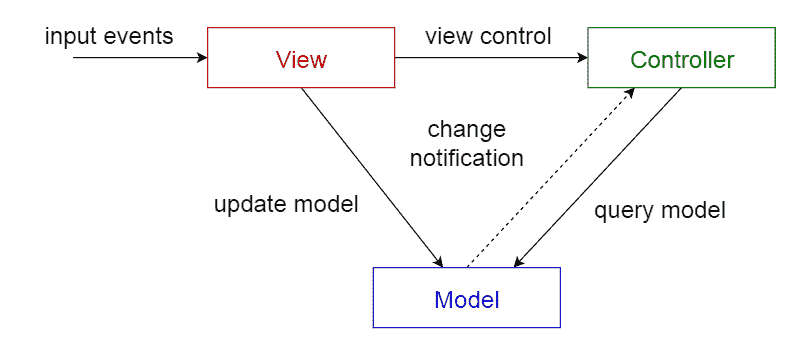
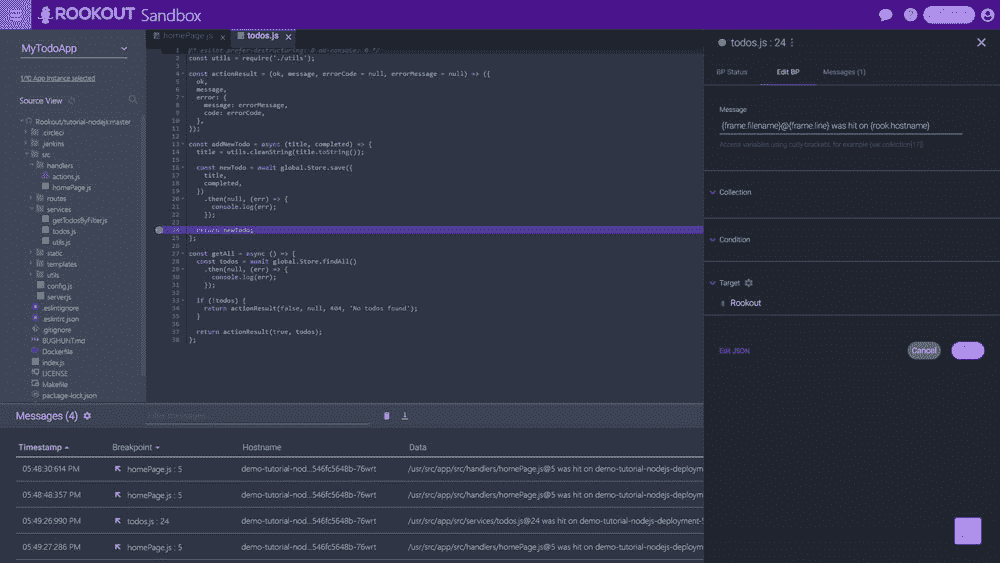
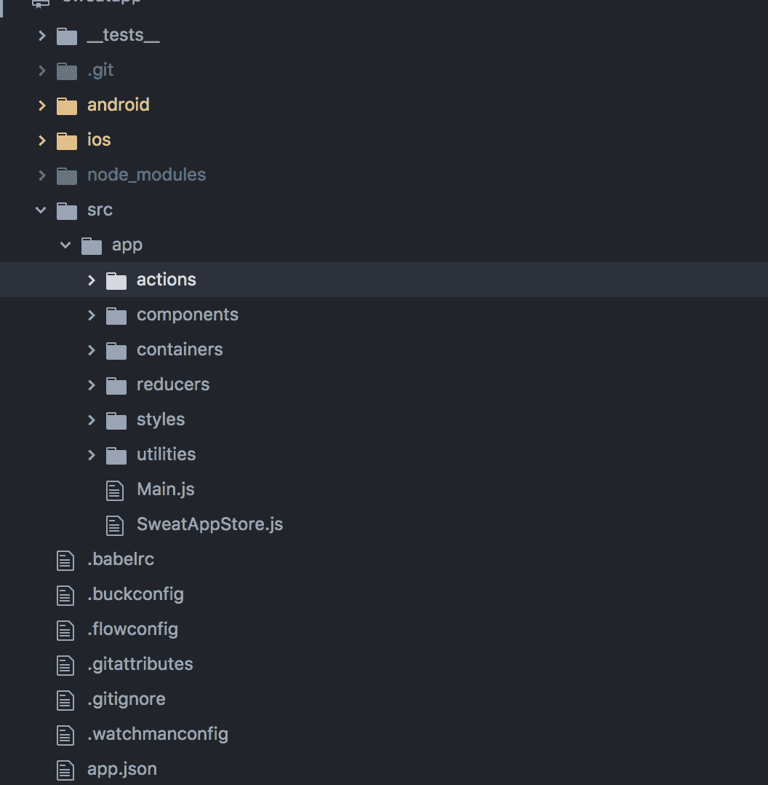
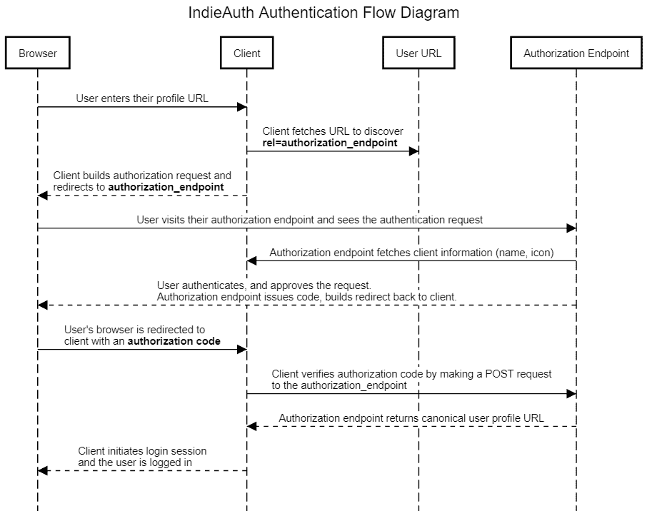

# 解开遗留代码的策略

> 原文：<https://javascript.plainenglish.io/strategies-for-untangling-legacy-code-ab776a585928?source=collection_archive---------11----------------------->

## *在更短的时间内提高您对遗留代码库的理解的技巧*

Photo by [Markus Spiske](https://unsplash.com/@markusspiske?utm_source=unsplash&utm_medium=referral&utm_content=creditCopyText) on [Unsplash](https://unsplash.com/s/photos/code?utm_source=unsplash&utm_medium=referral&utm_content=creditCopyText)

作为软件工程师，我们总是忙于使用不同的语言和框架做出创新的东西。有时我们被期望通过启动一个新的项目来做这件事，但是大多数时候我们是在一个别人最初写的遗留代码库上工作。

最近，一些研究人员提出了在遗留代码库中自动化重构和相关操作的[方法。在本文中，我们将研究如何手工处理遗留代码库。](https://link.springer.com/chapter/10.1007/978-3-642-01347-8_7)

当我们在处理[遗留系统](https://www.sciencedirect.com/topics/computer-science/legacy-systems)时，我们并不总是熟悉它们内部的情况。每个人都有不同的代码编写风格。此外，如果代码库老了几年，它可能会遵循不再以这种方式使用的更传统的软件模式。

总而言之，当你在一个遗留代码库上工作时，会有很多挑战。下面，我们将概述一些你在处理这样的代码库时需要记住的要点。

# **1。弄清楚结构**

*MVC software design pattern*

您的遗留代码库可能遵循一些模式，或者可能已经在其中实现了某种模式。当您刚刚开始处理遗留代码库时，对架构的良好理解会对您有所帮助。

如你所知，在编写代码时，通常会遵循一些软件设计模式。常见的有 MVC、MVVC、MVT 等。

如果你想更好地理解代码库，那么花点时间弄清楚代码库中遵循的软件设计模式并了解更多是值得的。

# **2。使用调试器**

Rookout Sandbox

有各种各样的工具可以帮助你更快地理解代码库。当新开发人员开始工作时，他们需要记录数据或将标识符放在不同的类或模块中，以了解代码库的流程。

软件工程师还需要在他们的本地机器上创建场景，以调查实时代码中出现的任何问题。如果有人是代码库的新手，那么这将是一个更大的挑战。

这就是像 [Rookout](https://www.rookout.com/) 、 [Visual Studio Code](https://code.visualstudio.com/) 或 [IntelliJ IDEA](https://www.jetbrains.com/idea/) 这样的工具可以帮助你调试你的代码库，而不需要在配置方面投入太多精力。例如，Rookout 的集成非常无缝，可以帮助您加快工作流程。

您需要做的是将 SDK 集成到您的实时应用程序中。完成后，在整个应用程序中添加断点，并从中收集您需要的任何信息。

像 Rookout 这样的调试器的主要优点是，您只需要在日志记录中添加一行，它几乎可以涵盖所有内容。无论是某种堆栈跟踪、局部或全局变量，还是您可能需要的任何其他指标，该工具都有。

# **3。检查明显的**

A typical structure of a React Native codebase — You can start reading the code from actions

如果你熟悉一种用于开发特定代码库的编程语言或框架，那么有些东西你马上就能理解。

然后你可以从那些你更容易理解的模块、课程或部分开始，然后在此基础上巩固你的学习。选择最简单的模块或部件，然后开始着手工作。

# **4。探索代码库中的流程**

Typical authentication flow in a web codebase — You can start with auth flow to understand the codebase [[Source](https://hacks.mozilla.org/2018/10/dweb-identity-for-the-decentralized-web-with-indieauth/)]

Web 应用和代码库通常基于一定的流程。如果是后端系统，它可能由不同的 API 组成，如登录、注册和其他与不同的 [CRUD](https://www.codecademy.com/articles/what-is-crud) 操作相关的 API。

在前端系统中，我们也有使用[API](https://developer.mozilla.org/en-US/docs/Web/API)来执行某些操作的类似流程。

为了更好地了解您的代码库是如何工作的，您需要选择某个 API 模块或流程，然后在您的本地机器上运行它，看看它是如何工作的。

# **5。慢慢来**

当你是一个代码库的新手时，你总是需要一些时间来正确理解它内部发生了什么。有时，软件工程师在没有仔细检查代码库的情况下就开始“修复”东西。这种方法经常导致破坏已经工作的东西，这并不奇怪。

正确浏览代码库并理解它总是很重要的。这种最初的时间投资可以避免你在未来浪费任何时间。如果您能够理解架构、设计模式和代码库的一般流程，那么以后解决问题和进行更改或改进就会容易得多。

# 结论

简而言之，如果你能够遵循一些关于如何解开遗留代码的实践，那么你将能够很快理解它。

调试、记录和测试是这个过程的重要部分。所以，当你在处理遗留代码库时，不要忘记使用它们。确保检查它们，这样你就可以在任何给你的代码库上无缝地工作。