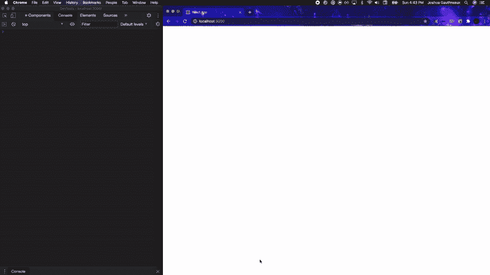

# 如何在 React 应用程序中从 Strava API 调用数据

> 原文：<https://javascript.plainenglish.io/strava-api-react-app-326e63527e2c?source=collection_archive---------0----------------------->


Photo by [Jeremy Lapak](https://unsplash.com/photos/CVvFVQ_-oUg)

每年九月或十月的某个时候，人们抖掉跑鞋上的灰尘，开始为第二年早春的马拉松比赛进行训练。

训练需要几个月的时间，所以一个好的计划是必要的。跑得太快会有受伤的风险，跑得太慢会让你没有足够的里程在比赛当天跑完 26.2 英里。

让你保持在正确轨道上的最好工具之一是一个好的跑步应用程序。我使用 [Strava](https://www.strava.com/) ，因为它可以跟踪数据，包括距离、速度、心率、个人最佳时间等等。它也是一个社交应用程序，所以支持你的朋友，分享活动和公共挑战是核心功能。

我正在开发一个 project/React 应用程序，以替换和升级我目前在谷歌文档中创建的培训系统。在新版本中，我想导入我的锻炼信息，这样我就可以在一个地方看到我的进展和见解。幸运的是， **Strava 有一个开放的、受支持的 API。**

本指南将带您了解如何将您的个人锻炼数据从 Strava 访问到您的 JavaScript 项目中。

*在这里* *找到 Strava API 文档* [*。本文根据 Strava 的*](https://developers.strava.com/docs/reference/) [*入门指南*](https://developers.strava.com/docs/getting-started/) *以及 Franchyze923 的这个* [*视频系列*](https://www.youtube.com/watch?v=sgscChKfGyg) *。*

# 概观

*   **创建或登录您的 Strava 账户**
*   **在你的 Strava 账户中设置一个新应用**
*   **关于范围**
*   **使用 Swagger 测试您的端点**
*   **创建授权令牌**
*   **获取您的访问令牌和刷新令牌**
*   从 React 应用程序中调用 Strava API。

## 创建或登录您的 Strava 帐户

点击[此处](https://www.strava.com)登录或创建 Strava 账户。

## 在您的 Strava 帐户中设置一个新应用程序

登录后，导航至[https://www.strava.com/settings/api](https://www.strava.com/settings/api)。你必须第一次在浏览器中手动输入地址，但之后，你可以通过点击`settings`通过 Stava 网站导航到那里。

最好将此页面**设为书签**或在标签中保持打开状态。在本教程中，您将经常访问它。

填写以下信息:


*   **应用名称:**您可以随意命名。
*   **类别:**我正在制定一个马拉松的计划日程，所以我选择了“训练”。
*   **俱乐部:**如果您是俱乐部的成员，您可以选择俱乐部，否则本字段为空。
*   **网站:**您正在创建的网站的网址。如果没有，只需放`[https://www.strava.sampleapp.com](https://www.strava.sampleapp.com.)` [。](https://www.strava.sampleapp.com.)
*   **应用描述:**描述应用操作的可选字段。
*   **授权回拨域:**现在进入`localhost`。这允许在开发模式下访问 API。在[swage](https://developers.strava.com/playground/)中测试端点时，将此字段更新为`developers.strava.com`(稍后会有更多相关内容)，并在应用部署后将其更新为您所在域的**。**

填写完字段后，选中表示您已阅读并同意 Strava 的 API 协议的复选框。

点击`Create`。

系统将提示您添加应用程序图标。您可以随时更改，现在请随意使用占位符。上传并保存。

您应该看到类似以下内容:


**向上滚动。**您现已掌握以下信息:


## **关于范围**

**Strava API 中的**作用域代表了您读取或更改用户数据所需的不同访问级别。

作为一个第三方应用程序的开发者，我们决定我们将要求 Strava 为特定用户授予什么权限。问自己需要什么是一种好的做法；不多不少。

Strava 通过身份验证过程告诉用户第三方应用程序请求什么权限，并允许用户授予或拒绝该访问权限。

在这种情况下，我们既是开发人员又是用户，所以这应该是一项容易的任务。


当您在 Strava 设置中设置新的应用程序时，上面列出的`Access Token`和`Refresh Token`将适用于一种类型的范围`read`。

根据您想要的信息，这可能不够访问。查看下图，了解每个**范围**选项允许多少访问权限。


我想访问我的所有活动，包括那些设置为 private 的活动，所以我将使用`activity:read_all`范围。这将给予我的`Refresh Token`和`Access Token`正确的访问权限。

在下一步中，我们将预览数据返回时的样子，并确认访问该数据需要什么范围。

*您可以随意使用任何您想要的端点，但是如果您这样做的话，请记住在本指南的其余部分中交换它和它的作用域。*

## 大摇大摆地测试您的端点

Swagger 是 Strava 提供的一个工具，可以让你熟悉他们的 API。它显示了基于您调用的端点以及访问这些端点所需的范围的响应。

为了让 Swagger 工具工作，请返回到您的 [Strava 帐户](https://www.strava.com/settings/api)的设置部分。在`Authorization Callback Domain`栏中，将`localhost`替换为`developers.strava.com`。


点击`Update`。

请记住保持此页面打开，您将在接下来的步骤中大量使用`Client ID`和`Client Secret`。(点击`Client Secret`旁边的`show`显示信息)。

导航至`[Swagger](https://developers.strava.com/playground)`。向下滚动页面时，您将看到所有可用的端点。单击一个端点将显示访问数据所需的范围，以及每条路由的参数。

因为 Swagger 将向我们返回真实的信息，所以我们需要授权它调用 API。

我将使用`get`路线，`/athlete/activities`终点。单击该行。


第一行将描述您需要在什么范围内访问这些信息。该端点要求`activity:read`仅返回公共信息，或者`activity:read_all`返回所有信息。

```
Returns the activities of an athlete for a specific identifier. Requires activity:read. Only Me activities will be filtered out unless requested by a token with activity:read_all.
```

正如我之前提到的，我希望包括活动在内的所有数据都设置为 private，所以我将选择`activity:read_all`。

接下来，滚动回页面顶部，点击绿色按钮`Authorize`。


在相应字段中输入您的 [Strava 账户](https://www.strava.com/settings/api)的`Client ID`和`Client Secret`。

选择您计划使用的终点中所列的范围。这个项目我选择了`activity:read_all`。

**注意，这个工具中有一个已知的错误，它只允许你一次测试一个范围。**


向下滚动，点击`Authorize`。

您会被重定向到 OAuth2 页面，在那里您会再次点击`Authorize`。


The app information you entered in Stava including the picture shows up here.

授权后，您将被重定向回斯瓦格。点击弹出屏幕上的`close`。


You did it! Now click “Close”

现在，向下滚动到`/athlete/activites`并展开。点击`Try it out`。

点击大`Execute`按钮。

向下滚动，查看回复！这就是数据返回给您时的样子。

This is ONE activity returned… look at all that info!!

您可以随意更改参数或检查其他端点，以决定您希望返回的确切数据。请记住，如果您查看需要不同范围的端点，您将需要使用 swag 重新授权，并且一次只能查看一个范围。

*   ***如果您看到返回了一个空白数组，则表示您在所选时间范围内没有记录任何活动。对通话正常感到放心，但请记录一项活动(或更改参数以捕获记录的活动)，以便您可以查看数据！****

## 中断

我不知道你怎么样，但是我需要休息一下。也许某个凯特·勒·邦是合适的:

Open only if avant-grade in a welch accent sounds good to you.

## 创建授权令牌

我们需要一个`Authorization Token`来请求一个`Access Token`和`Refresh Token`。

将您的信息粘贴到以下 URL 中(注意:为了清楚起见，添加了换行符):

```
[http://www.strava.com/oauth/authorize](http://www.strava.com/oauth/authorize?)?client_id=[CLIENT_ID]&response_type=code&redirect_uri=http://localhost/exchange_token&approval_prompt=force&scope=[YOUR_SELECTED_SCOPE]
```

以下是添加“我的信息”并删除换行符后的情况:

```
http://www.strava.com/oauth/authorize?client_id=54753&response_type=code&redirect_uri=http://localhost/exchange_token&approval_prompt=force&scope=activity:read_all
```

导航到您刚刚创建的网址。点击`Authorize`。


您将被重定向到无法打开的页面。**果然如此！！**


Don’t fret, we expected this.

复制页面的网址。它看起来像这样:

```
[http://localhost/exchange_token?state=&code=b29e1998446705436f2a2952b21eeb8f76c070c9&scope=read,activity:read_all](http://localhost/exchange_token?state=&code=b29e1998446705436f2a2952b21eeb8f76c070c9&scope=read,activity:read_all)
```

为清晰起见，增加了换行符:

```
[http://localhost/exchange_token?state=](http://localhost/exchange_token?state=&code=c0cd3f07f70d3dcfe20c86a69bf3b5b42b80d8e4&scope=read,activity:read_all)[&code=](http://localhost/exchange_token?state=&code=c0cd3f07f70d3dcfe20c86a69bf3b5b42b80d8e4&scope=read,activity:read_all)[b29e1998446705436f2a2952b21eeb8f76c070c9](http://localhost/exchange_token?state=&code=b29e1998446705436f2a2952b21eeb8f76c070c9&scope=read,activity:read_all)[&scope=read,activity:read_all](http://localhost/exchange_token?state=&code=c0cd3f07f70d3dcfe20c86a69bf3b5b42b80d8e4&scope=read,activity:read_all)
```

第二行是您的`authorization code`。复制`&code=`之后的所有内容，此时为`b29e1998446705436f2a2952b21eeb8f76c070c9`。

我们将使用这个`authorization code`来请求我们的`Refresh Token`和`Access Token`。

## **获取您的访问令牌和刷新令牌**

将您的信息输入以下 URL(为清晰起见，添加了分隔符):

```
[https://www.strava.com/oauth/token?](https://www.strava.com/oauth/token?)
client_id=[YOUR_CLIENT_ID]
&client_secret=[YOUR_CLIENT_SECRET]
&code=[AUTHORIZATION_CODE]
&grant_type=authorization_code
```

这是我输入的信息和删除的中断:

```
[https://www.strava.com/oauth/token](https://www.strava.com/oauth/token?)?client_id=54753&client_secret=6308cc42367f364b3e1c29ede9434d1b92e9b06c&code=[b29e1998446705436f2a2952b21eeb8f76c070c9](http://localhost/exchange_token?state=&code=b29e1998446705436f2a2952b21eeb8f76c070c9&scope=read,activity:read_all)&grant_type=authorization_code
```

打开您的终端，用您刚才创建的 URL 代替`[URL]`，键入以下 cURL POST 请求:

```
curl -X POST [URL]
```

我的看起来像这样:

```
curl -X POST https://www.strava.com/oauth/token\?client_id\=54753\&client_secret\=6308cc42367f364b3e1c29ede9434d1b92e9b06c\&code\=b29e1998446705436f2a2952b21eeb8f76c070c9\&grant_type\=authorization_code
```

为了清楚起见，下面是带有换行符的返回结果:

复制`Refresh Token`，我们将在 React 应用中使用它。

*一个* `*Access Token*` *有效期只有 6 小时。我们使用* `*Refresh Token*` *请求一个新的。据我所知，* `*Refresh Token*` *并没有过期。*

## **从 React 调用 Strava API**

我们在最后冲刺阶段！

首先，回到您的 Strava 设置，将`Authorization Callback Domain`字段改回`localhost`。

打开 react 应用程序，导航到呈现 DOM 的组件。对于这个例子，我将使用 App.js。

I’ve added some styling not shown here for the demonstration

第 1 行:用钩子`useState`和`useEffect`导入 React。

第 4–5 行:为一个`loading`布尔值设置状态，并保存我们收到的所有数据。

12–13:设置一个变量来保存我们的`Refresh Token`和发送当前`Access Token`请求的 URL。

16:为请求活动的 URL 设置变量。

19–25:当页面加载时，`useEffect`将请求当前的`Access Token`。一旦令牌被检索到，它就把它传递给一个名为`getActivities`的函数。

28–34:`getActivites`使用从`useEffect`传递的当前访问代码获取活动。它将结果设置为状态，将我们的布尔加载从`true`切换到`false`，或者显示任何出现的错误。

36–42:创建功能`showActivities`。如果我们的加载布尔值是`true`，它将返回`LOADING`。如果为 false，它会将我们的活动状态打印到控制台，并将活动总数显示到 DOM。

44–49:返回一个调用我们的`showActivities`函数的`<div>`,这个函数将决定在 DOM 上显示什么。



You did it!

恭喜你。！您已经成功地从 React 应用程序调用了 Strava API。

在你部署好你的应用程序后，不要忘记返回到你的 Strava 设置中，将`Authorization Callback Domain`字段更改为**你的域名**。

*感谢 Franchyze923，他有我能找到的唯一一个关于这个主题的视频教程* *。*

*看看我的其他一些故事；* [*用 EmailJS*](https://medium.com/javascript-in-plain-english/email-from-your-react-project-w-emailjs-d6af68fa5c17) *，* [*CSS 重置*](https://medium.com/swlh/css-reset-2b4831d4664e) *，或者* [*反冲. js &简单全局状态*](https://medium.com/javascript-in-plain-english/recoil-js-simple-global-state-d84100b3d535?source=your_stories_page-------------------------------------) *。*

*疑问？评论？顾虑？在 joshuagauthreaux@gmail.com 或通过*[*joshgotro.com*](https://www.joshgotro.com/)*与我联系。*

**感谢您的阅读，祝您身体健康！**