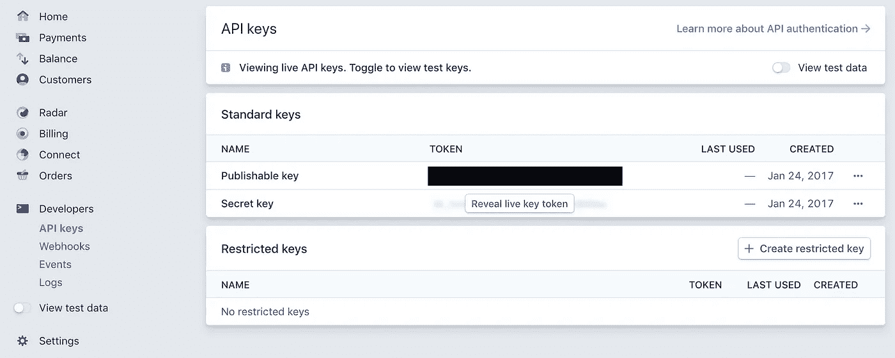
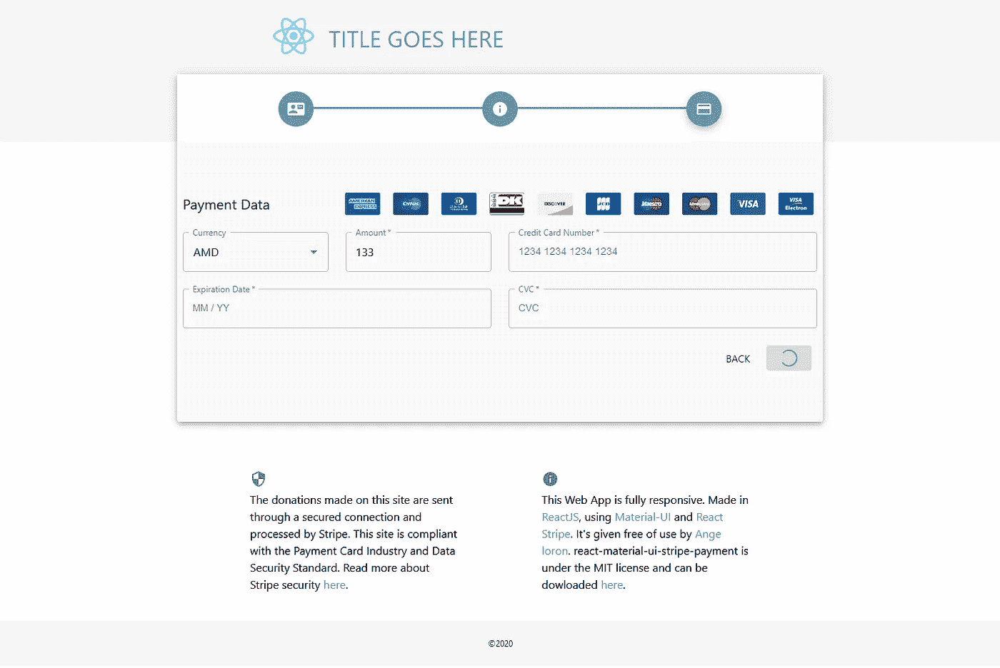
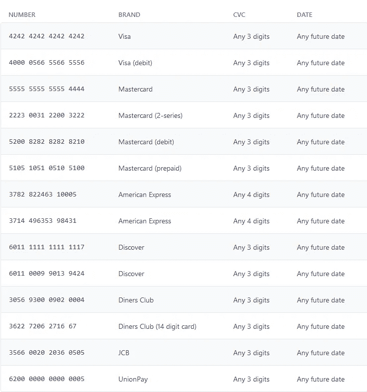
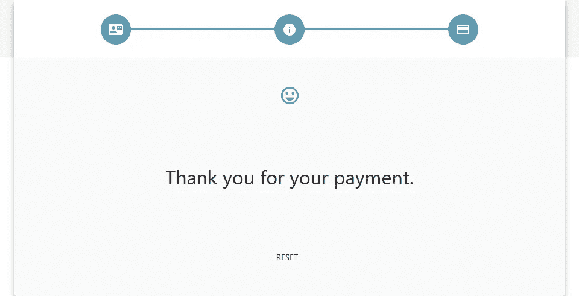
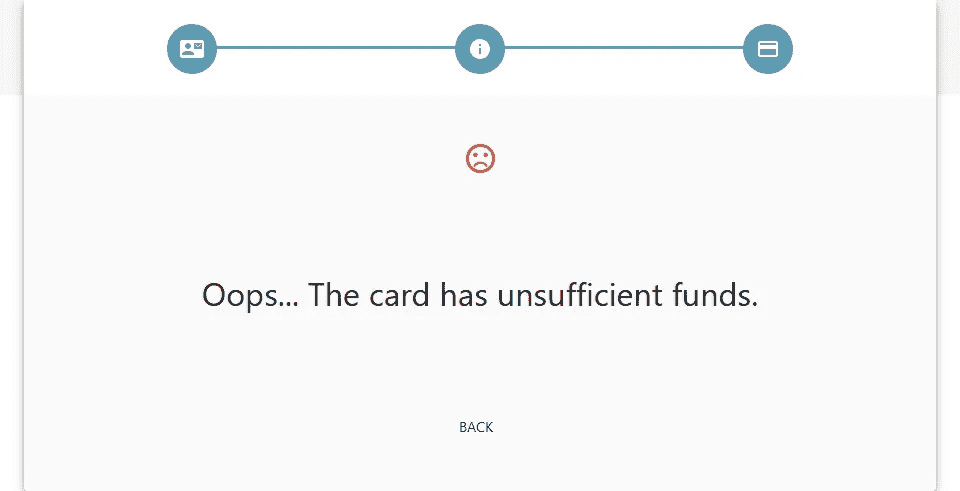

# 带反应和材料的条纹支付表单-用户界面-第 4 部分

> 原文：<https://javascript.plainenglish.io/stripe-payment-form-with-reactjs-and-material-ui-part-4-118e60fca962?source=collection_archive---------0----------------------->


本文共分 4 个部分:
**1。** [用户界面与素材-UI](https://t.co/ylkqiFJ64u?amp=1)
**2。** [创建表单](https://t.co/NiWBVDCcg5?amp=1)
**3。** [保存用户输入与 React use context](https://t.co/3nKnR4e8sC?amp=1)
**4。**实现条纹

> 如果您直接阅读了本文的最后一部分，而错过了其他所有内容，我建议您下载完整的代码，这样您就可以继续阅读本文的其余部分。

代码可在[这里](https://github.com/angeloron/react-material-ui-stripe-payment-form)获得。

现在让我们进行最后的冲刺…


如果您没有安装条纹和材质用户界面，请执行以下操作:

```
npm i @stripe/react-stripe-js @stripe/stripe-js @material-ui/core @material-ui/icons @material-ui/lab
```

# 主要的

*src/views/Main.js*

第一件事是用条带提供程序包装我们的元素。我决定在 Main.js 中这样做，但是您也可以在 App.js 中这样做，或者直接在您打算使用 Stripe 元素的表单上这样做。

首先导入条带提供程序调用 loadStripe ( [文档](https://stripe.com/docs/stripe-js/react#elements-provider)):

```
import { loadStripe } from '@stripe/stripe-js';
```

并导入条带元素包装器，如同一条带文档中所述:

```
import { Elements, } from "@stripe/react-stripe-js";
```

找到您的可发布密钥(在您的 Stripe 开发人员仪表板上提供):



通过用您的 publishableKey 添加此常量来激活它:

```
const stripe = loadStripe(***publishableKey***);
```

> 在我的 [git 存储库](https://github.com/angeloron/react-material-ui-stripe-payment-form/)上，你会看到我将所有的密钥(包括 publishableKey)保存在一个后端 PHP 文件中，并使用一个 fetch 函数来提取它，这个函数在 load 上用 useEffect 调用。对于 publishableKey，您不必这样做，但我认为这是一种很好的做法。

用 Elements 组件包装 Main.js 中的步进器:

```
<Container maxWidth="md" className={classes.container}>
     <Paper elevation={5}>
 **<Elements stripe={stripe}>**
               <Stepper />
 **</Elements>**
     </Paper>
</Container>
```

# 支付形式

*src/views/Forms/payment form . js*

首先，导入支付表单所需的条纹元素。在我的例子中，我将使用 CardNumber、CardExpiry 和 CardCvc。有关可用元素的完整列表，请单击此处的。

```
import {
     CardNumberElement,
     CardExpiryElement,
     CardCvcElement,
} from "@stripe/react-stripe-js";
```

我们将从信用卡号开始。
对于那些没有遵循之前文章的人，我们已经创建了一个如下所示的文本字段:

```
<TextField
     label="Credit Card Number"
     name="ccnumber"
     variant="outlined"
     required
     fullWidth
     InputLabelProps={{ shrink: true }}
/>
```

Material-UI 的 TextField 组件使用输入组件。
你可以在这里阅读官方文档: [TextField](https://material-ui.com/api/text-field/) 和 [Input](https://material-ui.com/api/input/) 。

您希望用 Stripe 中的 CardNumber 组件替换输入组件。

根据官方的 [TextField](https://material-ui.com/api/text-field/) 文档，您必须使用 InputProps 属性与输入组件进行交互:

```
<TextField InputProps={} />
```

您现在在输入组件中，可以使用来自[输入](https://material-ui.com/api/input/)文档的属性。

Input 组件有一个名为“Input component”的属性，如果您不想使用基本的 HTML 而想使用其他东西，那么可以使用这个属性——在本例中，我们想使用 CardNumber。

所以从逻辑上讲，你会认为你必须这样做:

```
<TextField InputProps={{ inputComponent: CardNumber }} />
```

不幸的是…不。那太容易了。这样做似乎可行，但是如果您查看控制台，当您开始键入某些内容时，您会得到以下错误:

**TypeError: Material-UI:预期的有效输入目标。您是否使用了自定义的“inputComponent”而忘记转发引用？更多信息见**[**https://material-ui.com/r/input-component-ref-interface**](https://material-ui.com/r/input-component-ref-interface)**。**

# 带状输入

*src/components/stripe input . js*

该组件必须从 Stripe 接收 CardNumber 作为 prop 和 useRef，以解释当您使用 TextField 时，它必须与 CardNumber 交互。这是那个组件的样子:

```
import React, { useRef, useImperativeHandle } from 'react'const StripeInput = (
     { component: Component, inputRef, ...props }
) => { const elementRef = useRef();
     useImperativeHandle(inputRef, () => ({
          focus: () => elementRef.current.focus
     })); return (
          <Component
               onReady={element => (elementRef.current = element)}     
               {...props}
          />
     )
}export default StripeInput
```

我不会解释各种各样的 React 钩子是什么，你可以在官方文档上查看一下: [useRef](https://reactjs.org/docs/hooks-reference.html#useref) ， [useImperativeHandle](https://reactjs.org/docs/hooks-reference.html#useimperativehandle) 。

现在，让我们回到我们的 PaymentForm 表单来使用这个新组件。

# 支付形式

*src/views/Forms/payment form . js*

首先导入新组件:

```
import StripeInput from "../../components/StripeInput";
```

返回到文本字段并添加新组件:

```
<TextField
     label="Credit Card Number"
     name="ccnumber"
     variant="outlined"
     required
     fullWidth
     InputLabelProps={{ shrink: true }}
     InputProps={{
          inputComponent: StripeInput
     }}
/>
```

当然，您仍然需要将“CardNumberElement”组件发送到 StripeInput，并将一个属性转发到 Input。您需要再次使用 InputProps，但这次是在“Input”元素的 InputProps 内部，如下所示:

```
InputProps={{
     inputComponent: StripeInput,
     inputProps: {
          component: CardNumberElement
     },
}}
```

开始了。控制台中不再有错误。

让我们对到期日和 CVC 做同样的事情。

现在，您应该看到每个字段上的占位符，如果您键入了错误的卡号或到期日期，文本将变为红色，以向用户指示存在错误。


现在，一旦用户按下“支付”按钮，就应该将所有这些数据发送到 stripe。

# 跳舞者

*src/views/Stepper.js*

我们将不得不创建一个函数，这可能需要时间，所以你想有一个加载指示器，向用户显示一些事情正在发生。为此，我们将使用 Material-UI 中的[循环进度组件，并为其添加一个状态。](https://material-ui.com/components/progress/#interactive-integration)

```
import {
   Stepper,
   Step,
   StepLabel,
   Button,
   Box,
   Grid,
 **CircularProgress,**
} from '@material-ui/core';[...]**const [loading, setLoading] = useState(false);**[...]<Button variant="contained"
  color="primary"
  className={classes.button}
  type="submit"
 **disabled={loading}**
>
{
  **loading
  ?
  <CircularProgress size={24} />
  :**
  activeStep === 2 ? 'Pay' : 'Next'
}
</Button>
```

对于那些没有遵循本文第一部分的人，在 Submit 调用“handleNext”时创建了一个函数

```
<form className={classes.form} **onSubmit={e => { e.preventDefault(); handleNext() }}**>
```

该函数用于更改步进器上的步骤，我们现在将添加一个 if 语句来检查它是否在最后一个步骤上，如果是，那么我们将执行一个新的异步函数调用“capture ”,因为它将用于捕获信用卡:

```
const handleNext = () => {
 **if (activeStep === 2) {
      capture()
   } else {**
      setActiveStep(prevActiveStep => prevActiveStep + 1);
 **}**
};
```

捕获功能的第一部分是激活加载:

```
const capture = async () => {
   setLoading(true);
}
```



为了捕获卡，我们需要将金额和货币发送给 Stripe，Stripe 将发送回一个交易号。除了金额和货币之外，我们还希望发送客户的数据(姓名、电子邮件等。).

为此，让我们首先将数据从我们的 reducer 导入到我们的页面(Stepper.js ),并从 Stripe 导入各种钩子:

```
import {
   useStripe,
   useElements,
   CardNumberElement,
} from '@stripe/react-stripe-js';
import { useStateValue } from "../stateContext";
```

并声明它们:

```
const stripe = useStripe();
const elements = useElements();
const [{ formValues }, dispatch] = useStateValue();
```

返回“capture”函数，将数据发送到我们将在调用“clientSecretPull”后立即创建的函数:

```
const clientSecret = await clientSecretPull({
   amount: formValues.amount * 100,
   currency: formValues.currency.code,
   cardType: "card",
   receipt_email: formValues.email,
   metadata: {
      date: formValues.date,
      service: formValues.service,
      facebook: formValues.facebook,
      twitter: formValues.twitter,
   }
})
```

电子邮件已更改为“receipt_email ”,这将指示 Stripe 必须向客户发送一封收据电子邮件以及所有其他数据

clientSecretPull 将使用 Axios 来获取数据，因此从安装 Axios 开始:

```
npm i axios
```

然后导入它:

```
import Axios from "axios";
```

并创建该函数:

```
const clientSecretPull = (data) => {

   const url = window.location.hostname + "capture.php"

   return new Promise(async resolve => {
     const { data: { clientSecret } } = await Axios.post(url, data); resolve(clientSecret)
   })
}
```

而现在你问，WTF 是“capture.php”？！？

# 捕获

*public/capture.php*

我决定用 PHP 做后端，但是你当然可以用 NodeJS 做类似的事情。我选择这个只是因为 Stripe.js 上的 PHP 文档是我能找到的最好的([https://stripe.com/docs/api/payment_intents/create](https://stripe.com/docs/api/payment_intents/create))。

总之，要使用它，我们需要在这里下载“stripe-php”库。

将整个 stripe-php 文件夹保存在您的公共文件夹中，并创建 catpure.php 文件。

首先导入 stripe-php 库并放入您的 API 键:

```
<?phprequire_once 'stripe-php/init.php';$ApiKey = 'sk_test_1234567891234567891234567891234567';
$publishableKey = 'pk_test_1234567891234567891234567891234567';\Stripe\Stripe::setApiKey($ApiKey);?>
```

Axios 以 json 格式发送您的数据，因此您必须对其进行解码，并确保发送最重要的数据(金额、货币和电子邮件)。

然后发送回 client secret——这是确认购买发生的必要信息。

```
$data = json_decode(file_get_contents('php://input'), true);if (!isset($data['amount']) || !isset($data['currency']) || !isset($data['receipt_email'])) {
  echo "Missing parameters";
} else {

 if(!isset($data['metadata'])) {
  $data['metadata'] = [];
 }

  $paymentIntent = \Stripe\PaymentIntent::create([
 'amount' => $data['amount'],
 'currency' => $data['currency'],
    'receipt_email' => $data['receipt_email'],
 'metadata' => $data['metadata'],
 ]);$output = [
  'publishableKey' => $publishableKey,
  'clientSecret' => $paymentIntent->client_secret,
 ];

  echo json_encode($output);

}
```

# 跳舞者

*src/views/Stepper.js*

我们通过发送一些关于用户的数据得到了“client_secret ”,但是我们仍然没有发送信用卡数据，我们想要那笔钱！！！

回到“capture”函数，创建一个常量来提取信用卡数据:

```
const capture = async () => { setLoading(true); const clientSecret = await clientSecretPull({
      amount: formValues.amount * 100,
      currency: formValues.currency.code,
      cardType: "card",
      receipt_email: formValues.email,
      metadata: {
         date: formValues.date,
         service: formValues.service,
         facebook: formValues.facebook,
         twitter: formValues.twitter,
     }
   }); **const cardElement = elements.getElement(CardNumberElement);**}
```

在这个函数上，你可以看到我在拉“CardNumberElement ”,而不是 CVV 或到期数据和 Sprite 元素都是连接的，所以它拉所有的数据。事实上，我也可以用 CardCvcElement 来代替，它会以同样的方式工作。

cardElement 常量现在包括信用卡号、到期数据和 CVV 号码。

因此，是时候将所有这些数据发送到条带并运行该卡了。为此，我们将使用“stripe.confirmCardPayment()”，它将返回一条 paymentIntent 和一条错误消息。

```
const stripeDataObject = {
   payment_method: {
      card: cardElement,
      billing_details: {
         address: {
            city: formValues.city,
            country: formValues.country.code,
            line1: formValues.line1,
            line2: formValues.line2,
            postal_code: formValues.postal_code,
            state: null
         },
         email: formValues.email,
         name: `${formValues.firstname} ${formValues.lastname}`,
         phone: null
      },
   },
}const { paymentIntent, error } = await stripe.confirmCardPayment(clientSecret, stripeDataObject);
```

呜哇呜！！！！你现在准备好运行一些卡！！！

如果您正在使用您的测试 API 密钥，您可以使用这些测试卡[这里](https://stripe.com/docs/testing#cards):



你不会在网页上得到任何东西，因为我们还没有为用户设计任何反馈，但检查你的 Stripe 仪表板，你应该会看到一些付款。

因此，我们已经完成了 Stripe 在网页上的实现。
不过，我会添加几行代码，让用户知道卡是否运行过。

# 捕捉反馈

*src/views/stepper . js capture()*

在捕获函数的末尾，我们将添加以下 if 语句:

```
if (error) {

} else if (paymentIntent && paymentIntent.status === "succeeded") {
   dispatch({ type: 'emptyFormValue' });
}setActiveStep((prevActiveStep) => prevActiveStep + 1);
setLoading(false);
```

上面将通过运行“emptyFormValue”函数清空我们的表单，该函数是在本文第 3 部分的[中创建的。如果信用卡运行成功，将用户发送到下一个也是最后一个步骤，并停止加载指示器。](https://t.co/3nKnR4e8sC?amp=1)

我们的最后一步只有一个不太吸引人的“重置”按钮。相反，我们应该有一些类似“感谢您的付款”的文字，或者如果卡被拒绝，我们应该有另一个文本。

在这里，我们可以有两种状态，要么卡运行成功，要么不成功，基于此将有一个不同的文本

让我们创建这些状态:

```
const [cardStatus, setCardStatus] = useState(true);
const [cardMessage, setCardMessage] = useState("");
```

并在捕获函数中调整 if 语句状态:

```
if (error) {
   setCardStatus(false);
   setCardMessage(`Oops... ${error.message}`);
} else if (paymentIntent && paymentIntent.status === "succeeded") {
   dispatch({ type: 'emptyFormValue' });
   setCardStatus(true);
   setCardMessage("Thank you for your payment.");
}setActiveStep((prevActiveStep) => prevActiveStep + 1);
setLoading(false);
```

这很好，但是用户仍然什么也看不到…


好吧，让我们来照顾我们的用户…

当然，您可以创建任何您想要的界面，但是对于我的目的，我将创建一些简单的东西:



为此，让我们从 Material-UI 的重要排版和两个图标开始:

```
import {
   Stepper,
   Step,
   StepLabel,
   Button,
   Box,
   Grid,
   CircularProgress,
 **Typography**
} from '@material-ui/core';**import {
   SentimentVerySatisfied,
   SentimentVeryDissatisfied
} from '@material-ui/icons';**
```

找到步进器功能内的重置按钮:

```
{activeStep === 3
?
   <Button onClick={handleReset} className={classes.button}>
      Reset
   </Button>
:
....
```

并将其修改如下:

```
<>
   {cardStatus
    ?
    <SentimentVerySatisfied fontSize="large" color="primary" />
    :
    <SentimentVeryDissatisfied fontSize="large" color="error" />
   }
   <Typography variant="h4">
      {cardMessage}
   </Typography>
   <Button onClick={cardStatus ? handleReset : handleBack}  
           className={classes.button}
   >
      {cardStatus ? "Reset" : "Back"}
   </Button>
</>
```

我们已经对 Stepper.js 文件做了很多修改，所以如果你忘记了，它应该是这样的:


你可以在 [github](https://github.com/angeloron/react-material-ui-stripe-payment-form) 上找到全部代码:

[](https://github.com/angeloron/react-material-ui-stripe-payment-form) [## angeloron/react-material-ui-stripe-payment-form

### 所有这些库都放在一个易于使用和实现的界面中。

github.com](https://github.com/angeloron/react-material-ui-stripe-payment-form) 

## **用简单英语写的 JavaScript 笔记**

我们已经推出了三种新的出版物！请关注我们的新出版物:[**AI in Plain English**](https://medium.com/ai-in-plain-english)[**UX in Plain English**](https://medium.com/ux-in-plain-english)[**Python in Plain English**](https://medium.com/python-in-plain-english)**——谢谢，继续学习！**

**我们也一直有兴趣帮助推广高质量的内容。如果您有一篇文章想要提交给我们的任何出版物，请发送电子邮件至[**submissions @ plain English . io**](mailto:submissions@plainenglish.io)**，并附上您的 Medium 用户名，我们会将您添加为作者。另外，请让我们知道您想加入哪个/哪些出版物。****