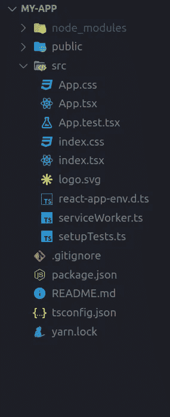
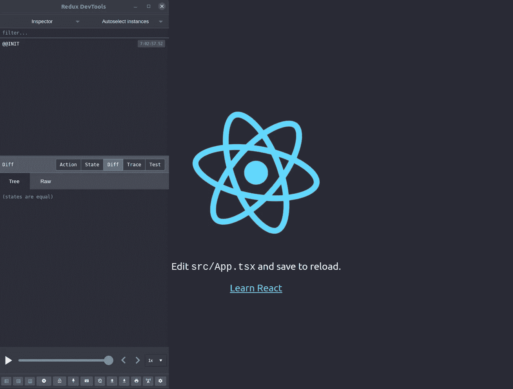
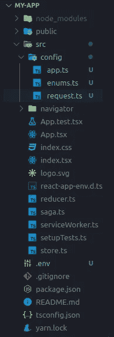
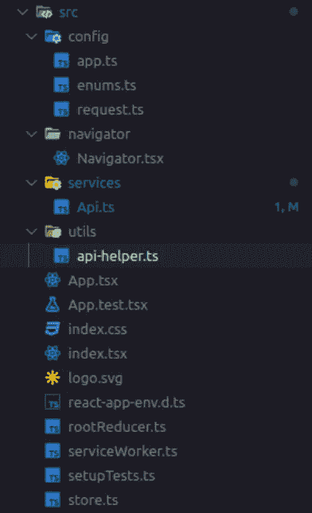

# 构建适合扩展的 React 应用程序(第一部分)

> 原文：<https://javascript.plainenglish.io/structuring-react-application-for-scale-part-i-1ce39f69bd42?source=collection_archive---------1----------------------->


Photo by [Marcello Gennari](https://unsplash.com/@marcello54?utm_source=medium&utm_medium=referral) on [Unsplash](https://unsplash.com?utm_source=medium&utm_medium=referral)

编写可维护代码的一个重要方面是正确设置代码。如果代码组织不当，很可能会导致错误并影响开发效率。

# 为什么要考虑组织代码？

来自不同堆栈和语言的开发人员对它的理解可能会非常不同，没有确定的方法，但是让我们尝试定义一下为什么它是好的

*   可读性
*   可预测性
*   一致性
*   更容易调试
*   更容易接纳新的开发人员

在本文中，我想分享一种组织 react 项目的方法，这种方法适用于中/大型应用程序。我们构建的方式是，我们将把应用程序分成更小的块(特性)，每个块将进一步分成

*   **数据层**:负责管理应用程序的状态
*   **表示层(UI)** :处理数据的表示

这将有助于我们轻松地在原子级别维护整个应用程序。由于我们将数据层和表示层分开，相同的结构也可以用于 react 本地项目。

在这个由两部分组成的系列中，我们将从头开始定义结构。您还需要对以下内容有一些基本的了解:

*   反应基础
*   反应钩
*   状态管理的 Redux
*   Redux-管理 Redux 的工具包
*   用于处理副作用的 Redux-saga(例如 API 调用)

虽然这种模式适用于小规模的项目，但可能有些矫枉过正，但是，嘿，一切都是从小处开始的，对吗？本文中定义的结构将构成我们将在本系列的下一篇文章中创建的应用程序的基础。

# 初始化项目

让我们通过在终端中运行以下命令，使用`create-react-app`初始化 react 项目(在 typescript 中)

```
npx create-react-app my-app --template typescript
```



初始化之后，我们将结束上面的结构。所有的业务逻辑都将放在`/src`文件夹中。

# 设置 Redux

对于状态管理，我们将使用`redux`和`redux-saga`。我们还将使用 RTK `@reduxjs/toolkit` (redux toolkit)，这是官方推荐的编写 redux 逻辑的方法。为了让 redux-saga 监听调度的 redux 动作，我们需要在创建 reducer 时注入 sagas，因为将使用`redux-injectors`。

注意:我们也可以使用其他状态管理选项，如 RxJS、上下文 API 等。

## `yarn add @reduxjs/toolkit react-redux redux-saga @types/react-redux redux-injectors`

让我们通过创建`/src/reducer.ts`、`/src/saga.ts`和`/src/store.ts`来配置 Redux 存储

```
// /src/reducer.ts
import { combineReducers } from "@reduxjs/toolkit";const reducers = {
  // ...reducers 
};function createRootReducer() {
    const rootReducer = combineReducers({
      ...reducers
    });

    return rootReducer;
};

export { createRootReducer };// /src/saga.ts
import { all, fork } from "redux-saga/effects";function* rootSaga() {
    yield all([
        // fork(saga1), fork(saga2)
    ]);
};

export { rootSaga };// /src/store.ts
import { configureStore, getDefaultMiddleware } from '@reduxjs/toolkit';
import createSagaMiddleware from 'redux-saga';
import { createInjectorsEnhancer } from 'redux-injectors';
import { createRootReducer } from './reducer';
import { rootSaga } from './saga';export type ApplicationState = {
  // will hold state for each chunk/feature 
};function configureAppStore(initialState: ApplicationState) {
  const reduxSagaMonitorOptions = {};
  const sagaMiddleware = createSagaMiddleware(reduxSagaMonitorOptions); const { run: runSaga } = sagaMiddleware; // sagaMiddleware: Makes redux saga works
  const middlewares = [sagaMiddleware]; const enhancers = [
    createInjectorsEnhancer({
      createReducer: createRootReducer,
      runSaga
    })
  ]; const store = configureStore({
    reducer: createRootReducer(),
    middleware: [...getDefaultMiddleware(), ...middlewares],
    preloadedState: initialState,
    devTools: process.env.NODE_ENV !== 'production',
    enhancers
  }); sagaMiddleware.run(rootSaga);
  return store;
}

export { configureAppStore };
```

现在让我们使用`/src/App.tsx`中的 **< Provider / >** 组件将 redux store 添加到应用程序中

```
// /src/App.tsx
import React from 'react';
import logo from './logo.svg';
import './App.css';
import { Provider } from 'react-redux';
import store from './store';function App() {
  return (
    <Provider store={store}>
    <div className="App">
      <header className="App-header">
        
        <p>
          Edit <code>src/App.tsx</code> and save to reload.
        </p>
        <a
          className="App-link"
          href="<https://reactjs.org>"
          target="_blank"
          rel="noopener noreferrer"
        >
          Learn React
        </a>
      </header>
      </div>
    </Provider>
  );
}export default App;
```

使用`npm start`保存并运行应用程序，检查是否一切运行正常。要检查 redux 是否正确集成，可以在浏览器中打开 Redux DevTools。



# 建立基地

在开始之前，让我们定义一些关于我们如何构建项目的基本类比

*   **配置:**应用相关配置，如 API 端点、枚举(常量)等
*   **组件:**多处使用的定制组件
*   **容器:**由特性或模块组成，其中组件连接到 Redux 存储
*   **导航器:**此处为路由相关逻辑
*   **服务:**与外界连接的模块，如所有的 API、分析等
*   实用工具:像 API 助手、日期助手等助手方法

让我们清理`src/App.tsx`，删除所有的样板代码。

```
// src/App.tsx
import React from 'react';
import { Provider } from 'react-redux';
import { ApplicationState, configureAppStore } from './store';const initialState: ApplicationState = {
  // ... initial state of each chunk/feature
};const store = configureAppStore(initialState);function App() {
  return (
    <Provider store={store}>
      <div>Hello world</div>
    </Provider>
  );
}export default App;
```

# 设置路由器

为了处理应用程序的路由逻辑，我们将在项目中添加`react-router-dom`，并在`/src/navigator/`中创建一个名为 **Navigator** 的组件

```
yarn add react-router-dom 
yarn add --dev @types/react-router-dom// src/navigator/Navigator.tsx
import React, { FC } from "react";
import { Switch, Route, BrowserRouter as Router } from "react-router-dom";type Props = {};const Navigator: FC<Props> = () => {
  return (
    <Router>
      <Switch>
        <Route
            path="/"
            render={() => <div>Hello world</div>} />
      </Switch>
    </Router>
  );
};export { Navigator };
```

并在`/src/App.tsx`中导入 **<导航器/ >** 组件

```
// /src/App.tsx
import React from "react";
import { Provider } from "react-redux";
import { ApplicationState, configureAppStore } from "./store";
import { Navigator } from "./navigator/Navigator";const initialState: ApplicationState = {
  // ... initial state of each chunk/feature
};const store = configureAppStore(initialState);function App() {
  return (
    <Provider store={store}>
      <Navigator />
    </Provider>
  );
}export default App;
```

点击保存，你应该可以看到 *Hello world* 文本。

# 设置配置

该文件夹将包含与应用程序相关的所有配置。对于基本设置，我们将添加以下文件

*   `/.env`:包含应用程序的所有环境变量，如 API 端点。如果文件夹是使用`create-react-app`搭建的，以`REACT_APP`为前缀的变量将被 webpack 配置自动读取，更多信息可以查看[官方指南](https://create-react-app.dev/docs/adding-custom-environment-variables/)。如果你有一个定制的 webpack 配置，你可以从 CLI 传递这些 env 变量，或者你可以使用像 [cross-env](https://www.npmjs.com/package/cross-env) 这样的包。

```
// .env 
// NOTE: This file is added at the root of the project
REACT_APP_PRODUCTION_API_ENDPOINT = "production_url"
REACT_APP_DEVELOPMENT_API_ENDPOINT = "development_url"
```

*   `**src/config/app.ts**` **:** 包含应用程序所需的所有访问密钥和端点。所有这些配置都将从上面定义的环境变量中读取。现在，让我们保持简单，我们将有两个环境，即生产和开发。

```
// src/config/app.ts
type Config = {
  isProd: boolean;
  production: {
    api_endpoint: string;
  };
  development: {
    api_endpoint: string;
  };
};const config: Config = {
  isProd: process.env.NODE_ENV === "production",
  production: {
    api_endpoint: process.env.REACT_APP_PRODUCTION_API_ENDPOINT || "",
  },
  development: {
    api_endpoint: process.env.REACT_APP_DEVELOPMENT_API_ENDPOINT || "",
  },
};export default config;
```

*   `**src/config/enums.ts**`:包含任何全局级枚举(常量)。现在，我们来声明一下。

```
// src/config/enums.ts
enum enums { 
	// GLOBAL_ENV = 'GLOBAL_ENV'
}export default enums;
```

*   `**src/config/request.ts**`:它包含默认的请求配置，我们稍后在进行 API 调用时会用到它。在这里，我们可以设置一些应用程序级别的 API 请求配置，如超时、最大内容长度、响应类型等。

```
// src/config/request.ts
type RequestConfig = {
  url: string,
  method: "get" | "GET" | "delete" | "DELETE" | "head" | "HEAD" | "options" | "OPTIONS" | "post" | "POST" | "put" | "PUT" | "patch" | "PATCH" | undefined,
  baseURL: string,
  transformRequest: any[],
  transformResponse: any[],
  headers: any,
  params: any,
  timeout: number,
  withCredentials: boolean,
  responseType: "json" | "arraybuffer" | "blob" | "document" | "text" | "stream" | undefined,
  maxContentLength: number,
  validateStatus: (status: number) => boolean,
  maxRedirects: number,
}const requestConfig: RequestConfig = {
  url: '',
  method: 'get', // default
  baseURL: '',
  transformRequest: [
    function transformRequest(data: any) {
      // Do whatever you want to transform the data
      return data;
    }
  ],
  transformResponse: [
    function transformResponse(data: any) {
      // Do whatever you want to transform the data
      return data;
    }
  ],
  headers: {},
  params: {},
  timeout: 330000,
  withCredentials: false, // default
  responseType: 'json', // default
  maxContentLength: 50000,
  validateStatus(status) {
    return status >= 200 && status < 300; // default
  },
  maxRedirects: 5, // default
};export default requestConfig
```

添加了以下文件的当前文件夹结构:

*   /src/config/app.ts
*   /src/config/enums.ts
*   /src/config/requests.ts
*   /.包封/包围（动词 envelop 的简写）



# 设置 API 服务

在这一节中，我们将为 API 调用设置一些辅助方法。为此，我们将使用 Axios 并为常见的本地存储和 API 方法`GET` `POST` `PUT` `PATCH` `DELETE`编写一个包装器。下面的包装器做了一些小的调整，甚至可以与 **fetch API** 或 **XMLHTTPRequest** 一起使用，它们不需要任何外部库就可以使用。这一点可以跳过，但是一点点的抽象可以提供更好的一致性和清晰可读的代码。

让我们首先将 Axios 包添加到项目中。

```
yarn add axios
```

现在我们将在`/src/utils`中创建一个名为`api-helper.ts`的文件，并将以下内容添加到该文件中。

```
// /src/utils/api-helper.ts
import axios from "axios";
import requestConfig from "../config/request";export type CustomError = {
  code?: number
  message: string
};export const getCustomError = (err: any) => {
  let error: CustomError = {
    message:  "An unknown error occured" 
  }; if (err.response
    && err.response.data
    && err.response.data.error
    && err.response.data.message) {
    error.code = err.response.data.error;
    error.message = err.response.data.message;
  } else if (!err.response && err.message) {
    error.message = err.message;
  } return error;
};export const getFromLocalStorage = async (key: string) => {
  try {
    const serializedState = await localStorage.getItem(key);
    if (serializedState === null) {
      return undefined;
    }
    return JSON.parse(serializedState);
  } catch (err) {
    return undefined;
  }
};export const saveToLocalStorage = async (key: string, value: any) => {
  try {
    const serializedState = JSON.stringify(value);
    await localStorage.setItem(key, serializedState);
  } catch (err) {
    // Ignoring write error as of now
  }
};export const clearFromLocalStorage = async (key: string) => {
  try {
    await localStorage.removeItem(key);
    return true;
  } catch (err) {
    return false;
  }
};async function getRequestConfig(apiConfig?: any) {
  let config = Object.assign({}, requestConfig);
  const session = await getFromLocalStorage("user");
  if (apiConfig) {
    config = Object.assign({}, requestConfig, apiConfig);
  }
  if (session) {
    config.headers["Authorization"] = `${JSON.parse(session).token}`;
  }
  return config;
}export const get = async (url: string, params?: string, apiConfig?: any) => {
  const config = await getRequestConfig(apiConfig);
  config.params = params;
  const request = axios.get(url, config);
  return request;
};export const post = async (url: string, data: any, apiConfig?: any) => {
  const config = await getRequestConfig(apiConfig);
  let postData = {};
  if (
    apiConfig &&
    apiConfig.headers &&
    apiConfig.headers["Content-Type"] &&
    apiConfig.headers["Content-Type"] !== "application/json"
  ) {
    postData = data;
    axios.defaults.headers.post["Content-Type"] =
      apiConfig.headers["Content-Type"];
  } else {
    postData = JSON.stringify(data);
    axios.defaults.headers.post["Content-Type"] = "application/json";
  }
  const request = axios.post(url, postData, config);
  return request;
};export const put = async (url: string, data: any) => {
  const config = await getRequestConfig();
  config.headers["Content-Type"] = "application/json";
  const request = axios.put(url, JSON.stringify(data), config);
  return request;
};export const patch = async (url: string, data: any) => {
  const config = await getRequestConfig();
  config.headers["Content-Type"] = "application/json";
  const request = axios.patch(url, JSON.stringify(data), config);
  return request;
};export const deleteResource = async (url: string) => {
  const config = await getRequestConfig();
  const request = axios.delete(url, config);
  return request;
};
```

`getCustomError`将错误处理成自定义类型`CustomError`并且`getRequestConfig`负责在用户被授权的情况下向 API 请求添加授权。这个实用 API 助手可以根据后端使用的逻辑进行修改。

让我们继续设置`/src/services/Api.ts`,在这里我们将声明所有的 API 调用。任何需要与外界交互的东西都将归入`/src/services`之下，比如 API 调用、分析等。

```
// /src/services/Api.ts
import config from "../config/app";
import * as API from "../utils/api-helper";const { isProd } = config;const API_ENDPOINT = isProd
  ? config.production.api_endpoint
  : config.development.api_endpoint;// example GET API request
/** 
	export const getAPIExample = (params: APIRequestParams) => {
		const { param1, param2 } = params;
		const url = `${API_ENDPOINT}/get_request?param1=${param1}&param2=${param2}`; return API.get(url);
	}
*/
```

包含以下更改的当前文件夹结构将如下所示:

*   /src/utils/api-helper.ts
*   /src/services/Api.ts



# 后续步骤

乡亲们！这是这一部分的主要内容，尽管我们在其中定义了应用程序的所有业务逻辑，即`containers` & `components`，我们将在下一部分通过创建一个小的 Reddit 客户端来获取特定主题的结果。

我也给了这个 GitHub 知识库的链接，请随意使用它作为参考，如果你喜欢它，请推广这个回购以最大化它的可见性。

[](https://github.com/anishkargaonkar/react-reddit-client/tree/setup) [## anishkargaonkar/react-Reddit-client

### 这个项目是用 Create React App 引导的。在项目目录中，您可以运行:在…中运行应用程序

github.com](https://github.com/anishkargaonkar/react-reddit-client/tree/setup) 

非常感谢你阅读这篇文章，希望这是一个有趣的阅读！我很想听听你的想法。下一部见[。再见！](https://medium.com/@anishkargaonkar/structuring-react-application-for-scale-part-ii-d652ff418da0)

[](https://medium.com/@anishkargaonkar/structuring-react-application-for-scale-part-ii-d652ff418da0) [## 结构化反应量表的应用(下)

### 在上一个教程中，我们定义了可伸缩 react 应用程序的基本结构。为了展示这一切是如何发生的…

medium.com](https://medium.com/@anishkargaonkar/structuring-react-application-for-scale-part-ii-d652ff418da0)