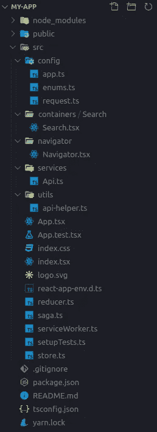
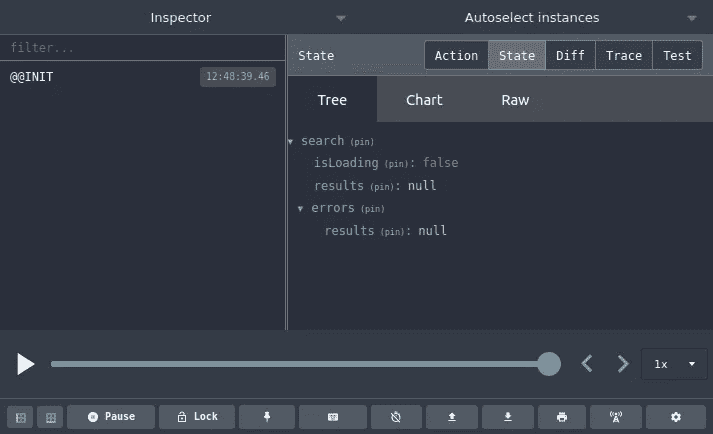
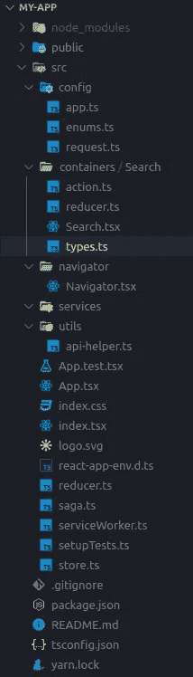
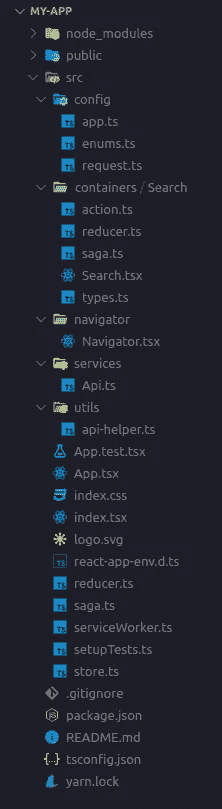

# 结构化反应量表的应用(下)

> 原文：<https://javascript.plainenglish.io/structuring-react-application-for-scale-part-ii-d652ff418da0?source=collection_archive---------7----------------------->


Photo by [Andreas Wagner](https://unsplash.com/@waguluz_?utm_source=medium&utm_medium=referral) on [Unsplash](https://unsplash.com?utm_source=medium&utm_medium=referral)

## 构建一个 Reddit 客户端，用户可以在其中搜索多个主题，并以列表的形式获得结果。

在上一个教程中，我们定义了可伸缩 React 应用程序的基本结构。为了演示这一切是如何结合在一起的，我们将构建一个 Reddit 客户端，用户可以在其中搜索多个主题，并以列表的形式获得结果。

如果你还不知道，请参考[第一部分](https://medium.com/@anishkargaonkar/structuring-react-application-for-scale-part-i-1ce39f69bd42)以深入了解该结构。


Final preview

GitHub:[https://github.com/anishkargaonkar/react-reddit-client](https://github.com/anishkargaonkar/react-reddit-client)
主持:[https://reddit-client-88d34d.netlify.app/](https://reddit-client-88d34d.netlify.app/)

# Reddit 客户端

让我们从在`/src/cotainers/Search/Search.tsx`创建一个名为 **Search** 的容器开始

```
// /src/cotainers/Search/Search.tsx
import React, { FC } from "react";type Props = {};const Search: FC<Props> = (props: Props) => {
    return (
        <div>Search Container</div>
    )
};export { Search };
```

并在`/src/navigator/Navigator.tsx`将其添加到**导航器**组件中

```
// /src/navigator/Navigator.tsx
import React, { FC } from "react";
import { Switch, Route, BrowserRouter as Router } from "react-router-dom";
import { Search } from "../containers/Search/Search";type Props = {};const Navigator: FC<Props> = () => {
  return (
    <Router>
      <Switch>
        <Route path="/" component={Search} />
      </Switch>
    </Router>
  );
};export { Navigator };
```

完成上述更改后，文件夹结构应该如下所示



# 添加搜索状态

我们将使用 Reddit 的搜索 API 来查询和获取结果。格式如下所示

```
<https://www.reddit.com/r/all/search.json?q=><query>&limit=<limit>
```

你可以在 Reddit 的[官方文档](https://www.reddit.com/dev/api/)上找到更多细节

让我们在`.env`定义我们的 API 端点

```
// /.envREACT_APP_PRODUCTION_API_ENDPOINT = "<https://www.reddit.com>"
REACT_APP_DEVELOPMENT_API_ENDPOINT = "<https://www.reddit.com>"
```

在我们的例子中，两个端点将是相同的，因为我们没有单独的应用后端环境。

在定义我们的 redux 状态之前，我们首先需要知道我们的数据看起来如何，所以让我们首先通过在我们的 **Search** 容器中创建一个文件`types.ts`来定义模型。

一般来说，这些模型是在项目开始之前就决定的，而项目是在一段时间内逐步发展的。有时可能会发生这样的情况，我们事先没有一个模型，在这种情况下，开发人员可以根据用例自由地发挥他/她的想象力。但最好是有了起点之后再开始，这样有助于避免后期的大量变化。对于我们的用例，我们可以查询上面的搜索查询链接以获得响应，并使用类似于 [json2ts](http://json2ts.com/) 的类型脚本生成器工具来获得我们的类型脚本模式。

注意:如果您使用的是 JavaScript，您可以跳过这一部分，但是一定要看一下这个模型。

```
// src/containers/Search/types.ts
export interface Result {
  title: string;
  thumbnail: string;
  permalink: string;
}export interface SearchResults {
  after: string;
  dist: number;
  modhash: string;
    children: {
        kind: string;
        data: Result;
  };
  before?: any;
}// reddit API response Model
export interface Search {
  kind: string;
  data: SearchResults;
}
```

我们定义了一个名为 **Search** 的模型，它表示从 Reddit 搜索 API 发送的数据。为了简单起见，我们省略了应用程序中不使用的属性。**结果**模型表示每个 Reddit 结果。

我们还将在`types.ts`中添加一个 **SearchQuery** 接口，在这里我们将定义进行 Reddit 搜索所需的查询参数

```
// src/containers/Search/types.ts... // Search Result modelexport interface SearchQuery {
  query: string;
  limit: number;
};
```

现在让我们为`types.ts`中的**搜索**容器定义 redux 状态和动作类型

```
// src/containers/Search/types.ts
import { CustomError } from "../../utils/api-helper";... // Search Result interface ... // Search Query interface// Search action types
export enum SearchActionTypes {
    GET_RESULTS_REQUEST = "@@search/GET_RESULTS_REQUEST",
    GET_RESULTS_SUCCESS = "@@search/GET_RESULTS_SUCCESS",
    GET_RESULTS_ERROR = "@@search/GET_RESULTS_ERROR",  
}interface Errors {
  results: CustomError | null
}// Search redux state 
export interface SearchState {
   isLoading: boolean,
   results: Search | null,
   errors: Errors
}
```

对于搜索 API 请求，在任何给定的时间点只能有 3 种状态，

*   **获取结果请求:**获取结果时
*   **获取结果成功:**当我们收到成功的响应时
*   **获取结果错误:**当我们收到错误响应时

类似地，对于**搜索**容器状态，我们定义了:

*   **isLoading:** 布尔值，用于跟踪是否有任何 API 请求被发出
*   **结果:**搜索结果将存储在哪里。
*   **错误:**每个属性最多跟踪 1 个错误响应(这里我们跟踪的是`results`)。

如果你已经注意到我们使用了一个带有`null`类型的管道(|)操作符，这意味着在任何给定点，它的值将是类型 **T** 或 **null** 。我们也可以使用`undefined`,但是这样我们将需要总是声明那个属性，并分配一个空值，这反过来使我们的代码更可读。

让我们将 **SearchState** 添加到`src/store.ts`中定义的 **ApplicationState** 中，并将其命名为`search`

```
// src/store.ts
... // imports
**import { SearchState } from './containers/Search/reducer';**export type ApplicationState = {
  **search: SearchState**
};function configureAppStore(initialState: ApplicationState) {
  ... // store configuration 
}export { configureAppStore };
```

让我们在 redux 中定义搜索状态的动作。为此，我们将使用 redux-toolkit 的`createAction`和`createReducer`助手函数分别用于动作和 reducer。

```
// src/containers/Search/action.ts
import { createAction } from "@reduxjs/toolkit";
import { CustomError } from "../../utils/api-helper";
import { Search, SearchActionTypes, SearchQuery } from "./types";export const getResultsRequest = createAction<SearchQuery>(
  SearchActionTypes.GET_RESULTS_REQUEST
);export const getResultsSuccess = createAction<Search>(
  SearchActionTypes.GET_RESULTS_SUCCESS
);export const getResultsError = createAction<CustomError>(
  SearchActionTypes.GET_RESULTS_ERROR
);
```

这里我们定义了 3 种动作类型。因为我们使用了 TypeScript，所以我们也为`getResultsRequest` `getResultsSuccess`和`getResultsError`定义了有效负载类型。有效负载类型将有助于连接流并避免错误。

是时候为**搜索**状态设置 reducer 了，它将监听调度的动作，如果动作类型匹配，redux 状态将被更新。为了创建缩减器，我们将使用 redux-toolkit 中的`createReducer` helper 实用程序，使用 TypeScript 推荐的构建器回调符号。欲了解更多信息，请随时查看 [redux-toolkit 文档。](https://redux-toolkit.js.org/api/createReducer)

```
// src/containers/Search/reducer.ts
import { createReducer } from "@reduxjs/toolkit";
import {
  getResultsError,
  getResultsRequest,
  getResultsSuccess,
} from "./action";
import { SearchState } from "./types";const initalState: SearchState = {
  isLoading: false,
  results: null,
  errors: {
    results: null,
  },
};const reducer = createReducer(initalState, (builder) => {
  return builder
    .addCase(getResultsRequest, (state, action) => {
      state.isLoading = true;
      state.results = null;
      state.errors.results = null;
    })
    .addCase(getResultsSuccess, (state, action) => {
      state.isLoading = false;
      state.results = action.payload;
    })
    .addCase(getResultsError, (state, action) => {
      state.isLoading = false;
      state.errors.results = action.payload;
    });
});export { initalState as searchInitialState, reducer as searchReducer };
```

这里我们创建了一个 reducer，它将监听先前创建的 **SearchActionTypes** ，并相应地更新状态。现在为了保持这个例子简单，我们不考虑分页和其他预先列表操作。我们将假设搜索结果将只被提取一次，我们将为最近的请求保留数据，因此，当一个新的`getResultsRequest`产生时，我们正在重置状态。我们还导出了初始状态(**searchininitialstate**)，这也将表示应用程序引导时的搜索状态。

注意:你也可以使用 redux-toolkit 提供的`createSlice`方法，它将为你创建两个动作和一个 reducer。动作类型可以内联提供。更多信息，可以参考 [redux-toolkit 文档](https://redux-toolkit.js.org/api/createSlice)。

现在让我们将初始搜索状态添加到`src/App.tsx`中的初始应用状态

```
// src/App.tsx
import React from 'react';
import { Provider } from 'react-redux';
import { ApplicationState, configureAppStore } from './store';
import { Navigator } from "./navigator/Navigator";
**import { searchInitialState } from './containers/Search/reducer';**const initialState: ApplicationState = {
  **search: searchInitialState**
};const store = configureAppStore(initialState);function App() {
  return (
    <Provider store={store}>
      <Navigator />
    </Provider>
  );
}export default App;
```

我们还需要通过将搜索归约器添加到`src/reducer.ts`来将它添加到根归约器中

```
// src/reducer.ts
import { combineReducers } from "@reduxjs/toolkit";
**import { searchReducer } from './containers/Search/reducer';**const reducers = {
  **search: searchReducer**
};function createRootReducer() {
    const rootReducer = combineReducers({
      ...reducers
    });

    return rootReducer;
};

export { createRootReducer };
```

现在，当您运行应用程序时，您应该能够在 Redux 状态中看到一个可用的`search`状态。



文件夹结构将如下所示:



现在我们已经完成了 redux 设置，是时候为**搜索**容器设置 saga 中间件了。让我们首先在**搜索**容器中创建一个文件`saga.ts`，并定义一个`getSearchResults`函数来监听`GET_SEARCH_RESULTS`动作类型。为了理解 redux-saga 如何工作，你可以查看他们的官方文件。

```
// src/containers/Search/saga.tsimport { all, fork, takeLatest } from "redux-saga/effects";
import { getResultsRequest } from "./action";function* getSearchResults() {
    // get search results API request
}function* watchFetchRequest() {
  yield takeLatest(getResultsRequest.type, getSearchResults);
}export default function* searchSaga() {
  yield all([fork(watchFetchRequest)]);
}
```

我们已经定义了一个 **searchSaga** ，我们将在`store.ts`中导入它，这样它就被注册了。`getSearchResults`将包含负责发出 API 请求的代码，并根据响应分派成功或错误操作。

在此之前，我们需要首先在`src/services/Api.ts`中创建一个用于发出 API 请求的函数。如上所述，要从 Reddit 获得搜索结果，我们可以使用下面的端点，我们将从组件传递`query` & `limit`。

```
<https://www.reddit.com/r/all/search.json?q=><query>&limit=<limit>
```

我们已经在环境配置中添加了基本 URL([https://www.reddit.com](https://www.reddit.com))作为`API_ENDPOINT`。

让我们定义一个函数 **fetchSearchResults** ，我们将使用`src/utils/api-helper.ts`中的`get`辅助函数。

```
// src/services/Api.ts
import config from "../config/app";
import * as API from "../utils/api-helper";
import { SearchQuery } from "../containers/Search/types";const { isProd } = config;const API_ENDPOINT = isProd 
	? config.production 
	: config.development;export const fetchSearchResults = (params: SearchQuery) => {
  const { query, limit } = params;
  const url = `${API_ENDPOINT}/r/all/search.json?q=${query}&limit=${limit}`; return API.get(url);
};
```

现在我们可以使用 **fetchSearchResults** ，让我们完成我们的搜索传奇，并进行 get search API 调用。

将动作指定为一个传奇的参数有点棘手，我们必须使用 TypeScript 的[类型保护。有趣的是，redux-toolkit 的](https://www.typescriptlang.org/docs/handbook/advanced-types.html#user-defined-type-guards)[文档](https://redux-toolkit.js.org/api/createAction#actioncreatormatch)中也提到了这一点。简而言之，我们必须使用 actionCreator 的 actionCreator.match 方法将传递的动作区分为所需的类型。因此，在区分之后，我们接收到匹配动作有效负载的期望静态类型。

玩了一圈回应，最后有了下面这个`saga.ts`。

```
// src/containers/Search/saga.ts
import { Action } from '@reduxjs/toolkit';
import { all, call, fork, put, takeLatest } from "redux-saga/effects";
import { getResultsError, getResultsRequest, getResultsSuccess } from "./action";
import * as Api from "../../services/Api";
import { getCustomError } from '../../utils/api-helper';function* getSearchResults(action: Action) {
  try {
    if (getResultsRequest.match(action)) {
      const res = yield call(Api.fetchSearchResults,action.payload);
      const data = res.data;
      if (res.status !== 200) {
        yield put(getResultsError(data.error));
      } else {
        yield put(getResultsSuccess(data));
      }
    }
  } catch (err) {
    yield put(getResultsError(getCustomError(err)))
  }
}function* watchFetchRequest() {
  yield takeLatest(getResultsRequest.type, getSearchResults);
}export default function* searchSaga() {
  yield all([fork(watchFetchRequest)]);
}
```

要注册 **searchSaga** ，只需在`src/saga.ts`的 root saga 中导入即可。

```
// src/saga.ts
import { all, fork } from "redux-saga/effects";
import searchSaga from "./containers/Search/saga";function* rootSaga() {
    yield all([
        fork(searchSaga)
    ]);
};

export { rootSaga };
```

这就完成了应用程序的数据设置。现在我们可以从 UI 实现开始。文件夹结构将如下所示



我们可以将用户界面分为两个部分

*   **SearchInput** :它将有一个输入字段，将接受来自用户的搜索查询
*   **结果:**基本上这里我们会显示查询的结果

让我们在`src/containers/Search/views`处创建一个名为`views`的文件夹，上面列出的组件将放在这里。容器内的`view`文件夹(有时命名为`screens`)将包含特定于该容器或访问全局状态(在我们的例子中为 redux 状态)的组件。

为了简单起见，由于制作输入和加载器等组件超出了本文的范围，我将使用一个组件库 [ant design](http://ant.design) 。但是如果你想知道，可能在多个地方使用的组件将会被放在`src/components`文件夹中。

尽管如果你使用钩子，决定一个组件应该放在哪里可能有点困难。在这种情况下，作为一个经验法则，如果一个组件正在访问全局状态，即从 redux 存储使用`useSelector`钩子，那么它应该被列在`src/containers/{feature}/views`文件夹下。

让我们将 ant 设计组件添加到项目中

```
yarn add antd @ant-design/icons
```

一旦流程完成，我们需要将 ant design 的 CSS 添加到`/src/index.css`中。让我们使用黑暗主题，因为谁不喜欢黑暗主题呢？

```
// src/index.css
@import '~antd/dist/antd.dark.css';body {
  margin: 0;
  font-family: -apple-system, BlinkMacSystemFont, 'Segoe UI', 'Roboto', 'Oxygen',
    'Ubuntu', 'Cantarell', 'Fira Sans', 'Droid Sans', 'Helvetica Neue',
    sans-serif;
  -webkit-font-smoothing: antialiased;
  -moz-osx-font-smoothing: grayscale;
}code {
  font-family: source-code-pro, Menlo, Monaco, Consolas, 'Courier New',
    monospace;
}
```

让我们在`src/containers/Search/views`中创建一个 **SearchInput** 组件，用户可以在其中搜索主题

```
// src/containers/Search/views/SearchInput.tsx
import React, { FC, useEffect, useState } from "react";
import { Avatar, Input } from "antd";
import logo from "../../../assets/logo.svg";
import "../styles.css";
import { useDispatch, useSelector } from "react-redux";
import { ApplicationState } from "../../../store";
import { getResultsRequest } from "../action";type Props = {};const { Search } = Input;
const SearchInput: FC<Props> = (props: Props) => {
  const dispatch = useDispatch();
  const [searchQuery, setSearchQuery] = useState("");
  const [searchQueryLimit, setSearchQueryLimit] = useState(0); const isLoading = useSelector<ApplicationState, boolean>(
    (s) => s.search.isLoading
  ); const onSearchQueryChangeHandler = (
    e: React.ChangeEvent<HTMLInputElement>
  ) => {
    const val = e.target.value;
    setSearchQuery(val);
  }; const onSearchHandler = () => {
    dispatch(getResultsRequest({
      query: searchQuery,
      limit: searchQueryLimit
    }))
  } useEffect(() => {
    setSearchQueryLimit(25);
  }, []) return (
    <div className="search-input-container">
      <Avatar src={logo} shape="circle" size={150} />
      <Search
        className="search-input"
        placeholder="Search for a topic"
        loading={isLoading}
        value={searchQuery}
        onChange={onSearchQueryChangeHandler}
        onSearch={onSearchHandler}
      />
    </div>
  );
};export { SearchInput };
```

让我们从顶部开始，我们已经创建了一个功能组件 **SearchInput。**我们使用 useSelector 和 useDispatch 钩子来访问 redux 状态并调度 redux 动作。我们还使用 useState 钩子来管理本地搜索查询和搜索查询限制，并使用 useEffect 在函数组件中执行副作用。

从蚂蚁设计组件库中，我们导入了**头像**和**输入。搜索**组件。我们还在`src/containers/Search/styles.css`中定义了一些样式，还在`src/assets`中添加了 [Reddit logo SVG](https://raw.githubusercontent.com/anishkargaonkar/react-reddit-client/master/src/assets/logo.svg) 。

```
/* src/containers/Search/styles.css */
.container {
    display: flex;
    justify-content: center;
    align-items: center;
    height: 100vh;
}.search-input-container {
    display: flex;
    justify-content: center;
    align-items: center;
    flex-direction: column;
}.search-input {
    margin: 2rem 0;
    border-radius: 5px;
}
```

现在在**搜索**中导入**搜索输入**组件

```
// src/containers/Search/Search.tsximport React, { FC } from "react";
import "./styles.css";
import { SearchInput } from "./views/SearchInput";type Props = {};const Search: FC<Props> = (props: Props) => {
  return (
    <div className="container">
      <SearchInput />
    </div>
  );
};export { Search };
```

现在点击保存，让它编译，然后导航到`[http://localhost:3000](http://localhost:3000/)`你应该能看到这样的东西

到目前为止的文件夹结构

现在让我们处理**结果**组件，它将显示查询的结果。我们将把这个组件添加到**搜索**容器的`views`文件夹中。

让我们创建一个名为 **ResultListItem** 的定制组件来显示每个结果。此外，让我们添加一个操作类型来重置结果，我们可以用它来返回到开始屏幕。

```
// src/containers/Search/types.ts// ... SearchResults modelexport interface Search {
  kind: string;
  data: SearchResults;
}export interface SearchQuery {
  query: string;
  limit: number;
};interface Errors {
  results: CustomError | null
}export enum SearchActionTypes {
  GET_RESULTS_REQUEST = "@@search/GET_RESULTS_REQUEST",
  GET_RESULTS_SUCCESS = "@@search/GET_RESULTS_SUCCESS",
  GET_RESULTS_ERROR = "@@search/GET_RESULTS_ERROR", **RESET_RESULTS = '@@search/RESET_RESULTS'**
}export interface SearchState {
  isLoading: boolean,
  results: Search | null,
  errors: Errors
}
```

这里，我们向`src/containers/Search/types.ts`添加了一个`RESET_RESULTS`动作类型，它将用于在**搜索状态**中将`results`状态重置为`null`。

```
// src/containers/Search/action.tsimport { createAction } from "@reduxjs/toolkit";
import { CustomError } from "../../utils/api-helper";
import { Search, SearchActionTypes, SearchQuery } from "./types";export const getResultsRequest = createAction<SearchQuery>(
  SearchActionTypes.GET_RESULTS_REQUEST
);export const getResultsSuccess = createAction<Search>(
  SearchActionTypes.GET_RESULTS_SUCCESS
);export const getResultsError = createAction<CustomError>(
  SearchActionTypes.GET_RESULTS_ERROR
);**export const resetResults = createAction(
  SearchActionTypes.RESET_RESULTS
);**
```

这里我们添加了一个新的动作类型 **resetResults** ，注意我们没有像对其他动作那样定义返回类型？因为在`resetResultst`中没有返回值，所以没有必要定义动作类型。

```
// src/containers/Search/reducer.tsimport { createReducer } from "@reduxjs/toolkit";
import {
  getResultsError,
  getResultsRequest,
  getResultsSuccess,
  resetResults,
} from "./action";
import { SearchState } from "./types";const initalState: SearchState = {
  isLoading: false,
  results: null,
  errors: {
    results: null,
  },
};const reducer = createReducer(initalState, (builder) => {
  return builder
    .addCase(getResultsRequest, (state, action) => {
      state.isLoading = true;
      state.results = null;
      state.errors.results = null;
    })
    .addCase(getResultsSuccess, (state, action) => {
      state.isLoading = false;
      state.results = action.payload;
    })
    .addCase(getResultsError, (state, action) => {
      state.isLoading = false;
      state.errors.results = action.payload;
    })
    **.addCase(resetResults, (state, action) => {
      state.results = null;
    });**
});export { initalState as searchInitialState, reducer as searchReducer };
```

在减速器中增加一个`resetResults`箱，并将`results`设置为`null`，即初始状态。

现在让我们创建一个**结果**组件来显示搜索结果。

```
// src/containers/Search/views/Results.tsx
import React, { FC } from "react";
import { useDispatch, useSelector } from "react-redux";
import { ApplicationState } from "../../../store";
import { Search } from "../types";
import { ResultListItem } from "../../../components/ResultListItem/ResultListItem";
import logo from "../../../assets/logo.svg";
import { ArrowLeftOutlined } from "@ant-design/icons";
import { Button } from "antd";
import { resetResults } from "../action";
import "../styles.css";type Props = {};const Results: FC<Props> = (props: Props) => {
  const dispatch = useDispatch();
  const results = useSelector<ApplicationState, Search | null>(
    (s) => s.search.results
  ); const onResetResultsHandler = () => {
    dispatch(resetResults());
  }; return (
    <div>
      <div className="result-header">
        <Button
          icon={<ArrowLeftOutlined />}
          shape="circle-outline"
          onClick={() => onResetResultsHandler()}
        />
        <div>Search Results</div>
        <div />
      </div>
      {!results || results.data.children.length === 0 ? (
        <div className="no-results-container">No results found</div>
      ) : (
        <div className="results-container">
          {results.data.children.map((result, index) => (
            <ResultListItem
              key={index}
              title={result.data.title}
              imageURL={result.data.thumbnail === "self" ? logo : result.data.thumbnail}
              sourceURL={result.data.permalink}
            />
          ))}
        </div>
      )}
    </div>
  );
};export { Results };/* src/containers/Search/styles.css */
.container {
    display: flex;
    justify-content: center;
    align-items: center;
    height: 100vh;
}.search-input-container {
    display: flex;
    justify-content: center;
    align-items: center;
    flex-direction: column;
}.search-input {
    margin: 2rem 0;
    border-radius: 5px;
}.result-header {
   font-size: 1.5rem;
   display: flex;
   justify-content: space-between;
   align-items: center;
   padding: 0.5rem;
}.result-header > i {
    cursor: pointer;
}.results-container {
    max-width: 100vh;
    max-height: 80vh;
    overflow-y: scroll;
}.no-results-container {
    width: 100vh;
    height: 80vh;
    overflow: hidden;
    display: flex;
    justify-content: center;
    align-items: center;
}
```

上面我们定义了一个名为**结果**的功能组件，样式在`src/containers/Search/styles.css`中定义。我们使用钩子来获取和重置 redux 状态`results`。

现在让我们定义 **ResultListItem** 组件及其在`src/components/ResultListItem`中的样式。这里遵循的模式类似于容器的模式。对于一个可以在多个地方使用的组件，我们将其定义在一个名为**组件**的文件夹中，并创建一个包含组件逻辑和样式的组件名文件夹。

```
// src/components/ResultListItem/ResultListItem.tsximport React, { FC } from "react";
import "./styles.css";
import logo from "../../assets/logo.svg";type Props = {
  title: string;
  imageURL: string;
  sourceURL: string;
};const ResultListItem: FC<Props> = (props: Props) => {
  const { title, imageURL, sourceURL } = props; const onClickHandler = (url: string) => {
    window.open(`https://reddit.com/${url}`);
  }; return (
      <div className="item-container" onClick={() => onClickHandler(sourceURL)}>
           logo} />
          <div>
              <div className="title">{title}</div>
          </div>
    </div>
  );
};export { ResultListItem };/* src/components/ResultListItem/styles.css */
.item-container {
    display: flex;
    align-items: center;
    padding: 0.5rem;
    width: 100%;
    height: 6rem;
    border: 1px solid rgb(77, 77, 77);
    margin-bottom: 0.5rem;
    border-radius: 4px;
    cursor: pointer;
}.thumbnail {
    width: 5rem;
    border-radius: 0.2rem;
}.title {
    font-weight: bold;
    padding: 1rem;
}
```

并对**搜索**容器进行以下更改，以显示**结果**组件(如果存在搜索结果),否则显示**搜索输入**组件。

```
// src/containers/Search/Search.tsx
import { message } from "antd";
import React, { FC, useEffect } from "react";
import { useSelector } from "react-redux";
import { ApplicationState } from "../../store";
import { CustomError } from "../../utils/api-helper";
import "./styles.css";
import { Search as SearchModel } from "./types";
import { Results } from "./views/Results";
import { SearchInput } from "./views/SearchInput";type Props = {};const Search: FC<Props> = (props: Props) => {
  const results = useSelector<ApplicationState, SearchModel | null>(
    (s) => s.search.results
  );
  const searchError = useSelector<ApplicationState, CustomError | null>(
    (s) => s.search.errors.results
  ); useEffect(() => {
    if (searchError) {
      message.error(searchError.message);
    }
  }, [searchError]); return (
    <div className="container">{!results ? <SearchInput /> : <Results />}</div>
  );
};export { Search };
```

最后，你的项目结构应该看起来像上面所有的变化

一旦保存了以上所有的更改，项目应该可以编译了，您应该能够搜索一个主题并看到如下所示的结果

您可以参考下面的存储库获得最终代码。

[](https://github.com/anishkargaonkar/react-reddit-client) [## anishkargaonkar/react-Reddit-client

### 这个项目是构建 react 项目规模的一个例子。主办地:https://reddit-client-88d34d.netlify.app/…

github.com](https://github.com/anishkargaonkar/react-reddit-client) 

# 结束语

在这个由两部分组成的系列文章中，我试图定义一种适合我的结构，在这种结构中，调试 bug、添加不断变化范围的新特性在 React 和 React-Native 中都是容易和可管理的。尽管没有适用于所有人的完美结构，但这可以是一个很好的起点。

我希望你喜欢读这篇文章，就像我喜欢写它一样。很想听听你的想法。再见！

*更多内容请看*[***plain English . io***](https://plainenglish.io/)*。报名参加我们的* [***免费周报***](http://newsletter.plainenglish.io/) *。关注我们关于*[***Twitter***](https://twitter.com/inPlainEngHQ)[***LinkedIn***](https://www.linkedin.com/company/inplainenglish/)*[***YouTube***](https://www.youtube.com/channel/UCtipWUghju290NWcn8jhyAw)*[***不和***](https://discord.gg/GtDtUAvyhW) *。对增长黑客感兴趣？检查* [***电路***](https://circuit.ooo/) *。***