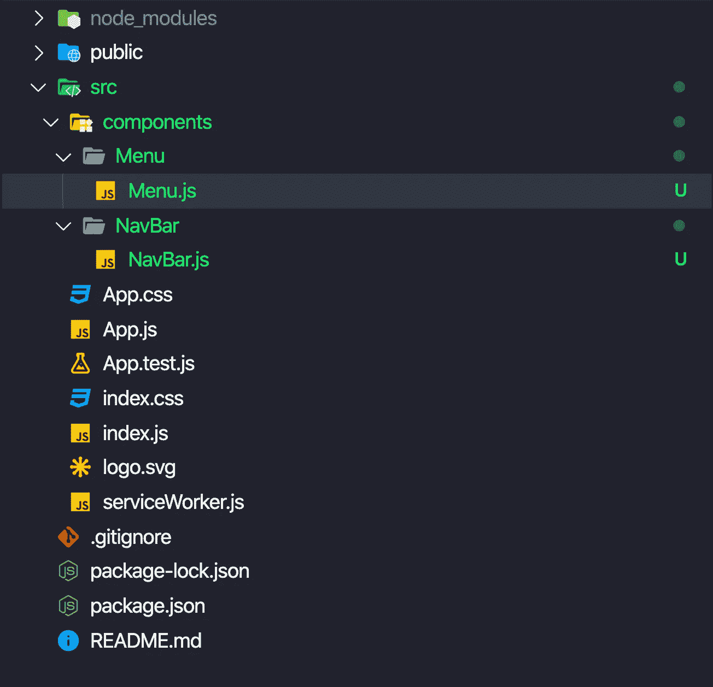
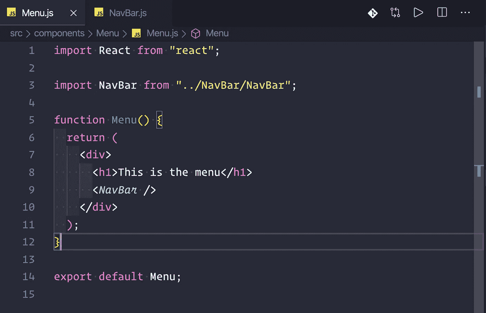
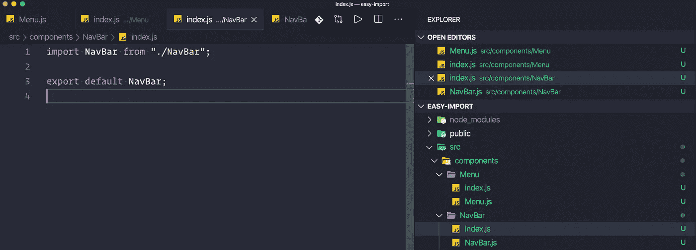
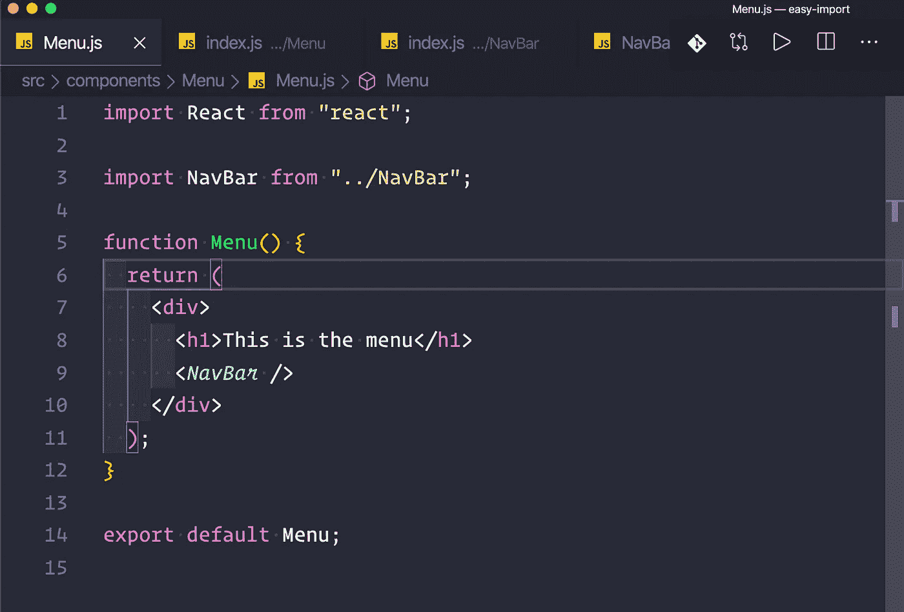

# 结构化 React 组件以便于导入

> 原文：<https://javascript.plainenglish.io/structuring-react-components-for-easy-imports-bc6e876cf541?source=collection_archive---------4----------------------->

在这篇短文中，我想分享一些我作为一名 React 开发人员在短时间内学到的项目结构。在我最近的工作中，当从组件自己的文件夹中导入组件时，我遇到了以下模式。

我们举个例子。这是一些玩具项目的当前目录结构。

给定这个目录结构，如果我想在`Menu`组件中导入`NavBar`，我必须按如下方式进行:

虽然我的文本编辑器有自动完成功能，但我并不是`../NavBar/NavBar`的粉丝。我宁愿要`../NavBar`。

要实现这一点，我们只需要为每个组件添加`index.js`文件！在`index.js`文件里面应该有以下内容:

现在我们可以修改`Menu`组件，用路径`../NavBar`导入`NavBar`！

编辑:我被告知这种技术叫做桶装。知道这些事情的正确术语总是好的！