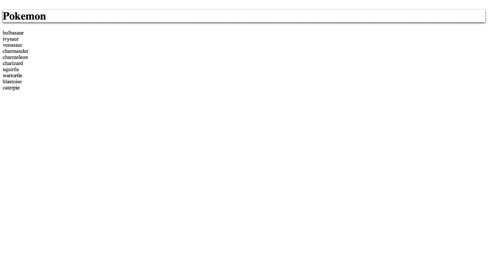
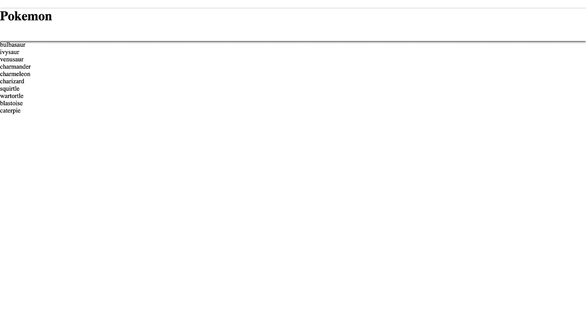

# Next.js 中的样式化组件入门

> 原文：<https://javascript.plainenglish.io/styled-components-in-next-js-9a4e84278bdb?source=collection_archive---------8----------------------->

您可以编写实际的 CSS 代码来设计组件的样式。它还删除了组件和样式之间的映射。对我来说，它比 CSS/SASS/SCSS 要好。 [***风格分量***](https://styled-components.com/docs/basics)


Photo by [Roman Synkevych](https://unsplash.com/@synkevych?utm_source=medium&utm_medium=referral) on [Unsplash](https://unsplash.com?utm_source=medium&utm_medium=referral)

我正在使用来自[上一篇文章](https://jetlysandita.medium.com/how-to-build-ssr-page-with-next-js-d6cc9a51f63a)的现有项目。我们将会使口袋妖怪列表变得更加有趣。你可以[在这里](https://github.com/jetlysandita/medium_pokemon)克隆并使用 branch init。

# 1.将样式化组件添加到项目中

```
yarn add styled-components
```

# 2.制作标题组件

标题为例，你可以尝试其他人以后与你的方式。在根目录下创建组件文件夹。在文件夹组件内创建文件夹标题。

创建文件 **StyledHeader.js** 并创建带有样式化组件的组件。

```
import styled from "styled-components";const StyledHeader = styled.div`padding: 0;margin: 0;box-shadow: 0px 2px 5px 0px rgba(0, 0, 0, 0.75);`;export default StyledHeader;
```

你可以用你的风格来改变风格。有背景或者别的什么。

因为这个文件只用于自定义样式，所以我们需要为一个组件视图创建 **index.jsx** 文件，就像一个通用的 react 组件一样。

```
import StyledHeader from "./StyledHeader";export default function Header() {return (<StyledHeader><h1>Pokemon</h1></StyledHeader>);}
```

让我们呈现文件 **MainLayout.js** 中的 header 组件

```
import Head from "next/head";import Header from "../components/Header";export default function MainLayout(props) {const { children } = props;return (<><Head><title>Pokemon</title></Head><Header /><div>{children}</div></>);}
```

是工作但没有风格，为什么？因为默认下一个 js SSR。因此，我们必须使样式组件 SSR。我们改一下 **_document.js** 。

```
import Document, { Html, Head, Main, NextScript } from "next/document";import { ServerStyleSheet } from "styled-components";const sheet = new ServerStyleSheet();class MyDocument extends Document {static async getInitialProps(ctx) {const sheet = new ServerStyleSheet();const originalRenderPage = ctx.renderPage;try {ctx.renderPage = () =>originalRenderPage({// useful for wrapping the whole react treeenhanceApp: (App) => (props) =>sheet.collectStyles(<><App {...props} /></>,),// useful for wrapping in a per-page basisenhanceComponent: (Component) => Component,});// Run the parent `getInitialProps`, it now includes the custom `renderPage`const initialProps = await Document.getInitialProps(ctx);return {...initialProps,styles: (<>{initialProps.styles}{sheet.getStyleElement()}</>),};} finally {sheet.seal();}}render() {return (<Html lang="en"><Head /><body><Main /><NextScript /></body></Html>);}}export default MyDocument;
```

重新运行，它的工作。但正文仍有填充或边距。



Image By [Jetly Sandita](https://jetlysandita.medium.com/)

# 3.使用样式化组件创建全局样式

我们需要改变我们的体型。你可以用下一个 js 的全局 CSS 来做这件事，但是它又是 CSS/sass，所以不要这样做，让我们用样式化的组件再次改变 **_document.js** (这里的[document](https://styled-components.com/docs/faqs#note-regarding-css-import-and-createglobalstyle))。你可以添加其他字体或任何东西。

```
import Document, { Html, Head, Main, NextScript } from "next/document";import { ServerStyleSheet, createGlobalStyle } from "styled-components";const GlobalStyle = createGlobalStyle`body {padding: 0;margin: 0;}`;class MyDocument extends Document {static async getInitialProps(ctx) {const sheet = new ServerStyleSheet();const originalRenderPage = ctx.renderPage;try {ctx.renderPage = () =>originalRenderPage({// useful for wrapping the whole react treeenhanceApp: (App) => (props) =>sheet.collectStyles(<><GlobalStyle /><App {...props} /></>,),// useful for wrapping in a per-page basisenhanceComponent: (Component) => Component,});// Run the parent `getInitialProps`, it now includes the custom `renderPage`const initialProps = await Document.getInitialProps(ctx);return {...initialProps,styles: (<>{initialProps.styles}{sheet.getStyleElement()}</>),};} finally {sheet.seal();}}render() {return (<Html lang="en"><Head /><body><Main /><NextScript /></body></Html>);}}export default MyDocument;
```

# 4.用道具改变风格

样式化组件在样式化时获得道具值。所以我们可以用道具自定义组件样式，就像这样。

```
import styled from "styled-components";const StyledHeader = styled.div`padding: 0;margin: 0;${(props) => props.height && `height: ${props.height}px;`};box-shadow: 0px 2px 5px 0px rgba(0, 0, 0, 0.75);`;export default StyledHeader;import StyledHeader from "./StyledHeader";export default function Header({ height }) {return (<StyledHeader height={height}><h1>Pokemon</h1></StyledHeader>);}
```



Image By [Jetly Sandita](https://jetlysandita.medium.com/)

你可以试试其他类似的东西。试试字体大小或任何你需要的东西，让它看起来更漂亮。

接下来，我将分享一个主题，并为库组件扩展样式化组件。

[在此查看项目](https://github.com/jetlysandita/medium_pokemon/tree/styled-components)

如果你知道任何其他方法，建议或问题，请在下面评论。谢谢:)