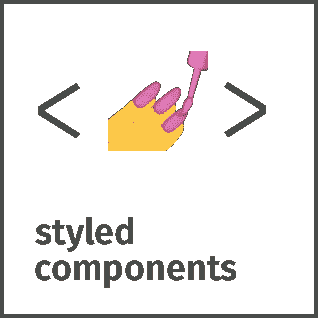
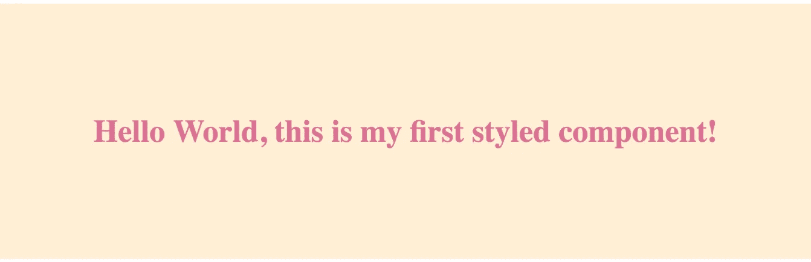

# 如何在 React 应用中使用样式化组件

> 原文：<https://javascript.plainenglish.io/styled-components-react-js-library-b1ae0bccb6be?source=collection_archive---------7----------------------->

## Styled Components 是一个 CSS 工具，可以帮助您组织 React 项目。在这里学习如何使用它！

> 组件时代的视觉原语。使用 ES6 和 CSS 的精华来设计你的应用，没有压力💅



这个库帮助你**构建小的、可重用的组件**负责你的应用程序的外观。

允许你写真正的 CSS 代码来设计你的组件。它还消除了组件和样式之间的映射——使用组件作为底层样式构造再简单不过了！

`styled-components`兼容 React(网络版)和 React Native——这意味着它是真正通用应用的完美选择！更多信息参见关于 React Native 的[文档。](https://www.styled-components.com/docs/basics#react-native)

# 装置

安装样式组件只需一个命令，您就可以开始了:

```
npm install --save styled-components
```

# 入门指南

styled-components 利用带标签的模板文本来设计组件的样式。

按照本文档 [**开始使用样式化组件**](https://www.styled-components.com/docs/basics#getting-started)

# [单据](https://www.styled-components.com/docs)

有关使用`styled-components`的更多信息，请参见[styled-components.com/docs](https://www.styled-components.com/docs)的文档！

快速链接到一些最常访问的页面:

*   [入门](https://www.styled-components.com/docs/basics)
*   [API 参考](https://styled-components.com/docs/api)
*   [主题化](https://www.styled-components.com/docs/advanced#theming)
*   [服务器端渲染](https://www.styled-components.com/docs/advanced#server-side-rendering)
*   [标记的模板文字解释](https://www.styled-components.com/docs/advanced#tagged-template-literals)

# 版本 5

styled-components v5 现在正式进入测试版！立即在您的项目中试用它:

```
npm install styled-components@beta
```

注意事项:

*   确保您使用的是 react 的钩子兼容版本(> = 16.8 for react、react-dom 和 react-is)
*   如果你使用 jest 风格的组件，请升级

# 例子

```
import React from 'react';

import styled from 'styled-components';

// Create a <Title> react component that renders an <h1> which is
// centered, palevioletred and sized at 1.5em
const Title = styled.h1`
  font-size: 1.5em;
  text-align: center;
  color: palevioletred;
`;

// Create a <Wrapper> react component that renders a <section> with
// some padding and a papayawhip background
const Wrapper = styled.section`
  padding: 4em;
  background: papayawhip;
`;

// Use them like any other React component – except they're styled!
<Wrapper>
  <Title>Hello World, this is my first styled component!</Title>
</Wrapper>
```

这是您将在浏览器中看到的内容:



[Image Source](https://github.com/styled-components/styled-components)

官方 [GitHub](https://github.com/styled-components/styled-components) 链接:【https://github.com/styled-components/styled-components】T2

官方[网站](https://www.styled-components.com/)链接:[https://www.styled-components.com/](https://www.styled-components.com/)

我要感谢本库的[创建者](https://github.com/styled-components)和贡献者所做的出色工作。