# 用样式化组件设计 React 原生应用的样式

> 原文：<https://javascript.plainenglish.io/styling-your-react-native-app-with-styled-components-6939afde3d2f?source=collection_archive---------7----------------------->

## 样式化组件的力量:可重用性和灵活性

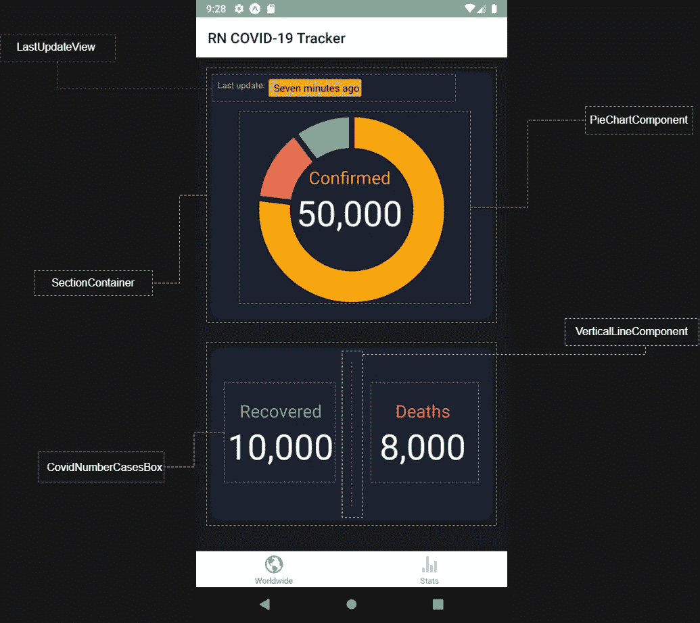

Provided by the author

当我准备开始一个新的 React 本机应用程序时。就在我定义了堆栈和我将在中使用的所有技术之后。我想到了一个问题。我应该遵循哪种方法来增强 React 本机应用程序的 CSS 样式？。

这个问题是由于我在以前的 RN 项目中一直使用内联样式和 CSS 外部文件方法来样式化我的组件。然而，我听说过一些关于样式化组件方法的强大之处。所以下一个问题是，我应该继续依赖这些方法还是尝试一下样式化组件？你猜怎么着？我转向了样式组件。

# 用户体验:可用性和功能性

你有没有打开一个手机或网络应用程序，当它打开后，你想逃离它？。我们一登陆或打开应用程序就放弃了。第一印象很重要，我的朋友。依我拙见，首先是用户界面，然后是交互，同时还有功能。

我是二项式的忠实粉丝:功能性和可用性。对我来说，它们就像海洋和潮汐。不可能看到他们单独独立吧？。

如果我们能够通过可用性和功能性保证良好的用户体验，当然，我们可以确保 100%的用户不仅会再次使用该应用程序，还会使用我们开发的新应用程序。

# 什么是样式化组件？

styled-component 是使用新的 CSS-in-JS 方法用普通 CSS 编写的组件。这种方法允许您在 JavaScript 代码中编写普通的 CSS。由于使用了[模板文字，这是可能的。](https://developer.mozilla.org/en-US/docs/Web/JavaScript/Reference/Template_literals)这意味着你可以嵌入表达式，并赋予你使用多行字符串和字符串插值的能力。

因此，为了让我们的组件具有风格，我们需要使用任何 CSS-in-JS 解决方案，例如使用 CSS-in-JS 风格框架的[风格组件](https://styled-components.com/)或[情感](https://emotion.sh/docs/introduction)库。

# 给你一个使用样式化组件的理由列表

依我拙见，使用它们最有力的理由是它们有助于优化我们的开发者体验。然而，还有更多原因。接下来我们来列举一下。

*   您可以为 react 应用程序和 React 本机应用程序使用样式化组件。
*   您永远不必担心类名重复或拼写错误。因为 styled-components 生成唯一的类名。
*   一种更简单的方法来找到和删除 CSS。我知道在我们的代码库中使用一个类名有多痛苦。样式化组件使这一点变得很明显，因为每一点样式都与一个特定的组件相关联。
*   自由和简单的动态风格。您可以根据组件的道具或全局主题的使用来调整组件的样式。它简单直观，无需手动管理几十个类。
*   逃避痛苦的维护。您永远不需要搜索不同的文件来找到影响组件的样式，所以无论您的代码库有多大，维护都是一个问题。

## 用样式化组件构建的令人惊叹的东西的列表

*   Grommet 是一个考虑到可访问性、模块化、响应性和主题化的组件库。
*   [平滑 UI](https://github.com/smooth-code/smooth-ui) :基于样式化组件的 UI 库/设计系统
*   [ReaKit](https://github.com/diegohaz/reakit) :用 React 和 styled-components 构建交互式 ui 的工具包。

# 入门指南

# 装置

Styled-components 是一个 NPM 软件包。因此，要安装它，我们只需要运行下一个命令。

```
npm install --save styled-components
```

现在，我们已经安装并知道了什么是风格化组件，以及使用它们的最重要的原因，是时候跳到水里去湿一点了。因此，让我们构建一些 React 本机样式的组件。

# 设计我们的应用程序:新冠肺炎追踪器

下一张图向我们展示了我们应用程序的全球屏幕。我们将为这个屏幕构建每个需要的样式组件。

注意:*` react-Native-responsive-screen`*是一个非常简单的库，可以让我们的 React 原生应用完全响应。所以，你会通过我们的组件看到它。


Worldwide Screen — Styled Components UI

这就是在全球屏幕上看起来像完整代码的样子。放心吧！我们将为您在下一段代码中看到的所有组件实现每个样式化组件的设计。


Worldwide Screen — Code

在上面的代码中，您可以看到组成整个全球屏幕的所有组件。下一步是为屏幕构建每个组件。

## LastUpdateComponent

这个组件将有三个样式组件和一个包装函数组件。它将包含容器、文本和日期时间/时间之前的信息。

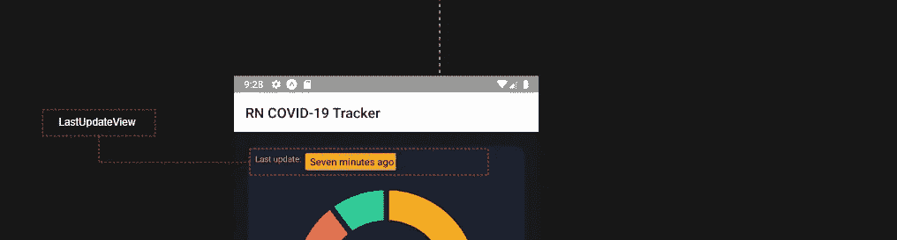

LastUpdateView Component UI

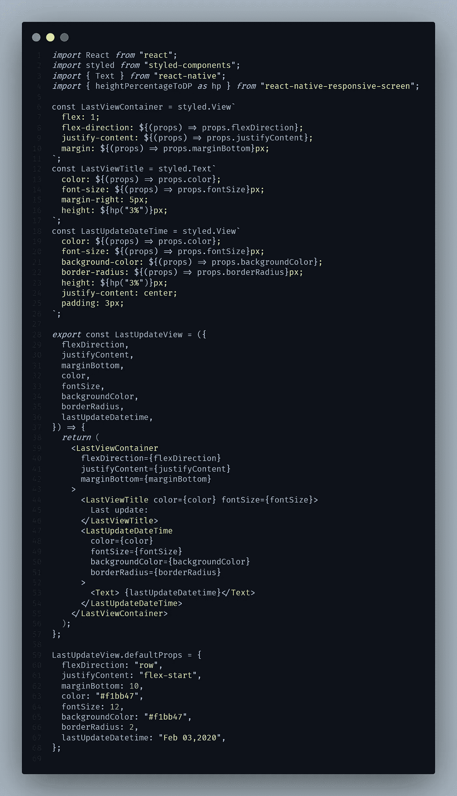

LastUpdateView Code

## 垂直分量

这个组件的想法是在两个视图之间呈现一条垂直线。它还会有一些动态 CSS 属性，这些属性会根据道具而改变。它就像一个分离器。然而，它将在不同的屏幕上跨应用程序使用。

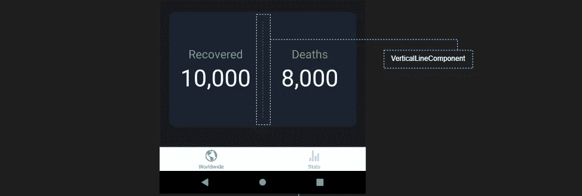

VerticalLine Component UI

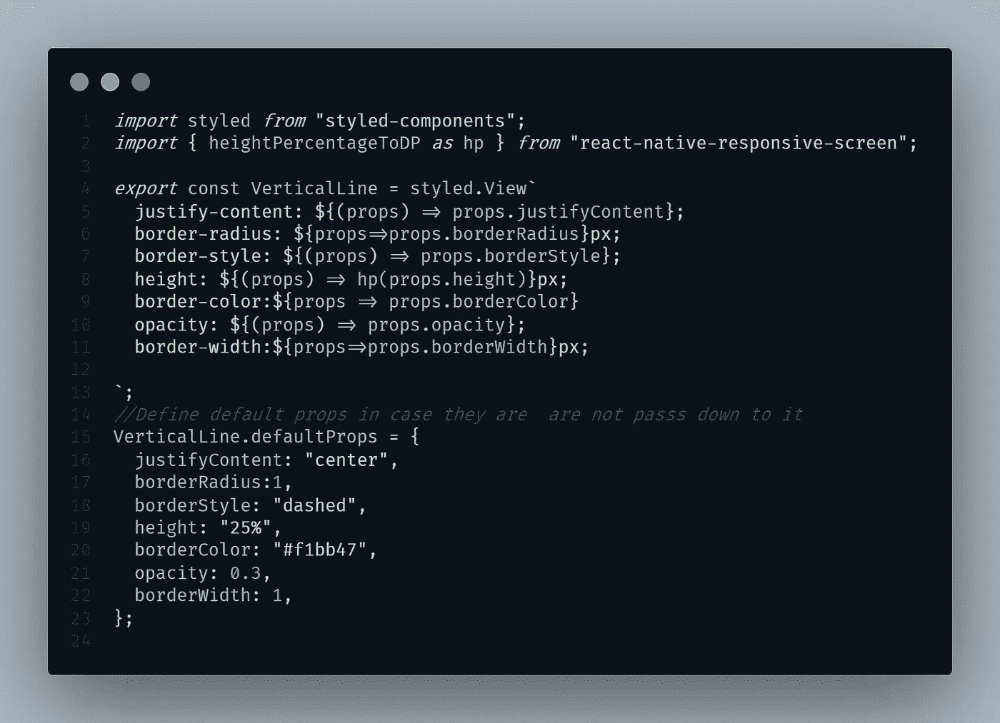

VerticalLine Code

## 截面容器

我认为有一个突出显示内容的盒子是个好主意。当部分容器组件出现时。它只是一个组织我们内容的盒子。

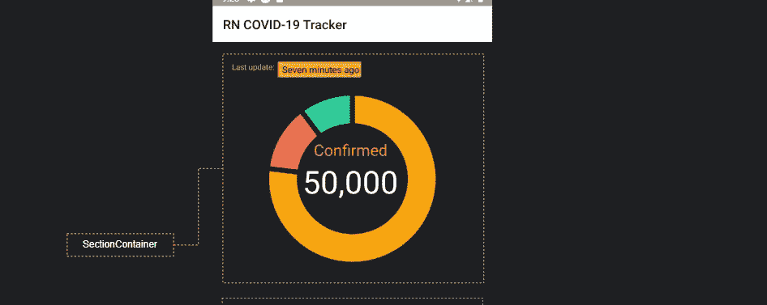

Section Container UI

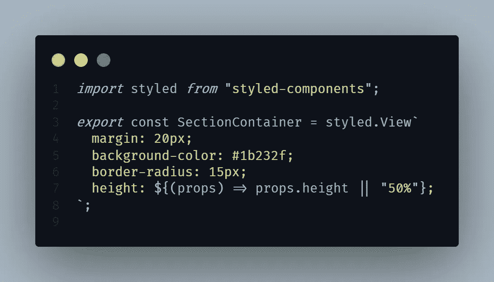

Section Container code

## COVID 编号案例框

该组件将呈现图像。这个想法是要有灵活性，在应用程序的任何屏幕上显示这个组件。

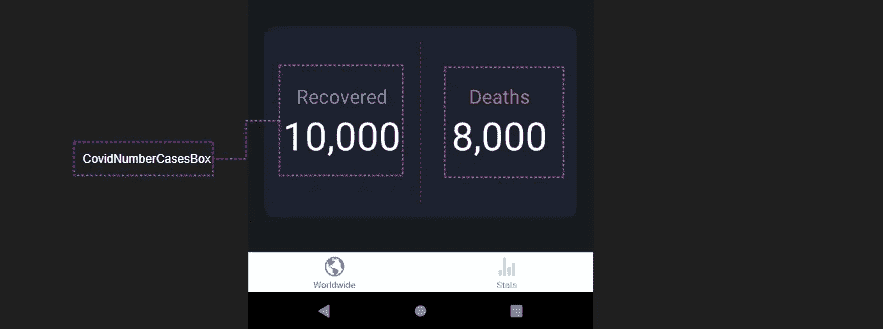

COVID Number Cases Box — UI


COVID Number Cases Box — Code

## 饼图组件

最后，您可以推断饼图组件将呈现饼图。我们将在应用程序的不同地方重用这个组件。因此，在一些屏幕上，它将呈现全球数据，但在另一些屏幕上，它将呈现特定国家或地区的数据。

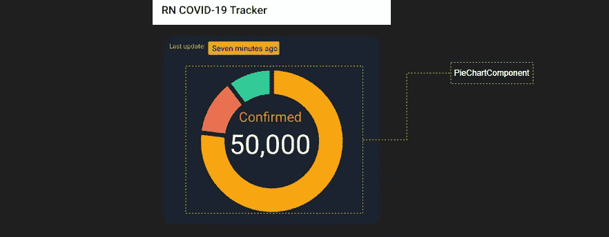

Pie Chart Component — UI

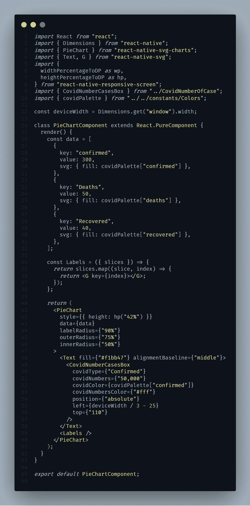

Pie Chart Component — Code

# 需要记住的几个要点

## 使用默认道具

如果你不想面对未来的应用程序崩溃，那么使用默认道具。当丢失的道具出现时，这是一个很好的练习。所以每当应用程序试图渲染一个组件时，不会因为缺少一些道具而崩溃。

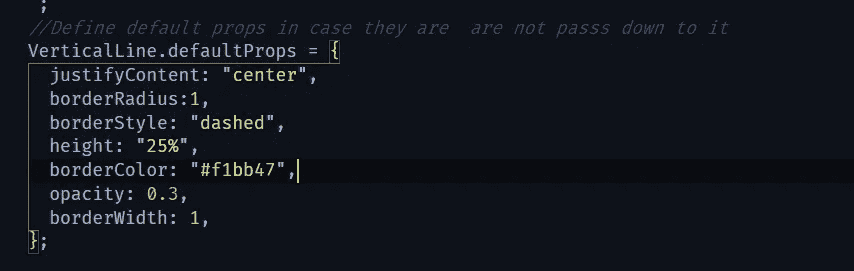

VerticalLine Component — Default Props

## 使用伪元素

CSS 伪元素的使用在任何 web 应用中都非常重要，因此 React 原生应用也是如此。然而，无论是使用样式表 API 还是内联样式，它们都不适用于 React Native。因此，如果你需要使用它们，你必须使用样式化组件。

## 它不适用于关键帧和全局样式

与网页版的一些区别是，您不能使用关键帧和 createGlobalStyle 辅助对象，因为 React Native 不支持关键帧或全局样式。如果您使用媒体查询或嵌套您的 CSS，我们也会警告您。

## 组件命名约定

遵循最流行的组件命名约定。我们需要使用大写字母和 camel case 练习来命名样式化组件。

```
const LastUpdateView = styled.View`your style here`;
```

## 嵌套样式

在某些情况下，我们需要使用嵌套样式的方法。但是，请记住，样式化组件的主要目的是避免它。这是第一种方法。相反，它遵循组件模式。

*感谢阅读！我希望这篇文章对你有所帮助。*

## **用简单英语写的 JavaScript 笔记**

我们已经推出了三种新的出版物！请关注我们的新出版物: [**AI in Plain English**](https://medium.com/ai-in-plain-english) ，[**UX in Plain English**](https://medium.com/ux-in-plain-english)，[**Python in Plain English**](https://medium.com/python-in-plain-english)**——谢谢，继续学习！**

**我们也一直有兴趣帮助推广高质量的内容。如果您有一篇文章想要提交给我们的任何出版物，请发送电子邮件至[**submissions @ plain English . io**](mailto:submissions@plainenglish.io)**，使用您的 Medium 用户名，我们会将您添加为作者。另外，请让我们知道您想加入哪个/哪些出版物。****