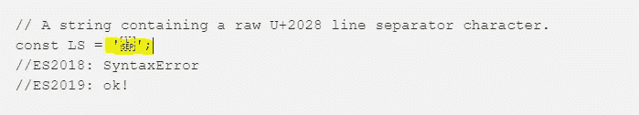

# 包含 JSON 和格式良好的 JSON.stringify

> 原文：<https://javascript.plainenglish.io/subsume-json-and-well-formed-json-stringify-323f70c9dc36?source=collection_archive---------7----------------------->

## JSON 的新改进(S2019)


在这篇小文章中，我们将讨论 javascript 世界中的一些最新提议，这些提议将被包含在 ES2019 中。这些都是包容 JSON 和 JSON.stringify 中的新修改。

## 包含 JSON

根据这一提议(作者为 Mark Miller 和 Mathias Bynens)，JSON 成为 JSON.parse 中 ECMAScript 的一个句法子集。这一提议处于第 4 阶段，计划纳入 ES2019。

到目前为止，JSON 还不是 ECMAScript 的子集，JSON 字符串可以包含 U+2029 段落分隔符和未转义的 U+2028 行分隔符，而 ECMAScript 字符串则不能。这些差异增加了开发的复杂性，并促进了 bug 的引入。

在这个新的建议中，ECMAScript 字符串可以包含原始的 U+2028 和 U+2029 字符，消除了 JSON 和 ECMAScript 之间令人困惑的不匹配。

我放了一个代码的图像，这样就可以很好地看到不同操作系统上的行分隔符:



U+28 line separator character image

```
// A raw U+2029 character, produced by eval:
const PS = eval('"\u2029"');
//ES2018: SyntaxError
//ES2019: ok!
```

这种变化是向后兼容的。当分析包含段落分隔符或无转义行分隔符或的字符串时，可见效果将仅限于消除语法错误完成。

## 格式良好的 JSON.stringify

该提案(由 Richard Gibson 撰写)处于第 4 阶段，是 ECMAScript 2019 的一部分。

如果输入包含任何单独的替代字符(范围为 0xd 800–0xdff 的 JavaScript 字符)，则 JSON.stringify 先前被指定返回格式不正确的 Unicode 字符串。当我们交换 JSON 时，根据 JSON 的 RFC，我们必须将其编码为 UTF-8。如果我们使用 JSON.stringify()，这可能是一个问题，因为它可能返回无法编码为 UTF-8 的 UTF-16 序列。

```
JSON.stringify('\u{D800}')
//'"�"'
```

这个建议改变了 JSON.stringify()，以便通过代码单元转义序列来表示它们:

```
JSON.stringify('\u{D800}')
//'"\\ud800"'
```

## 结论

这些新的变化可能不像最新提案中引入的其他变化那样引人注目，但它们使语言更加健壮和一致，避免了可能的编程错误。

我希望它对你有用。非常感谢你阅读我！

## **来自 JavaScript 的简单英语注释**

我们推出了三种新的出版物！通过以下方式表达对我们新出版物的热爱: [**通俗易懂的 AI**](https://medium.com/ai-in-plain-english)、[、**通俗易懂的 UX**、](https://medium.com/ux-in-plain-english)、[、**通俗易懂的 Python**、](https://medium.com/python-in-plain-english)、**、**——谢谢您，继续学习！

我们也一直有兴趣帮助推广高质量的内容。如果您有一篇文章想要提交给我们的任何出版物，请发送电子邮件至[**submissions @ plain English . io**](mailto:submissions@plainenglish.io)**，使用您的 Medium 用户名，我们会将您添加为作者。另外，请让我们知道您想加入哪个/哪些出版物。**