# Chrome 开发者工具的超级有用的提示和技巧

> 原文：<https://javascript.plainenglish.io/super-useful-tips-and-tricks-of-chrome-developer-tools-8b3c27d3ebca?source=collection_archive---------5----------------------->

## 救生提示和技巧

Photo by [Zan](https://unsplash.com/@zanilic?utm_source=medium&utm_medium=referral) on [Unsplash](https://unsplash.com?utm_source=medium&utm_medium=referral)

Chrome 开发者工具是 web 开发的重要组成部分。

这里有一些 chrome 开发者工具的提示和技巧，可以让你在开发过程中更加轻松。

**对整个页面进行截图**

1.当 chrome developer 工具打开时，通过按 Control + Shift + P 或 Command + Shift + P (Mac)来打开命令菜单。

2.在搜索框中输入截图，然后从结果中选择“捕获全尺寸截图”。

无论页面有多长，它都会对整个页面进行截图。

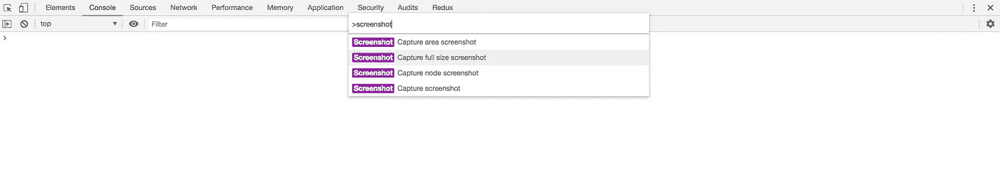

Full Page Screenshot

你可以使用这个技巧截取页面的任何部分。假设你在 freecodecamp.org 网站的[首页，想截图页眉](http://freecodecamp.org)

1.通过检查选择标题。

2.从命令菜单中选择“捕获节点截图”

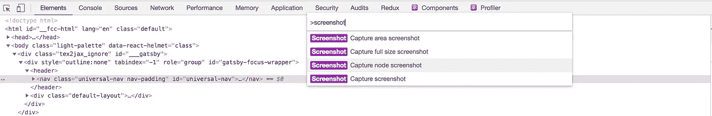

Node Screenshot

**获取页面上任意元素的 CSS 样式**

假设你在[google.com](http://google.com)想看看应用于谷歌标志的 CSS 样式

1.右键单击 google 徽标图像，然后选择 inspect

2.右键单击图像标签并选择复制->复制样式，应用于徽标的样式将被复制到剪贴板

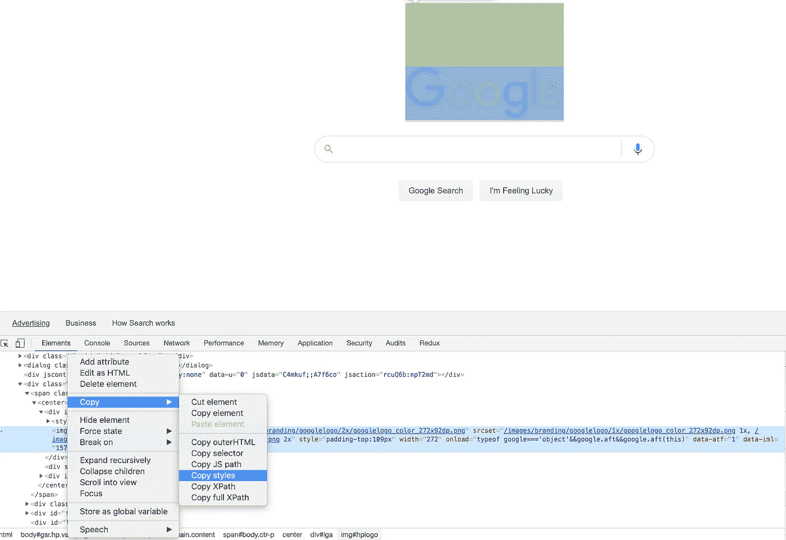

Copy Styles

**片段**

代码片段是您想要在任何网站上执行的 javascript 代码。

这是为了避免在控制台中手动复制粘贴代码来测试每一页。您可以随时在任何网站上运行创建的代码片段。

**创建一个代码片段**

1.转到开发者工具的源选项卡

2.单击新片段

3.写代码

4.通过给文件起一个名字来保存文件

5.通过右键单击代码片段文件名并选择 run 来执行代码

例如，如果您想获得网页上包含的所有脚本，您可以运行下面的 get_all_scripts.js 文件

Get All Scripts

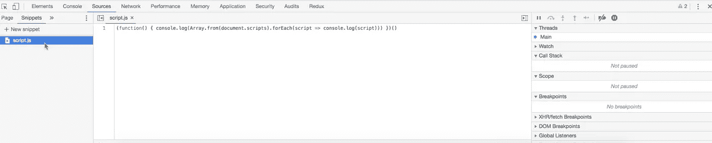

Snippet Example

注意，需要执行的代码片段必须是 IIFE(立即调用的函数表达式)

**本地超控**

这种技术允许将本地 javascript 或 CSS 文件映射到生产站点上的文件。这对于调试生产问题非常有用。

很多时候，UAT /生产环境具有特定于环境的数据，如数据库、迁移脚本等，因此不可能让本地环境具有与 UAT /生产环境相同的数据。在这种情况下，本地覆盖变得非常方便。通过映射本地文件，您可以直接在 UAT / Production 上快速执行任何 javascript 或 CSS，而无需部署更改。

为此，请遵循以下步骤。

1.在您的计算机上创建一个新文件夹来存储覆盖文件

2.转到源选项卡内的覆盖选项卡(如果默认情况下未显示，点击两个箭头选择覆盖选项卡)

3.点击“选择覆盖文件夹”

4.选择在第一步中创建的文件夹

5.单击浏览器顶部弹出窗口中的“允许”按钮，允许对浏览器文件进行更改

6.更改任何 javascript 或 CSS 文件，并使用 Control + S 或 Command + S 保存文件(Mac)

7.第一次保存时，您可能会看到“DevTools 已与页面断开连接”错误。这是可以的。

8.使用 Control + R 或 Command + R 重新加载页面(Mac)

9.您可以看到您的更改反映在网站上。

它将保存您的更改，即使在刷新过程中也是如此，因此您可以在提交到 UAT 或生产站点之前测试您的更改。

请注意，如果在浏览器中进行更改感觉不太好，您可以在您喜欢的编辑器(如 VS Code)中对 javascript 或 CSS 文件进行更改。只需将该文件复制到第一步中创建的文件夹的正确目录下，并在浏览器中刷新页面。

查看下面的演示视频

Local Overrides Demo

**在控制台中获取格式化的 JSON**

假设您有以下 JSON。

*const book = { " date ":" 2019–03–22 "，" book ":"哈利波特"，"作者":" J.K .罗琳" }；*

为了使它在控制台中更具可读性，可以使用 JSON.stringify(book，null，2)

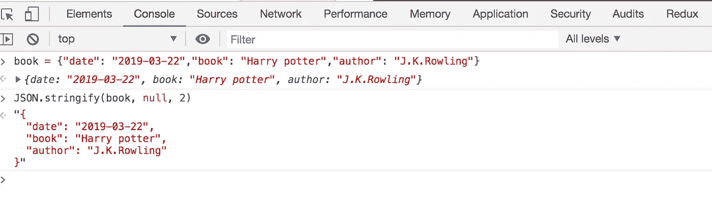

Formatted JSON

作为最后一个参数传递的 2 是每行之前要使用的空格数。您甚至可以通过制表符\t 来缩进它

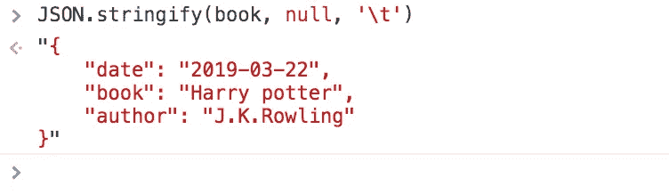

Tab Formatted JSON

**调试时将变量值复制到剪贴板**

假设您正在通过添加断点来调试 chrome 中的代码，变量值是一个 long JSON，并且您想要复制该值以供检查，您可以在控制台中通过传递变量名来执行复制功能，该值将被复制到您的剪贴板

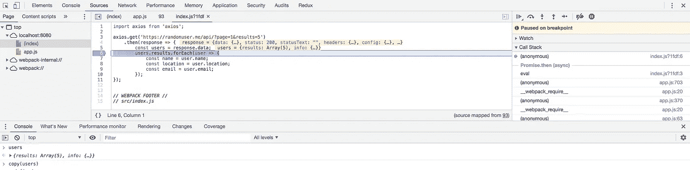

Copy Value

**调试时注意变量值的变化**

很多时候，在 chrome 中调试时，你会发现自己用鼠标悬停在变量名上来检查它的当前值。

每次用鼠标检查每个变量的值时，这是很痛苦的。您可以不这样做，而是通过单击调试器中监视部分旁边的+按钮，将该变量名添加到监视列表中，如下所示

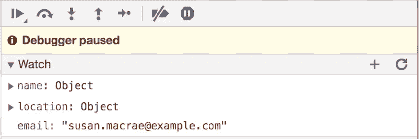

Watch Expression

因此，每次您单步执行代码时，监视部分中的当前值都会更新，您不必将鼠标悬停在变量名上

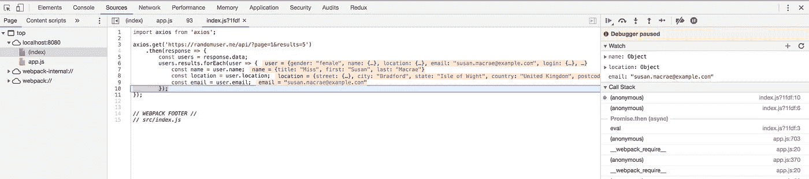

Watch Example

**即时编辑任何网站文本**

现在来了一个很酷的技巧，可以让你编辑网站上显示的任何文本。这个技巧避免了选择元素并在元素面板中编辑它的需要。为此，

1.去任何网站。
2。在您的控制台中执行以下代码，使站点可编辑

> document.designMode = 'on '

3.现在点击网站上的任何标题或文本，你可以直接开始输入和改变显示的文本。

那很酷。

要关闭编辑，请执行

> document.designMode = 'off '

请看这段由[托梅克·苏克斯基](https://medium.com/u/c17c5e2267f6?source=post_page-----8b3c27d3ebca--------------------------------)制作的视频

DesignMode

**从你的网站上找到未使用的 CSS**

使用这种技术，你将能够快速找到网站上任何地方都没有使用的多余 CSS。

这使得我们可以通过删除不使用的代码来最小化 CSS 文件的大小。

1.转到任何标签，如控制台标签，并按下退出键。

2.您将看到“覆盖范围”选项卡。(如果默认情况下没有显示“承保范围”选项卡，请单击左侧的三个点并选择“承保范围”)

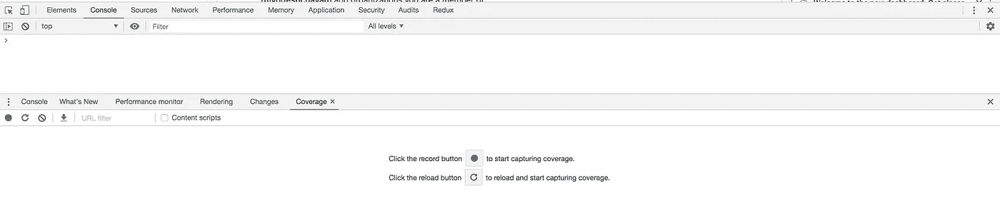

Coverage Tab

3.点击显示的重新加载按钮开始覆盖

4.它将显示所有的 js 和 CSS 文件

5.搜索。css 在搜索框中过滤结果

6.双击任何。css 文件，它会用红色突出显示未使用的 CSS

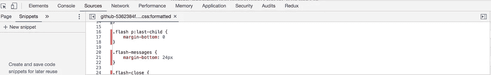

Unused CSS

**计算代码执行时间**

console.time 和 console.timeEnd 函数允许我们找出执行特定代码所花费的时间。

Execution Time

一旦您执行了上面的代码，您将会看到输出，其中显示了在这种情况下所用的时间(以毫秒为单位)。

Total Time

**以表格格式打印 JSON 数组**

如果您有一个 JSON 对象数组，那么您可以使用 console.table 获得表格格式的结果

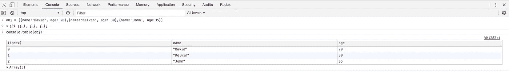

Table Formatted Result

**创建新的内联组以便更好地记录日志**

如果你有一个遍历条目的循环，并且你想在每次迭代中看到变量值，你可以使用`console.groupCollapsed`方法。它让我们可以很容易地看到输出，而不会弄乱控制台。

[https://gist.github.com/myogeshchavan97/16ec90d546983d3e537b744a69d8156b](https://gist.github.com/myogeshchavan97/16ec90d546983d3e537b744a69d8156b)

一旦执行了上面的代码，您将看到如下所示的输出

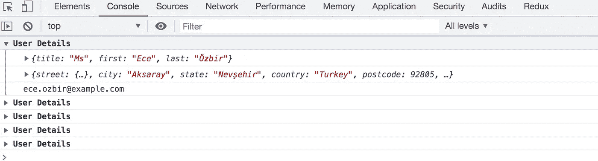

Console Grouping

**快速查找网站上的任何文件**

如果您想要查看特定站点加载的所有文件，您可以使用 Control + O 或 Command + O (Mac)来查看所有文件的列表。在这里，您可以检查特定的文件或只是类型。css 来查看 CSS 文件列表

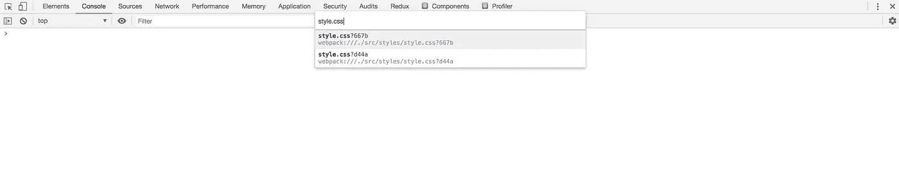

See List Of Files

**搜索所有文件**

要在页面上加载的所有文件中搜索特定文本，请使用

ctrl+Shift+F 或 Command + Option + F (Mac)

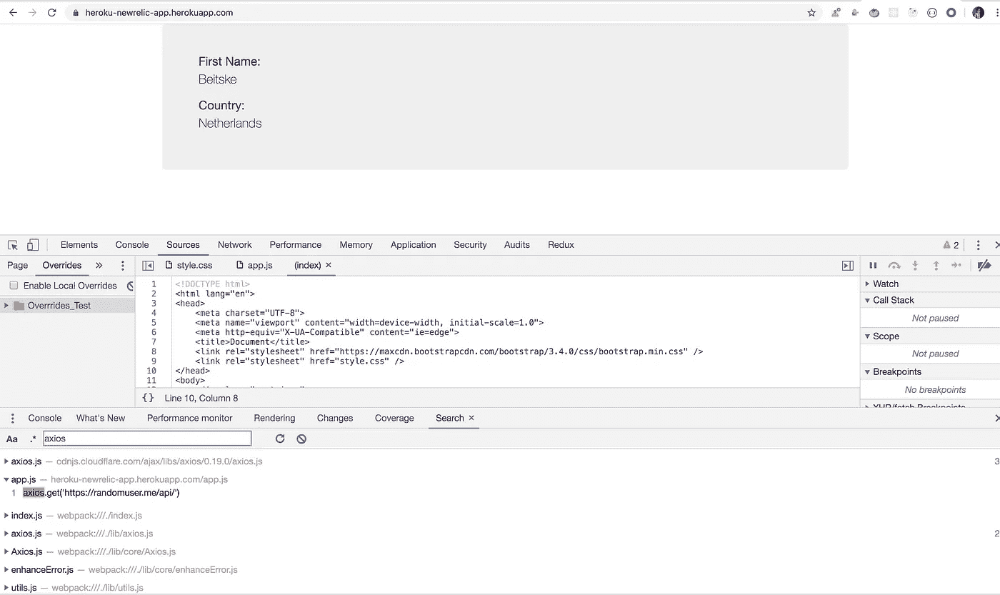

Search Across Files

关于这个帖子就这些了！希望这些小技巧和小窍门对你有帮助。

看看我最近出版的[掌握 Redux](https://master-redux.yogeshchavan.dev/) 课程。

在本课程中，您将构建 3 个应用程序以及一个点餐应用程序，您将了解:

*   基本和高级冗余
*   如何管理数组和对象的复杂状态
*   如何使用多个减速器管理复杂的冗余状态
*   如何调试 Redux 应用程序
*   如何在 React 中使用 Redux 使用 react-redux 库让你的 app 反应性。
*   如何使用 redux-thunk 库处理异步 API 调用等等

最后，我们将从头开始构建一个完整的[订餐应用](https://www.youtube.com/watch?v=2zaPDfCKAvM)，集成 stripe 以接受支付，并将其部署到生产中。

**别忘了直接在你的收件箱** [**这里**](https://yogeshchavan.dev) **订阅我的每周时事通讯，里面有惊人的技巧、诀窍和文章。**